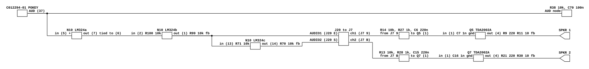
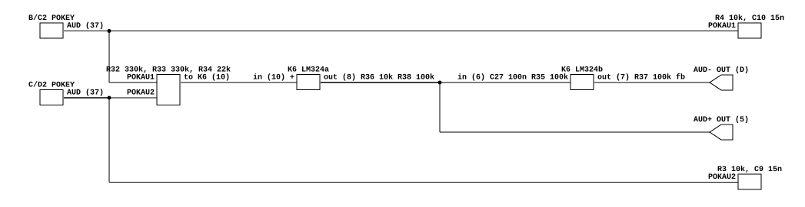

# Missile Command and Tempest: POKEY to speaker

What two Atari POKEY games do between the chip and the cabinet. Read for
`phosphor-emulator-discrete-sound-fidelity-l5r3.10`, the project-wide audit. The
models are `machines/src/missile_command.rs` and `machines/src/tempest.rs`.

They are in the catalog as two rows and they turn out to share the second half of
the path: the same **Regulator/Audio II PCB, 035435-02**, at two revisions. What
they do not share is the first half, and the difference between the two POKEY
load networks is a factor of 6.7 in one capacitor.

Three Atari POKEY boards read after this one — Quantum, Food Fight and Crystal
Castles — all end in the same Regulator/Audio II PCB, and all three load pin 37
differently again. The amplifier half below is therefore the shared one, worth
modelling once; the table of the six interfaces is in
[`foodf-audio-output.md`](foodf-audio-output.md).

## Provenance

| | |
|---|---|
| Drawing | `Missile Command`, Atari 035467-XX rev D, sheet 2 side B, `Input and Output Circuitry` |
| Drawing | `Regulator/Audio II PCB Schematic`, 035435-02 rev B, in the same package, sheet 1 side A |
| Read from | `arcade-museum.com/manuals-videogames/M/MissileCommand.pdf`, PDF p63 and p60 |
| Drawing | `Tempest`, Atari 037585-01 rev B, sheet 3 side B, `Player Inputs and Audio Output` |
| Drawing | `Regulator Audio II PCB Schematic`, 035435-02 rev E, sheet 1 side A of the same package |
| Read from | `gauck.com/arcade/Tempest/Atari Tempest Schematic.pdf`, PDF p6 and p2 |
| Transcribed | 2026-08-31 |

Two notes for whoever reads the next Atari game:

- **`arcade-museum.com/manuals-videogames/T/Tempest.pdf` has no schematics.** It
  is the operation and maintenance manual with illustrated parts lists, 60 pages,
  and its last page is the back cover. All 60 were checked. The schematics are a
  separate Drawing Package Supplement, which is what the gauck.com file above is.
  Do not re-fetch the arcade-museum file expecting circuits.
- **The Missile Command file is three manuals in one**, upright, cabaret and
  cocktail, and the Drawing Package Supplement is appended at the end: PDF pages
  59 through 63, after 58 pages of parts lists. The PDF reports 684 pages; only
  the first 63 carry any image.

The Tempest parts list is still worth knowing about, because it is what first
identified the shared board: its `Figure 21 Regulator/Audio II PCB Assembly
Parts List` carries the same reference designators and values as Missile
Command's schematic, one for one, down to R9/R21 220 ohm 1/2 W and the TDA2002A
at Q5 and Q7. That was a hypothesis, not a reading; the Tempest schematic
arrived afterwards and confirmed it.

## What the models do today

`missile_command.rs` drains the POKEY, runs it through a shared `DcBlocker`, and
scales by 2. `tempest.rs` computes `(pokey1 + pokey2) * 0.5` and scales to i16,
with no filter and no DC removal at all. Neither has anything else.

## Missile Command, one POKEY

[`missile-audio-output.json`](missile-audio-output.json).

- **POKEY pin 37, `AUD`, sits on R38 10k to +5 V and C70 0.1 uF to ground.** This
  is a low-pass and it is the first thing the model does not have.
- **N10 LM324 section a is a unity-gain follower**: pin 5 is the input, and pin 6
  is tied directly to pin 7. C75 0.1 uF is across the supplies, +12 V at pin 4
  and -5 V at pin 11, not in the feedback. The op-amps run on split supplies with
  their non-inverting inputs at ground, so this stage of the path is
  ground-referenced and DC-coupled.
- **Section b inverts**: R100 10k in, R99 10k feedback, pin 3 to ground. Gain -1.
  Its output at pin 1 is `AUD 1`, leaving on connector J20 pin E as `AUDIO1`.
- **Section c inverts again**: R71 10k from that same node into pin 13, R70 10k
  feedback, pin 12 to ground. Gain -1. Its output at pin 14 is `AUD 2`, leaving
  on J20 pin S as `AUDIO2`.
- So the game PCB emits **an antiphase pair**, as I, Robot and Dig Dug do, and
  there is no series capacitor anywhere on it.

## Tempest, two POKEYs

[`tempest-audio-output.json`](tempest-audio-output.json).

- **Both POKEYs are on the auxiliary PCB**, at B/C2 and C/D2. Each pin 37 sits on
  10 k to +5 V and **0.015 uF mylar** to ground: R4/C10 for `POKAU1`, R3/C9 for
  `POKAU2`. Same topology as Missile Command's R38/C70, and **a capacitor 6.7
  times smaller**.
- **The two are summed passively**, R32 330k and R33 330k into one node with R34
  22k to ground. Equal resistors, so equal weighting.
- **K6 LM324 section a amplifies that node**, non-inverting: pin 10 is the input,
  R36 10k from pin 9 to ground and R38 100k feedback from pin 8. Gain 11.
- Its output is `AUD+`, leaving on connector pin 5.
- **Section b inverts it, AC-coupled**: C27 0.1 uF then R35 100k into pin 6, R37
  100k feedback, pin 5 held at +5 V, supply +22 V at pin 4. Gain -1. Its output
  is `AUD-` on connector pin D.
- Each has its own return pin, 6 for `AUD+` and E for `AUD-`, both grounded here.

The mixing arithmetic, since the model has a constant for it. Two 330k legs
against 22k to ground give each POKEY 3.03 uS out of 51.5 uS at the node, so
0.0588 each, and the stage's gain of 11 makes it **0.647 per POKEY**. The model's
`(p1 + p2) * 0.5` is 0.5 each. The **ratio** the model encodes, 1:1, is what the
board does and this reading confirms it, the way I, Robot's paralleled POKEYs
confirmed its `* 0.25`. The absolute factor is not 0.5, but nothing in the model
calibrates an absolute output level, so that part is a scale and not an error.

## The Regulator/Audio II PCB, which both games use

035435-02, revision B in Missile Command's package and revision E in Tempest's.
The audio half is the same circuit on both. Per channel, with Missile Command's
channel 1 designators and Tempest's in the same positions:

| stage | parts |
|---|---|
| input divider | R14 10k series, R27 1k to ground |
| coupling | C6 0.22 uF into pin 1 |
| shunt at pin 1 | C7 0.001 uF to ground |
| amplifier | Q5 TDA2002AV, supply +10.3 V |
| gain network | R9 220 ohm 1/2 W from output to node X, R11 10 ohm from node X to ground, C4 470 uF from node X to pin 2 |
| HF compensation | R12 100 ohm and C5 0.01 uF, output to pin 2 |
| Boucherot cell | C3 0.1 uF and R10 1.0 ohm at the output to ground |
| output coupling | C9, **1000 uF on Missile's rev B, 3300 uF on Tempest's rev E** |
| out | J8, `SPKR 1` with its own `SPKR 1 RTN` |

Channel 2 is the same with R13, R28, C15, C16, Q7, R21, R20, C12, R22, C14, C11,
R19, C10, `SPKR 2`. **Both games drive two speakers**, and both models are mono.

Two arithmetic consequences worth having:

- The input divider is 1k against 11k, so **the board throws away 20.8 dB before
  the amplifier**, and the amplifier's 1 + 220/10 = 23 puts about 6.4 dB back.
  Net gain from the connector to the speaker is about 2.1.
- The output coupling into a nominal 8 ohm speaker is a high-pass at **19.9 Hz on
  Missile Command's 1000 uF and 6.0 Hz on Tempest's 3300 uF**. Both below the
  band, but they are the difference between the two revisions.

**The drawing's own note disagrees with its own components.** Missile Command's
sheet says, in prose beside the circuit: "The audio circuit contains two
independent audio amplifiers. Each consists of a TDA2002AV amplifier with a gain
of ten." The feedback network as drawn gives 23, and R11 is confirmed as 10 ohm
by Tempest's parts list as well as by both schematics. The discrepancy is
recorded, not resolved.

## What it establishes

- Both games' analog paths are entirely unmodelled. These are `missing` rows, not
  `partial` ones.
- **The two games' POKEY load capacitors differ by 6.7 times**, 0.1 uF against
  0.015 uF on the same 10 k. Whatever corner that sets, Missile Command's is far
  lower than Tempest's, and both are modelled as no filter at all. Same family,
  different law, which is the second time this sweep has found that.
- Both boards emit an antiphase pair into two independent TDA2002A channels and
  two speakers.
- Tempest's model has **no DC removal of any kind**, where the board has C27
  0.1 uF in the inverting leg and C6 or C15 0.22 uF at each amplifier input.
- Missile Command's `DcBlocker` does correspond to a real part, C6 and C15, but
  they are on the Regulator/Audio II board: the game PCB's own path is DC-coupled
  end to end, and the comment in `missile_command.rs` reads as though the
  capacitor were nearer than it is.
- Tempest's two POKEYs are summed with equal 330k legs, so the model's 1:1
  weighting is the board's.
- Both games use the same amplifier board, so a model of it is worth writing once.

## What it does NOT establish

- **The corner of either POKEY load network.** It is set by R (10 k) in parallel
  with the POKEY's own output impedance at pin 37, and that impedance is on
  neither drawing and was not looked up. What can be said is a bound: the corner
  is **at least** 159 Hz on Missile Command and **at least** 1061 Hz on Tempest,
  those being the values for 10 k alone, and it rises as the chip's own impedance
  falls. The ratio of 6.7 between the two games is not sensitive to that.
- **The corner of C6, the amplifier's input coupling.** It works against the
  divider's 909 ohms in series with the TDA2002A's input impedance, and the
  latter is not on the sheet.
- **Whether the two speakers are wired in phase in the cabinet.** The two channels
  carry the same signal inverted; how the cabinet connects them was not traced,
  and it decides whether the antiphase is heard as a bridge or as cancellation.
- **What Tempest's rev E changes besides the output capacitor.** Only the audio
  half of each revision was compared, and only for values, not for topology
  outside the table above.
- **Any measurement.** Nothing here has been compared against a capture.

## Confidence

The Tempest package is a 400 dpi scan of full-size sheets, 13000 pixels across,
and every value above was read without ambiguity. Missile Command's supplement is
a smaller reduction but still clean; the two connections worth being sure of were
checked specifically at high magnification. The first was whether C75 is in the
LM324's feedback or across its supplies: it is across the supplies, and pin 6
goes straight to pin 7, so section a is a follower and not an integrator. The
second was whether C6 on the Regulator/Audio II board is in series or in shunt:
it is in series between the R14/R27 node and pin 1, which is what makes it the
coupling capacitor the model's comment refers to. Reading it as a shunt would
have produced a confident and wrong claim that the path has no coupling capacitor
at all.

This is a hand transcription and can be wrong. Nothing in it is checked by a
test; the section above it is what keeps that honest.
