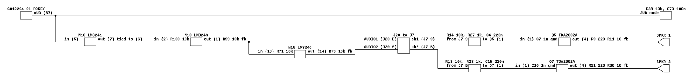
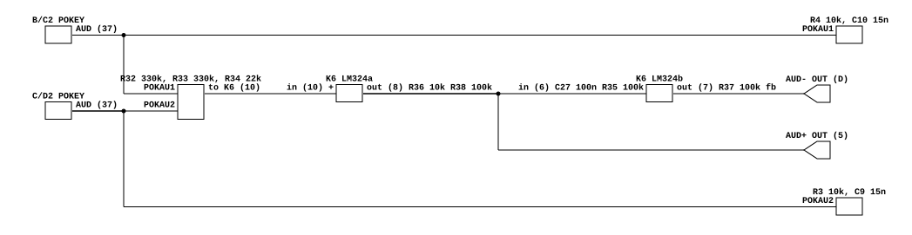

# Missile Command and Tempest: POKEY to speaker

What two Atari POKEY games do between the chip and the cabinet. Read for
`phosphor-emulator-discrete-sound-fidelity-l5r3.10`, the project-wide audit. The
models are `machines/src/missile_command.rs` and `machines/src/tempest.rs`.

They are in the catalog as two rows and they turn out to share the second half of
the path: the same **Regulator/Audio II PCB, 035435-02**, at two revisions. What
they do not share is the first half, and the difference between the two POKEY
load networks is a factor of 6.7 in one capacitor.

Three Atari POKEY boards read after this one — Quantum, Food Fight and Crystal
Castles — all end in the same Regulator/Audio II PCB, and all three load pin 37
differently again. The amplifier half below is therefore the shared one, worth
modelling once; the table of the six interfaces is in
[`foodfight-audio-output.md`](foodfight-audio-output.md).

## Provenance

| | |
|---|---|
| Drawing | `Missile Command`, Atari 035467-XX rev D, sheet 2 side B, `Input and Output Circuitry` |
| Drawing | `Regulator/Audio II PCB Schematic`, 035435-02 rev B, in the same package, sheet 1 side A |
| Read from | `arcade-museum.com/manuals-videogames/M/MissileCommand.pdf`, PDF p63 and p60 |
| Drawing | `Tempest`, Atari 037585-01 rev B, sheet 3 side B, `Player Inputs and Audio Output` |
| Drawing | `Regulator Audio II PCB Schematic`, 035435-02 rev E, sheet 1 side A of the same package |
| Read from | `gauck.com/arcade/Tempest/Atari Tempest Schematic.pdf`, PDF p6 and p2 |
| Transcribed | 2026-08-31 |

Two notes for whoever reads the next Atari game:

- **`arcade-museum.com/manuals-videogames/T/Tempest.pdf` has no schematics.** It
  is the operation and maintenance manual with illustrated parts lists, 60 pages,
  and its last page is the back cover. All 60 were checked. The schematics are a
  separate Drawing Package Supplement, which is what the gauck.com file above is.
  Do not re-fetch the arcade-museum file expecting circuits.
- **The Missile Command file is three manuals in one**, upright, cabaret and
  cocktail, and the Drawing Package Supplement is appended at the end: PDF pages
  59 through 63, after 58 pages of parts lists. The PDF reports 684 pages; only
  the first 63 carry any image.

The Tempest parts list is still worth knowing about, because it is what first
identified the shared board: its `Figure 21 Regulator/Audio II PCB Assembly
Parts List` carries the same reference designators and values as Missile
Command's schematic, one for one, down to R9/R21 220 ohm 1/2 W and the TDA2002A
at Q5 and Q7. That was a hypothesis, not a reading; the Tempest schematic
arrived afterwards and confirmed it.

## What the models do today

`missile_command.rs` drains the POKEY, runs it through a shared `DcBlocker`, and
scales by 2. `tempest.rs` computes `(pokey1 + pokey2) * 0.5` and scales to i16,
with no filter and no DC removal at all. Neither has anything else.

## Missile Command, one POKEY

[`missilecommand-audio-output.json`](missilecommand-audio-output.json).

- **POKEY pin 37, `AUD`, sits on R38 10k to +5 V and C70 0.1 uF to ground.** This
  is a low-pass and it is the first thing the model does not have.
- **N10 LM324 section a is a unity-gain follower**: pin 5 is the input, and pin 6
  is tied directly to pin 7. C75 0.1 uF is across the supplies, +12 V at pin 4
  and -5 V at pin 11, not in the feedback. The op-amps run on split supplies with
  their non-inverting inputs at ground, so this stage of the path is
  ground-referenced and DC-coupled.
- **Section b inverts**: R100 10k in, R99 10k feedback, pin 3 to ground. Gain -1.
  Its output at pin 1 is `AUD 1`, leaving on connector J20 pin E as `AUDIO1`.
- **Section c inverts again**: R71 10k from that same node into pin 13, R70 10k
  feedback, pin 12 to ground. Gain -1. Its output at pin 14 is `AUD 2`, leaving
  on J20 pin S as `AUDIO2`.
- So the game PCB emits **an antiphase pair**, as I, Robot and Dig Dug do, and
  there is no series capacitor anywhere on it.

## Tempest, two POKEYs

[`tempest-audio-output.json`](tempest-audio-output.json).

- **Both POKEYs are on the auxiliary PCB**, at B/C2 and C/D2. Each pin 37 sits on
  10 k to +5 V and **0.015 uF mylar** to ground: R4/C10 for `POKAU1`, R3/C9 for
  `POKAU2`. Same topology as Missile Command's R38/C70, and **a capacitor 6.7
  times smaller**.
- **The two are summed passively**, R32 330k and R33 330k into one node with R34
  22k to ground. Equal resistors, so equal weighting.
- **K6 LM324 section a amplifies that node**, non-inverting: pin 10 is the input,
  R36 10k from pin 9 to ground and R38 100k feedback from pin 8. Gain 11.
- Its output is `AUD+`, leaving on connector pin 5.
- **Section b inverts it, AC-coupled**: C27 0.1 uF then R35 100k into pin 6, R37
  100k feedback, pin 5 held at +5 V, supply +22 V at pin 4. Gain -1. Its output
  is `AUD-` on connector pin D.
- Each has its own return pin, 6 for `AUD+` and E for `AUD-`, both grounded here.

The mixing arithmetic, since the model has a constant for it. Two 330k legs
against 22k to ground give each POKEY 3.03 uS out of 51.5 uS at the node, so
0.0588 each, and the stage's gain of 11 makes it **0.647 per POKEY**. The model's
`(p1 + p2) * 0.5` is 0.5 each. The **ratio** the model encodes, 1:1, is what the
board does and this reading confirms it, the way I, Robot's paralleled POKEYs
confirmed its `* 0.25`. The absolute factor is not 0.5, but nothing in the model
calibrates an absolute output level, so that part is a scale and not an error.

## The Regulator/Audio II PCB, which both games use

035435-02, revision B in Missile Command's package and revision E in Tempest's.
The audio half is the same circuit on both. Per channel, with Missile Command's
channel 1 designators and Tempest's in the same positions:

| stage | parts |
|---|---|
| input divider | R14 10k series, R27 1k to ground |
| coupling | C6 0.22 uF into pin 1 |
| shunt at pin 1 | C7 0.001 uF to ground |
| amplifier | Q5 TDA2002AV, supply +10.3 V |
| gain network | R9 220 ohm 1/2 W from output to node X, R11 10 ohm from node X to ground, C4 470 uF from node X to pin 2 |
| HF compensation | R12 100 ohm and C5 0.01 uF, output to pin 2 |
| Boucherot cell | C3 0.1 uF and R10 1.0 ohm at the output to ground |
| output coupling | C9, **1000 uF on Missile's rev B, 3300 uF on Tempest's rev E** |
| out | J8, `SPKR 1` with its own `SPKR 1 RTN` |

Channel 2 is the same with R13, R28, C15, C16, Q7, R21, R20, C12, R22, C14, C11,
R19, C10, `SPKR 2`. Two amplifier channels, and both models are mono; the next
section is why that is right.

Two arithmetic consequences worth having:

- The input divider is 1k against 11k, so **the board throws away 20.8 dB before
  the amplifier**, and the amplifier's 1 + 220/10 = 23 puts about 6.4 dB back.
  Net gain from the connector to the speaker is about 2.1.
- The output coupling into a nominal 8 ohm speaker is a high-pass at **19.9 Hz on
  Missile Command's 1000 uF and 6.0 Hz on Tempest's 3300 uF**. Both below the
  band, but they are the difference between the two revisions.

**The drawing's own note disagrees with its own components.** Missile Command's
sheet says, in prose beside the circuit: "The audio circuit contains two
independent audio amplifiers. Each consists of a TDA2002AV amplifier with a gain
of ten." The feedback network as drawn gives 23, and R11 is confirmed as 10 ohm
by Tempest's parts list as well as by both schematics. The discrepancy is
recorded, not resolved.

## How the cabinet wires the speaker

Read for `phosphor-emulator-fuqb.2`, 2026-09-29.

| | |
|---|---|
| Drawing | `Tempest Upright Wiring Diagram`, 037774-01 rev A, sheet 1 side B of Tempest's package: `gauck.com` file above, PDF p2 |
| Drawing | `Game Wiring Diagram`, 036294-01 rev A (cabaret) and 036455-01 rev A (sit-down), Missile Command's supplement, PDF p60 |
| Parts | Volume control 19-9032, `50-Ohm, 12½-Watt, Wirewound Rheostat`: cocktail Missile Command's Figure 15 parts list, PDF p56. The same part number is the volume control in cabaret Missile Command's list (PDF p46) and Tempest's (manual PDF p37) |

**All three cabinets bridge one speaker across the amplifier's two outputs.**
The harness takes only J8 pins 3 (`SPKR 2`) and 4 (`SPKR 1`); pins 1 and 2, the
two returns, are not wired. Traced on each drawing:

- `SPKR 1` goes to one end of the volume rheostat R1. Wire color OR on Tempest,
  BN/W on Missile Command.
- `SPKR 2` goes to the rheostat's other end **and** to the speaker's W terminal.
  Wire color W on both.
- The rheostat's wiper goes to the speaker's BN terminal.

So the speaker sits across the two outputs, shunted by the part of R1 between
the wiper and `SPKR 2`, in series with the rest. At full volume it is across
the pair directly, with the 50 ohm rheostat in parallel. On Tempest the path runs
through P32/J32 and P31/J31 pins 4 and 5 to `LS SPEAKER`. On Missile Command's
cabaret it runs straight to `SPEAKER LS1`. On the sit-down, the wiper and `SPKR 2`
leave through J34 pins 11 and 12, and the scan is cropped at the right edge
before the speaker, but the rheostat's wiring is the same.

Which input feeds which channel does not matter to the result, but for the
record: Tempest's harness takes the auxiliary board's `AUDIO +` (W) to J7 pin 8,
`AUDIO 2 IN`, and `AUDIO -` (BN) to J7 pin 9, `AUDIO 1 IN`.

What it means for the model:

- **The antiphase pair is heard in phase.** The speaker sees the difference of
  the two channels, and the two carry the signal inverted, so the difference is
  twice either one. A mono model is right up to a scale; this is a bridge, not a
  cancellation.
- **Missile Command's two legs are identical** (two DC-coupled unity
  inverters), so for it the bridge is exactly a scale.
- **Tempest's are not.** Only `AUD-` passes through C27 0.1 uF into R35 100k, so
  the speaker hears `AUD+` plus `AUD+` high-passed at 15.9 Hz. The model now sums
  those two before the amplifier, which is exact because the channels are
  identical and linear.
- **The output coupling is not what the C9 stage models.** In a bridge the
  speaker current runs out of one channel through its C9, through the rheostat
  and speaker, and back through the other channel's C10, so the two capacitors
  are in series. The load is the speaker with the rheostat's shunt section
  across it. At full volume that gives about 26 Hz on Tempest (1650 uF into its
  4 ohm speaker in parallel with 50 ohm) and about 46 Hz on Missile Command's
  cabaret (500 uF into 8 ohm in parallel with 50 ohm), against the 6.0 Hz and
  19.9 Hz modeled. The corner also falls as the volume is turned down, since the
  series section of R1 adds to the loop. Not changed: see the measurements
  below.

The speakers themselves, from the parts lists: Tempest's upright has one 6 x 9
inch 4 ohm 15 W oval (manual PDF p50). Missile Command's cabaret lists a 5 inch
8 ohm 5 W speaker (PDF p46), and the cocktail a 4 inch 16 ohm 4 W one (PDF p56).
**Missile Command's upright has two**, in the attraction panel (`Figure 17
Signal Distribution`, PDF p24; `Figure 19`, PDF p28, 5 inch 8 ohm 5 W), behind
the same single volume control, and its wiring diagram is not in this package.
Whether its two speakers are in series or in parallel across the bridge is
therefore not established; it moves the C9 corner (roughly 26 Hz in series,
86 Hz in parallel, at full volume) but not the phase.

Measured over the recorded movies (`disasm audiodiff`), against the tree before
this change:

| change | game | 0-150 Hz share | RMS | peak | clipped |
|---|---|---|---|---|---|
| C27 in the `AUD-` leg (landed) | Tempest | 23.6 to 22.3 % | -0.06 dB | -3.45 dBFS | 0 |
| bridged C9 loop at full volume (experiment, reverted) | Tempest | 22.3 to 19.7 % | -0.14 dB | -3.73 dBFS | 0 |
| bridged C9 loop, cabaret figures (experiment, reverted) | Missile Command | 30.5 to 24.3 % | -0.50 dB | -3.20 dBFS | 0 |

"Clipped 0" in that table is the emulator's i16 output, not the amplifier. The
next section is the amplifier.

## How far the amplifier can swing

From Fairchild's `TDA2002 / TDA2002A` data sheet, pages 4-262 to 4-264 (a
9-page copy from alldatasheet). Figures, not specified limits:

- **Fig. 1, quiescent output against supply**: about 5.1 V at 10.3 V, so the
  output idles at mid-rail and clips about symmetrically.
- **Fig. 4, output power against load at 10 % THD**, the 11 V curve: about
  1.8 W at 8 ohm, 1.2 W at 12 ohm and 0.9 W at 16 ohm. All three are the same
  5.4 V equivalent sine peak, so at those loads the limit is voltage, not
  current.
- A sine clipped hard enough to reach 10 % THD has a fundamental 1.13 times its
  clip level, so that is a **clip level of about 4.75 V peak on 11 V into 8 ohm
  or more**: 0.75 V short of half the supply.
- Heavier loads lose more, from the 14.4 V table rows the same way: about 1.5 V
  short at 4 ohm (5.2 W) and 2.2 V at 2 ohm (8 W).

Carried to 10.3 V by keeping those losses against the 5.1 V quiescent, which is
an assumption: about 4.4 V peak at light load, 3.6 V at 4 ohm, 2.9 V at 2 ohm.
In the bridge each amplifier drives half the loop's load, so at full volume
Tempest's amplifiers each see about 1.85 ohm and Missile Command's cabaret's
about 3.45 ohm.

What the game boards can ask of it: every POKEY device on pulls pin 37 down by
about 4.75 V, the model's full scale. Through the board's 23/11, one model unit
is **9.9 V at a Missile Command amplifier output and 12.9 V at a Tempest one**
(Tempest's sum gives each POKEY 0.647 and a unit spans both). Against the
recorded movies, whose output is the model's units scaled to i16:

| game | movie peak | clip case | clip level | samples over |
|---|---|---|---|---|
| Missile Command | 7.2 V | light load | 4.4 V | 0.25 % |
| Missile Command | | cabaret, full volume | 3.6 V | 0.65 % |
| Missile Command | | upright if its speakers are paralleled | 2.9 V | 1.4 % |
| Tempest | 8.6 V | light load | 4.4 V | 0.59 % |
| Tempest | | full volume | 2.9 V | 5.0 % |

So **both amplifiers clip on the movies' loud passages**, and Tempest's does so
often at full volume. The clip level depends on the volume setting, through the
rheostat's share of the load, not on the gain. The POKEY conductances are the
data sheet's weakest-part limits, so a real chip asks for more swing, not less.
Not modeled yet.

## What it establishes

- Both games' analog paths are entirely unmodelled. These are `missing` rows, not
  `partial` ones.
- **The two games' POKEY load capacitors differ by 6.7 times**, 0.1 uF against
  0.015 uF on the same 10 k. Whatever corner that sets, Missile Command's is far
  lower than Tempest's, and both are modelled as no filter at all. Same family,
  different law, which is the second time this sweep has found that.
- Both boards emit an antiphase pair into two independent TDA2002A channels,
  and every cabinet wiring diagram read bridges one speaker across the two
  outputs, so the pair is heard in phase.
- Tempest's model has **no DC removal of any kind**, where the board has C27
  0.1 uF in the inverting leg and C6 or C15 0.22 uF at each amplifier input.
- Missile Command's `DcBlocker` does correspond to a real part, C6 and C15, but
  they are on the Regulator/Audio II board: the game PCB's own path is DC-coupled
  end to end, and the comment in `missile_command.rs` reads as though the
  capacitor were nearer than it is.
- Tempest's two POKEYs are summed with equal 330k legs, so the model's 1:1
  weighting is the board's.
- Both games use the same amplifier board, so a model of it is worth writing once.

## What it does NOT establish

- **The corner of either POKEY load network.** It is set by R (10 k) in parallel
  with the POKEY's own output impedance at pin 37, and that impedance is on
  neither drawing and was not looked up. What can be said is a bound: the corner
  is **at least** 159 Hz on Missile Command and **at least** 1061 Hz on Tempest,
  those being the values for 10 k alone, and it rises as the chip's own impedance
  falls. The ratio of 6.7 between the two games is not sensitive to that.
- **The corner of C6, the amplifier's input coupling.** It works against the
  divider's 909 ohms in series with the TDA2002A's input impedance, and the
  latter is not on the sheet.
- **How Missile Command's upright wires its two speakers.** The cabaret,
  sit-down and Tempest upright diagrams all bridge one speaker (see above); the
  upright's diagram is not in the package read.
- **The TDA2002A's exact clip level on +10.3 V.** The Fairchild data sheet
  gives it only as power at 10 % THD on 8, 11, 14.4 and 16 V curves; the figures
  in the next section are read off those, not specified.
- **What Tempest's rev E changes besides the output capacitor.** Only the audio
  half of each revision was compared, and only for values, not for topology
  outside the table above.
- **Any measurement.** Nothing here has been compared against a capture.

## Confidence

The Tempest package is a 400 dpi scan of full-size sheets, 13000 pixels across,
and every value above was read without ambiguity. Missile Command's supplement is
a smaller reduction but still clean; the two connections worth being sure of were
checked specifically at high magnification. The first was whether C75 is in the
LM324's feedback or across its supplies: it is across the supplies, and pin 6
goes straight to pin 7, so section a is a follower and not an integrator. The
second was whether C6 on the Regulator/Audio II board is in series or in shunt:
it is in series between the R14/R27 node and pin 1, which is what makes it the
coupling capacitor the model's comment refers to. Reading it as a shunt would
have produced a confident and wrong claim that the path has no coupling capacitor
at all.

This is a hand transcription and can be wrong. Nothing in it is checked by a
test; the section above it is what keeps that honest.
