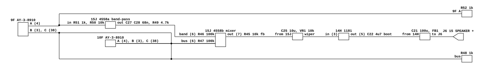

# BurgerTime's audio output

What BurgerTime's Sound I/O board does between its two AY-3-8910s and the
cabinet. Read for `phosphor-emulator-discrete-sound-fidelity-l5r3.10`, the
project-wide audit. The model is `machines/src/btime.rs`.

The finding is structural rather than a filter value: **the board does not sum
the two chips.** Five of the six channels go to one bus and the sixth is taken
out on its own, put through a two-pole band-pass, and remixed at higher level and
opposite polarity. `btime.rs` adds the two chips' outputs, and the device it adds
has already summed each chip's three channels internally, so the shape the board
has is not currently expressible at all.

## Provenance

| | |
|---|---|
| Drawing | `SCHEMATIC DWG SOUND I/O BURGER-TIME`, Bally Midway M051-00333-B007, sheet 9-3 |
| Read from | `archive.org/items/arcademanual_BurgerTime/BurgerTime.pdf`, PDF pages 68, 69 and 70, a 300 dpi scan |
| Transcribed | 2026-09-01 |

Sheet 9-3 is spread across three PDF pages in reading order, left to right, and
everything below is on the middle one. Its designation list is sheet 9-4 on PDF
page 71. The other board's schematic is sheet 9-5 on pages 74 to 76; sheets 9-7
through 9-9 are the power supply and cabinet wiring and carry no audio. The
monitor schematics are omitted from this scan, which its own first page says.

## What the model does today

`BtimeBoard::fill_audio` fills from `ay1`, fills from `ay2` into a temporary
buffer, adds the two with `saturating_add`, and runs the result through a shared
`DcBlocker` at the default corner. That is the whole model.

## The chain

[`btime-audio-output.json`](btime-audio-output.json).

## Five channels on a bus, and one that is not

Each AY-3-8910 brings its three analog channels out on pins 4, 3 and 38. On this
board:

| channel | goes to |
|---|---|
| 10F A (4) | the common bus, which its wire starts |
| 10F B (3) | the common bus, junction dot |
| 10F C (38) | the common bus, junction dot |
| 9F B (3) | the common bus, junction dot |
| 9F C (38) | the common bus, junction dot |
| **9F A (4)** | **crosses the bus without connecting** and goes on alone |

**That crossing is the connection the whole reading turns on, and it was checked
at pixel level.** 9F's channel A leaves the chip on the same horizontal pitch as
its B and C, passes straight over the bus vertical with no junction dot, and
lands on a dot of its own at R52. Immediately below it, on the next wire down,
9F's channel B meets the same vertical with a large solid dot. The two look
identical at any zoom that fits both AYs on screen, and they are not the same.

The bus carries five channels into R48 1k to ground, and from there R47 100k
feeds the mixer.

## The band-pass, which is not a low-pass

9F channel A goes to R52 1k to ground, then R51 1k into the `15J` 4558's first
section, wired as a **multiple-feedback band-pass**:

| net | ref.pin |
|---|---|
| 9F channel A | 9F.4 -> R52 -> R51 |
| node A | R51 -> R50 10k to ground, C28 0.068 uF, C27 0.068 uF |
| 4558 inverting input | C27 -> 15J.2, R49 4.7k to 15J.1 |
| 4558 non-inverting | 15J.3 to ground |
| 4558 output | 15J.1 -> C28 back to node A, and R46 100k to the mixer |
| supplies | 15J.8 +5 V, 15J.4 -5 V |

Two capacitors from one node, one to the inverting input and one back to the
output, with a resistor to ground at that node and a resistor in the feedback, is
the band-pass form and not the low-pass one. Reading it as a low-pass, which is
what a first pass at the same components suggests, gives a corner near 500 Hz and
is wrong.

With `R1` = R51 1k, `R2` = R50 10k, `R3` = R49 4.7k and `C` = 0.068 uF:

- centre frequency `f0 = (1 / 2*pi*C) * sqrt((R1 + R2) / (R1*R2*R3))` = **1.13 kHz**
- `Q = (1/2) * sqrt(R3 * (R1 + R2) / (R1*R2))` = **1.14**
- gain at `f0` = `-R3 / 2*R1` = **-2.35**

The mixer at the 4558's second section takes both paths through 100k into its
inverting input, with R45 10k and C26 150 pF in the feedback, so each arrives at
`-0.1` and the mixer's own pole is at 106 kHz, out of band. So at the output:

- the five bussed channels appear at **-0.1**, unfiltered
- 9F channel A appears at **+0.235 at 1.13 kHz**, band-passed, and **in opposite
  polarity to the other five**, because its path is inverted twice

## The rest of the chain

- **C25 10 uF into VR1, a 10k volume pot.** The capacitor feeds the top of the
  pot rather than the wiper, so the load is 10k whatever the setting and the
  corner does not move with the volume: 1.6 Hz, out of the way. This is the one
  volume control in this sweep so far that does **not** move a filter corner.
- **The `14H` 1181 power amplifier**, +12 V at pin 7, input at pin 3, ground at
  pin 4, output at pin 5, with C22 4.7 uF bootstrapping pin 6 from the output and
  C23 and C24 4.7 uF on the input side.
- **C21 100 uF is the output coupling.** Into a nominal 8 ohm speaker that is a
  high-pass at **199 Hz**, which is twenty times the shared 10 Hz default the
  model's `DcBlocker` runs at.
- **FB1, a ferrite bead, with C37 and C30 to ground** at the J6 pin 15
  `SPEAKER +` terminal.

## What it establishes

- **The two chips are not summed equally, and the asymmetry is per channel.** One
  of six channels is separated, band-passed, boosted and inverted. A model that
  adds two chip outputs cannot express this, and neither can one that adds six
  channel outputs, until the band-pass and the polarity are there too.
- The filter is a band-pass at 1.13 kHz with Q 1.14, not a low-pass.
- The output coupling capacitor is C21 100 uF, so the row's old note that "the
  exact capacitor is not on a schematic to hand" is now answered: the board's
  dominant coupling corner is about 199 Hz into 8 ohms, not the 10 Hz default.
- **The model's placement of the coupling after the sum is right.** C25 and C21
  are both between the chips and the speaker and neither is inside either chip,
  which is exactly what the comment in `btime.rs` reasoned without a drawing. The
  corner it chose is wrong; the position it chose is not.
- The volume pot does not move a filter corner here, which is worth recording
  because on four other boards in this sweep the control does.

## What it does NOT establish

- **Which of the model's `ay1` and `ay2` is 9F.** `ay1` is at 0x2000/0x4000 and
  `ay2` at 0x6000/0x8000 on the sound CPU's map; the chip selects were not traced
  back from 9F and 10F's BDIR and BC1 pins. Anyone implementing this has to
  settle it first, because it decides which chip loses a channel to the
  band-pass.
- **The exact band-pass parameters**, because R52 1k sits between the chip and
  R51 and its Thevenin resistance adds to `R1` by an amount set by the AY's own
  output impedance, which is not on this sheet. The figures above are for `R1` =
  R51 alone. At the other extreme, `R1` = 2k, they become f0 836 Hz, Q 0.84 and
  gain -1.18. The shape is a band-pass either way and the centre is in the same
  octave.
- **The 1181's manufacturer prefix.** The drawing has `1181` on one line and two
  characters below it that read as `HA` but do not resolve. An HA1181 is a
  Hitachi audio power amplifier and would fit the pinout and the bootstrap
  capacitor, but that is inference.
- **Whether the speaker is 8 ohms.** It is not on this sheet, and the 199 Hz
  above scales with it.
- **What C37 and C30 are**, beyond being a capacitor either side of the ferrite
  bead. Their values were not read.
- **Any measurement.** Nothing here has been compared against a capture.

## Confidence

A clean 300 dpi scan, and every resistor and capacitor value above was read
without ambiguity. The two connections the reading depends on were both checked
specifically at pixel level rather than at reading zoom: that 9F channel A
crosses the bus without a dot while 9F channel B meets it with one, and that C27
and C28 leave the same node in the two different directions that make the section
a band-pass rather than a low-pass. Both were wrong on a first pass at ordinary
magnification.

This is a hand transcription and can be wrong. Nothing in it is checked by a
test; the section above it is what keeps that honest.
