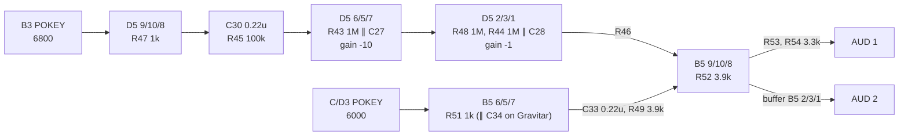

# The Black Widow / Gravitar board

What Atari's Black Widow and Gravitar main PCBs do around their 6502, read for
`phosphor-emulator-quwu.1`, part of adding both games (`phosphor-emulator-quwu`).
The model is `machines/src/atari_color_vector_conversions.rs`, the board
module for Atari's color vector conversion class, with the per-game halves in
`machines/src/blackwidow.rs` and `machines/src/gravitar.rs`.

The finding in one line: **the two games are one board, and five things on it
are not what the reference driver models.** The IRQ is a counter that restarts
on every acknowledge rather than a free-running clock; the watchdog bites after
128 periods of the 3 kHz clock; the output latch carries a RAM bank select and
two picture inverts; the coin-door byte's bit 5 is a signature
analysis test point, not a diagnostic button; and Gravitar's difficulty switch
reads the other way round. The audio chains differ between the two games in
four part values.

## Provenance

| | |
|---|---|
| Drawing | `Black Widow PCB Schematic Diagram`, SP-234, 2nd printing, (c) Atari Inc. 1983: sheet 3A `Black Widow Memory Map`, 4A and 4B `Signal Name Descriptions`, 5B `Power Input, Clock, Power-On Reset, Watchdog`, 6A `Microprocessor, Address Decoder`, 6B `Read-Only Memory, Random-Access Memory, High-Score Table`, 7A `Coin Door and Control Panel Input, Option Switch Input and Audio Output, Coin Door and Control Panel Output`, 10A `X-Axis Output` |
| Drawing | `Gravitar PCB Schematic Diagram`, SP-206, 2nd printing, (c) Atari Inc. 1982: sheet 5A (the same three blocks as Black Widow's 7A) and 11A `Gravitar PCB Troubleshooting`, which carries the memory map |
| Manual | `Black Widow Operators Manual` TM-234, 2nd printing, tables 1-3 and 1-4 (PDF page 15); `Gravitar Operation, Maintenance and Service Manual` TM-206, 2nd printing, tables 1-1 to 1-3 (PDF pages 13-14) |
| Read from | `arcarc.xmission.com/PDF_Arcade_Atari_Kee/Black_Widow/Black_Widow_SP-234_2nd_Printing.pdf` and `.../Gravitar/Gravitar_SP-206_2nd_Printing.pdf`, 600 dpi 1-bit scans, one 11x17 sheet per page, stored rotated |
| PROM | `136010-112.r2` and `136010-111.r1` from the `gravitar` ROM set, dumped and decoded here |
| Transcribed | 2026-10-01 |

Page index for the next reader. Black Widow: PDF page 5 is sheet 3A, 6-9 are
3B-4B, 10 is 5B, 11 is 6A, 12 is 6B, 13 is 7A, 19 is 10A. Gravitar: 7 is the
6A-equivalent decoder sheet, 9 is 5A, 21 is 11A. The sheets are drawn the same
way on both boards, with the same reference designators.

## Memory map

From sheet 3A, Gravitar's 11A, and the decode PROMs. Every 2K block is decoded
by `136010-112` at R2 (A15-A11 in, active-low selects out) and every ROM block
by `136010-111` at R1.

| CPU address | select | what |
|---|---|---|
| `0000-07FF` | R2 B0 `RAM` | 2K program RAM at N/P1, with A10 swapped by BANK SEL (below) |
| `0800-1FFF` | none | open bus |
| `2000-27FF` | R1 `VMEM` | vector RAM |
| `2800-2FFF`, `3000-3FFF`, `4000-4FFF`, `5000-5FFF` | R1 `VMEM` | VROM 0 to 3 |
| `6000-67FF` | R2 B1 `I/O0` | POKEY C/D3, A3-A0 to the chip; ALLPOT reads switch bank D4 |
| `6800-6FFF` | R2 B2 `I/O1` | POKEY B3; ALLPOT reads switch bank B4 |
| `7000-77FF` | R2 B4 `EAROMRD` | ER2055 data |
| `7800-7FFF` | R2 B5 `SINP1` | buffer M9: coin door and status |
| `8000-87FF` | R2 B6 `SINP2` | buffer L9: player 1 controls and option jumpers |
| `8800-8FFF` read | R2 B7 `IO` | buffer N9: player 2 controls, starts, cabinet |
| `8800-8FFF` write | R2 B7 `IO` into LS138 P3 | the strobes below, on A8-A6 |
| `9000-9FFF` ... `D000-DFFF` | R1 `ROM0`-`ROM4` | program ROM, 4K each |
| `E000-FFFF` | R1 `ROM5` | ROM 5, both halves |

The decode PROM's bytes, indexed by `addr >> 11`: `F6` at block 0, `F7`
through block 0x0B, `FD` `FB` `E7` `D7` `B7` `77` for 0x0C to 0x11, `F7` after.
B3 `I/OS` is low everywhere except at blocks 0x0C and 0x0D and from 0x12 up; it
steers the data buffer and does not select a device.

**The write strobes** come from P3, an LS138 with G2A on `/IO`, G2B on `/WRITE`
and C, B, A on AB8, AB7, AB6. A9 and A10 are not decoded, so each strobe repeats
every 0x200 through `8800-8FFF`.

| A8-A6 | address | strobe |
|---|---|---|
| 0 | `8800` | `LATCH`, the R9 output latch |
| 1 | `8840` | `VGGO` |
| 2 | `8880` | `VGRST` |
| 3 | `88C0` | `INTACK` |
| 4 | `8900` | `EAROMCON`, DB3-DB0 into K2 (LS175) |
| 5 | `8940` | `EAROMWR`, AB5-AB0 into P2 (LS174), data into J2 (LS374) |
| 6 | `8980` | `WDCLR` |
| 7 | `89C0` | spare |

## Inputs

**M9 at `7800`**, LS244, traced pin by pin on sheet 7A:

| bit | signal |
|---|---|
| D7 | `3 KHZ` |
| D6 | `HALT`, the vector generator's halt flag, high when halted |
| D5 | `/SA`, the signature analysis test point at J3 pin 13. It is grounded only to put the board in signature mode for a CAT box, so it reads 1 in play |
| D4 | `/SELF-TEST` |
| D3 | `/SLAM` (sheet 3A's table omits this row; the buffer has it) |
| D2 | `/COIN AUX` |
| D1 | `/COIN L` |
| D0 | `/COIN R` |

Every switch input has a 470 ohm pull-up and a 1k series resistor, so an open
switch reads 1.

**L9 at `8000` and N9 at `8800`** carry the controls, active low, and differ by
game:

| bit | Black Widow `8000` | Gravitar `8000` | Black Widow `8800` | Gravitar `8800` |
|---|---|---|---|---|
| D7 | `OPTION 2` | `OPTION 2` | `CABINET 1` | `CABINET 1` |
| D6 | `OPTION 1` | `OPTION 1` | `/START 2` | `/START 2` |
| D5 | `OPTION 0` | `OPTION 0` | `/START 1` | `/START 1` |
| D4 | spare | `/THRUST 1` | spare | `/THRUST 2` |
| D3 | `/MOVE UP` | `/ROT LEFT 1` | `/FIRE UP` | `/ROT LEFT 2` |
| D2 | `/MOVE DOWN` | `/ROT RIGHT 1` | `/FIRE DOWN` | `/ROT RIGHT 2` |
| D1 | `/MOVE LEFT` | `/FIRE 1` | `/FIRE LEFT` | `/FIRE 2` |
| D0 | `/MOVE RIGHT` | `/SHIELDS 1` | `/FIRE RIGHT` | `/SHIELDS 2` |

- **`OPTION 0-2` are P10/11 switches 2-4** to ground with 10k pull-ups, so open
  reads 1. Neither manual assigns them a meaning: both document only switch 1,
  which is not read by the CPU at all but strapped across the two coin counter
  outputs ("credits counted on one coin counter"). They are left open.
- **`CABINET 1`** is J20 pin R with a pull-up, so it reads 1 with the harness
  jumper absent.
- **Gravitar has a full set of player 2 controls on `8800`**, for the cocktail
  cabinet.

## The option switches

Sheet 7A: each POKEY's P7-P0 go to an 8-position switch bank with 10k pull-ups,
**D4 into C/D3** and **B4 into B3**, and each switch closes to ground. A
grounded pot line never reaches the POKEY's threshold, so ALLPOT reads 1 for a
switch that is on. Switch 1 is bit 7 and switch 8 is bit 0, which the manual
tables bear out: every coinage row decodes to the value its description implies
only that way round.

The two games use the two banks the other way round: **Black Widow's D4 is
coinage and B4 the game options; Gravitar's D4 is the game options and B4
coinage.**

From the manuals, with on = 1:

- **Black Widow B4** (TM-234 table 1-4): bits 1-0 maximum start level 13, 21,
  37, 53; bits 3-2 spiders 3 to 6; bits 5-4 easy, medium, hard, demonstration;
  bits 7-6 bonus spider every 20,000, 30,000, 40,000 or none. Recommended:
  level 21, 3 spiders, medium, 20,000, so **0x11**.
- **Gravitar D4** (TM-206 table 1-3): bits 1-0 and bit 5 not used; bits 3-2
  ships 3 to 6; **bit 4 on is easy**; bits 7-6 bonus ship every 10,000, 20,000,
  30,000 or none. Recommended: 3 ships, easy, 10,000, so **0x10**.
- **Coinage** (TM-206 table 1-1, and the same rows on Black Widow's D4): bits
  1-0 1 coin 1 credit, 2 coins 1 credit, free play, 1 coin 2 credits; bits 3-2
  right mechanism x1, x4, x5, x6; bit 4 left mechanism x1 or x2; bits 7-5 bonus
  coins. Recommended 0x00. Gravitar's table lists bonus-coin codes 0x00, 0x40,
  0x60, 0x80, 0xA0, 0xC0 and 0xE0, and not 0x20, which Black Widow's lists as
  "for every 2 coins, add 1".

## The output latch

R9, an LS273 clocked by `LATCH` at `8800` and **cleared by `/RESET`**:

| bit | Q pin | signal | goes to |
|---|---|---|---|
| D7 | 15 | `INVERT Y` | E10, the Y-axis output's inverting switch |
| D6 | 12 | `INVERT X` | B10 through K9, the X-axis output's inverting switch |
| D5 | 16 | `/PLAYER 2 LED` | R102 220 ohm to J20 J |
| D4 | 19 | `/PLAYER 1 LED` | R103 220 ohm to J20 7 |
| D3 | 9 | `COIN LOCKOUT` | Q2 |
| D2 | 2 | `BANK SEL` | B6, an LS86, into RAM A10 |
| D1 | 6 | `COIN CNTR-L` | Q4 |
| D0 | 5 | `COIN CNTR-R` | Q3 |

- **The program draws upright with both invert bits set, whatever the labels
  say.** Sheet 4A says "When high, INVERT X closes switch B10 through inverter
  K9 in the X-axis Output circuit. This inverts the X-axis vector instruction
  to the display", and the same for Y with E10; Gravitar's 11A and Space Duel's
  CAT-box map (`1 = Invert`) agree. Only Black Widow's sheet 3A draws bars over
  the names. But in an upright cabinet (`CABINET 1` open) Black Widow writes
  `38` to the latch at reset and `C8` and `F8` from its second frame on, both
  bits set throughout attract, and Space Duel's program does the same; modeled
  as the labels read, the picture turns 180 degrees. So somewhere between the
  latch and the yoke the sense flips, in a stage that was not traced, and the
  model inverts an axis while its bit is clear. The latch clears on reset, so
  the picture is inverted until the program's first write, 65 cycles in.
- **`BANK SEL` swaps the two 1K halves of program RAM.** Sheet 6B: N/P1's A10
  pin is B6's output, the exclusive-OR of A10 and BANK SEL. Cleared on reset.

## The IRQ

Sheet 6A: **J4**, an LS161, counts the 3 kHz clock. Its parallel inputs are
grounded and its `LD` and `EP` are pulled up, so it counts from zero; its clear
is `/INTACK`. L3, an LS00, NANDs QC and QD into the 6502's `/IRQ`, and that same
`/IRQ` is J4's `ET`.

So the count runs 0 to 12, **asserts IRQ at 12 and stops there**, holding the
line low until the program writes `88C0`, which clears the counter and lets it
count again. The next interrupt is twelve 3 kHz edges after the acknowledge, not
after the previous interrupt: a free-running 246 Hz clock and this circuit agree
only while the program acknowledges promptly.

## The clocks and the watchdog

Sheet 5B, read upside down in the scan:

- **The clock chain**: the 12.096 MHz crystal Y1 into E4, an LS193, for 6, 3
  and 1.5 MHz (the 6502's phi 0); then F4, an LS393 pair, for 12 kHz (master /
  1024) and **3 kHz (master / 4096)**, which is 512 CPU cycles.
- **The watchdog** is H4, an LS393 pair, its first half clocked by F4's 3 kHz
  output and its second half by the first half's QD. E3 clears both on
  `/WDCLR` or power-on reset. The second half's QD clocks K3, an LS74, whose
  output is `/RESET`. **QD rises after 8 x 16 = 128 periods of the 3 kHz clock,
  43.3 ms**, about 2.6 frames, so a program that fails to write `8980` for that
  long is reset. (Sheet 4B's description of RESET names the clear address as
  `0D00`, which is Space Duel's; the decode above puts `WDCLR` at `8980`.)

## Audio

Both games' sheets draw the same topology, sheet 7A on Black Widow and 5A on
Gravitar, with four part values different. Each POKEY's `AUD` (pin 37) goes
straight to an LM324 inverting input, so each works into a virtual ground and
its first stage output is the feedback resistance times the current its devices
sink. Both non-inverting inputs sit on +5 V through R50 100k, decoupled by C39
10 uF and C44 0.01 uF.

| part | Black Widow | Gravitar | what it sets |
|---|---|---|---|
| C27 | **100 pF** (handwritten on the sheet) | **0.001 uF** | the gain-of-10 stage's pole: 1.59 kHz, or 159 Hz |
| C28 | 0.001 uF | 0.001 uF | the unity stage's pole, 159 Hz on both |
| R46 | **22k** | **10k** | B3's weight at the mixer: 3.9/22 = 0.177, or 3.9/10 = 0.39 |
| C34 | absent | **0.22 uF** across R51 | a 723 Hz pole on C/D3's first stage |

Everything else is common: R47 and R51 1k; C30 0.22 uF into R45 100k, a 7.2 Hz
coupling; C33 0.22 uF into R49 3.9k, a **185 Hz** coupling on C/D3's path; R52
3.9k of mixer feedback, so C/D3 arrives at -1. B3's path inverts four times and
C/D3's twice, so the two add in phase. **In band, B3 reaches the mixer at 1.77
times C/D3 on Black Widow and 3.9 times on Gravitar**, and only below its 159 Hz
poles; C/D3 is high-passed at 185 Hz with no low-pass at all on Black Widow.

C29 (0.1 uF) and C35 (0.1 uF) are the LM324s' supply decoupling. C31 and C32
(0.015 uF) hang on the two virtual-ground nodes and do nothing in the band.

The summing amplifier's output leaves twice: inverted at unity by R53 and R54
3.3k as `AUD 1`, and buffered as `AUD 2`, J19 pins 12 and 11. Sheet 4A: "AUD 1
is the inverse of AUD 2". An antiphase pair, which the Audio/Regulator II board
amplifies.

## Where the drawings disagree

- **Which select is at `6000`.** Sheet 3A says `I/O0` at `6000` and `I/O1` at
  `6800`. Sheet 4A says `I/O0` is "at address 6800" and selects C/D3, and
  Gravitar's 11A also puts `I/O0` at `6800`. The decode PROM settles it for
  3A: block 0x0C (`6000`) is `FD`, B1 low, and B1 is drawn as `I/O0` on sheet
  6A; sheet 7A wires `/I/O0` to C/D3's `/CS0`. So **C/D3 and switch bank D4
  are at `6000`.** The PROM was dumped from the Gravitar set; Black Widow's
  sheet 6A draws the same part number at R2, and its contents were not checked
  against a Black Widow board.
- **The bar over `INVERT X` and `INVERT Y`** on 3A, against 11A, the 4A
  descriptions and Space Duel's map. The labels are not the question, though:
  every one of them may describe the switch at B10 correctly while the output
  stage or the monitor's yoke wiring inverts again. The LF13201 switch
  polarities at B10 and E10 and everything after them were not traced, and
  would settle it from the drawing alone.
- **Sheet 4B's watchdog address**, as above.

## Where the reference driver differs

Recorded because each is a place a model built from the driver would be wrong.

- It raises the IRQ periodically at 3 kHz / 12, where J4 restarts on each
  acknowledge.
- It models neither `BANK SEL` nor `INVERT X`/`INVERT Y`, nor a watchdog.
- It calls `7800` bit 5 a "Diagnostic Step" button. It is `/SA`.
- Gravitar's difficulty is defined the wrong way round (bit 4 clear = easy, and
  the driver's own comment block agrees with the manual) and its default is 4
  ships where TM-206 recommends 3.
- It has no player 2 controls for Gravitar.
- Its audio model gives Black Widow's C28 as 1 pF ("on schematic, not on parts
  list"); the 2nd-printing sheet reads 0.001 uF.

## What it does NOT establish

- **The parts list.** Only the drawings were read, and the reference driver
  says Black Widow's C28 is missing from it. If the board ships without C28,
  the unity stage has no pole.
- **What `OPTION 0-2` do** to the program, since no manual defines them.
- **Cabinet polarity** beyond the pull-up: which level the program treats as
  cocktail was not checked in the program code.
- **Past J19.** The Audio/Regulator II board and the speaker wiring were not
  read, so mono is an assumption, as on Space Duel.
- **The display window.** The AVG's visible field (480 x 440 on Black Widow,
  420 x 400 on Gravitar) is the reference driver's: the monitor's size and
  position pots set it on hardware, and no drawing does.
- **The bias sources' accuracy and the LM324s' headroom.** No measurement.
