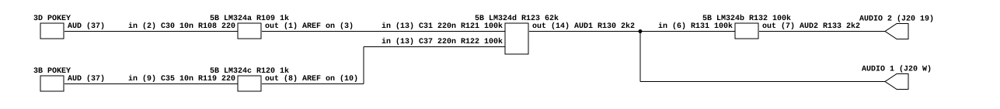

# Crystal Castles' audio output

What Atari's Crystal Castles PCB does between its two POKEYs and the cabinet.
Read for `phosphor-emulator-discrete-sound-fidelity-l5r3.10`, the project-wide
audit. The model is `machines/src/ccastles.rs`.

This one confirms more than it refutes. The two POKEYs are mixed **1:1**, which
is `samples1 + samples2`; the coupling capacitor the model's comment reasons
about is **real and in the place the comment says**, by superposition; and the
one filter at the chip pins turns out to sit so far above the band that it does
nothing. The rest, a voltage gain of about 4.5 per chip before the mixer, an
antiphase output pair, and two speakers, was not modeled when this was read; see
the next section for what is now.

## Provenance

| | |
|---|---|
| Drawing | `Crystal Castles PCB Schematic Diagram`, Atari SP-241 sheet 8B, 2nd printing, (c) Atari Inc. 1983, block `Audio Output` |
| Drawing | `Crystal Castles Regulator/Audio II PCB and Power Supply Diagrams`, SP-241 sheet 2A, carrying `Regulator/Audio II PCB` 035435-01 rev F |
| Read from | `arcade-museum.com/manuals-videogames/C/CCastles.pdf`, PDF pages 79 and 66, a 300 dpi scan |
| Transcribed | 2026-09-01 |

Two notes for the next reader of this file.

- **The schematics are the last third of the operators manual, not a separate
  package.** `CCastles.pdf` is 85 pages; pages 1 to 62 are the manual, page 63 is
  the `Schematic Package Supplement` cover and page 64 its contents. From there
  sheet 1A is page 64 and each side advances one page, so sheet 8B is page 79.
- **`Crystal-Castles-2board-schematic.pdf` is not this.** It is two pages, both
  of the two-board revision, and carries no audio. It was fetched and checked.

## What the model does today

Modeled under `phosphor-emulator-fd0d`. Each `Pokey` runs its open-drain
output into a `PokeyOutputNetwork` of 220 ohm to +5 V: that is R108 as the chip
sees it, because the far end sits on the op-amp's virtual ground at `AREF`, and
the current the devices sink through it is what R109 turns into the front end's
output. `run_frame` sums the two pin drops 1:1, divides by both chips' full drop,
runs one `DcBlocker` at C31's 7.23 Hz, and then the Regulator/Audio II model in
`atari_regulator_audio.rs` with C9 at 3300 uF. The front end's 4.55 and the
summer's 0.62 are a scale.

What the 220 ohm does, which a gain of 4.55 alone would not: it sits in series
with the devices, so a loud mix compresses. Every device on both chips reads
about 70 % of the linear sum of the same devices, and pin 37 never falls below
about 3.53 V. The device conductances come from data sheet rows taken between
4.2 V and 1.2 V against 10k, so at this load they are extrapolated, and a device
nearer a current source than a resistor would compress less. That is not
established either way.

Measured over the committed movie (`ccastles-1787707168.phmi`, 33 s), against
the previous plain sum at 10 Hz:

| | before | pin law, 7.23 Hz | + amplifier |
|---|---|---|---|
| 0-150 Hz share | 48.5 % | 53.4 % | 27.3 % |
| 150-400 Hz share | 25.1 % | 22.0 % | 34.0 % |
| centroid | 509 Hz | 480 Hz | 744 Hz |
| decay T20 | 2.12 s | 2.13 s | 0.52 s |
| AC RMS | -24.9 dBFS | -28.6 dBFS | -29.4 dBFS |
| peak | -8.7 dBFS | -13.2 dBFS | -13.9 dBFS |

Most of the change is the amplifier's low end, as it was for Missile Command and
Tempest. The level falls because full scale is now every device on both chips,
the convention those two use; nothing clips.

**The front ends do not clip on this movie.** An LM324 on +12 V swings to about
V+ - 1.5 V, so each front end, resting at `AREF` and rising 4.55 times the pin's
drop, saturates when the drop passes (12 - 1.5 - 5) / 4.55 = 1.21 V. The largest
drop over the movie was 0.47 V on one chip and 0.52 V on the other, so this is
not modeled. The TDA2002A's own clipping is not modeled either, for the reasons
given in `atari_regulator_audio.rs`.

## The chain

[`ccastles-audio-output.json`](ccastles-audio-output.json).

## Two POKEYs, two identical amplifiers

The chips are `CO12294-01` at board positions 3D and 3B. Each one's `AUD` output
on pin 37 sees the same three parts, and then an inverting amplifier:

| chip | shunt at pin 37 | series in | op-amp | feedback | coupling out |
|---|---|---|---|---|---|
| 3D | C30 0.01 uF | R108 **220** | 5B pins 2, 3, 1 | R109 **1k** | C31 0.22 uF |
| 3B | C35 0.01 uF | R119 **220** | 5B pins 9, 10, 8 | R120 **1k** | C37 0.22 uF |

The non-inverting input of each is held at the net `AREF`, which is R134 100k up
to +5 V with C40 0.22 uF to ground. The package runs single-supply, **+12 V on
pin 4** with pin 11 grounded, so `AREF` at +5 V is the mid-rail reference the
whole analog section swings about.

Two things follow.

- **Each chip gets a voltage gain of about `-R109/R108` = -4.55** before it
  reaches the mixer. This is a sixth distinct way an Atari board loads a POKEY,
  and the first that amplifies rather than attenuating or merely buffering.
- **The 0.01 uF at each pin does nothing audible.** R108 runs into a virtual
  ground, so the resistance the capacitor works against is at most 220 ohm and
  the corner is **at least 72.3 kHz**. Missile Command's network is the same two
  parts in the same two places, 10k and 0.1 uF, and sits at **at least 159 Hz**.
  Same designer, same shape, a factor of 455 between them, and the model has no
  filter on either. Worth naming because the sweep keeps finding load filters
  that matter; this is one that does not.

## The mixer sums them 1:1

Both couplings feed one inverting summer at 5B pins 13, 12, 14, through **R121
100k** and **R122 100k**, with **R123 62k** feedback and `AREF` on pin 12. Equal
legs, so each path arrives at `-0.62` and the two chips are mixed **1:1**.

- **That is the model's law.** `samples1 + samples2` weights them equally, and the
  board does too. Eighth confirmation in this sweep. The absolute factor per chip
  is about `4.55 * 0.62` = 2.8 rather than 1, but nothing in the model calibrates
  an absolute level.
- **The couplings sit one per chip, ahead of the summing resistors**, not after
  the sum. Both are 0.22 uF into 100k, so both are high-passes at **7.23 Hz**, and
  because the two corners are equal, one high-pass on `a + b` is the same filter
  as one on each. **The model's single `DcBlocker` after the sum is therefore
  right in position and in effect**, and only its corner is off: 10 Hz where the
  board is 7.23 Hz. This is exactly the shape Mr. Do turned up, where the comment
  had reasoned to the right place without a drawing.

The summer's output is `AUD1`, out through **R130 2.2k** to J20 pin W as
`AUDIO 1`. A further section at 5B pins 6, 5, 7 inverts it through **R131 100k**
with **R132 100k** feedback, giving `AUD2` out through **R133 2.2k** to J20 pin 19
as `AUDIO 2`. J20 pin V is `AUDIO RET` and is grounded here. So the board emits an
antiphase pair, as Missile Command, Tempest, Food Fight, Quantum, I, Robot and
Dig Dug all do, and the model is mono.

## The Regulator/Audio II PCB

035435-**01** rev **F**, the same dash number as Food Fight's rev G. The audio
half is component for component the circuit transcribed in
[`atari-pokey-audio-output.md`](atari-pokey-audio-output.md), with output
coupling capacitors C9 and C10 at **3300 uF**, a high-pass at **6.0 Hz** into a
nominal 8 ohm speaker, and two channels driving SPKR1 and SPKR2.

This is the fifth game in the sweep on that board. The set is tabulated under
[`foodf-audio-output.md`](foodf-audio-output.md), which is also where the six
different POKEY interfaces are collected.

## How the cabinet wires the speakers

Read 2026-09-29, after `phosphor-emulator-fd0d` landed.

| | |
|---|---|
| Drawing | `Crystal Castles Main Wiring Diagram`, SP-241 sheet 1B, 2nd printing, PDF p65 |
| Drawing | `Utility Panel Wiring Diagram`, on `Crystal Castles Game Interfaces`, SP-241 sheet 2B, 2nd printing, PDF p67 |
| Parts | Speaker Assembly A040108-01 (Figure 5-5, manual p5-9): 148001-017, `6 x 9-Inch Oval, 8 Ω, 6-Ounce, Shielded High-Fidelity Speaker` |
| Parts | Utility Panel Assembly A038002-01 (Figure 5-6, manual p5-10): volume control **19-9032**, the part number Missile Command's parts list gives as `50-Ohm, 12½-Watt, Wirewound Rheostat` (see [`atari-pokey-audio-output.md`](atari-pokey-audio-output.md)) |

**The cabinet bridges two speakers across the amplifier's two outputs**, the
same wiring Missile Command and Tempest use. Traced:

- The Regulator/Audio II's P8 carries `SPKR` on pin 3 (W) and pin 4 (OR). Its
  returns are not taken.
- Both run down to the utility panel's J29, pins 1 (W) and 2 (OR), which go to
  the two ends of R1 `VOLUME CONTROL`. J29 pin 3 (BN) is R1's wiper.
- LS1 and LS2 are drawn in parallel: both `+` terminals on the W net, which is
  pin 3's `SPKR`, and both other terminals on BN, the wiper.

So the two speakers sit between one amplifier output and the wiper, with R1
across both outputs. At full volume the wiper is at the OR end and the speakers
are across the pair directly, shunted by the whole 50 ohm.

What it means for the model:

- **The antiphase pair is heard in phase.** The speakers see the difference of
  the two outputs, which is twice either one, since `AUDIO 2` is `AUDIO 1`
  through a DC-coupled unity inverter. A mono model is exactly right up to a
  scale, as it is for Missile Command.
- **The speakers are 8 ohm each, 4 ohm together.**
- **The output coupling is two C9s in series, not one.** 3300 uF and 3300 uF are
  1650 uF, into 4 ohm in parallel with 50 ohm (3.70 ohm) at full volume: **26.1
  Hz**, against the 6.0 Hz that one C9 into 8 ohm gives in the model. These are
  Tempest's figures exactly (its one 4 ohm speaker, the same capacitors and
  rheostat). As the knob comes down the series section of R1 joins the loop and
  the corner falls.

**Not changed, measured.** With the amplifier's C9 stage set to the 26.1 Hz
corner, over the committed movie the 0-150 Hz share goes from 27.3 to 21.5 %, AC
RMS moves 0.17 dB, and nothing clips. The experiment was reverted for the reason
Tempest's was: the corner depends on a knob the model does not have, and nothing
here checks it against hardware. If full volume is ever adopted as the modeled
setting, it should be done for all three games at once.

## What it establishes

- **The model's plain sum is the board's law.** Two equal 100k legs into a 62k
  feedback, so the two POKEYs are mixed 1:1.
- **The model's coupling capacitor is real, and its position is right.** C31 and
  C37 are one per chip ahead of the sum rather than one behind it, which by
  superposition is the same filter because both corners are 7.23 Hz. Only the
  corner differs from the 10 Hz default.
- **Each POKEY is amplified by about 4.55 before the mixer**, through 220 ohm into
  a virtual ground with 1k of feedback. Nothing in the model corresponds to it,
  and it is a sixth distinct Atari POKEY interface.
- **The 0.01 uF shunt at each pin is inaudible**, at least 72.3 kHz, where Missile
  Command's same-shaped network sits at least 159 Hz.
- **The board emits an antiphase pair** into two independent channels and two
  speakers on a Regulator/Audio II PCB, 035435-01 rev F, whose output coupling is
  3300 uF and 6.0 Hz into 8 ohms. The model is mono.

## What it does NOT establish

- **Which of the model's `pokey1` and `pokey2` is 3D.** `pokey1` is at 0x9800 and
  `pokey2` at 0x9A00, and the chip selects were not traced back from 3D and 3B.
  **Nothing here depends on the answer**: the two chains are identical part for
  part, unlike Quantum's, where the same question decides which chip loses its top
  four octaves.
- **The exact front-end gain.** R108's 220 ohm is in series with the POKEY's own
  output impedance at pin 37, which is on no sheet, so 4.55 is an upper bound and
  falls as that impedance rises. The same impedance is what makes 72.3 kHz a lower
  bound rather than a figure.
- **The volume setting.** The cabinet is now read (see above): a bridge, two 8
  ohm speakers, 26.1 Hz at full volume. Where the knob sits is not on any sheet,
  so the modeled corner stays at one C9 into 8 ohm.
- **Any measurement against hardware.** The table above compares the model with
  its own previous version, not with a capture of a board.

## Confidence

A 300 dpi scan, clean, and every value above was read without ambiguity at
moderate magnification. The one thing worth stating as read rather than assumed
is that the two front ends really are identical: R108 and R119 are both 220 ohm
and R109 and R120 are both 1k, on two sections of the same package a long way
apart on the sheet, and both were read separately rather than one being assumed
from the other. Quantum, read the same afternoon, is the board where that
assumption would have been wrong.

The Regulator/Audio II half was read as a comparison against the transcription
already in `atari-pokey-audio-output.md`, and every designator and value in that
table was found in the same position. The two output coupling capacitors were
read fresh, because that is the value that moves between revisions.

This is a hand transcription and can be wrong. Nothing in it is checked by a
test; the section above it is what keeps that honest.
