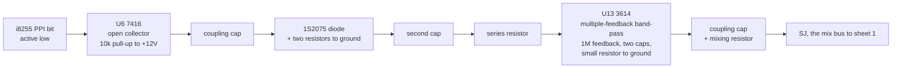

# Congo Bongo's percussion is a circuit, not a sample set

What actually generates Congo Bongo's five percussion voices. Written because
the project had recorded the opposite, and the mistake had reached a plan.

Read for `phosphor-emulator-7z54`. The device that will be rebuilt from it is
`machines/src/congo_sound.rs`.

## Provenance

| | |
|---|---|
| Drawing | `Sound Board 834-5168 rev A`, sheets 1 and 2 of 2, Gremlin/SEGA, drawn 3-17-83 and 3-22-83 |
| Read from | `arcade-museum.com/manuals-videogames/C/congobongo5.PDF`, PDF pp15-18 |
| Transcribed | 2026-08-30, from a 150 dpi render |

Each sheet is spread across two PDF pages: sheet 1 is pp15-16, sheet 2 is
pp17-18. The percussion is all on p18, which is legible at 150 dpi without
magnification; p17 carries the gorilla and needed no more either.

This closes `congo_bongo` on the "no known schematic source at all" list in
`phosphor-emulator-aih3`.

## Why this file exists

The coverage catalog recorded this target as one whose *reference* is sample
playback, and the epic's phase list put it first on exactly that reasoning: that
comparing against recorded WAVs would exercise the claim that the tooling does
not care where a WAV came from.

That is wrong, and it is wrong in the direction that matters. **The board
synthesizes these voices in analog hardware.** The reference emulator plays
recorded samples because it never modelled the circuit, not because the circuit
is a sample player. Reading the drawing took twenty minutes and the belief had
been in the plan for weeks.

The general form is the one this project keeps relearning: *an emulator's
implementation choice is not evidence about the hardware.* A sample set is what
somebody did instead of reading this sheet.

## The four drum voices

Bass drum, low conga, high conga and rim are **the same circuit four times over**
with different component values. One PPI bit each, and the chain is:

The front end is an envelope shaper: the inverter's edge is differentiated by the
coupling capacitor, the diode rectifies it, and the RC pair sets how fast it
decays. The op-amp section is a resonant band-pass that **rings** at its centre
frequency. A pulse into a ringing filter is how you build a drum out of parts,
and it is the whole voice.

### The values, per voice

| | bass drum | conga (L) | conga (H) | rim |
|---|---|---|---|---|
| PPI bit | PC0 | PC1 | PC2 | PC3 |
| U6 7416 section | 9 -> 8 | 5 -> 6 | 13 -> 12 | 11 -> 10 |
| pull-up | R21 10k | R31 10k | R41 10k | R51 10k |
| input cap | C20 68n | C26 68n | C32 68n | C38 10n |
| shaper resistors | R22 47k, R23 47k | R32 47k, R33 47k | R42 47k, R43 47k | R52 22k, R53 22k |
| diode | D1 1S2075 | D2 1S2075 | D3 1S2075 | D4 1S2075 |
| second cap | C21 1u | C27 33n | C33 33n | C39 3n3 |
| series resistor | R24 10k | R34 47k | R44 47k | R54 22k |
| U13 3614 section | 12,13 -> 14 | 9,10 -> 8 | 2,3 -> 1 | 5,6 -> 7 |
| feedback resistor | R28 470k | R38 1M | R48 1M | R58 1M |
| feedback caps | C23 100n, C24 100n | C30 33n, C31 33n | C35 33n, C36 33n | C41 6n8, C42 6n8 |
| tuning resistor | R29 1k | R39 330R | R49 220R | R59 470R |
| bias | R26 22k, C22 47u, R27 10k, R25 47k, R37 10k | R36 22k, C28 47u, R35 47k, R47 10k | R46 22k, C34 47u, R45 47k, R57 4k7 | R56 10k, C40 2u2, R55 22k |
| output cap | C25 1u | C29 1u | C37 1u | C44 1u |
| **mixing resistor** | **R30 240k** | **R40 390k** | **R50 390k** | **R62 200k** |

The rim has R60 2.2M, R61 2.2M and C43 47n around its section that the other
three do not, which is why it is the odd one.

**The mixing resistors are the balance**, and they are the single most useful
row: 240k, 390k, 390k and 200k into a common node say the rim is loudest, the
bass next, and the two congas equal and quietest, with about 5.8 dB between the
extremes. Nothing about that is a matter of taste.

## The gorilla

A different circuit, on p17, and the only voice that is not one of the four
above. It runs from PB1 through two 4538B monostables (U19, both halves, with
R70 100k / C52 1u and R71 150k / C53 1u), 4001B gating at U18, diodes D6 and D7
(1S2075), and several 3614 sections at U16 and U17, into C59 10u and then U15,
marked `G501534`. Its output leaves through C61 1u and R94 51k to the same mix
bus.

A **HM5837** at U20 supplies noise to that side of the sheet, through R63 22k /
R64 22k and C47 470p into a 4001B at U18. That is a dedicated digital noise-
generator IC, and it is the board's only noise source.

## What it establishes

- **All five voices are analog circuits on the board.** There is no sample ROM
  and no sample player. The catalog's ordering rationale for this target was
  false.
- **Four of the five are one design with four sets of values**, so modelling one
  correctly gets four, and getting the topology wrong gets all four wrong
  together.
- **The voices are ringing band-pass filters excited by a shaped pulse.** The
  current model synthesizes them as damped sine oscillators and enveloped noise,
  which is a different thing that can be made to sound similar. A damped sine is
  what a ringing band-pass produces, so the model is not far off in behaviour;
  it is far off in that no constant in it corresponds to a part.
- **The relative levels are the four mixing resistors**, not a matter of ear.
- **The trigger polarity is confirmed**: each voice hangs off a 7416 inverter
  driven by its PPI bit, and the current model's mapping (gorilla PB1, bass PC0,
  conga low PC1, conga high PC2, rim PC3) matches the drawing's labels exactly.
- **The board's noise source is one HM5837**, shared, where the model gives the
  rim and the gorilla an LFSR each.

## What it does NOT establish

- **Any centre frequency or decay time.** The values are transcribed but not
  solved. A multiple-feedback band-pass's centre and Q come from the two
  capacitors, the feedback resistor, the series resistor and the resistor to
  ground together, and none of that arithmetic has been done here. That is the
  first work of the rebuild, not of this note.
- **What U15 `G501534` is.** It sits in the gorilla's path after a 10 uF
  coupling capacitor, with pins marked IN, OUT, VCC, GND, CY and RD. It was not
  identified, and until it is, the gorilla's chain is not understood.
- **The gorilla at component level.** Its two monostables' timings, its gating,
  and how the noise reaches it were read well enough to say what the parts are
  and not well enough to model them.
- **Where SJ goes.** The percussion mix bus is labelled `SJ SH1` on sheet 2 and
  `SJ SH2` on sheet 1, joining the node R20 20k drives from the PSG chain. The
  relative level of percussion against the two SN76489As therefore depends on
  the PSG chain's output impedance, which was not worked out. Sheet 1's PSG path
  is U5 and U4 76489A -> R13/R15 10R -> C12/C13 100n -> C14/C15 1u -> R16/R17
  51k -> U12 3614 with R18 100k -> R19 51k -> U12 3614 with R20 20k -> `SOU`.
- **Whether any of this matches what the emulator currently plays.** Nothing was
  measured. The claim here is about the drawing only.
- **The op-amp part.** `3614` is written on every section; whether that is an
  LM3614, a Norton amplifier, or a house number was not chased, and its input
  structure decides whether the summing nodes above are virtual grounds.

## Confidence

A clean scan, read at 150 dpi, where every designator and value in the table
above was legible without magnification. The four-voice table is a
straightforward read of one well-drawn sheet and is the part to trust.

The gorilla section and the mix bus are read at block level rather than
component level, and are marked so above.

This is a hand transcription and can be wrong. Nothing in it is checked by a
test; the section above it is what keeps that honest.
