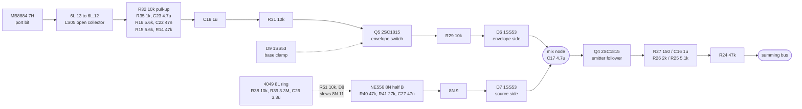

# Donkey Kong's effect chain

What sits between an effect's oscillator and the summing bus on Donkey Kong's
CPU board, and it is the shape of that path rather than the whole analog section
that this file is for. The model is `machines/src/dkong_sound.rs`.

Read for `phosphor-emulator-dkong-sound-excerpt-yfbx`, which exists because that
file asserts specific component values throughout and nothing recorded where any
of them came from. The load-bearing claim it makes is a topology claim, that the
effects are **diode-mixed with their source rather than multiplied by it**, and a
drawing is the only thing that can settle a topology claim. A spectral fit is
evidence for it and not proof.

## Provenance

| | |
|---|---|
| Drawing | `TKG4-14-CPU`, sheet 3, Nintendo Co. Ltd., dated 5,56,12,1 |
| Read from | `arcade-museum.com/manuals-videogames/D/dk-tkg4u.pdf`, PDF pp29-30 |
| Transcribed | 2026-09-18 |

The scan quirks are already written up in `machines/src/tkg04.rs`'s header and
are repeated here only where they cost a pass: this is a 300 dpi 1-bit scan with
no text layer, so nothing in it is searchable, and the sheet is **cut across two
PDF pages, left half then right half**, so a sheet number and a PDF page never
agree. The whole analog section is on the right half, p30, in grid columns 11 to
16.

## Two channels, identical but for one resistor

The board carries the chain twice, and reading both is what makes the shape
trustworthy: a single reading of one channel could be a misread, two channels
that come out the same cannot both be misread the same way.

**The upper channel is jump and the lower is stomp**, which is settled by where
each one's source comes from rather than assumed from the layout. The vertical
that carries `D7` into the upper channel's mix node runs up to `8N.9`, the
`NE556`'s half-B output, and half B is the 47 nF half that
[`crate::dkong_sound`] calls jump. The lower channel's source arrives on `D2`
and `D3` from the LS164 and LS161 chain, which is stomp's divider.

| stage | jump (upper) | stomp (lower) |
|---|---|---|
| envelope coupling | `C18` 1 uF | `C21` 1 uF |
| base resistor | `R31` 10k | `R9` 10k |
| base clamp to ground | `D9` 1SS53 | `D4` 1SS53 |
| envelope switch | `Q5` 2SC1815 | `Q2` 2SC1815 |
| collector load | `R30` 100k | `R8` 100k |
| collector series | `R29` 10k | `R7` 10k |
| **mix diode, envelope side** | `D6` 1SS53 | `D1` 1SS53 |
| **mix diode(s), source side** | `D7` 1SS53 | `D2`, `D3` 1SS53 |
| node capacitor | `C17` 4.7 uF | `C20` 3.3 uF |
| emitter follower | `Q4` 2SC1815 | `Q1` 2SC1815 |
| emitter load to ground | `R28` 4.7k | `R6` 4.7k |
| first series | `R27` **150** | `R5` **750** |
| first shunt | `C16` 1 uF | `C19` 1 uF |
| second series | `R26` 2k | `R4` 2k |
| second shunt | `R25` 5.1k | `R3` 5.1k |
| into the summing bus | `R24` 47k | `R2` 47k |

**The one asymmetry is `R27` 150 against `R5` 750.** Every other value matches
across the two channels, which is what makes that one worth pointing at rather
than filing as a misread: it was checked at full scale on both.

**Which diode carries what is worth stating, because it is easy to get backwards
and this file did at first.** `Q5` and `Q2` are driven from the sound CPU's port
through an open-collector inverter and an RC network, so their collectors carry
the ENVELOPE. The oscillator arrives on the other diode, down a vertical from
the `NE556` for jump and from the divider chain for stomp. The mix node is
therefore envelope against source, which is the arrangement the model assumes,
and not source against a gate.

## Where the envelope comes from

Both envelopes start at the sound CPU, an `MB8884` (8035) at `7H`, and reach the
chain through an open-collector `LS05` at `6L`:

| | jump | stomp |
|---|---|---|
| inverter | `6L.13` in, `6L.12` out | `6L.11` in, `6L.10` out |
| pull-up | `R32` 10k | `R10` 10k |
| shaping | `R35` 1k, `C23` 4.7 uF, `R16` 5.6k, `C22` 0.047 uF, `R15` 5.6k, `R14` 47k | via `C21` |

`Q6` 2SC1815 sits on jump's shaping network. The port bit behind each inverter
was not traced to a numbered `PB` pin; see what this does not establish.

## Jump's wobble, which stomp does not have

`dkong_sound.rs` says jump "adds a slewing control-voltage capacitor with its own
wobble oscillator, which is the only part of the two that differs downstream of
the source". The sheet has it. The `NE556`'s half-B control-voltage pin `8N.11`
sits on `C24` 10 uF with `R49` 1.2k, `R126` pulls `8N.10`, and a three-inverter
ring on the `4049` at `8L` (`R38` 10k, `R39` 3.3M, `C26` 3.3 uF) feeds back into
that node through `R51` 10k and `D8` 1SS53. So the control voltage is slewed by
a slow oscillator, exactly as described.

## The chain

Jump, with stomp's designators beside each stage in the table above. The same
path at pin level, including the wobble ring, is
[`dkong-effect-chain.json`](dkong-effect-chain.json), rendered to
[`dkong-effect-chain.svg`](dkong-effect-chain.svg) by `render.sh`.

## Nets

Only the nets the chain needs. `ref.pin` where the drawing gives a pin.

| net | members |
|---|---|
| jump mix node | `D6` cathode, `D7` cathode, `C17`+, `Q4` base |
| stomp mix node | `D1` cathode, `D2` cathode, `D3` cathode, `C20`+, `Q1` base |
| jump emitter | `Q4` emitter, `R28`, `R27` |
| stomp emitter | `Q1` emitter, `R6`, `R5` |
| summing bus | `R24`, `R2`, and the other effect legs, to `R1` 47k and `VR2` 10k |
| NE556 half A, walk | `R42` 47k, `R43` 27k to `8N.1`, `8N.2`; `C28` 0.033 uF on `8N.6` |
| NE556 half B, jump | `R40` 47k, `R41` 27k to `8N.13`, `8N.12`; `C27` 0.047 uF on `8N.8` |
| jump source | `8N.9` to `D7` anode |
| jump control voltage | `8N.11`, `C24` 10 uF, `R49` 1.2k, `R51` 10k, `D8` cathode |
| jump wobble ring | `8L.2`/`8L.3`, `8L.4`/`8L.5`, `8L.6`/`8L.7` on the 4049, with `R38` 10k, `R39` 3.3M, `C26` 3.3 uF |
| jump envelope | `6L.13` in, `6L.12` out, `R32` 10k pull-up, then `R35`, `C23`, `R16`, `C22`, `R15`, `R14`, `C18` |
| stomp envelope | `6L.11` in, `6L.10` out, `R10` 10k pull-up, then `C21` |
| DAC data | `7H.34`-`7H.27` (`PA7`-`PA0`) to `DAC-08` `B1`-`B8` |
| DAC decay | `7H.38` (`PB7`) to `Q7` base; `Q7` emitter, `C32` 10 uF to ground, `R20` 10k in series |
| DAC collector load | `R37` 10k, from the supply to `Q7` collector |

## What it establishes

- **The effects are diode-mixed, not multiplied.** Two diodes meet at one node
  that feeds a transistor base: `D6` and `D7` on the upper channel, `D1` with
  `D2` and `D3` on the lower. Two diodes into a common node is a mix, and there
  is no multiplying element anywhere on the path. `dkong_sound.rs` lines 18-24
  assert exactly this and the drawing agrees, so that claim is no longer resting
  on a spectral fit.
- **The stage after the mix is an emitter follower into a resistive divider**,
  which is the rest of the shape the model assumes: `Q4`/`Q1` with their emitter
  load, then two series-shunt sections, then a 47k into the shared bus. The 47k
  is what sets each effect's weight in the mix.
- **The two 555 pairs are 47k / 27k with 0.033 uF and 0.047 uF**, `R42`/`R43`/`C28`
  and `R40`/`R41`/`C27` on the `NE556` at `8N`. These two were already confirmed
  by hand on 2026-08-30; they are repeated here so the file is self-contained.
- **The DAC's decay is `C32` 10 uF discharging through `R20` 10k**, driven from
  `PB7` on the sound CPU, which is the 100 ms time constant `DAC_DECAY_S` uses.
  The code's "10 kOhm across 10 uF" is right in value. Note that **`R37`, also
  10k, is `Q7`'s collector load and not the discharge path**; the issue text
  named `R37` for the decay, and the two being the same value is why that would
  never have shown up as a wrong number.
- **Which channel is which effect.** Jump is the upper one, because the vertical
  feeding its `D7` runs to `8N.9`, and half B is the 47 nF half. Stomp is the
  lower one, taking its source on `D2` and `D3` from the divider chain.
- **Jump's wobble oscillator is real and stomp has none**, which is the one
  downstream difference `dkong_sound.rs` claims between the two: a three-inverter
  4049 ring slews `8N.11` through `R51` and `D8`.
- **The sound CPU is an `MB8884` (8035) at `7H`**, its `PA` port drives the
  `DAC-08` and `PB7` drives the decay transistor. That names what `feed_dac` and
  `set_discharge` reach.

## What it does NOT establish

- **Which `PB` bit gates which envelope.** Both run from the CPU through an
  open-collector `LS05` at `6L`, jump on pins 13 and 12 and stomp on 11 and 10,
  but the two inverter inputs cross several other verticals on their way back to
  the port and were not followed to a numbered pin. They are `PB4` to `PB6`,
  since `PB7` is the decay and `PA` is the DAC. This did not need settling to
  name the channels, which the sources did.
- **Why `R27` is 150 and `R5` is 750.** The asymmetry is read, not explained. It
  makes one channel's follower see a different load, so the two effects do not
  arrive at the bus at the same level, but what that ratio should sound like is
  not something this sheet says.
- **The chopper claim.** `dkong_sound.rs` lines 82-89 argue the oscillator chops
  the envelope rather than multiplying it. The diodes above are consistent with
  chopping and inconsistent with a multiply, but the specific one-sided-pulse
  reasoning in that comment is about the waveform, and a waveform is not
  something a schematic shows.
- **Anything about the 4049 oscillators, the `MB3614` sections or the `MB3712`.**
  They are on the same sheet and were not read. The full analog section is an
  NE556, two 4049 oscillators, seven 2SC1815, two MB3614 quads and an MB3712, and
  transcribing all of it is the "arcade motherboard" `README.md` warns against.
- **Walk's own chain.** Walk is the `NE556`'s other half, `R42`/`R43`/`C28` on
  `8N.1`, `8N.2` and `8N.6`, and its envelope network is a different shape from
  these two: `dkong_sound.rs` gives it four resistors and a 3.3 uF rather than
  the diode mix above. It was not read, and this file makes no claim about it.
- **The stomp divider itself.** Its source reaches `D2` and `D3` from an LS164
  chain into an LS161, which is on the same sheet in columns 10 and 11 and was
  not read. What is established here is only that stomp's source arrives on those
  two diodes.

## Confidence

A 300 dpi 1-bit scan, and legible at full scale without pixel-level guessing
once the right half is cropped. Every designator and value in the table was read
at magnification, and the two channels were read independently and compared
afterwards rather than one being assumed from the other.

Two readings were corrected during the pass and are worth recording because both
would have produced a plausible-looking wrong table. The upper divider's second
series resistor reads `R26` 2k, not a second `R25`; and the decay path is `R20`,
not `R37`, which sits on the other side of `Q7`.

This is a hand transcription and can be wrong. Nothing in it is checked by a
test; the section above it is what keeps that honest.
