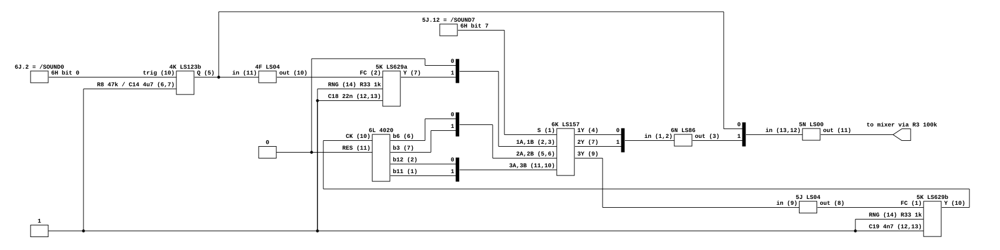
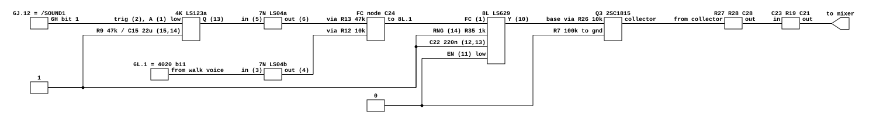
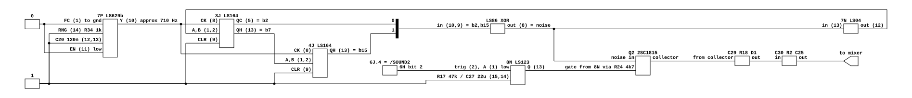
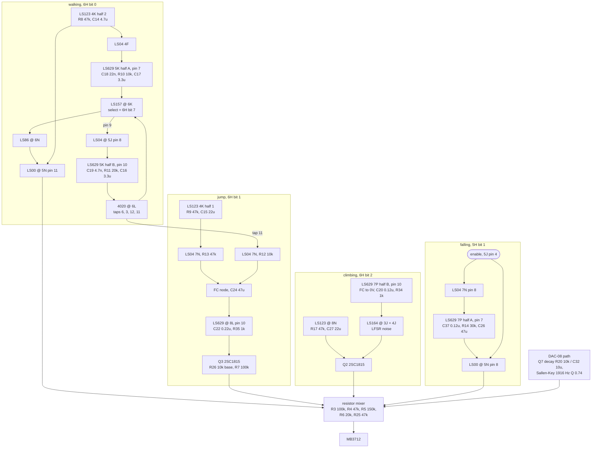

# Donkey Kong Jr. effect voices

What generates Donkey Kong Jr.'s sound effects, which latch bit triggers each,
and why none of Donkey Kong's model applies. Read for
`phosphor-emulator-dkongjr-wrong-discrete-sound-0tx9`. The emulator currently
plays Donkey Kong Jr.'s effects through `machines/src/dkong_sound.rs`, which was
wired in deliberately to give the machine some audio and was never meant to be
correct. This is the reading that says what correct would be.

## Provenance

| | |
|---|---|
| Drawing | `Donkey Kong Junior CPU P.C. Board`, sheet 5 of 5, dated 5-31-82 |
| Read from | `arcade-museum.com/manuals-videogames/D/DKJr.pdf`, PDF pp30-31 |
| Transcribed | 2026-08-30, from a 400 dpi render of a 300 dpi 1-bit scan |

The sheet is cut across two PDF pages, left half then right half, so its sheet
number and its PDF page never agree. The voices are on the right half (p31); the
noise clock, the shift registers and the trigger latches are on the left half
(p30). Scan quirks for the whole package are in the module header of
`machines/src/tkg04.rs`.

## Four voices, not three

Donkey Kong has three discrete effects. Donkey Kong Jr. has four, and a fifth
latch bit that retunes one of them.

| Voice | Trigger | Source |
|---|---|---|
| Walking | 6H bit 0 | 4020 counter, tap-selected, gated against a VCO |
| Jump | 6H bit 1 | VCO swept by a one-shot, chopped by Q3 |
| Climbing | 6H bit 2 | LFSR noise, chopped by Q2 |
| Falling | 5H bit 1 | VCO gated by its own enable |
| (walking pitch) | 6H bit 7 | selects which counter tap the walking voice uses |

The two latches are `0x7D00`-`0x7D07` (the 6H latch) and `0x7D80`-`0x7D87` (the
5H latch). Both are already decoded in `machines/src/donkey_kong_jr.rs`; only
bits 0 to 2 of the 6H latch currently reach a sound device, and they reach the
wrong one.

## The voices, at pin level

Three of the four are transcribed as netlists and rendered by
[`render.sh`](render.sh). Each one earns a drawing because its argument is in
the pin numbers rather than in the block order.

### Walking

[`dkongjr-walk-voice.json`](dkongjr-walk-voice.json). Which four counter taps
reach which mux channels, and that the mux output returns through 5J to the
frequency control of the very oscillator clocking the counter. That loop is the
voice, and a block diagram cannot show it is a loop.

### Jump

[`dkongjr-jump-voice.json`](dkongjr-jump-voice.json). The frequency-control node
has **two** sources through different resistors: the one-shot through R13 47 k,
and the walking voice's 4020 bit 11 through R12 10 k. The jump is therefore not
independent of the walking counter. This is the exact place the first pass of
this transcription went wrong, by assuming both legs came from the one-shot.

### Climbing

[`dkongjr-climb-voice.json`](dkongjr-climb-voice.json). A 16-bit LFSR across two
cascaded LS164s: QC of 3J (bit 2) and QH of 4J (bit 15) into an XOR, whose output
is both the noise and, inverted through 7N, the bit shifted back in. The tap
positions are the whole character of the noise, and they are only visible as pin
numbers.

### Falling

No netlist. It is an enable, one inverter, one VCO half and one NAND, in that
order, with no branch or feedback. The block diagram below is a complete
description and a netlist would add nothing.

## Signal flow

## Nets

| Net | Pins |
|---|---|
| `4020.RES` | 6L.11 -> GND |
| `4020.CK` | 6L.10 <- 5K.10 |
| `4020` taps | 6L.6 (bit 6), 6L.7 (bit 3), 6L.2 (bit 12), 6L.1 (bit 11) |
| `LS157.S` | 6K.1 <- 5J.12 (6H bit 7, inverted) |
| `LS157` inputs | 6K.2/3 <- GND, 5K.7; 6K.5/6 <- 6L.6, 6L.7; 6K.11/10 <- 6L.2, 6L.1 |
| `LS157` outputs | 6K.4 -> 6N.1; 6K.7 -> 6N.2; 6K.9 -> 5J.9 |
| `fc_5k_b` | 5J.8 -> R11 20k -> {C16 3.3u -> GND, 5K.1} |
| `LS629_5K` | CX 5K.12-C19 4.7n-5K.13; RNG 5K.14 <- R33/2 1k; EN 5K.11 -> GND |
| `fc_8l` | {7N.6 -> R13 47k, 7N.4 -> R12 10k} -> {C24 47u -> GND, 8L.1} |
| `LS629_8L` | CX 8L.12-C22 0.22u-8L.13; RNG 8L.14 <- R35 1k; EN 8L.11 -> GND |
| `LS629_8L.Y` | 8L.10 -> R26 10k -> Q3.base (R7 100k to GND) |
| `Q3.collector` | R27 10k, R28 100k, C28 10u -> C23 0.47u / R4 47k -> R19 100 / C21 0.056u |
| `LS629_7P.FC_b` | 7P.1 -> GND |
| `LS629_7P` | RNG 7P.14 <- R34/2 1k; EN 7P.11 -> GND; CX C20 0.12u |
| `LFSR.CK` | 7P.10 -> 3J.8, 4J.8 |
| `LS123_4K` | half 1: R9 47k / C15 22u, Q 4K.13; half 2: R8 47k / C14 4.7u, Q 4K.5 |
| `LS123_8N` | C 8N.14 <- C27 22u; R 8N.15 <- R17 47k; Q 8N.13 |
| `Q2.collector` | R24 4.7k, C29 10u, R18 100k, D1 1S953 -> C30 0.47u / R6 20k -> R2 120 / C25 1u |
| `discharge` | sound CPU 7H port 2 bit 7 |

## What it establishes

- **The tone sources are 74LS629 voltage-controlled oscillators**, five halves
  across three packages: 5K (both halves), 8L (one), 7P (both). Donkey Kong's
  model is two voltage-controlled 555 astables plus an LS164 into an LS161.
  Not one source is shared, so this is the wrong circuit rather than a mistuned
  one.
- **Walking is a counter-tap voice.** A 4020 at 6L is clocked by one LS629 half
  and an LS157 at 6K selects among four of its taps. The pin numbers of those
  four taps match the CD4020 pinout, which is the cross-check that the read is
  right. Latch bit 7 picks which pair of taps is in play, so the same trigger
  produces two different pitches.
- **Climbing is noise**, from a 16-bit LFSR built out of two cascaded LS164s at
  3J and 4J, clocked by an LS629 half at 7P whose frequency control pin is tied
  to ground so it free-runs at a fixed rate near 710 Hz. The feedback is QC of 3J
  (bit 2) exclusive-ORed with QH of 4J (bit 15), inverted through an LS04 section
  at 7N and shifted back into 3J. The noise itself is taken at the XOR output.
- **Falling exists and the emulator has no trigger for it at all.** It is bit 1
  of the 5H latch at `0x7D80`, which the emulator decodes for the sound CPU IRQ
  and otherwise ignores.
- **Jump and climbing both end in a transistor chopping an RC network** (Q3 and
  Q2), which is the same shape as Donkey Kong's jump and stomp even though the
  source feeding it is different. Both then use one output topology, read off
  the drawing as series against shunt rather than inferred: a series coupling
  capacitor, then a series resistor into a shunt capacitor, then a series
  resistor that is also the mixer leg.

  | Voice | coupling | series R | shunt C | corner | mixer leg |
  |---|---|---|---|---|---|
  | Jump | C23 0.47 uF | R19 100 | C21 0.056 uF | 28 kHz | R4 47 k |
  | Climbing | C30 0.47 uF | R2 120 | C25 1 uF | 1.3 kHz | R6 20 k |

  The two corners are three decades apart, which is the point: jump's is a
  snubber that does nothing audible, climbing's genuinely rolls the noise off.
  Guessing the order would have swapped a tone control for a snubber on both.
- **The DAC path is identical to Donkey Kong's**: the same Q7 decay network
  (10 k across 10 uF) and the same Sallen-Key reconstruction filter at 1916 Hz,
  Q 0.74. That half of `dkong_sound.rs` transfers unchanged.

## What it does NOT establish

- **A usable 74LS629 frequency law.** See the section below; the datasheet does
  not supply one, and this is now the single thing blocking the model.
- **The LS157's fourth channel.** 6K pins 2 and 3 were read as ground and the
  5K pin 7 output, which makes the mux's first channel a gate rather than a
  selector, but that pair was the least legible connection on the sheet.
- **Absolute pitch of anything.** Every frequency here follows from the LS629
  law above, so no number in this document is yet a hertz.
- **The 4H latch at `0x7C80`.** It carries sound and graphics signals and one of
  its bits is read back by the sound CPU, but its role was not traced.
- **Levels.** The mixer leg resistors are recorded but the relative loudness of
  the four voices was not derived.

## What the 74LS629 datasheet does and does not give

TI SDLS186, January 1980, revised March 1988, covering SN54/74LS624 through
LS629. It settles two things and refuses the one that matters.

Settled. The 'LS629 row of the selection table is dual VCO, no complementary Z
output, enable present, range input present, no external timing resistor, which
is exactly how all three packages are drawn. And "when the enable input is low,
the output is enabled; when the enable input is high, the internal oscillator is
disabled": every enable pin on this board is grounded, so all five halves free
run, and the reading above does not depend on inferring that from the layout.
Frequency control and range inputs both take 0 V to 5 V, output range is 1 Hz to
20 MHz, and the output duty cycle is fixed near 50 percent.

Not settled. There is no equation. Frequency is given only as curves, and the
one curve set that covers the 'LS629 is Figure 3, output frequency against
external capacitance, drawn for three corners: control 5 V with range 0 V,
control and range both 2.5 V, and control 0 V with range 5 V. It is log-log and
close to f proportional to 1/C. Note the sense that falls out of it, which is
easy to get backwards: raising the range input voltage *lowers* the frequency.

The frequency-against-control-voltage curves, Figures 4 and 5, are drawn for the
'LS625, 'LS626 and 'LS627 only. The part on this board is not among them. So the
datasheet gives the family shape and three corner points, and nothing that
converts a control voltage on 5K, 8L or 7P into a frequency. A footnote adds
that output frequency may be unstable below 1 V of control voltage, which is
inside the range these circuits actually use.

That is the gap the model has to cross, and it is a design decision rather than
a reading, so it is recorded here and not guessed at.

## Confidence

A 400 dpi render of a 300 dpi 1-bit scan. Designators are the weak point at this
resolution: four of them were misread on the first pass and corrected on a second
look at 500% (R13 read as R15, R18 as R20, R28 as R20, and R24's value read as
47 k when the drawing shows 4.7 k). Every designator and value in the tables
above was re-read at magnification after the first pass.

The structure was cross-checked against MAME's `dkong_a.cpp` discrete netlist,
which is an independent transcription of the same board. That check is what
found the four misreads, and it also corrected two topology errors: both
inverters feeding the 8L control node are not from the one-shot, one of them
carries a counter tap; and the LS123 at 4K has both halves in use, on different
voices. Where the drawing and that netlist disagreed the drawing was re-read and
won, which is how R26 and R7 stayed in the tables despite not appearing there.

This is a hand transcription and can be wrong. Nothing in it is checked by a
test, and the section above it is what keeps that honest.
