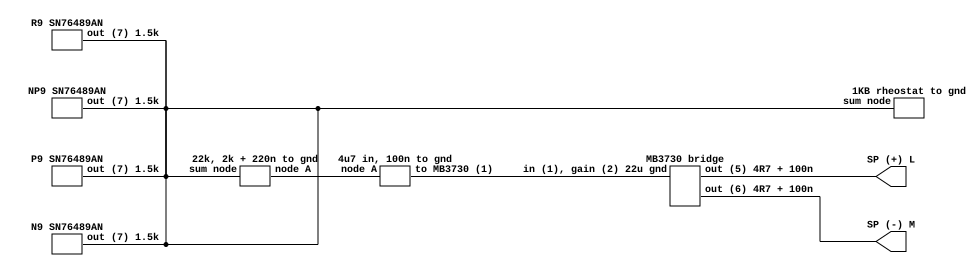

# Mr. Do's Castle's audio output

What Universal's 8302 main board does between its four SN76489As and the
cabinet. Read for `phosphor-emulator-discrete-sound-fidelity-l5r3.10`, the
project-wide audit. The model is `machines/src/docastle.rs`.

The catalog row's worry was specific and answerable: "four chips summing into one
output is a mixer, and its resistors decide the balance between them". The
resistors are four equal 1.5k, so the balance is 1:1 and the model's plain sum
has the right ratio. What the model does not have is everything after that node:
a fixed low-frequency shelf worth about 22 dB, a volume rheostat, and a bridge
output into one speaker.

## Provenance

| | |
|---|---|
| Drawing | `Mr. Do's CASTLE`, Universal 8302, `Fig. 6 Main Circuit Board Schematic Diagram (No. 4)` |
| Read from | `arcade-museum.com/manuals-videogames/M/MrDosCastle.pdf`, PDF page 16, a 335 dpi scan |
| Transcribed | 2026-09-01 |

The manual is 167 pages and only four of them are schematics, PDF pages 13 to
16, sheets No. 1 through No. 4. **Sheet No. 4 is printed rotated 90 degrees** on
its page, so it needs a `-rotate 90` before anything on it can be read. The
audio is the whole left half of that sheet; the right half is the sound chips'
address decode.

## What the model does today

`DocastleBoard::tick` sums the four `Sn76489a` outputs, clamps, box-filters to
the output rate, and runs a shared `DcBlocker` over the result. That is the whole
model.

## The chain

[`docastle-audio-output.json`](docastle-audio-output.json). The netlist draws the
signal path; the MB3730's pin 2 gain capacitor is folded into that cell's port
name rather than given a net of its own, because it goes to ground and a net with
one end is not a connection.

## The four chips are summed equally

Each SN76489AN brings its output out on pin 7, and each reaches one common node
through **1.5k**. Four equal legs, four junction dots on one vertical. So:

- the balance between the four chips is **1:1**, which is what
  `iter().map(output).sum()` already is;
- the node's source impedance is the four legs in parallel, **375 ohms**, plus
  whatever the chips' own output impedance is.

This is the fifth result in this sweep that confirms a constant rather than
refuting one, and it is the one the row explicitly asked for.

## What is after the node, and is not modelled

- **A 1K B-taper pot wired as a rheostat**, its wiper strapped to one end, from
  the summing node to ground. The cabinet volume control. At its maximum the node
  keeps about `1000 / (1000 + 375)` of the signal; at zero it is shorted silent.
- **A low-frequency shelf.** 22k in series from the node, and 2k in series with
  0.22 uF from the far side of it to ground. That is flat at DC, falls from about
  **30 Hz**, and flattens again above about **362 Hz** at `2k / 24k`, which is
  **-21.6 dB**. In the band the chips actually use it reads as a large bass lift:
  at 110 Hz the network passes -11.3 dB against -21.6 dB at the top, so about
  **10 dB more bass than treble**.
- **4.7 uF into the MB3730's pin 1**, with 0.1 uF from that pin to ground. This
  is the coupling capacitor the model's `DcBlocker` stands for.
- **22 uF from pin 2 to ground**, which is how an MB3730 is told its gain.
- **The output is a bridge.** Pins 5 and 6 drive `SP (+)` on connector L and
  `SP (-)` on connector M, each through a 4.7 ohm and 0.1 uF Boucherot cell. One
  speaker, driven differentially, and the model is mono. The same part drives
  Galaga's speaker, one manufacturer and one continent away.

**The volume control does not move the shelf.** The pot sits before the 22k, and
22k dominates the shelf's series arm, so turning the volume changes the level and
leaves both corners within about a percent. That is worth stating because it is
the exception: on Pac-Man, Lunar Lander, Galaga and Dig Dug the control setting
moves a corner, and here it does not.

## What it establishes

- The four chips are mixed 1:1 through equal 1.5k legs, so the model's sum is
  right in ratio. The row's question is answered.
- There is a fixed low shelf of about 22 dB between 30 Hz and 362 Hz that the
  model does not have, and it is the largest single thing missing here.
- The `DcBlocker`'s position after the sum is right again: the 4.7 uF really is
  between the summing network and the amplifier.
- The output is a bridge into one speaker, where the model is mono.
- The board's power amplifier is an MB3730, the same part Galaga's Midway board
  uses.

## What it does NOT establish

- **Do Run Run and Mr. Do's Wild Ride.** They are in the same catalog row and on
  the same device file, and neither board's drawing was read. Only Mr. Do's
  Castle, Universal 8302, is transcribed here. Whether the other two share this
  output stage is open, and given that Galaga and Dig Dug did not share theirs,
  it is not safe to assume.
- **The coupling corner at the amplifier input.** 4.7 uF works against the
  MB3730's input impedance, which is not on this sheet, in parallel with the
  0.1 uF at the same pin. Without that impedance the capacitor's value alone says
  nothing, which is why no number is given.
- **The SN76489AN's own output impedance**, which adds to the 375 ohms and so
  changes what the volume rheostat's law actually is. Not on this sheet.
- **The shelf's exact depth**, to better than the component tolerances: the
  -21.6 dB above uses 22k and 2k as drawn and ignores the source impedance, which
  moves it by about a percent.
- **Any measurement.** Nothing here has been compared against a capture.

## Confidence

A clean 335 dpi scan of a redrawn manual schematic rather than a photocopied
factory sheet, and it is the most legible drawing in this sweep so far. Every
value was read without ambiguity at moderate magnification. The one connection
worth checking specifically was the volume pot's, because a three-terminal pot
with its wiper strapped to an end is a rheostat and a pot with its wiper going
somewhere else is a divider, and those are different circuits. Pin 2 is strapped
to pin 3 and pin 3 goes to ground, so it is a rheostat.

This is a hand transcription and can be wrong. Nothing in it is checked by a
test; the section above it is what keeps that honest.
