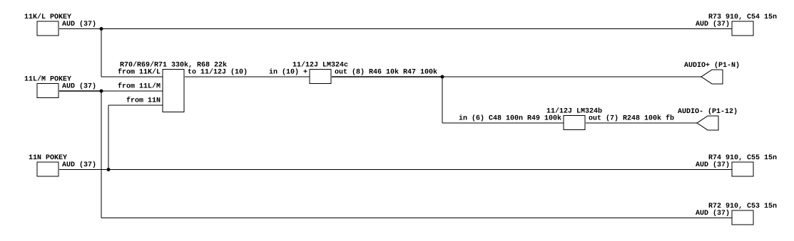

# Food Fight's audio output

What Atari's Food Fight game PCB does between its three POKEYs and the cabinet.
Read for `phosphor-emulator-discrete-sound-fidelity-l5r3.10`, the project-wide
audit. The model is `machines/src/foodf.rs`.

Two results, and they point in opposite directions. The **mixing law is
confirmed**: three equal 330k legs, so the model's `/ 3.0` is the board's
1:1:1. And the **POKEY load is a fourth distinct interface**, 910 ohm where
Missile Command and Tempest use 10k, which puts its low-pass an order of
magnitude higher than either.

The summing stage itself is Tempest's, resistor for resistor, with a third leg
added. That matters because three times running in this sweep a shared board
family has *not* meant a shared output stage. Here it does, and the part that
differs is the one part that also differed between Missile Command and Tempest.

## Provenance

| | |
|---|---|
| Drawing | `Food Fight Sound Schematic Diagram`, Atari SP-229 sheet 10A, 2nd printing, (c) Atari Inc. 1983 |
| Drawing | `Food Fight Regulator/Audio II PCB and Power Supply Diagrams`, SP-229 sheet 2B, carrying `Regulator/Audio II PCB` 035435-01 rev G |
| Read from | `arcarc.xmission.com/PDF_Arcade_Atari_Kee/Food_Fight/Food_Fight_SP-229_2nd_Printing.pdf`, PDF pages 19 and 4, a 600 dpi scan |
| Transcribed | 2026-09-01 |

**The catalog row asked whether SP-229 carries an audio sheet, and it does.**
The row already recorded sheets 7B, 8A and 8B as read for this board's *video*
under `phosphor-emulator-aih3`; the same 22-page package carries sheet 10A,
`Food Fight Sound`, which is the whole of the game PCB's audio, and sheet 2B,
which is the amplifier board. Nothing else had to be fetched.

Two notes on the package. Its pages are stored rotated 90 degrees, so rotate
before reading. Its sheet numbering is regular for once: sheet 1A is PDF page 1
and each subsequent side advances one page, so sheet 10A is page 19. The
contents page on sheet 1A is the authority and it agrees with every title block
checked.

## What the model does today

`FoodfSystem::run_frame` drains three `Pokey`s, averages them with
`(s0 + s1 + s2) / 3.0`, runs one shared `DcBlocker` at the 10 Hz default, and
scales by 2. That is the whole model.

## The chain

[`foodf-audio-output.json`](foodf-audio-output.json).

## Three POKEYs, three identical loads

The chips are `CO12294-01` at board positions 11K/L, 11L/M and 11N. Their chip
selects are the nets `AUDIO 2`, `AUDIO 1` and `AUDIO 0` respectively, read off
pin 30 or pin 31 on each.

Each `AUD` output on pin 37 sits on the same two parts:

| chip | pull-up to +5 V | shunt to ground | leg to the summing node |
|---|---|---|---|
| 11K/L | R73 **910** | C54 0.015 uF mylar | R70 330k |
| 11L/M | R72 **910** | C53 0.015 uF mylar | R69 330k |
| 11N | R74 **910** | C55 0.015 uF mylar | R71 330k |

**910 ohm is the finding.** Missile Command loads pin 37 with 10k and 0.1 uF;
Tempest with 10k and 0.015 uF; Food Fight uses Tempest's capacitor against a
resistor eleven times smaller. The corner is at **least 11.66 kHz** here against
at least 1061 Hz on Tempest and at least 159 Hz on Missile Command, those being
the values for the printed resistor alone and rising as the chip's own output
impedance falls. Three games, one capacitor value shared between two of them,
and a low-pass that moves by a factor of 73 across the set. The model has no
filter at all on any of them.

## The summing network, which is Tempest's with a third leg

The three 330k legs meet at one node with **R68 22k to ground**, and that node
drives the non-inverting input of a single LM324 section at board position
11/12J: pin 10 is the input, **R46 10k** from pin 9 to ground and **R47 100k**
from pin 8 back to pin 9. Supply is pin 4 on `10.3 UNREG` with pin 11 grounded.

Which input is which is the one connection this reading turns on, and it was
checked at pixel level: the R46/R47 junction drops into pin 9, marked `-`, and
the resistor legs enter pin 10, marked `+`, on two separate verticals with no
junction between them. Read the other way round it would be an inverting summer
and every number below would change.

The arithmetic is exact. Three 330k legs against 22k to ground is
`3/330k` against `18/330k` in total, so each POKEY reaches the node at
**exactly 1/18**, and the stage's gain of `1 + 100/10 = 11` puts each at
**11/18 = 0.611** at the output.

- **The ratio is 1:1:1, which is what the model encodes.** Seventh confirmation
  in this sweep, after I, Robot's `* 0.25`, Mr. Do's Castle's and Mr. Do's 1:1
  sums, Tempest's `* 0.5` and Mr. Do's coupling position. The absolute factor is
  0.611 rather than the model's `1/3 * 2`, but nothing in the model calibrates an
  absolute level, so that is a scale and not an error.
- **The stage is Tempest's.** Tempest: R32 and R33 330k, R34 22k, R36 10k, R38
  100k, gain 11, each POKEY at `1/17`. Food Fight: R70/R69/R71 330k, R68 22k,
  R46 10k, R47 100k, gain 11, each POKEY at `1/18`. Same circuit, one more leg,
  and the `1/17` against `1/18` is entirely the extra leg loading the node.

## The antiphase pair is not symmetric

Section b of the same LM324 inverts the summed signal to make the second
connector pin: **C48 0.1 uF then R49 100k** into pin 6, **R248 100k** feedback
from pin 7, and pin 5 held at **+5 V**. Gain -1.

- `AUDIO+` leaves on P1-N as the output of the non-inverting summer, and **it is
  DC-coupled all the way back to the POKEY pins**. Nothing between pin 37 and the
  connector is a series capacitor.
- `AUDIO-` leaves on P1-12 through C48, so **it is high-passed at 15.92 Hz** and
  the other channel is not.

So the pair is antiphase above 16 Hz and single-ended below it. The model has one
`DcBlocker` at 10 Hz standing in for both.

## The Regulator/Audio II PCB, which four games now share

035435-**01** rev **G** here, against 035435-**02** rev B in Missile Command's
package and rev E in Tempest's. The audio half is component for component the
circuit already transcribed in
[`atari-pokey-audio-output.md`](atari-pokey-audio-output.md): R14 10k and R27 1k
dividing the input, C6 0.22 uF into pin 1 of a TDA2002AV at Q5 with C7 0.001 uF
in shunt, R9 220 ohm and R11 10 ohm setting a gain of 23 through C4 470 uF, R12
100 ohm and C5 0.01 uF compensating, C3 0.1 uF and R10 1.0 ohm as a Boucherot
cell, and a second identical channel at Q7.

Two values worth having:

- **The output coupling is C9 and C10 at 3300 uF**, which into a nominal 8 ohm
  speaker is a high-pass at **6.0 Hz**. That is Tempest's rev E value, not
  Missile Command's rev B 1000 uF.
- The divider throws away 20.8 dB and the amplifier puts 27.2 dB back, so the
  connector-to-speaker gain is about **2.09**, the same as the other games.

**Both speakers are driven**, SPKR1 and SPKR2 off J8, and the model is mono.

## Six Atari POKEY interfaces, and one amplifier board

This is the fourth Atari POKEY board read in this sweep and the picture is now
clear enough to state as a rule. Recorded here because the next Atari row will
want it, and because the temptation on each new board is to carry a law over.

| game | what pin 37 sees | consequence |
|---|---|---|
| Missile Command | 10k to +5 V, 0.1 uF to ground | low-pass at least 159 Hz |
| Tempest | 10k to +5 V, 0.015 uF to ground | low-pass at least 1061 Hz |
| **Food Fight** | **910 to +5 V, 0.015 uF to ground** | **low-pass at least 11.66 kHz** |
| Star Wars | virtual ground, 1k transimpedance, 1000 pF | pole at 159 kHz, no load filter |
| Quantum | virtual ground at `AREF`, 1k transimpedance | no load filter |
| Crystal Castles | 0.01 uF at the pin, 220 into a virtual ground at `AREF` with 1k feedback | voltage gain about 4.5, low-pass at least 72 kHz |

**One chip, six laws, and no two boards alike.** What *is* shared is everything
after the connector: Missile Command, Tempest, Quantum, Food Fight and Crystal
Castles all end in a Regulator/Audio II PCB, 035435-01 or -02, and the audio half
is the same circuit on all five. The only value that moves across them is the
output coupling capacitor, 1000 uF on Missile Command's rev B and 3300 uF on
every later revision read.

That inverts the sweep's recent pattern. Galaga and Dig Dug, Missile Command and
Tempest, and Mr. Do and Mr. Do's Castle each shared a family and not an output
stage. Here five games share an output stage and not an interface. Neither
direction is safe to assume; both have to be read.

## What it establishes

- **The model's `/ 3.0` is the board's weighting.** Three equal 330k legs into
  one node, so the three POKEYs are mixed 1:1:1 and each arrives at exactly 1/18
  of the node before a gain of 11.
- **A fourth distinct POKEY interface**, 910 ohm and 0.015 uF, whose low-pass is
  at least 11.66 kHz. None of the four is modelled.
- **The summing stage is Tempest's circuit with a third leg**, which is the first
  time in this sweep that a shared family has predicted a shared stage.
- **The antiphase pair is asymmetric**: `AUDIO+` is DC-coupled from the POKEY
  pins and `AUDIO-` is high-passed at 15.92 Hz by C48 and R49.
- **The game PCB has no coupling capacitor in the `AUDIO+` path at all.** The
  model's `DcBlocker` corresponds to C6 and C15 on the amplifier board, two
  connectors away, exactly as on Missile Command.
- **A fourth game on the Regulator/Audio II PCB**, here 035435-01 rev G with
  3300 uF output couplings, 6.0 Hz into 8 ohms.
- **Two speakers**, and the model is mono.

## What it does NOT establish

- **Which of the model's `pokey[0..2]` is 11K/L.** The sheet names the three chip
  selects `AUDIO 2`, `AUDIO 1` and `AUDIO 0` and is self-consistent about it, but
  those nets were not traced back through the address decoder on sheet 5B to the
  0xA80000, 0xA40000 and 0xAC0000 windows the model uses. **Unlike Star Wars,
  nothing here depends on the answer**: all three legs are 330k and all three
  loads are 910 ohm and 0.015 uF, so the chips are interchangeable in the
  arithmetic. It is worth stating rather than leaving silent, because the same
  question blocks the first item of the Star Wars issue.
- **The exact corner of the POKEY load.** It needs the chip's own output
  impedance at pin 37 in parallel with the 910 ohm, and that is on no sheet here.
  11.66 kHz is a lower bound, and the ratio of 11 against Tempest's 10k does not
  depend on it.
- **The DC operating point of the summing stage.** It is DC-coupled and runs
  single-supply from 10.3 V unregulated, so where it sits depends on the DC level
  at the POKEY's `AUD` pin, which is on no sheet. The stage's headroom cannot be
  checked without it.
- **Which of `AUDIO+` and `AUDIO-` reaches `AUDIO 1 INPUT` and which reaches
  `AUDIO 2 INPUT`.** That is on sheet 1B, the main wiring diagram, which was not
  read. The two amplifier channels are identical, so it decides the phase between
  the two speakers and nothing else.
- **Whether the speakers are 8 ohms.** Not on either sheet, and the 6.0 Hz above
  scales with it.
- **Any measurement.** Nothing here has been compared against a capture.

## Confidence

A 600 dpi scan of full-size sheets, 10064 pixels across, and every resistor and
capacitor value above was read without ambiguity at moderate magnification.

Two things were checked specifically rather than at reading zoom. The first is
the summing amplifier's inputs, described above: the feedback pair on pin 9 and
the resistor legs on pin 10, on two verticals that pass within 60 pixels of each
other at full scale. The second is R73's value, which is written vertically and
reads as `016` if the crop is rotated the wrong way; rotated the other way it is
unambiguously `910`, and 910 ohm is a standard E24 value where 016 is not.

The Regulator/Audio II half was read as a comparison against the transcription
already in `atari-pokey-audio-output.md` rather than from scratch, and every
designator and value in that table was found in the same position on this sheet.
The two output coupling capacitors were read fresh, because that is the value
that moves between revisions.

This is a hand transcription and can be wrong. Nothing in it is checked by a
test; the section above it is what keeps that honest.
