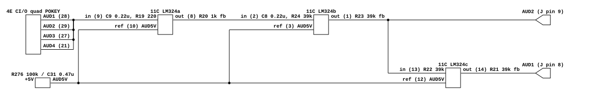
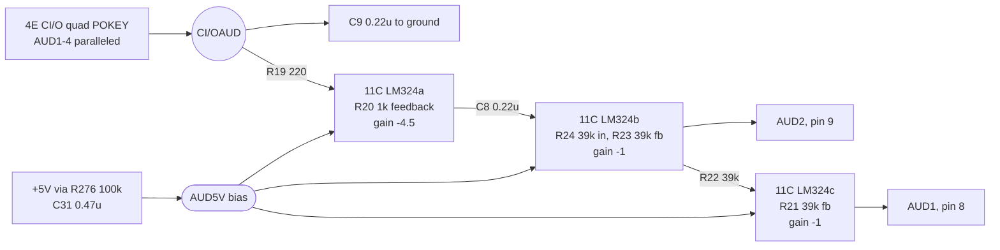

# I, Robot's audio output

What I, Robot's CPU board does between its quad-POKEY and the cabinet. Read for
`phosphor-emulator-discrete-sound-fidelity-l5r3.10`, the project-wide audit. The
model is `machines/src/irobot.rs`.

Notable for being the first board in this sweep where a constant the model
already had turned out to be **right**, and for a reason nobody had written down.

## Provenance

| | |
|---|---|
| Drawing | `I, ROBOT CPU PCB`, SP-251 sheet 4A, 1st printing, (c) Atari Inc. 1984 |
| Read from | `irobot_schematics.zip`, `IROBOT_4A.bmp`, a 1700x2800 1-bit scan |
| Transcribed | 2026-08-31 |

The scan is a set of 22 BMPs, sheets 1A through 11B, rotated 90 degrees: the
content is landscape on a portrait bitmap, so everything below was read after a
`-rotate 90`. Sheet 1A's table of contents gives the layout as 1A contents, 1B
main wiring, 2A game interface, 2B-6A CPU PCB, 6B-11A video PCB, 11B mathbox.

## The four POKEY outputs are wired together

[`irobot-audio-output.json`](irobot-audio-output.json).

The quad-POKEY at 4E, marked `CI/O`, brings its four audio pins out at 28, 29, 27
and 21. **They are tied directly together**, with junction dots, onto one node
that leaves as `CI/OAUD`. There are no summing resistors.

`irobot.rs` computes `(a + b + c + d) * 0.25`. Four equal-impedance outputs
shorted together average, so that is the right first-order model of what the
board does. The comment beside it says it matches the reference emulator's
routing, which is true but is not why it is correct; the board is why. Worth
recording, because "borrowed from an emulator and happens to be right" and
"derived from the board" look identical in the code and are not the same claim.

## What follows it, and is not modelled

- **C9, 0.22 uF, from the paralleled node to ground.** A low-pass on everything
  the POKEYs make, before any gain.
- **A gain stage of about -4.5**, R20 1k against R19 220, on the first LM324
  section.
- **C8, 0.22 uF, between the first and second stages.** A high-pass.
- **THE OUTPUT IS DIFFERENTIAL.** The second section produces `AUD2` on connector
  pin 9; the third takes that through R22 39k with R21 39k feedback, giving unity
  inversion, and produces `AUD1` on pin 8. The same signal in antiphase on two
  pins. `irobot.rs` is mono, as Lunar Lander was before its own drawing was read.
- **The LM324 runs on a single +10.3 V regulated supply** with `AUD5V` as its
  mid-rail reference, generated from +5 V through R276 100k and smoothed by C31
  0.47 uF. So the amplifier's clipping is asymmetric about that bias rather than
  about zero, which a signed-integer model does not reproduce.

## What it establishes

- The `* 0.25` in `mix_audio` is the board's passive paralleling and not an
  arbitrary scale.
- Two capacitors shape the audio before it leaves the board, and neither is
  modelled: a shunt at the POKEY node and a coupling between stages.
- There is about 13 dB of gain in the chain, none of it modelled.
- The board's output is a differential pair.

## What it does NOT establish

- **The corner of the C9 low-pass.** It is set by the POKEY output impedance in
  parallel by four, which is not on this drawing and was not looked up. Without
  it the capacitor's value alone says nothing.
- **The corner of the C8 high-pass**, for the same reason: it depends on the
  following stage's input resistance, which is R24 39k, but also on the first
  stage's output impedance, which was not checked.
- **Whether both AUD pins reach the cabinet.** They leave on connector pins 8
  and 9; where they go was not traced past the connector, and the main wiring
  diagram on sheet 1B was not read for it.
- **What the fourth LM324 section does.** It is drawn near +5V with its output
  apparently unused, which usually means a spare tied off, but that was not
  confirmed.
- **Any measurement.** Nothing here was compared against a capture.

## Confidence

A 1-bit scan, legible after rotation. The paralleling of the four AUD pins was
the one connection worth being sure of and it shows four clear junction dots on a
short vertical; every resistor and capacitor value above was read without
ambiguity.

This is a hand transcription and can be wrong. Nothing in it is checked by a
test; the section above it is what keeps that honest.
