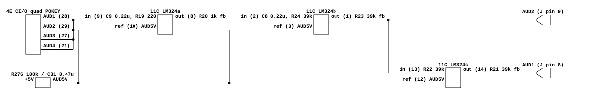
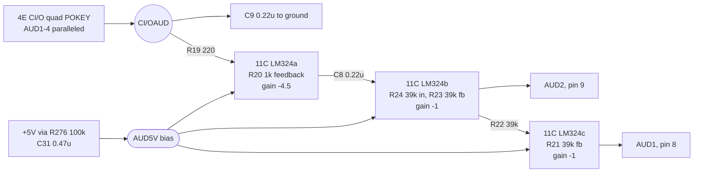

# I, Robot's audio output

What I, Robot's CPU board does between its quad-POKEY and the cabinet. Read for
`phosphor-emulator-discrete-sound-fidelity-l5r3.10`, the project-wide audit. The
model is `machines/src/irobot.rs`.

Notable for being the first board in this sweep where a constant the model
already had turned out to be **right**, and for a reason nobody had written down.

## Provenance

| | |
|---|---|
| Drawing | `I, ROBOT CPU PCB`, SP-251 sheet 4A, 1st printing, (c) Atari Inc. 1984 |
| Read from | `irobot_schematics.zip`, `IROBOT_4A.bmp`, a 1700x2800 1-bit scan |
| Transcribed | 2026-08-31 |

The scan is a set of 22 BMPs, sheets 1A through 11B, rotated 90 degrees: the
content is landscape on a portrait bitmap, so everything below was read after a
`-rotate 90`. Sheet 1A's table of contents gives the layout as 1A contents, 1B
main wiring, 2A game interface, 2B-6A CPU PCB, 6B-11A video PCB, 11B mathbox.

## The four POKEY outputs are wired together

[`irobot-audio-output.json`](irobot-audio-output.json).

The quad-POKEY at 4E, marked `CI/O`, brings its four audio pins out at 28, 29, 27
and 21. **They are tied directly together**, with junction dots, onto one node
that leaves as `CI/OAUD`. There are no summing resistors.

`irobot.rs` computes `(a + b + c + d) * 0.25`. Four equal-impedance outputs
shorted together average, so that is the right first-order model of what the
board does. The comment beside it says it matches the reference emulator's
routing, which is true but is not why it is correct; the board is why. Worth
recording, because "borrowed from an emulator and happens to be right" and
"derived from the board" look identical in the code and are not the same claim.

## What follows it, and is not modelled

```mermaid
flowchart LR
  P["4E CI/O quad POKEY<br/>AUD1-4 paralleled"] --> N
  N(("CI/OAUD"))
  N --> C9["C9 0.22u to ground"]
  N -- "R19 220" --> A1
  A1["11C LM324a<br/>R20 1k feedback<br/>gain -4.5"] -- "C8 0.22u" --> A2
  A2["11C LM324b<br/>R24 39k in, R23 39k fb<br/>gain -1"] --> O2["AUD2, pin 9"]
  A2 -- "R22 39k" --> A3
  A3["11C LM324c<br/>R21 39k fb<br/>gain -1"] --> O1["AUD1, pin 8"]
  B["+5V via R276 100k<br/>C31 0.47u"] --> AUD5V(["AUD5V bias"])
  AUD5V --> A1 & A2 & A3
```

- **C9, 0.22 uF, from the paralleled node to ground.** A low-pass on everything
  the POKEYs make, before any gain.
- **A gain stage of about -4.5**, R20 1k against R19 220, on the first LM324
  section.
- **C8, 0.22 uF, between the first and second stages.** A high-pass.
- **THE OUTPUT IS DIFFERENTIAL.** The second section produces `AUD2` on connector
  pin 9; the third takes that through R22 39k with R21 39k feedback, giving unity
  inversion, and produces `AUD1` on pin 8. The same signal in antiphase on two
  pins. `irobot.rs` is mono, as Lunar Lander was before its own drawing was read.
- **The LM324 runs on a single +10.3 V regulated supply** with `AUD5V` as its
  mid-rail reference, generated from +5 V through R276 100k and smoothed by C31
  0.47 uF. So the amplifier's clipping is asymmetric about that bias rather than
  about zero, which a signed-integer model does not reproduce.

## What the model does now

Modeled under `phosphor-emulator-2u1j`.

- **The four chips are one `QuadPokey`**, a core device that steps four POKEYs,
  sums their devices' conductance every clock, and runs one output stage on the
  shared node. Four `Pokey`s each on its own load would miss that one chip's
  devices load another's.
- **The node is R19 220 ohm into the first LM324 section's virtual ground at
  `AUD5V`, with C9 0.22 uF to ground**, modeled as a 220 ohm pull-up to +5 V.
  That answers the first "not established" item below: the resistance C9 works
  against is at most R19, so its corner is **3.29 kHz** with every device off
  and rises with the total conductance of all sixteen channels. It is audible.
- **C8 into R24 39k is 18.5 Hz.** The op-amp's output impedance is negligible
  beside 39k, which answers the second item.
- `-R20/R19`, the two unity inverters and the differential input are a scale.

Measured over the committed movie (`irobot-1787707910.phmi`, 38 s), against the
previous four-chip average with no coupling at all:

| | before | C8 coupling only | + shared node |
|---|---|---|---|
| DC offset | 0.0253 | 0.0000 | 0.0000 |
| 0-150 Hz share | 85.0 % | 25.0 % | 30.1 % |
| 3000-8000 Hz share | 1.14 % | 5.73 % | 2.26 % |
| 8000+ Hz share | 0.51 % | 2.57 % | 0.24 % |
| centroid | 228 Hz | 1119 Hz | 614 Hz |
| AC RMS | -30.3 dBFS | -33.6 dBFS | -26.8 dBFS |

The old output was the chips' unipolar mix with nothing to remove its DC, so it
was dominated by a sub-audio envelope. C8 removes that; the node's C9 then takes
the top back down. The level step at the node is its full scale: every device on
all four chips now means the compressed drop at the node, not the linear sum.
Nothing clips in the model.

**The first stage probably saturates on the loudest passages, and this is not
modeled.** It rests at `AUD5V` and rises 4.55 times the node's drop, on +10.3 V,
so with the LM324's typical V+ - 1.5 V it saturates at a drop of 0.835 V. Over
the movie 1.6 % of active samples (17,894 of 1,089,348) exceed that, peaking at
1.658 V. The rest level here is held by the op-amp, so unlike Food Fight's the
operating point is not in doubt; the swing is, since at the limit the stage
sources about 3.8 mA through its own 1k and the ceiling falls with load.

## The cabinet and the amplifier

Read 2026-09-29 from SP-251 1st printing as a PDF,
`arcarc.xmission.com/PDF_Arcade_Atari_Kee/I-Robot/I-Robot_SP-251_1st%20_Printing.pdf`,
sheet 1B `I, ROBOT Main Wiring Diagram`, PDF p2. It is the same package as the
BMP set this file was first read from.

- **The amplifier is inside the switching power supply**, not a Regulator/Audio
  II board. The CPU PCB's `AUDIO 1` (pin 8, BN) goes to the supply's P7 pin 1
  `L AUDIO`, and `AUDIO 2` (pin 9, W) to pin 2 `L AUDIO GND`. So the differential
  pair drives one amplifier channel with `AUDIO 2` as its ground: it hears the
  difference, twice either one, in phase. **Mono is exactly right.**
- Its outputs, P7 pin 3 `L SPKR +` (OR) and pin 4 `L SPKR -` (W), drive **four
  speakers as two series pairs**: LS1's + to LS2's - on OR, the pair across BN
  and W through P32/J32, and LS3 with LS4 the same across a second run.
- The amplifier's circuit is in the power supply's own manual (`SEE POWER SUPPLY
  MANUAL`), which is not in this package. Its gain, couplings and speaker
  impedance are not established, and the model stops at the connector.

## What it establishes

- The `* 0.25` in `mix_audio` is the board's passive paralleling and not an
  arbitrary scale.
- Two capacitors shape the audio before it leaves the board, and neither is
  modelled: a shunt at the POKEY node and a coupling between stages.
- There is about 13 dB of gain in the chain, none of it modelled.
- The board's output is a differential pair.

## What it does NOT establish

- **The corner of the C9 low-pass.** It is set by the POKEY output impedance in
  parallel by four, which is not on this drawing and was not looked up. Without
  it the capacitor's value alone says nothing.
- **The corner of the C8 high-pass**, for the same reason: it depends on the
  following stage's input resistance, which is R24 39k, but also on the first
  stage's output impedance, which was not checked.
- **Whether both AUD pins reach the cabinet: now read.** Both do, into one
  amplifier channel as signal and ground; see the section above.
- **What the fourth LM324 section does.** It is drawn near +5V with its output
  apparently unused, which usually means a spare tied off, but that was not
  confirmed.
- **The power supply's amplifier**, whose circuit is in a manual not in this
  package.
- **Any measurement against hardware.** The table above compares the model with
  its own previous version.

## Confidence

A 1-bit scan, legible after rotation. The paralleling of the four AUD pins was
the one connection worth being sure of and it shows four clear junction dots on a
short vertical; every resistor and capacitor value above was read without
ambiguity.

This is a hand transcription and can be wrong. Nothing in it is checked by a
test; the section above it is what keeps that honest.
