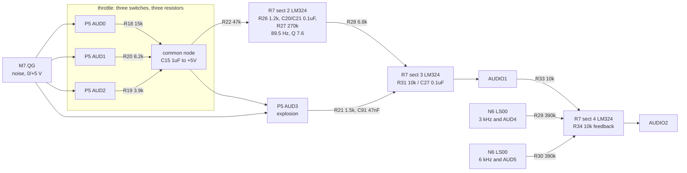

# Lunar Lander's audio output

What generates Lunar Lander's four sounds, how the microcomputer reaches them,
and where the mixer sets their balance. Read for
`phosphor-emulator-discrete-sound-fidelity-l5r3.8`. The model built from this is
`machines/src/llander_sound.rs`.

## Provenance

| | |
|---|---|
| Drawing | `LUNAR LANDER POWER INPUTS AND OUTPUTS 034230-XX A`, sheet 1 side B, (c) 1979 Atari |
| Read from | `arcade-museum.com/manuals-videogames/L/Lunar-Lander-DP136-3rd-Printing-Missing-Sheet-01-Side-A.pdf`, PDF p1 |
| Transcribed | 2026-08-30, from 300 and 600 dpi renders of that page |

The scan is three sheets: PDF p1 is sheet 1 side B (power, audio, video output),
p2 and p3 are the vector generator. As the filename says, **sheet 1 side A is
missing from this scan**, so the address decode that produces the `AUDIO` strobe
was not read. Everything below is on p1.

The audio block reads cleanly at 600 dpi. The feedback gates around the noise
shift registers needed 900 dpi to separate two horizontal wires that run 0.6 mm
apart at 72 dpi; above 900 the scan's own resolution runs out.

## Four sounds, one write address

The microcomputer writes `0x3C00`. That clocks N5, a 74LS174 hex D flip-flop,
latching DB0-DB5 into AUD0-AUD5. The drawing's own summary of what they do:

> There are four sounds generated in the Lunar Lander game: thrust, explosion,
> 3 KHz and 6 KHz. All audio control lines are altered by the microcomputer when
> AUDIO, from the address decoder, is low.

| Line | Function |
|---|---|
| AUD0, AUD1, AUD2 | thrust volume, one analog switch each |
| AUD3 | explosion enable |
| AUD4 | 3 kHz tone enable |
| AUD5 | 6 kHz tone enable |

`0x3E00` is a separate address carrying no data, wired to `NOISERESET` on both
shift registers.

## The noise source


[`llander-noise.json`](llander-noise.json). M6 and M7 are 74LS164 eight-bit
serial-in shift registers clocked together at 12 kHz, so the register is sixteen
bits. M6's QH feeds M7's A and B; M7's QG (bit 15, or bit 14 counting from zero)
is both the audio output and one of the two feedback taps, and M6's QG (bit 7,
or 6 from zero) is the other.

**The feedback is an XNOR built from three gates**, which is the one thing here
worth transcribing at pin level because a shift register with the wrong feedback
does not fail, it runs a different and usually much shorter polynomial:

| M7.QG | M6.QG | M5 LS32 (OR) | N6 LS00 (NAND) | N6 LS00 out |
|---|---|---|---|---|
| 0 | 0 | 0 | 1 | 1 |
| 0 | 1 | 1 | 1 | 0 |
| 1 | 0 | 1 | 1 | 0 |
| 1 | 1 | 1 | 0 | 1 |

The second NAND takes the OR and the first NAND, giving `NOT(NAND(a,b) AND
OR(a,b))`, which is XNOR. Its output drives M6's A and B together.

`NOISERESET` goes to pin 9, the active-low clear, on both registers. On the
board it is inactive except during a write, so the register free-runs.

## The thrust volume is not a DAC



**This is the finding.** The three
volume bits are three sections of a 4066 analog switch, each putting one resistor
between the noise output and a common node:

| Line | Switch pins | Resistor |
|---|---|---|
| AUD0 | P5 8 -> 9, control 6 | R18 15k |
| AUD1 | P5 4 -> 3, control 5 | R20 8.2k |
| AUD2 | P5 11 -> 10, control 12 | R19 3.9k |
| AUD3 | P5 1 -> 2, control 13 | R21 1.5k (explosion, from the same node) |

C15, 1 uF, sits between that common node and +5 V, which is an AC ground. So the
enabled resistors in parallel and C15 are a low-pass, **and the same three
resistors set the volume and the corner**. All three closed is 2247 ohms and a
71 Hz corner; AUD0 alone is 15 k and a 10.6 Hz corner. On the board, quieter
thrust is also darker thrust.

> **Both corner figures in that sentence are low**, and the board is now
> transcribed at
> [`netlists/llander-audio.toml`](netlists/llander-audio.toml) so that the
> network can be solved rather than estimated. Two things the arithmetic above
> leaves out: the `4066`'s roughly 80 ohms of on-resistance in series with each
> leg, and, much larger, `R22` and `R26`'s 48.2 kOhm path to +5 V loading the
> same node. Solving all eight settings:
>
> | throttle | legs closed | R against `C15` | corner | DC gain | at 89.5 Hz | linear would be |
> |---|---|---|---|---|---|---|
> | 1 | `R18` | 11487 | **13.9 Hz** | 0.762 | 0.193 | 0.143 |
> | 2 | `R20` | 7066 | 22.5 Hz | 0.853 | 0.345 | 0.286 |
> | 3 | `R18`, `R20` | 4812 | 33.1 Hz | 0.900 | 0.517 | 0.429 |
> | 4 | `R19` | 3676 | 43.3 Hz | 0.924 | 0.666 | 0.571 |
> | 5 | `R19`, `R18` | 2956 | 53.8 Hz | 0.939 | 0.801 | 0.714 |
> | 6 | `R19`, `R20` | 2546 | 62.5 Hz | 0.947 | 0.898 | 0.857 |
> | 7 | all three | 2178 | **73.1 Hz** | 0.955 | 1.000 | 1.000 |
>
> The corner error against the figures above is 3 percent at full throttle and
> **31 percent at throttle 1**, because the load matters more as the switched
> resistance rises. It runs the same direction as the finding rather than
> against it: the spectrum moves with the volume even more than this section
> says.
>
> **The last three columns are what a model needs**, and they replace two
> things at once. `llander_sound.rs` builds this stage as
> `rc_low_pass("NOISE_RC", noise, 2_247.0, 1e-6)` followed by a linear multiply
> by `throttle/7`. The resistance column replaces the 2247, which is right at
> one setting of eight, and the DC-gain column replaces the multiply, which is
> right at two. Tracked as `phosphor-emulator-b72s`.
>
> **Done, and from the solver rather than from this table.**
> [`netlists/llander-audio.derive.toml`](netlists/llander-audio.derive.toml)
> solves the whole board once per setting and writes each setting's `C15` time
> constant and DC gain to `machines/src/llander_sound_derived.rs`, which the
> device's `Throttle` component indexes by the 3-bit value. The spec holds the
> band-pass's inverting input at its virtual ground, so its figures are the
> 11.4774 ms and 2.1783 ms of the next paragraph rather than the open-pin ones.
>
> **The op-amp being open in the solver does not carry this.** The band-pass
> input is a virtual ground in the real circuit and an open pin in the model,
> which changes the load on the common node through `R22`. Holding `R7` pin 6
> at +5 V to model the virtual ground moves the corner from 11.4867 ms to
> 11.4774 ms at throttle 1 and from 2.1782 ms to 2.1783 ms at full: under a
> tenth of a percent either way, because `R26`'s 1.2 kOhm is an order below
> `C20`'s impedance in this band and dominates the parallel. The result is
> about the resistors, not about the modeling choice.
>
> **The volume law itself is confirmed.** Weighted at the band center from the
> solved DC gain and corner, throttle 1 lands at **0.193** of full against the
> 0.143 a linear control gives, where the paragraph below derives 0.192 by
> hand. Two independent routes to the same number, one of them with no
> arithmetic about which resistors are in parallel.
>
> ```bash
> cargo run -p phosphor-netlist -- solve \
>     docs/schematics/netlists/llander-audio.toml \
>     --drive 'noise out=3.8' --drive AUD0=5 --drive AUD1=5 --drive AUD2=5
> ```

The parallel resistance of all three, 2247 ohms, is exactly the figure an
independent netlist of this board uses for a *fixed* RC ahead of a *linear*
volume multiply. That netlist is therefore correct at full throttle and wrong
everywhere else, and so is the model built from it.

Two consequences follow, and both are now modeled (see the measurement after
this list):

- **The volume law is not linear.** Weighted by conductance at the band centre,
  where C15's impedance is comparable to the switched resistance, throttle 1
  sits at 0.192 of full rather than the 0.143 a linear DAC gives, about 2.6 dB
  louder, with the other steps in between.
- **The spectrum moves with the volume.** A linear model gives every throttle
  setting the same spectrum, which is what both our capture and the reference
  show: their band shares agree to 0.15 pp at throttle 7 and at throttle 1
  alike, and the reference's throttle-1 RMS is exactly 1/7 of its throttle-7.

> **Measured with the board's throttle in the device**, against a fresh 192 kHz
> reference capture band-limited to 44.1 kHz:
>
> | scenario | level vs reference, before | after | centroid delta, after | 0-150 Hz share delta, after |
> |---|---|---|---|---|
> | `llander/thrust`, setting 7 | -0.44 dB | -0.29 dB | +0.9 Hz | -0.18 pp |
> | `llander/thrust-low`, setting 1 | -0.44 dB | **+2.58 dB** | **-3.5 Hz** | **+0.47 pp** |
>
> Full throttle barely moves, since only its corner changed, from 71 to 73 Hz.
> Throttle 1 is now louder and darker than the reference by the amount the
> drawing predicts, and the reference is the side without the mechanism. Inside
> the device, each setting's level against full is within 0.25 dB of the
> solver's 89.5 Hz column above (throttle 1 at -14.04 dB against -14.29), and
> `the_throttle_is_the_boards_switched_resistors_not_a_linear_control` holds
> throttles 1 and 2 between the board's law and the linear one.

## The band-pass, which is the rumble

From the common node, R22 47 k reaches the input network of R7 section 2, an
LM324 with its non-inverting input at +5 V. R26 1.2 k shunts that node to +5 V;
C20 0.1 uF couples it into the inverting input; R27 270 k is the feedback; and
C21 0.1 uF runs from the same node forward to the output.

Solving that network gives a second-order band-pass with

- `f0 = sqrt((1/R22 + 1/R26) / (C20*C21*R27)) / 2*pi` = **89.5 Hz**
- `Q = sqrt(C20*C21*R27 * (1/R22 + 1/R26)) / (C20 + C21)` = **7.60**

Both figures are what the reference netlist carries as literals with a `TBD -
replace this line with a Sallen-Key Bandpass macro` comment beside them. They are
derived here from the six component values, which is the confirmation that the
netlist's two magic numbers are this circuit and not a fit.

## The mixer, and where the balance comes from

R7 section 3 (pins 9, 10, 8) is an inverting summing amplifier with R31 10 k and
C27 0.1 uF in parallel as its feedback, non-inverting input at +5 V. Its output
is `AUDIO1`. Section 4 (pins 12, 13, 14) takes R33 10 k from AUDIO1 and feeds
back through R34 10 k, so its output `AUDIO2` is AUDIO1 inverted at unity.

The drawing says this in words:

> The pins 8 and 14 outputs of op amp R7 develop two equal amplitude, opposite
> phase signals for the thrust and explosion signals only. Pin 14 of R7 is the
> output for the 3 KHz and 6 KHz signals.

| Leg | Path | Gain |
|---|---|---|
| thrust | band-pass -> R28 6.8 k -> pin 9 | (R31 parallel C27)/R28, doubled by the differential pair |
| explosion | common node -> R21 1.5 k -> C91 0.047 uF -> pin 9 | C91/C27 = 0.47 from 159 Hz to 2.3 kHz, doubled; see "C27 makes the explosion leg a band-pass" |
| 3 kHz | N6 LS00 -> R29 390 k -> pin 13 | R34/R29, single-ended |
| 6 kHz | N6 LS00 -> R30 390 k -> pin 13 | R34/R30, single-ended |

**The tones are single-ended and the noise voices are differential**, so the
tones sit 6 dB further down than a summed mix would put them. R99 and R100, 1 k
each, pull the two gate outputs up.

## Nets

| Net | Pins |
|---|---|
| latch | DB0-DB5 -> N5 74LS174 at 6,11,4,13,14,3; CK N5.9 <- `AUDIO`; CLR N5.1 <- P,R23 |
| AUD0..AUD5 | N5 outputs 7,10,5,12,15,2 |
| noise clock | `12KHZ` -> M6.8 and M7.8 |
| feedback | {M7.12, M6.12} -> {M5.12, M5.13} and {N6.2, N6.1}; M5.11 -> N6.13; N6.3 -> N6.12; N6.11 -> {M6.1, M6.2} |
| register chain | M6.13 (QH) -> {M7.1, M7.2} |
| noise out | M7.12 (QG) -> {P5.11, P5.4, P5.8} |
| clear | `NOISERESET` -> M6.9 and M7.9 |
| volume | P5.10 -> R19 3.9k; P5.3 -> R20 8.2k; P5.9 -> R18 15k; all -> common node |
| common node | {R18, R19, R20, C15 1u to +5V, R22 47k, P5.1} |
| band-pass | R22 -> {R26 1.2k to +5V, C20 0.1u, C21 0.1u}; C20 -> R7.6; R27 270k R7.6 -> R7.7; C21 -> R7.7; R7.5 -> +5V |
| explosion leg | P5.2 -> R21 1.5k -> C91 0.047u -> R7.9 |
| thrust leg | R7.7 -> R28 6.8k -> R7.9 |
| summing amp | R7.10 -> +5V; {R31 10k, C27 0.1u} R7.9 -> R7.8; R7.8 -> `AUDIO1` |
| tone gates | {AUD5, 6KHZ} -> N6.4,5 -> N6.6 -> R30 390k; {3KHZ, AUD4} -> N6.10,9 -> N6.8 -> R29 390k; R99/R100 1k pull-ups to +5V |
| inverter | {R29, R30, R33 10k from R7.8} -> R7.13; R34 10k R7.13 -> R7.14; R7.12 -> +5V; R7.14 -> `AUDIO2` |

## What it establishes

- **The 89.5 Hz / Q 7.6 band-pass is real**, derived above from six component
  values rather than taken on trust from a netlist literal.
- **The XNOR taps are bits 6 and 14 of sixteen, output on bit 14**, matching the
  model.
- **The thrust volume and the noise low-pass corner are the same three
  resistors**, which nothing models, and which no comparison against the
  reference netlist can reveal because the reference has the same gap.
- **The explosion's volume is the throttle**, because its switch takes the same
  common node the throttle resistors drive. Enabling the explosion with the
  throttle at zero is silence.
- **The mixer balance is R28/R21/R29/R30 against R31 and R34**, with a factor of
  two for the two noise legs and not for the tones. *C27 across R31 makes that
  balance frequency-dependent for the two noise legs; see "C27 makes the
  explosion leg a band-pass".*
- **The board does not clip.** The noise legs' nominal swing through R28 into
  R31 is about 11 V peak-to-peak differential, against roughly 20 V available
  from an LM324 biased at +5 V on a +22 V rail. The reference netlist's output
  normalization clips its explosion on 9.9 % of samples; that is the netlist's
  calibration, not the circuit.

## What it does NOT establish

- **The address decode.** `AUDIO` and the `0x3E00` strobe come from sheet 1 side
  A, which is not in this scan. The addresses used here are from the memory map,
  not from a drawing.
- **Logic levels.** No voltage here was measured. The reference netlist's
  comment table uses 4 V for the gate outputs and 3.8 V for the noise, and those
  numbers are taken on trust: they set the tone-to-noise balance directly.
- **The 4066's on-resistance**, which adds to each switched leg. At a nominal
  80 ohms against 3.9 k it is under 2 %, but it is not in any figure above.
- **C15's part number or tolerance.** It is drawn as `1.0 TANT` with a polarity
  mark; a tantalum's actual value at this bias was not looked into, and it sets
  the corner the finding above is about.
- **The +22 V rail's use.** Only section 3's supply pin was traced to it. What
  the rest of the board does with +22 V, and whether the LM324 sections share
  it, was not read. *Half of this is now settled: pin 4 is +22 V and pin 11 is
  ground, and a quad has one supply pair, so all four sections share them. What
  the rest of the board does with the rail is still unread.*
- **What the game writes, and when.** No trace of the ROM's own use of `0x3C00`
  or `0x3E00` was taken, so how long a crash holds the explosion, and whether it
  holds full throttle while it does, are unknown. The scenarios assume it does
  because the circuit gives no alternative, not because anything was traced.
  *Now traced, with `tools/sound-reference/trace_llander_writes.lua`, over
  three crashes that agree to within a few milliseconds. The game does not hold
  full throttle. It writes `0x0f` (explosion and throttle 7), steps the throttle
  down one notch every 0.41 s (the first after 0.32 s) to `0x08` at 2.81 s,
  holds the explosion bit with every leg open, and so silent, for 3.5 s more,
  then writes `0x01`. In flight with the pedal released it holds throttle 1,
  not 0, so the throttle-1 rumble plays for the whole descent. Low fuel blinks
  the 3 kHz tone at about 1.25 Hz. `0x3E00` is written three times at the start
  of a game and never during a crash.*

## What the netlist added

The board is transcribed at
[`netlists/llander-audio.toml`](netlists/llander-audio.toml), complete rather
than as an excerpt, and checking it part by part against the scan held
everything above except the two corner figures corrected in place. Four things
this document did not have:

- **`C14` and `C28`**, two supply bypass capacitors, are on the sheet and in
  none of the tables here. Neither is in the device. Both are inert for the
  audio, which is the point: a part nobody models should be visible as one
  rather than absent.
- **`R100`'s lead crosses the 6 kHz gate's output wire with no junction dot**
  and lands on the 3 kHz gate's output. Settled at 600 percent. The section
  above says the two 1 k resistors "pull the two gate outputs up" without
  saying which goes where, and read as a junction both would land on pin 6.
- **`R7` pin 4 is +22 V and pin 11 is ground.** The list below says whether the
  `LM324` sections share the rail was not read; the package answers it, because
  a quad has one supply pair. The clipping argument depends on it.
- **`R7` section 1, on pins 1, 2 and 3, is not drawn at all.** What the board
  does with the fourth amplifier is still unread, but "not drawn" is now
  recorded as a statement about the drawing rather than as a silence.

### The two noise legs do not have a ratio, because they are not both flat

`phosphor-emulator-b72s` asks to resolve a disagreement about the mixer
balance: the reference netlist gives both legs the same `R31`/`R28` and
separates them with a 1000-against-600 level, where this drawing has
`R31`/`R21` against `R31`/`R28`. **Transcribed, the question turns out to be
the wrong shape.** Neither leg is a flat gain, and they scarcely overlap:

| | path from the common node | peak | at 89.5 Hz | at 5 kHz |
|---|---|---|---|---|
| thrust | band-pass, then `R28` 6.8 k into `R31` with `C27` across it | 3.68 at 89.5 Hz | **3.68** | 0.0003 |
| explosion | `R21` 1.5 k and `C91` into the same | 0.44 near 600 Hz | **0.23** | 0.19 |

*Corrected 2026-09-25.* This table first read `R31` as a flat 10 k and gave
4.22, 6.67, 0.26 and 6.08; the gains above include `C27`, which was always in
the drawing and in the netlist and was left out of the arithmetic. The ratios
between the legs are unchanged, since `C27` scales both. What changes is each
leg's absolute gain and the explosion's shape. See the next section.

The thrust leg is a band-pass at 89.5 Hz with Q 7.6. At the thrust's own
center the explosion is sixteen times down, and at 5 kHz the explosion is some
six hundred times up. A single balance number describes neither, so "their
ratio" has no value to resolve and the two parameterizations are not comparing
the same quantity.

### C27 makes the explosion leg a band-pass, and a quiet one

`C27`, 0.1 uF across `R31`, makes the summing amplifier a low-pass at
`1/(2*pi*R31*C27)` = **159 Hz** for both legs. The explosion leg is therefore
not a high-pass at 2258 Hz. Its gain rises below 159 Hz, sits at
`C91/C27` = **0.47** from 159 Hz to 2258 Hz, and falls above. Read again at
400 dpi on 2026-09-25, `P5` pin 1 leaves the junction dot on the throttle's
common node, `C15` sits on the same wire, and `R21` and `C91` read 1.5 k and
.047, so all of this is as drawn.

Put together with the common node's own low-pass, which is 73 Hz at full
throttle, and taking the noise as white with ideal op-amps:

| at full throttle | explosion against thrust | explosion centroid | explosion energy below 150 Hz |
|---|---|---|---|
| as drawn | **-11.1 dB** | 392 Hz | 31.5 % |
| as drawn without `C27` | -0.1 dB | 2021 Hz | 2.6 % |
| the reference, and the device | about **+15.5 dB** | about 110 Hz | 77 % |

**Read literally, the drawing's explosion sits 11 dB under the thrust it always
plays over**, so enabling it adds about 0.3 dB. The reference makes it 26 dB
louder and much darker, and the device copies the reference: noise times a
fitted 2400, then a 560 Hz low-pass that has no part behind it either (the
drawing's only shared low-pass is `C27`'s 159 Hz).

Two readings of that gap, and nothing on this sheet can separate them. Either
the board plays a quiet, bright crash, or something shaping the explosion is
off this sheet: side A is missing from every scan, and the game could make the
crash by what it writes to the throttle bits as well as by `AUD3`. The
reference's 1000-against-600 levels have no part behind them, so they are not
evidence either way. What the game writes to `0x3C00` during a crash was the
cheapest thing that could.

**Traced, it narrows the gap without closing it.** The crash sets full throttle
with the explosion and steps the throttle down to 0 over 2.8 s (see "What it
does NOT establish"). The thrust has no gate of its own, so that staircase plays
the thrust's roar at full level and fades it: on the board, most of a crash's
loudness is the thrust. The explosion leg rides on it, but the throttle scales
both legs together, so the staircase cannot change their ratio; as it falls, the
common node's corner darkens and the brighter explosion leg loses further. So
the drawn crash is a full-throttle roar decaying over 2.8 s with a brighter
layer about 11 dB under it. Distinct in band, that layer would still be clearly
audible, which makes it a plausible design rather than an evident misreading.

It also bounds item 3. `llander/explosion` holds throttle 7 with the explosion
indefinitely, which the game never does for more than 0.32 s, and that hold is
where the device's 9.9 % clipping is measured.

`C27` was missed because the solver reports time constants and DC gains, and
every figure in this section needs a frequency response. The netlist has had
`C27` all along.

The band-pass's midband gain is `R27/(2*R22)` = **2.87** referred to the common
node, which is the same 115 the device carries referred to the `R22`/`R26`
Thevenin source, the two differing by that divider's 0.0249. **That figure is
hand arithmetic from the transcribed values and not a solver result**: a
multiple-feedback band-pass is an op-amp circuit, and the passive solver models
every op-amp as open. It is the kind of number rung 6 of
[the transcription design](../designs/schematic-transcription.md) exists to
make an output rather than a formula.

### The board still does not clip, and the margin is half what this file says

The section below argues the board cannot clip from "roughly 20 V available
from an LM324 biased at +5 V on a +22 V rail". **The 20 V is the total range
and not the usable swing.** Biased at +5 V, an output reaches ground 5 V below
and the positive limit 15 V above, so a symmetric signal is bounded by the
negative side at **10 V peak to peak**, not 20.

The conclusion survives with room to spare: 11 V peak to peak differential is
5.5 V on each output, which is 2.25 V to 7.75 V about the bias and clears both
limits. But the margin is about 1.8 to 1 rather than 3.6 to 1, and it is the
ground rail that binds. The solver confirms the half of this that is a
reading: every `R7` output sits at exactly +5 V at DC, because all three
sections are DC-coupled to the +5 V their non-inverting inputs sit on.

## Confidence

A clean scan, read at 600 and 900 dpi. Every designator and value above was
legible without guessing except the two feedback wires noted at the top, which
needed the higher render.

Those two numbers are magnification rather than resolution, and on this board
that distinction is a footnote rather than the trap it was on Zaxxon. The PDF's
embedded image is 13500 x 8736 at 1 bit on a 2430 x 1572 pt page, which is a
genuine 400 dpi across a D-size sheet and ten times Zaxxon's pixel count. So
rendering the page above 400 dpi resamples, and the reading still holds because
what it needed was magnification of an image that already had the detail.
Extract the image with `pdfimages` and magnify with `magick -filter point`
rather than rendering, for the same reason either way.

The strongest check on it is not the drawing: the band-pass's two derived
figures, 89.5 Hz and Q 7.60, reproduce two literals in an independently written
netlist to three significant figures, and the parallel resistance of the three
volume resistors reproduces a third. Three independent agreements on numbers
nobody transcribed from each other.

This is a hand transcription and can be wrong. Nothing in it is checked by a
test; the section above it is what keeps that honest.
