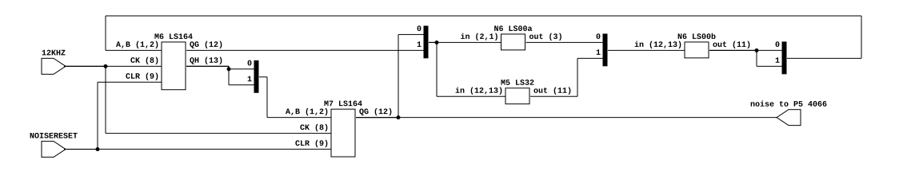
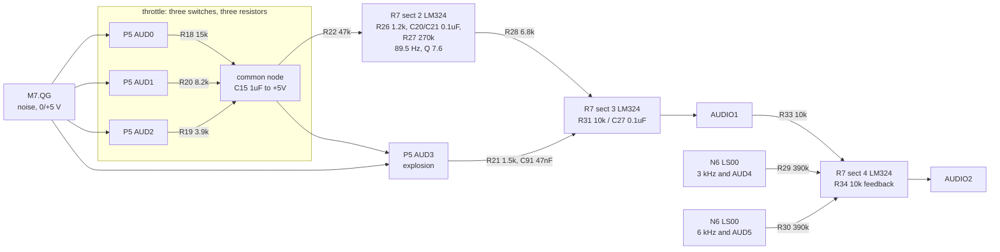

# Lunar Lander's audio output

What generates Lunar Lander's four sounds, how the microcomputer reaches them,
and where the mixer sets their balance. Read for
`phosphor-emulator-discrete-sound-fidelity-l5r3.8`. The model built from this is
`machines/src/llander_sound.rs`.

## Provenance

| | |
|---|---|
| Drawing | `LUNAR LANDER POWER INPUTS AND OUTPUTS 034230-XX A`, sheet 1 side B, (c) 1979 Atari |
| Read from | `arcade-museum.com/manuals-videogames/L/Lunar-Lander-DP136-3rd-Printing-Missing-Sheet-01-Side-A.pdf`, PDF p1 |
| Transcribed | 2026-08-30, from 300 and 600 dpi renders of that page |

The scan is three sheets: PDF p1 is sheet 1 side B (power, audio, video output),
p2 and p3 are the vector generator. As the filename says, **sheet 1 side A is
missing from this scan**, so the address decode that produces the `AUDIO` strobe
was not read. Everything below is on p1.

The audio block reads cleanly at 600 dpi. The feedback gates around the noise
shift registers needed 900 dpi to separate two horizontal wires that run 0.6 mm
apart at 72 dpi; above 900 the scan's own resolution runs out.

## Four sounds, one write address

The microcomputer writes `0x3C00`. That clocks N5, a 74LS174 hex D flip-flop,
latching DB0-DB5 into AUD0-AUD5. The drawing's own summary of what they do:

> There are four sounds generated in the Lunar Lander game: thrust, explosion,
> 3 KHz and 6 KHz. All audio control lines are altered by the microcomputer when
> AUDIO, from the address decoder, is low.

| Line | Function |
|---|---|
| AUD0, AUD1, AUD2 | thrust volume, one analog switch each |
| AUD3 | explosion enable |
| AUD4 | 3 kHz tone enable |
| AUD5 | 6 kHz tone enable |

`0x3E00` is a separate address carrying no data, wired to `NOISERESET` on both
shift registers.

## The noise source

[`llander-noise.json`](llander-noise.json). M6 and M7 are 74LS164 eight-bit
serial-in shift registers clocked together at 12 kHz, so the register is sixteen
bits. M6's QH feeds M7's A and B; M7's QG (bit 15, or bit 14 counting from zero)
is both the audio output and one of the two feedback taps, and M6's QG (bit 7,
or 6 from zero) is the other.

**The feedback is an XNOR built from three gates**, which is the one thing here
worth transcribing at pin level because a shift register with the wrong feedback
does not fail, it runs a different and usually much shorter polynomial:

| M7.QG | M6.QG | M5 LS32 (OR) | N6 LS00 (NAND) | N6 LS00 out |
|---|---|---|---|---|
| 0 | 0 | 0 | 1 | 1 |
| 0 | 1 | 1 | 1 | 0 |
| 1 | 0 | 1 | 1 | 0 |
| 1 | 1 | 1 | 0 | 1 |

The second NAND takes the OR and the first NAND, giving `NOT(NAND(a,b) AND
OR(a,b))`, which is XNOR. Its output drives M6's A and B together.

`NOISERESET` goes to pin 9, the active-low clear, on both registers. On the
board it is inactive except during a write, so the register free-runs.

## The thrust volume is not a DAC

**This is the finding.** The three
volume bits are three sections of a 4066 analog switch, each putting one resistor
between the noise output and a common node:

| Line | Switch pins | Resistor |
|---|---|---|
| AUD0 | P5 8 -> 9, control 6 | R18 15k |
| AUD1 | P5 4 -> 3, control 5 | R20 8.2k |
| AUD2 | P5 11 -> 10, control 12 | R19 3.9k |
| AUD3 | P5 1 -> 2, control 13 | R21 1.5k (explosion, from the same node) |

C15, 1 uF, sits between that common node and +5 V, which is an AC ground. So the
enabled resistors in parallel and C15 are a low-pass, **and the same three
resistors set the volume and the corner**. All three closed is 2247 ohms and a
71 Hz corner; AUD0 alone is 15 k and a 10.6 Hz corner. On the board, quieter
thrust is also darker thrust.

The parallel resistance of all three, 2247 ohms, is exactly the figure an
independent netlist of this board uses for a *fixed* RC ahead of a *linear*
volume multiply. That netlist is therefore correct at full throttle and wrong
everywhere else, and so is the model built from it.

Two consequences follow, and neither is modelled today:

- **The volume law is not linear.** Weighted by conductance at the band centre,
  where C15's impedance is comparable to the switched resistance, throttle 1
  sits at 0.192 of full rather than the 0.143 a linear DAC gives, about 2.6 dB
  louder, with the other steps in between.
- **The spectrum moves with the volume.** A linear model gives every throttle
  setting the same spectrum, which is what both our capture and the reference
  show: their band shares agree to 0.15 pp at throttle 7 and at throttle 1
  alike, and the reference's throttle-1 RMS is exactly 1/7 of its throttle-7.

## The band-pass, which is the rumble

From the common node, R22 47 k reaches the input network of R7 section 2, an
LM324 with its non-inverting input at +5 V. R26 1.2 k shunts that node to +5 V;
C20 0.1 uF couples it into the inverting input; R27 270 k is the feedback; and
C21 0.1 uF runs from the same node forward to the output.

Solving that network gives a second-order band-pass with

- `f0 = sqrt((1/R22 + 1/R26) / (C20*C21*R27)) / 2*pi` = **89.5 Hz**
- `Q = sqrt(C20*C21*R27 * (1/R22 + 1/R26)) / (C20 + C21)` = **7.60**

Both figures are what the reference netlist carries as literals with a `TBD -
replace this line with a Sallen-Key Bandpass macro` comment beside them. They are
derived here from the six component values, which is the confirmation that the
netlist's two magic numbers are this circuit and not a fit.

## The mixer, and where the balance comes from

R7 section 3 (pins 9, 10, 8) is an inverting summing amplifier with R31 10 k and
C27 0.1 uF in parallel as its feedback, non-inverting input at +5 V. Its output
is `AUDIO1`. Section 4 (pins 12, 13, 14) takes R33 10 k from AUDIO1 and feeds
back through R34 10 k, so its output `AUDIO2` is AUDIO1 inverted at unity.

The drawing says this in words:

> The pins 8 and 14 outputs of op amp R7 develop two equal amplitude, opposite
> phase signals for the thrust and explosion signals only. Pin 14 of R7 is the
> output for the 3 KHz and 6 KHz signals.

| Leg | Path | Gain |
|---|---|---|
| thrust | band-pass -> R28 6.8 k -> pin 9 | R31/R28, doubled by the differential pair |
| explosion | common node -> R21 1.5 k -> C91 0.047 uF -> pin 9 | R31/R21 above 2.3 kHz, doubled |
| 3 kHz | N6 LS00 -> R29 390 k -> pin 13 | R34/R29, single-ended |
| 6 kHz | N6 LS00 -> R30 390 k -> pin 13 | R34/R30, single-ended |

**The tones are single-ended and the noise voices are differential**, so the
tones sit 6 dB further down than a summed mix would put them. R99 and R100, 1 k
each, pull the two gate outputs up.

## Nets

| Net | Pins |
|---|---|
| latch | DB0-DB5 -> N5 74LS174 at 6,11,4,13,14,3; CK N5.9 <- `AUDIO`; CLR N5.1 <- P,R23 |
| AUD0..AUD5 | N5 outputs 7,10,5,12,15,2 |
| noise clock | `12KHZ` -> M6.8 and M7.8 |
| feedback | {M7.12, M6.12} -> {M5.12, M5.13} and {N6.2, N6.1}; M5.11 -> N6.13; N6.3 -> N6.12; N6.11 -> {M6.1, M6.2} |
| register chain | M6.13 (QH) -> {M7.1, M7.2} |
| noise out | M7.12 (QG) -> {P5.11, P5.4, P5.8} |
| clear | `NOISERESET` -> M6.9 and M7.9 |
| volume | P5.10 -> R19 3.9k; P5.3 -> R20 8.2k; P5.9 -> R18 15k; all -> common node |
| common node | {R18, R19, R20, C15 1u to +5V, R22 47k, P5.1} |
| band-pass | R22 -> {R26 1.2k to +5V, C20 0.1u, C21 0.1u}; C20 -> R7.6; R27 270k R7.6 -> R7.7; C21 -> R7.7; R7.5 -> +5V |
| explosion leg | P5.2 -> R21 1.5k -> C91 0.047u -> R7.9 |
| thrust leg | R7.7 -> R28 6.8k -> R7.9 |
| summing amp | R7.10 -> +5V; {R31 10k, C27 0.1u} R7.9 -> R7.8; R7.8 -> `AUDIO1` |
| tone gates | {AUD5, 6KHZ} -> N6.4,5 -> N6.6 -> R30 390k; {3KHZ, AUD4} -> N6.10,9 -> N6.8 -> R29 390k; R99/R100 1k pull-ups to +5V |
| inverter | {R29, R30, R33 10k from R7.8} -> R7.13; R34 10k R7.13 -> R7.14; R7.12 -> +5V; R7.14 -> `AUDIO2` |

## What it establishes

- **The 89.5 Hz / Q 7.6 band-pass is real**, derived above from six component
  values rather than taken on trust from a netlist literal.
- **The XNOR taps are bits 6 and 14 of sixteen, output on bit 14**, matching the
  model.
- **The thrust volume and the noise low-pass corner are the same three
  resistors**, which nothing models, and which no comparison against the
  reference netlist can reveal because the reference has the same gap.
- **The explosion's volume is the throttle**, because its switch takes the same
  common node the throttle resistors drive. Enabling the explosion with the
  throttle at zero is silence.
- **The mixer balance is R28/R21/R29/R30 against R31 and R34**, with a factor of
  two for the two noise legs and not for the tones.
- **The board does not clip.** The noise legs' nominal swing through R28 into
  R31 is about 11 V peak-to-peak differential, against roughly 20 V available
  from an LM324 biased at +5 V on a +22 V rail. The reference netlist's output
  normalization clips its explosion on 9.9 % of samples; that is the netlist's
  calibration, not the circuit.

## What it does NOT establish

- **The address decode.** `AUDIO` and the `0x3E00` strobe come from sheet 1 side
  A, which is not in this scan. The addresses used here are from the memory map,
  not from a drawing.
- **Logic levels.** No voltage here was measured. The reference netlist's
  comment table uses 4 V for the gate outputs and 3.8 V for the noise, and those
  numbers are taken on trust: they set the tone-to-noise balance directly.
- **The 4066's on-resistance**, which adds to each switched leg. At a nominal
  80 ohms against 3.9 k it is under 2 %, but it is not in any figure above.
- **C15's part number or tolerance.** It is drawn as `1.0 TANT` with a polarity
  mark; a tantalum's actual value at this bias was not looked into, and it sets
  the corner the finding above is about.
- **The +22 V rail's use.** Only section 3's supply pin was traced to it. What
  the rest of the board does with +22 V, and whether the LM324 sections share
  it, was not read.
- **What the game writes, and when.** No trace of the ROM's own use of `0x3C00`
  or `0x3E00` was taken, so how long a crash holds the explosion, and whether it
  holds full throttle while it does, are unknown. The scenarios assume it does
  because the circuit gives no alternative, not because anything was traced.

## Confidence

A clean scan, read at 600 and 900 dpi. Every designator and value above was
legible without guessing except the two feedback wires noted at the top, which
needed the higher render.

The strongest check on it is not the drawing: the band-pass's two derived
figures, 89.5 Hz and Q 7.60, reproduce two literals in an independently written
netlist to three significant figures, and the parallel resistance of the three
volume resistors reproduces a third. Three independent agreements on numbers
nobody transcribed from each other.

This is a hand transcription and can be wrong. Nothing in it is checked by a
test; the section above it is what keeps that honest.
