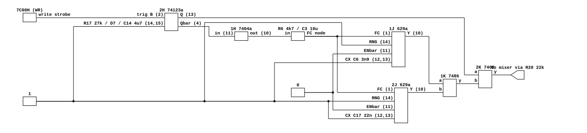
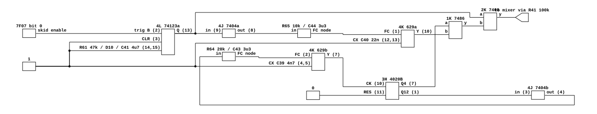
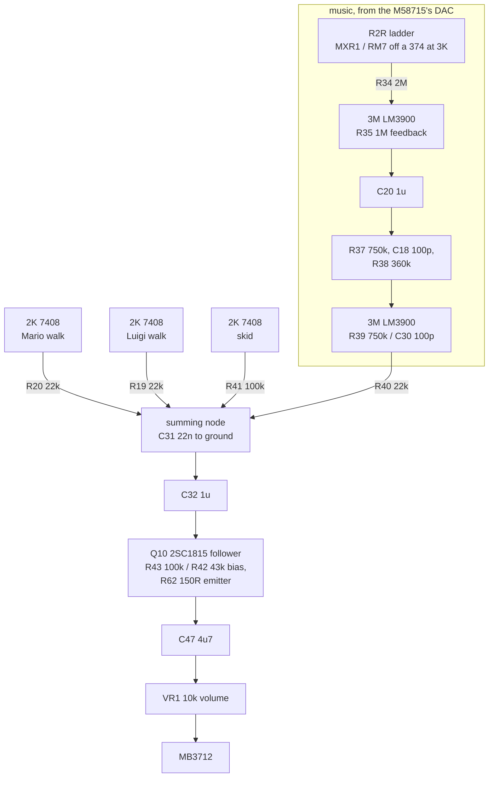

# Mario Bros. effect voices and audio output

What generates Mario Bros.'s three discrete effects, how the game triggers them,
and where the music joins them. Read for
`phosphor-emulator-mario-discrete-sound-boaz`. The model built from this is
`machines/src/mario_sound.rs`.

## Provenance

| | |
|---|---|
| Drawing | `TMA1-CPU SCHEMATIC`, (c) 1983 Nintendo of America |
| Read from | `arcade-museum.com/manuals-videogames/M/marioborspak.pdf`, PDF p39 |
| Transcribed | 2026-08-30, from a 500 dpi render of that page |

Prefer this scan. The same drawing appears in
`arcade-museum.com/manuals-videogames/M/MarioBros.pdf` at roughly 430 dpi and cut
across two pages, which separates the oscillators from the filter chain they
feed. Here the whole sheet is one page, and every designator below was legible
without ambiguity.

The sheet is drawn in landscape on a portrait page, so it reads rotated 90
degrees. Rendering the page and rotating it is what makes the designators
readable at all.

## Three voices, and only one of them is a level

| Voice | Trigger | Kind | Source |
|---|---|---|---|
| Mario walk | write to `0x7C00` | **strobe** | 1J + 2J 74LS629 halves, XORed |
| Luigi walk | write to `0x7C80` | **strobe** | 1J + 2J other halves, XORed |
| Skid | `0x7F07` bit 0 | level, inverted | 4K 74LS629 + a 4020 tap, XORed |
| (music) | the M58715's DAC | — | R2R ladder into two LM3900 sections |

**THE TWO WALK TRIGGERS ARE WRITE STROBES.** The drawing names those two inputs
`7C00H(WR)` and `7C80H(WR)`: the address decode ANDed with the write strobe,
straight into a 74123's B input. No latch stands between them and the one-shot,
so the data byte never reaches the circuit and writing zero fires a footstep
exactly as writing one does. Only the skid passes through a latch, and it is
inverted on the way.

This is the single easiest thing to get wrong here, in both directions. A model
that treats those lines as latches makes footsteps that never stop or never
start; and a reference driver that rewrites all three lines every frame, as a
latch driver would, triggers every voice sixty times a second in every run
including its own null case.

## The voices, at pin level

### Walking, either player

[`mario-walk-voice.json`](mario-walk-voice.json). The argument is in the pins.
TWO oscillator control pins share ONE node, fed through a single resistor, so the
divider that sets their pitch is against the two pins in parallel and not against
one. And the one-shot drives the voice from both of its outputs: Q-bar through
the inverter to that control node, Q directly to the output gate. A block
diagram would show one arrow where there are two, going to different places.

Luigi's half is the same circuit with different parts: R18/C15 for its one-shot,
R7 4.7 k with C4 4.7 uF slewing its control node, and C5 39 nF and C16 6.8 nF as
its timing capacitors against Mario's C6 3.9 nF and C17 22 nF. So the two
footsteps are genuinely different sounds rather than one voice on two lines.

### Skid

[`mario-skid-voice.json`](mario-skid-voice.json). A loop, and the loop is the
voice: 4K's second half clocks the 4020 at 3H, that counter's Q12 comes back
through an inverter to the SAME oscillator's control pin, and Q4 is exclusive
ORed with the other half's output. An oscillator tuned by the counter it clocks.

This is structurally Donkey Kong Jr.'s walking voice, which is worth stating
because the two boards share no sound design otherwise. See
[`dkongjr-sound-sources.md`](dkongjr-sound-sources.md).

## Where everything meets

## Nets

| Net | Pins |
|---|---|
| Mario trigger | `7C00H(WR)` -> 2H.2 |
| Luigi trigger | `7C80H(WR)` -> 2H.10 |
| `2H` half 1 | R17 27k / D7 1S953 / C14 4.7u at 14,15; Q 2H.13; Qbar 2H.4 |
| `2H` half 2 | R18 27k / D8 1S953 / C15 4.7u at 6,7; Q 2H.5; Qbar 2H.12 |
| Mario FC | 2H.4 -> 1H.11; 1H.10 -> R6 4.7k -> {C3 10u -> GND, 1J.1, 2J.1} |
| Luigi FC | 2H.12 -> 1H.9; 1H.8 -> R7 4.7k -> {C4 4.7u -> GND, 1J.2, 2J.2} |
| `1J 629` | CX C6 3.9n at 12,13 and C5 39n at 4,5; RNG 1J.14/1J.3 -> +5; EN 1J.11/1J.6 -> GND |
| `2J 629` | CX C17 22n at 12,13 and C16 6.8n at 4,5; RNG and EN as 1J |
| Skid trigger | `0x7F07` bit 0, inverted -> 4L.2 |
| `4L 74123` | R61 47k / D10 1S953 / C41 4.7u at 14,15; CLR 4L.3 -> +5; Q 4L.13 |
| Skid FC a | 4L.13 -> 4J.9; 4J.8 -> R65 10k -> {C44 3.3u -> GND, 4K.1} |
| Skid FC b | 3H.1 (Q12) -> 4J.3; 4J.4 -> R64 20k -> {C43 3.3u -> GND, 4K.2} |
| `4K 629` | CX C40 22n at 12,13 and C39 4.7n at 4,5; RNG -> +5; EN -> GND |
| `3H 4020B` | CK 3H.10 <- 4K.7; RES 3H.11 -> GND; taps 3H.7 (Q4), 3H.1 (Q12) |
| Mixer | {2K walk1 -> R20 22k, 2K walk2 -> R19 22k, 2K skid -> R41 100k, R39.1 -> R40 22k} -> {C31 22n -> GND, C32 1u} |
| Follower | C32 -> Q10.B; R43 100k -> +5; R42 43k -> GND; R62 150R -> GND at Q10.E; R63 1k -> +5 at Q10.C |
| Output | Q10.E -> {C42 0.1u -> GND, C47 4.7u} ; C47 -> VR1 10k -> GND |

## What it establishes

- **Three discrete voices, not two.** Both halves of the 4K package plus the
  4020 at 3H are ONE voice, the skid. The two players' footsteps use the 1J and
  2J packages, four oscillator halves between them. The board's output port
  labels `1 WALK` and `2 WALK` name those two lines, not the 4K pair.
- **The walk triggers carry no data**, as above.
- **The LM3900 chain is the music path.** R34 takes the DAC and nothing else.
  The three voices reach the summing node directly through their own resistors,
  so those two Norton sections shape the music alone. This is easy to read the
  other way round from a block diagram, and reading it that way puts a filter on
  the voices that is not on them and leaves the music unfiltered.
- **The one-shots are diode-fed.** Each of D7, D8 and D10 is a 1S953 between the
  timing resistor and the capacitor, which is not the configuration the 74LS123
  datasheet's `tW = 0.45*R*C` describes and roughly halves the pulse. The
  datasheet explicitly says the diode "is not needed for electrolytic capacitance
  application and should not be used on the LS122 and LS123", and Nintendo fitted
  it anyway, here and on Donkey Kong Jr.
- **The summing node carries C31 22 nF**, which against the four legs in parallel
  (6832 ohm) is a 1059 Hz low-pass on everything. Recorded here because the
  equivalent part on the Donkey Kong Jr. sheet was missed on that reading and
  cost a day.
- **There are TWO output couplings**, C32 into the follower's base network and
  C47 into the 10 k volume control. Both sit near 5 Hz, so on a steady tone they
  do nothing; on a 45 ms pulse, which is what this board actually sends them,
  their time constants decide whether it arrives as a thump or as a pair of
  spikes.
- **R18 reads 27 k.** An independent netlist of this board uses 30 k and notes
  "30K in schematics". At 500 dpi both R17 and R18 read 27 k without ambiguity.

## What it does NOT establish

- **The 7486 and 7408 pin numbers.** The gates at 1K and 2K are on a part of the
  sheet that was not cropped and read, so the netlists above carry their
  connections without pin numbers. Everything else in them is a pin read off the
  drawing.
- **Any logic level.** No output voltage here was measured, on this board or
  from its datasheets. The model borrows a 74LS04's measured low and high from
  the Donkey Kong Jr. bench work and uses nominal TTL levels for the 7408s. Those
  set each oscillator's frequency range and the voices' absolute loudness, so
  they are a real gap rather than a detail.
- **The transistor's gain.** Q10's beta is a datasheet typical, and it sets how
  much the follower loads C32.
- **What the game does with these lines.** How often it strobes a footstep, and
  for how long it holds the skid, were not traced. Donkey Kong Jr.'s equivalent
  question was answered by watching a recorded movie
  (`tools/script/examples/dkongjr_sound_trace.rhai`) and the same should be done
  here.
- **The music DAC itself.** The ladder is drawn as MXR1 / RM7 off a 374 latch at
  3K rather than the DAC-08 the Donkey Kong boards use, and the emulator still
  models it with a DAC-08 part. Whether that matters was not checked.
- **Absolute levels.** The mixer leg resistors are recorded, so the balance
  between the three voices and the music is the board's, but no absolute
  calibration follows from this sheet.

## Confidence

A 500 dpi render of a clean scan, and the best-conditioned of the drawings read
for this project so far: designators and pin numbers were readable at
magnification without the guessing that the Donkey Kong Jr. sheet required.

The structure was cross-checked against an independent netlist of the same board,
which agreed on every connection above and disagreed on one value, R18, where the
drawing was re-read and won.

This is a hand transcription and can be wrong. Nothing in it is checked by a
test; the section above it is what keeps that honest.
