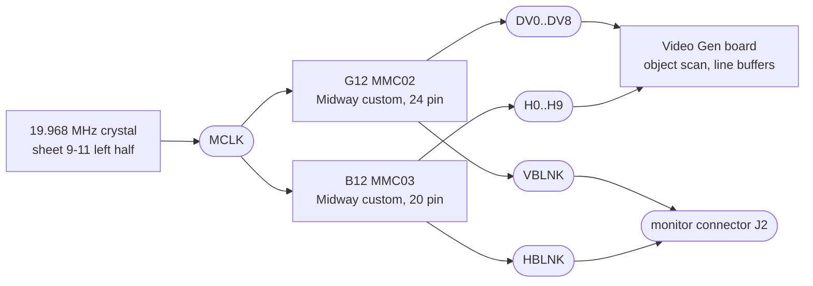

# MCR II: where the video counters are, and why the blanking phase is not on a drawing

A negative result, recorded so the next person does not repeat the search. The
Bally Midway MCR II video timing is inside two custom LSIs. The horizontal and
vertical counters, and the blanking decodes derived from them, do not appear on
any schematic in any MCR manual, because there is no discrete logic to draw.

**Blocks:** the mcr2 half of W1 in
[`raster-sampling-fidelity.md`](../designs/raster-sampling-fidelity.md), which
needs to know where the 480 visible lines sit inside the 512-line frame.

## Provenance

| | |
|---|---|
| Drawing | Super CPU Board `A084-90010-C000`, sheet 9-11, right half |
| Read from | `arcade-museum.com/manuals-videogames/T/Tron.pdf`, PDF page 116 |
| Transcribed | 2026-08-28, from a 400 dpi render |

Also searched, and clean of counters: Satan's Hollow's Video Gen sheet 9-8
(`A084-91399-A941`) and Tron's the same drawing as sheet 9-13 across PDF pages
121 and 122; Tron's Super CPU sheet 9-11 left half (PDF page 115), which carries
the 19.968 MHz crystal and the MCLK dividers but no counter chain; and the Super
Sound I/O sheet. `H0`..`H9` and `DV0`..`DV8` arrive on the Video Gen board over
the connector, already counted.

## The circuit

## Parts

| Ref | Part | Role |
|---|---|---|
| G12 | MMC02 | vertical counter: outputs `DV0`..`DV8` and `VBLNK` |
| B12 | MMC03 | horizontal counter: outputs `H`-series and `HBLNK` |

## Nets

| Net | Pins |
|---|---|
| `DV0`..`DV7` | G12.23, .22, .21, .20, .19, .18, .17, .16 |
| `DV8` | G12.15 |
| `VBLNK` | G12.14 |
| `HFLIP`, `S11`, `S17`, `SW2C` | G12 inputs, pins 1-5 |
| `PLC`, `H9`, `H3` | B12.4, .5, .8 |
| `HBLNK` | B12.12 (label partly cut on the scan) |
| `VBLNK`, `HBLNK` | J2.9, J2.8, out to the monitor |

`G12`'s numbers are at least self-consistent: on a 24 pin package the second
side is pins 13 to 24, and the ten outputs read here run contiguously down 23
to 14 with the inputs on 1 to 5 at the other end. That is what an output bank
looks like, which is weak evidence the digits were read correctly and none at
all about what is behind them. `B12` and `J2` have too few pins recorded to
check, and neither part has a datasheet to check against.

There is no netlist beside this file even though it has pin numbers, which the
other excerpts use as the test. Two reasons. The pinout is seven rows and a
drawing would restate it rather than add to it. More importantly `B12`'s output
labels are cut off on the scan and their identity is inferred from what the
Video Gen board consumes, as recorded below; a drawing has one voice and would
put that inference on the page in the same weight as the pins that were read.

## What it establishes

- The vertical counter is nine bits (`DV0`..`DV8`), which matches a 512-line
  frame, and `VBLNK` comes out of the same package as the count.
- Both counters and both blanking signals are generated inside custom parts. The
  CPU board sources them and the Video Gen board consumes them.

## What it does NOT establish, and cannot

- **Where in the 512-line frame the 480 visible lines sit.** The comparison that
  asserts `VBLNK` is inside MMC02. There is no decode to read, no gate to trace,
  and no net named for a line number.
- **Which field the even framebuffer rows belong to.** Same reason.
- MMC03's output labels are cut off at the right edge of the page-116 scan; that
  they are the `H` series is inferred from what the Video Gen board consumes, not
  read.

Nothing else in the manual set closes this. If the phase is ever needed it has to
come from somewhere that is not a drawing: a logic capture on a live board, a
die-level teardown of MMC02, or someone else's reverse engineering of it. MAME
does not know it either, and says so: `mcr.cpp` sets the screen up with
`set_vblank_time(ATTOSECONDS_IN_USEC(2500))` and the comment `/* not accurate */`.
