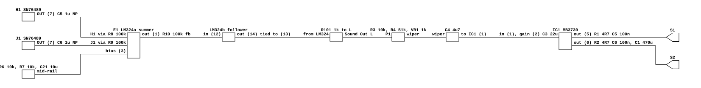

# Mr. Do's audio output

What Universal's 8201 board and its Sound Amplifier Unit do between two SN76489s
and the cabinet. Read for `phosphor-emulator-discrete-sound-fidelity-l5r3.10`,
the project-wide audit. The model is `machines/src/mrdo.rs`.

Read straight after `docastle-audio-output.md`, and the pair is the point. **Mr.
Do and Mr. Do's Castle are the same manufacturer, one year apart, and end in the
same MB3730 power amplifier, and their output stages are not the same circuit.**
Mr. Do's Castle mixes passively into a shelf on the main board. Mr. Do mixes in
an op-amp and puts the amplifier on a separate unit behind a 51k attenuator.
That is the third time in this sweep that a shared family has not meant a shared
output stage.

## Provenance

| | |
|---|---|
| Drawing | `MR. DO!`, Universal 8201, main board sheet 1, top right |
| Drawing | `SOUND AMPLIFIER DIAGRAM AND PARTS LOCATION`, same manual |
| Read from | `arcade-museum.com/manuals-videogames/M/mrdo_2.pdf`, PDF pages 7 and 12, a 300 dpi scan |
| Transcribed | 2026-09-01 |

The manual's schematics are PDF pages 7 to 14. **The main board sheets are
printed rotated 90 degrees** and need a `-rotate -90` before anything on them
reads. The amplifier page is upright.

## What the model does today

`MrdoBoard` sums `sn1` and `sn2`, box-filters to the output rate, and runs a
shared `DcBlocker` over the sum. That is the whole model.

## The chain

[`mrdo-audio-output.json`](mrdo-audio-output.json).

## On the main board

Two SN76489s at H1 and J1, each with `OUT` on pin 7.

| net | ref.pin |
|---|---|
| H1 output | H1.7 -> C5 1 uF NP -> R8 100k -> E1.2 |
| J1 output | J1.7 -> C6 1 uF NP -> R9 100k -> E1.2 |
| summing feedback | R10 100k, E1.2 to E1.1 |
| bias | R6 10k and R7 10k from Vcc with C21 10 uF, to E1.3 |
| follower | E1.1 -> LM324 pin 12, pin 14 tied to pin 13 |
| out | pin 14 -> R101 1k -> `Sound Out` L, with M as its ground |

So the two chips are **coupled first and summed second**, through equal 100k
legs into an inverting summing amplifier with 100k feedback: gain -1 each,
balance 1:1. Then a unity follower and a 1k series resistor to the connector. The
LM324 runs on a single supply with its non-inverting input at a mid-rail
divider, so everything on this board sits on that pedestal.

## On the Sound Amplifier Unit

A separate board with its own parts-location drawing, four terminals P1 to P4 and
two speaker terminals S1 and S2.

- **P1 is the audio in**, P2 and P3 are ground, P4 is +12 V with C2 1000 uF.
- **R3 10k from P1 to ground**, then **R4 51k** into the top of **VR1**, a 1k B
  taper pot to ground. The wiper drives the amplifier.
- **C4 4.7 uF** from the wiper to IC1 pin 1.
- **C3 22 uF from pin 2 to ground**, which is how an MB3730 is told its gain.
- **Pin 5 goes straight to S1**, with R1 4.7 ohm and C5 0.1 uF to ground.
- **Pin 6 goes to S2 through C1 470 uF**, with R2 4.7 ohm and C6 0.1 uF to
  ground on the amplifier side of it.

So the speaker sits between the two outputs, driven as a bridge, with a 470 uF in
one leg: a high-pass at **42.3 Hz** into a nominal 8 ohm speaker. Both outputs
carry their own Boucherot cell.

The attenuation before the amplifier is large. The 1k pot is loaded onto the end
of a 51k series resistor, so at full volume the top of the pot sees about
`1k / 52k` of P1, which is **-34 dB**, and the wiper takes a fraction of that.
Whatever the MB3730's fixed gain is, the board throws most of the signal away
first, which is what makes the pot a usable control over a power amplifier with
no gain adjustment of its own.

## The coupling capacitors are before the sum, not after

`mrdo.rs` applies one `DcBlocker` to the summed pair, and its comment says the
capacitor "sits between the chips and the amplifier, so what it strips the offset
from is the summed signal on its way to the speaker". On this board the coupling
is **C5 and C6, one per chip, ahead of the summing resistors**.

For a linear filter that is the same thing: superposition says one high-pass on
`a + b` equals one high-pass each on `a` and `b` at the same corner. So **the
model's output is right and its stated reason is not**, and the fix is a comment
rather than code. The corners are not the same either, though both are far below
the band: 1 uF into 100k is **1.59 Hz**, against the shared 10 Hz default.

There is a second coupling capacitor further along, C4 4.7 uF on the amplifier
unit, and a third in the speaker leg, C1 470 uF at 42.3 Hz. The last is the one
that actually shapes anything.

## What it establishes

- The two chips are mixed 1:1, so the model's plain sum is right in ratio. Sixth
  confirmation of a constant in this sweep.
- The coupling is per chip and ahead of the sum, which is equivalent to what the
  model does but is not what its comment says.
- **The dominant high-pass is C1 470 uF in the speaker leg at 42.3 Hz**, not
  anything near the chips.
- Missing from the model: R101 1k, the 10k/51k/1k input attenuator, the volume
  pot, the MB3730, both Boucherot cells, and the bridge output. The model is
  mono.
- **Mr. Do and Mr. Do's Castle do not share an output stage** despite sharing a
  manufacturer, an era and a power amplifier part.

## What it does NOT establish

- **Whether the volume pot moves a corner.** The wiper drives C4 4.7 uF into the
  MB3730's input impedance, and that impedance is not on either drawing, so
  whether the wiper's source resistance is significant against it cannot be said.
  On Mr. Do's Castle the equivalent question had an answer, because there the
  series arm was 22k and dominated; here it does not obviously.
- **The MB3730's closed-loop gain**, which C3 22 uF sets by a datasheet
  relationship that was not looked up. Without it the -34 dB of input attenuation
  cannot be turned into an overall figure.
- **What the SN76489's own output impedance is**, which sits in series with C5
  and C6 and so moves the 1.59 Hz slightly.
- **Whether the two Boucherot cells and C1 imply the outputs are not perfectly
  balanced.** A true bridge needs no series capacitor; C1 is there and its reason
  was not established.
- **Any measurement.** Nothing here has been compared against a capture.

## Confidence

Two clean 300 dpi drawings. The amplifier unit's page is a redrawn diagram and is
the most legible thing in this sweep; every value on it was read without
ambiguity. The main board's sound section is rotated and denser, but the eight
components that matter, C5, C6, R8, R9, R10, R6, R7 and R101, were all read
without ambiguity after rotation.

The connection worth checking specifically was on the amplifier unit: which of
S1 and S2 has C1 in its leg, since a series capacitor in one leg of a bridge and
a series capacitor feeding a single-ended output are different circuits. Pin 5
reaches S1 directly and pin 6 reaches S2 through C1, and both outputs carry their
own Boucherot cell, so it is a bridge with a capacitor in one leg.

This is a hand transcription and can be wrong. Nothing in it is checked by a
test; the section above it is what keeps that honest.
