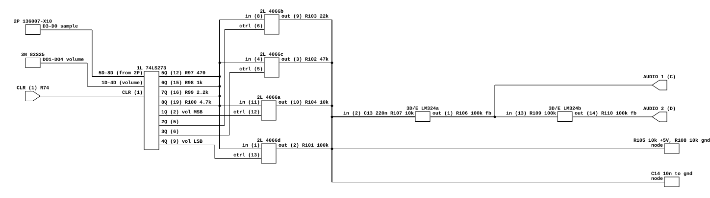

# The Namco Galaga board's audio output

What the Galaga-family board does between the WSG's digital output and the
cabinet. Read for `phosphor-emulator-discrete-sound-fidelity-l5r3.10`, the
project-wide audit. The model is `machines/src/namco_galaga.rs`, whose
`fill_audio` forwards `NamcoWsg` and stops.

The headline: **the WSG's output stage is the same circuit Pac-Man has**, down to
the resistor values, and it is unmodelled here for the same reasons. But the two
games this was read from load that circuit differently, so Galaga and Dig Dug do
not share a volume law even though they share a DAC.

## Provenance

| | |
|---|---|
| Drawing | `GALAGA CPU PC`, Midway Mfg. Co., part A084-91414-A000 |
| Read from | `arcade-museum.com/manuals-videogames/G/galaga3.pdf`, PDF p23 (whole sheet) and p24 (the right half, larger) |
| Drawing | `Dig Dug CPU PCB Schematic Diagram`, Atari SP-203 sheet 5A, 1st printing, (c) Atari Inc. 1982 |
| Read from | `arcade-museum.com/manuals-videogames/D/digdugsp.pdf`, PDF p18 (left half) and p17 (right half) |
| Transcribed | 2026-08-31 |

Two scans of the same design, at two resolutions and from two licensees. **The
Dig Dug package is the one to read**: its pages carry a 300 dpi bitmap where the
Galaga package carries 150 dpi, and everything below that is stated at pin level
was read on the Dig Dug sheet first and then confirmed on the Galaga one.

Three things about these files that cost time:

- **The Atari package prints each wide sheet across two PDF pages in reverse
  order.** The audio drawing's left half is p18 and its right half is p17. The
  cut runs through the 1M 74LS283, which appears at p18's right edge and p17's
  left edge; that is how the pair was matched. The title `Audio` sits at the top
  center of the full sheet, so it lands at p18's right edge and off p17
  altogether, and the ATARI title block giving the sheet number is on p17.
- **Sheet numbers disagree with the package's own table of contents.** The
  contents page calls the audio drawing sheet 4C; its title block says SP-203
  sheet 5A. The part number and the drawing title are the stable names.
- **The `Regulator/Audio II PCB` sheet (035435-05, SP-203 sheet 2A) is cut at its
  right edge in this scan.** Only the +5 V regulator half is present. J7 pins 8
  and 9 are labeled `AUDIO 2 INPUT` and `AUDIO 1 INPUT` and lead into the missing
  portion, so the power amplifier that actually drives the Dig Dug speaker was
  not read.

## What the model does today

`NamcoWsg::tick` computes, per voice, `(wave_nibble - 8) * volume`, sums the
three voices, scales by 80 and hands that to the resampler. Linear arithmetic,
one instantaneous sum, no filter, no bias, no output stage. `namco_galaga.rs`
forwards it unchanged.

## The chain, at pin level

[`namco-galaga-audio-output.json`](namco-galaga-audio-output.json), drawn from
the Dig Dug sheet. As with Pac-Man, the argument is in the pins: the four sample
resistors and the four switch inputs are **one node**, and a block diagram would
draw two.

## The 74LS273 holds two different four-bit fields

`1L` is an octal D flip-flop, and its eight outputs go to two unrelated places.

| latch output | pin | goes to | role |
|---|---|---|---|
| 5Q | 12 | R97 470 | sample MSB |
| 6Q | 15 | R98 1k | sample |
| 7Q | 16 | R99 2.2k | sample |
| 8Q | 19 | R100 4.7k | sample LSB |
| 1Q | 2 | 4066 ctrl 12, switching R104 10k | volume MSB |
| 2Q | 5 | 4066 ctrl 6, switching R103 22k | volume |
| 3Q | 6 | 4066 ctrl 5, switching R102 47k | volume |
| 4Q | 9 | 4066 ctrl 13, switching R101 100k | volume LSB |

Which field is which is settled by where the latch's data comes from. `5D`-`8D`
are the four outputs of the `2P` 136007-X10 PROM, pulled up by R93-R96 1k. That
PROM is addressed A0-A4 from the `2M/N` 74LS174 accumulator latch and A5-A7 from
the register file: **32 samples by 8 waveforms, 256 bytes**, which is exactly the
`waveform_rom: [u8; 256]` the model loads. So 5Q-8Q are the waveform sample, and
1Q-4Q are the volume.

The four sample resistors meet at one node, four junction dots on a single
vertical, and that node feeds all four 4066 switch inputs (pins 11, 8, 4, 1). The
switch outputs (pins 10, 9, 3, 2) each reach the summing node through their own
resistor. **The board multiplies sample by volume in the analog domain, with
switched resistors**, and a model computing `sample * volume` is asserting that
both networks are exact binary ladders. Neither is.

## Neither ladder is binary, and the sample one kinks at mid-scale

Sample legs are 470, 1k, 2.2k and 4.7k, so their conductances are in the ratio
10 : 4.70 : 2.136 : 1 where a binary ladder wants 8 : 4 : 2 : 1. All four are
always connected (a logic low sources through the same resistor), so the node is
a fixed divider and the code maps to `sum(selected conductances) / 3.795 mS`:

| code | board | linear | error (LSB) |
|---|---|---|---|
| 3 | 0.1758 | 0.2000 | -0.36 |
| 4 | 0.2635 | 0.2667 | -0.05 |
| 7 | 0.4393 | 0.4667 | **-0.41** |
| 8 | 0.5607 | 0.5333 | **+0.41** |
| 11 | 0.7365 | 0.7333 | +0.05 |
| 12 | 0.8242 | 0.8000 | +0.36 |

Monotonic, but the 7 to 8 step is 0.121 where every step should be 0.067: a
differential nonlinearity of +0.82 LSB at the major carry. **That is the
waveform's zero crossing.** The model's `wave_nibble - 8` puts the signed zero
exactly at the code pair where the board's DAC has its one large kink, so the
error is a step discontinuity through zero on every cycle of every voice, which
is an odd-harmonic mechanism rather than a level error.

The sample network's own output impedance is 263 ohms, the four legs in
parallel.

## The volume law is a divider, and the two boards divide differently

The volume legs are 10k, 22k, 47k and 100k, conductances in the ratio
10 : 4.545 : 2.128 : 1 against a binary 8 : 4 : 2 : 1, the same compression
Pac-Man has. But the switched conductance does not set the level on its own: what
it sets is one arm of a divider, and the other arm is different on the two
boards.

- **Dig Dug** ties the summing node to +5 V through R105 10k and to ground
  through R108 10k, so the node's other arm is a fixed 200 uS at 2.5 V. The
  transfer is `G / (G + 200 uS)`.
- **Galaga** has no shunt pair. The node runs to R19 10k into the inverting input
  of the `5P` LM324, with R20 3.3k feedback, so the switched legs and R19 are in
  series into a virtual ground and the transfer is `1 / (R_legs + 10k)`.

Both saturate as the volume code rises, and both are therefore louder than a
linear multiply once normalized to full scale:

| code | Dig Dug vs linear | Galaga vs linear |
|---|---|---|
| 1 | +3.65 dB | +6.59 dB |
| 2 | +3.73 dB | +6.28 dB |
| 4 | +3.41 dB | +5.27 dB |
| 8 | +2.49 dB | +3.33 dB |
| 12 | +1.00 dB | +1.29 dB |
| 15 | 0 dB | 0 dB |

At full volume Dig Dug's node passes only 0.47 of the sample swing, because
176.7 uS of switched legs works against 200 uS of bias. That is the divider, not
a loss to be trimmed out.

Neither column includes the 4066's on-resistance, which is in series with every
leg and is a couple of hundred ohms at a 5 V supply, nor the sample network's 263
ohms. Both push the same way and are worth about 3 % on the 10k leg and 0.3 % on
the 100k one; the shape above is not sensitive to them, the absolute full-scale
number is.

## The low-pass corner moves with the volume code

Each board shunts the summing node with a capacitor, and the node's resistance is
what the volume code just selected, so the corner is a function of the volume:

| code | Dig Dug, C14 10 nF | Galaga, C43 2.2 nF |
|---|---|---|
| 1 | 3.3 kHz | 8.0 kHz |
| 4 | 3.9 kHz | 10.5 kHz |
| 8 | 4.8 kHz | 14.5 kHz |
| 15 | 6.0 kHz | 20.0 kHz |

Quieter is darker, on both boards, by roughly an octave across the code range.
This is the second instance of the shape Lunar Lander's thrust filter has, and
the third instance in this sweep of a corner that moves with a control setting.

The corners are computed from the node's Thevenin resistance treating the sample
network as a source: on Dig Dug that is `1 / (200 uS + G)`, on Galaga it is the
selected legs in parallel with R19, since the LM324 input is a virtual ground.
Nothing here is measured.

## The rest of each board, which also is not modelled

Common to both: the DAC is **time multiplexed**. One `74LS273` serves all three
voices, its clock comes from `2H` through the `5E` 74LS32, and the register RAM's
address is 32H, 16H, 8H, 4H, so sixteen slots pass in 64 dot clocks: 96 kHz at
the 6.144 MHz dot clock, which is the WSG's documented sample rate. The three
voices reach the shared node in sequence and the capacitor averages them; the
model sums them instantaneously. To first order that is a constant scale, but the
node's time constant changes slot by slot with each voice's own volume code, so
the analog mixer is a time-varying filter and the model is a linear sum.

**Dig Dug**, after the node: C13 0.22 uF and R107 10k into the `3D/E` LM324's
inverting input with R106 100k feedback, so a high-pass and a gain of -10, out as
`AUDIO 1` on connector C. A second LM324 section takes that through R109 100k
with R110 100k feedback, a unity inversion, out as `AUDIO 2` on connector D.
**The output is a differential pair**, as I, Robot's is, and it lands on two
separate inputs of the Regulator/Audio II board. The amplifier itself is on the
cut part of that sheet. The LM324 is marked as running from 10.6 V unregulated.

**Galaga**, after the node: the long run to R19 10k into the `5P` LM324's
inverting input, R20 3.3k feedback, out as the `SOUND` net. **That inverting node
is shared.** R21 33k and R36 33k also land on it, from the outputs of two
active filter sections whose inputs sit in the 54XX's resistor bank, so the WSG
enters this amplifier at -0.33 and each explosion filter at -0.10. The filters
belong to the `namco-54xx-explosion` row, but the summing junction does not
belong to either row alone, and nothing downstream of it can be attributed to one
of them. `SOUND` then reaches the top of VR1, a 1k volume pot, through R81 10k,
in parallel with a second net through R80 10k. The wiper drives a 0.1 uF
coupling capacitor, C19 0.01 uF to ground, and the `7C` MB3730 bridge amplifier,
out to `+SPEAKER` and `-SPEAKER`. So Galaga's speaker is driven differentially
too, from a bridge output rather than from an op-amp pair.

## What it establishes

- The Galaga-family board's analog audio path is the Pac-Man circuit: the same
  74LS273 split into sample and volume fields, the same 470 / 1k / 2.2k / 4.7k
  sample ladder, the same 4066 with 10k / 22k / 47k / 100k legs. Three boards now
  read, one design.
- The sample-times-volume multiply is analog on this board too, and both ladders
  are compressed at the bottom relative to binary.
- The sample ladder's largest error, +0.82 LSB of DNL, sits at the 7-to-8
  transition, which is where the model's `- 8` puts the signed zero crossing.
- The volume law is a divider whose other arm differs between Galaga and Dig Dug,
  so **one linear multiply cannot be right for both**, and the two are 3 dB apart
  from each other at low volume codes before either is compared with the model.
- Both boards shunt the summing node, and both corners move by about an octave
  with the volume code.
- Both boards leave the PCB differentially, Dig Dug as an op-amp pair and Galaga
  as a bridge amplifier output. The model is mono.
- The waveform source is discrete TTL on this board as it is on Pac-Man: a
  136007-X10 PROM addressed through a 74LS283 adder and a 74LS174 latch, with
  82S25 register RAM.

## What it does NOT establish

- **Xevious.** The catalog row covers Xevious and no Xevious drawing was read.
  The claim above is about Galaga and Dig Dug. Whether Xevious's board loads the
  same DAC the Galaga way, the Dig Dug way, or a third way is open.
- **The polarity and bit order of the volume nibble arriving at 1D-4D.** The
  82S25 register RAM's outputs are drawn with overbars, so they are inverting,
  and the path from RAM to `1D`-`4D` was not traced through. The mapping of
  latch bit to resistor leg in the table above is read off the drawing and is
  solid; what the CPU has to write to get a given leg closed is not.
- **The second net feeding Galaga's volume pot through R80 10k.** Its label reads
  as `EKDATA` or `EXDATA` and does not resolve further at 150 dpi; it was not
  traced. It is a second signal summed into the same pot and therefore in the
  level.
- **The reference on Galaga's `5P` non-inverting input**, pin 3, which arrives
  from off the left of the region read and sets the DC the summing amplifier
  works about.
- **Whether a third 54XX filter output joins Galaga's summing node.** Two were
  followed onto it, R21 and R36; the sheet has a third section with a 10k output
  resistor whose destination was not traced.
- **Which of the sixteen multiplex slots carry voice output.** The `2K/L`
  136007-X09 sequencer PROM was not read, so the 96 kHz figure is the frame rate
  and not a per-voice duty cycle. The scale factor between the board's average
  and the model's sum follows from that and is therefore unknown.
- **Galaga's control-bit to switch mapping**, which was read in detail only on
  the Dig Dug sheet. The Galaga sheet shows the same topology and the same ten
  resistor values, and its four control lines nest the same way, but at 150 dpi
  the pin numbers on the 4066 were not all legible.
- **Dig Dug's power amplifier**, on the cut half of the Regulator/Audio II sheet.
- **Any measurement.** Nothing here has been compared against a capture. Every
  number above is arithmetic on component values.

## Confidence

The Dig Dug sheet is a clean 300 dpi line drawing and the ten resistor values,
the eight latch destinations and the shared sample node were all read without
ambiguity; the shared node shows four junction dots on one vertical, checked
specifically because the whole reading turns on it. The Galaga sheet is half that
resolution and was used to confirm values and topology, not to establish them.

The one thing worth flagging as a near miss: Galaga's `Q1` 2SC1815-Y with R6 1k,
R7 10k, R8 10k, C44 10 uF and D1 sits a short distance from the DAC node on the
same sheet. It is the power-on reset circuit, next to the watchdog net `WDR`.
That is the same trap Pac-Man's R28/R29 set, one sheet further along.

This is a hand transcription and can be wrong. Nothing in it is checked by a
test; the section above it is what keeps that honest.
