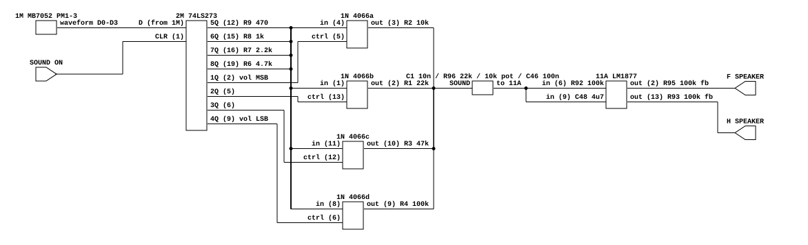
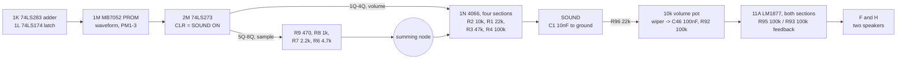

# Pac-Man's audio output stage

What Pac-Man's board does between the WSG's digital output and its two speakers.
Read for `phosphor-emulator-discrete-sound-fidelity-l5r3.10`, the project-wide
audit. Nothing models any of it today: `namco_pac.rs`'s `fill_audio` forwards the
WSG and stops.

## Provenance

| | |
|---|---|
| Drawing | `PAC-MAN` game logic schematic, Midway Mfg. Co. |
| Read from | `arcade-museum.com/manuals-videogames/P/Pacman-Troubleshooting-Guide-Part1.pdf`, PDF p23 |
| Transcribed | 2026-08-31, from 300, 600 and 900 dpi renders of that page |

**Use this scan, not the one the board file used to cite.** The schematic in
`arcade-museum.com/manuals-videogames/P/pac-man_p2.pdf` is split across PDF p2
(left half) and p1 (middle) in reverse order, and p1 is then cut MID-COMPONENT at
its right edge, through the 5L 74LS139, the 4N 2114, the 4H 8T245 and the 5S
custom IC. The portion carrying everything below is simply not in that file. All
35 of its pages were checked before giving up on it; the rest is assembly
drawings, three daughter boards, cabinet wiring and the Electrohome monitor.

Here the whole sheet is two pages, p22 and p23, and the audio is at the right of
p23.

## The chain, at pin level

[`pacman-audio-output.json`](pacman-audio-output.json). The argument is in the
pins, which is why this is a netlist rather than only a block diagram: the four
sample resistors and the four switch inputs are ONE node, and a block diagram
would draw two.

## The same thing as blocks

## THE VOLUME MULTIPLY IS ANALOG

This is the finding, and it is the same shape as Lunar Lander's throttle.

The 74LS273 at 2M holds eight bits, and they are two different four-bit fields:

| latch output | pin | goes to | weight |
|---|---|---|---|
| 5Q | 12 | R9 470 | sample MSB |
| 6Q | 15 | R8 1k | sample |
| 7Q | 16 | R7 2.2k | sample |
| 8Q | 19 | R6 4.7k | sample LSB |
| 1Q | 2 | 4066 pin 5, switching R2 10k | volume MSB |
| 2Q | 5 | 4066 pin 13, switching R1 22k | volume |
| 3Q | 6 | 4066 pin 12, switching R3 47k | volume |
| 4Q | 9 | 4066 pin 6, switching R4 100k | volume LSB |

The four sample resistors all meet at ONE node -- four solid junction dots on the
drawing, checked at 900 dpi because this is the connection the whole reading
turns on. That node is a binary-weighted DAC output. The four 4066 sections then
tap that same node and connect it to the output through one of four resistors, so
**the board multiplies sample by volume in the analog domain, with switched
resistors.**

Neither network is exactly binary. Taking conductances and normalising to the
largest leg:

| | measured ratio | exact binary |
|---|---|---|
| sample: 470 / 1k / 2.2k / 4.7k | 1 : 0.470 : 0.214 : 0.100 | 1 : 0.5 : 0.25 : 0.125 |
| volume: 10k / 22k / 47k / 100k | 1 : 0.455 : 0.213 : 0.100 | 1 : 0.5 : 0.25 : 0.125 |

Both are compressed at the bottom: the least significant leg carries 0.10 of the
most significant where an exact ladder gives 0.125, and the second-least 0.21
against 0.25. A model that computes `sample * volume` in integer arithmetic is
using the exact ladder, and is therefore wrong in a way that grows as either
field gets small -- which is most of a decaying note.

## What the two ladders actually do

The arithmetic the section below asks for, done 2026-09-17 for
`phosphor-emulator-ga9p`. It needs no capture: it is the transcribed resistor
values and nothing else. Three mechanisms come out of it, and they are not the
same size.

**The volume network is a divider, and it is the large one.** The 4066 sections
put some subset of R2, R1, R3 and R4 in parallel between the summing node and
the output bus, and the bus is loaded by R96 22k in series with the 10k pot,
about 31k. A leg that is switched out leaves the network entirely, so the gain
is `load / (R_parallel + load)` rather than a sum of leg gains, and the law that
produces is strongly compressed:

| volume code | 1 | 2 | 4 | 8 | 15 |
|---|---|---|---|---|---|
| board, dB below full | -11.1 | -6.6 | -3.2 | -1.0 | 0 |
| `code / 15`, dB below full | -23.5 | -17.5 | -11.5 | -5.5 | 0 |
| error | +12.5 | +10.9 | +8.3 | +4.5 | 0 |

So the emulator's quietest volume code is 23.5 dB down where the board's is
11.1 dB down. **Every decaying note in the game decays about twice as far in
dB as the board's does.** Over the 225 audible (sample, volume) pairs the RMS
error is 6.1 dB.

That figure moves with R5, the untraced trimmer below. If R5 turns out to shunt
the output bus to ground, the load is about 12.9k instead and the compression is
milder: -15.7 dB at code 1, a +7.8 dB error, 4.2 dB RMS. **The direction and the
rough size survive either answer**, which is what makes this worth modeling
before R5 is resolved, but the exact law does not.

**The sample ladder is not a level error, it is an asymmetry.** Its four legs
are switched between the latch's rails, so code 8, the waveform's zero, lands at
0.5607 of full scale rather than 0.5. The negative half-swing is therefore 27.6 %
larger than the positive one, worth 2.1 dB, and what that adds is even harmonics
rather than gain. A full-swing waveform leaves a -0.061 offset for C46 to remove.
Judged as a shape after that coupling, the codes either side of zero are the
furthest out: code 7, one step below zero, is 5.7 dB larger than the model makes
it, though at an amplitude where that costs little.

**C1's corner moves with the volume code**, because the code decides which
resistors are in circuit. Against the 31k load it runs from 673 Hz at code 1 to
3.3 kHz at code 15 (1.4 kHz to 4.1 kHz for the 12.9k load). A note therefore
gets darker as it decays, on top of getting quieter. The emulator has no filter
here at all.

One caveat on all three: the 4066's on-resistance is in series with each volume
leg and is in none of these numbers. At a nominal 80 ohms it is under 1 % of the
10k leg and proportionally less of the others, so it moves the law less than R5
does.

## The filter and the amplifier

- **C1, 0.01 uF, at the summing output.** Against the switched legs in parallel
  (10k, 22k, 47k and 100k together are 5.75k) that is a low-pass near 2.8 kHz,
  and it moves with the volume code, because the volume code is what decides
  which resistors are in circuit. Another mechanism the board has and a digital
  multiply does not.
- **R96 22k into a 10k pot to ground**, with the wiper feeding C46 0.1 uF and
  R92 100k. The cabinet volume control.
- **11A is an LM1877**, a dual audio amplifier, with a heat sink. Section one
  (pins 6, 7, 2) has R95 100k feedback and drives connector **F SPEAKER**;
  section two (pins 9, 8, 13) has R93 100k with C47 22 pF across it, C49 0.47 uF
  tantalum at its output, and drives connector **H SPEAKER**. Supply is +16 VDC
  with C51 330 uF and C50 0.0047 uF mylar.
- **PAC-MAN DRIVES TWO SPEAKERS.** The emulator is mono and the machine has two
  output connectors off two amplifier sections. Whether they carry the same
  signal was not traced.

## What it establishes

- The board's analog audio path exists, is substantial, and is entirely
  unmodelled. This is a `missing` entry rather than a `partial` one.
- The sample-times-volume multiply is a pair of resistor networks, not
  arithmetic, and neither network is an exact binary ladder.
- `SOUND ON` is the 74LS273's CLR, so disabling sound zeroes the sample and the
  volume together at the latch rather than muting downstream.
- The waveform source is discrete TTL, not a custom chip: an MB7052 PROM at 1M
  addressed through a 74LS283 adder at 1K and a 74LS174 at 1L.

## What it does NOT establish

- **R5, 22k, drawn as a trimmer at the output bus.** Its other end was not
  traced. It is in the summing network and therefore in the level, so this is a
  real gap rather than a detail.
- **Whether the two amplifier sections carry the same signal.** Section two's
  input side was not followed back.
- **Any measurement.** Nothing here has been compared against a capture; the
  claims are all from the drawing, and the ladder arithmetic above is derived
  from it rather than measured against anything.
- **The 4066's on-resistance**, which adds to each volume leg. At a nominal 80
  ohms against 10k it is under 1 %, but it is in none of the ratios above.
- **How often the game visits the codes where the error is largest.** The
  arithmetic above says what each code is worth; it does not say what the WSG
  actually plays. The error is largest at low volume codes, which is where a
  decay spends most of its time, so the weighting is unlikely to be kind, but
  that is a prediction rather than a count.

## Confidence

A clean scan read at up to 900 dpi. The summing node, the eight latch-output
destinations and all ten resistor values were read without ambiguity. The one
connection the reading depends on, that the four sample resistors share a node
rather than crossing, was checked specifically and shows four solid junction
dots.

A correction worth recording, because it is why the section above exists: an
earlier pass at this board read R28, R29 and a 2N3391A off the ASSEMBLY drawing
and wrote them down as an audio network. Tracing them on the schematic puts them
in the power-on reset circuit. Component positions on an assembly drawing are not
a circuit.

This is a hand transcription and can be wrong. Nothing in it is checked by a
test; the section above it is what keeps that honest.
