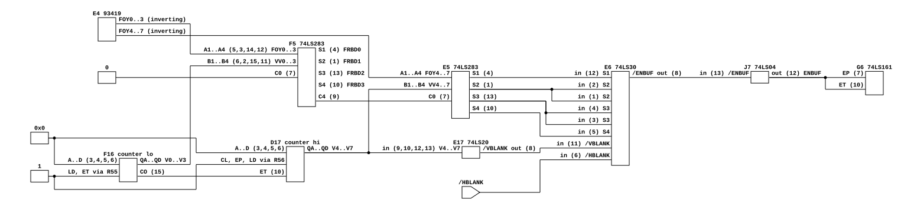
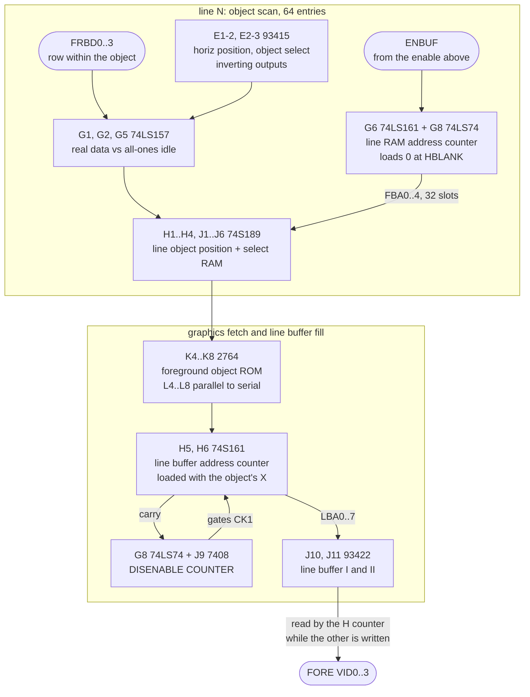

# What enables one Q*bert object on one line

Gottlieb System 80's foreground objects are not clipped to the screen; they are
enabled by a gate. This is that gate, its two blanking terms, and the pipeline
between the gate and the pixel, read from the drawing.

**Answers:** why an object parked at (0, 0) with a live code draws a fragment in
the corner of our framebuffer, and what part the `sy_raw - 13` position constant
in `gottlieb.rs` stands for.
**Extends:** the Q*bert section of
[`sprite-list-scan.md`](sprite-list-scan.md), which read the same sheet for a
different question and left the enable, the line RAM and sheet 3 unread.

## Provenance

| | |
|---|---|
| Drawing | Logic Board Assy. (A1) Schematic Diagram, sheets 2 and 3 of 3 |
| Read from | `arcade-museum.com/manuals-videogames/Q/QBertInstructionManual483.pdf`, PDF pages 16 and 17 |
| Transcribed | 2026-08-28, from a 600 dpi grayscale render |

Sheet 2 carries the object list, the vertical select, the enable and the line
object RAM. Sheet 3 carries the graphics fetch, the line buffer and the counter
that places an object horizontally. Sheet 1 was not read. Gottlieb labelled the
functional blocks, and the block names quoted below are the drawing's own,
including its spelling of "DISENABLE COUNTER".

## The enable

The gate itself, at pin level, from the first two net tables below.

Generated from [`qbert-object-enable.json`](qbert-object-enable.json) by
[`render.sh`](render.sh). Every port carries its pin number, so `E6`'s eight
inputs can be counted off the drawing: that is the claim this file exists to
support and it is the one thing a block diagram cannot show.

Two departures from the net tables, both deliberate. `VV0..7` is drawn straight
from the vertical counter, which is what the sum's B inputs are labeled; whether
it is really `V` or `V - 1` through the `E16` latch was not traced, and is under
"does not establish" below. `E16` itself is not drawn, because its clock was not
traced and it sits outside the enable path. `FRBD0..3` leave `F5` labeled but
unwired, because their destination is in the next diagram rather than this one.

## The path to the pixel

Everything downstream of `ENBUF`, as blocks. The stages are the point here and
the pin numbers are in the tables, so this one stays a block diagram.

## Nets

### Vertical select and the enable, sheet 2

| Net | Pins |
|---|---|
| `FOY0`..`FOY3` | F5.A1..A4 (pins 5, 3, 14, 12) |
| `VV0`..`VV3` | F5.B1..B4 (pins 6, 2, 15, 11) |
| GND | F5.C0 (pin 7) |
| `FRBD0`..`FRBD3` | F5.Σ1..Σ4 (pins 4, 1, 13, 10), the row within the object |
| F5.C4 (pin 9) | E5.C0 (pin 7) |
| `FOY4`..`FOY7` | E5.A1..A4 |
| `VV4`..`VV7` | E5.B1..B4 |
| E5.Σ1 (pin 4) | E6.12 |
| E5.Σ2 (pin 1) | E6.2, and E6.1 tied to it |
| E5.Σ3 (pin 13) | E6.4, and E6.3 tied to it |
| E5.Σ4 (pin 10) | E6.5 |
| `/VBLANK` | E6.11 |
| `/HBLANK` | E6.6 |
| `/ENBUF` | E6.8 -> J7.13 |
| `ENBUF` | J7.12 -> G6.EP (pin 7), G6.ET (pin 10) |

### Vertical counter and the blanking decode, sheet 2

| Net | Pins |
|---|---|
| GND | F16.A..D, D17.A..D (pins 3, 4, 5, 6 on both) |
| +5V via R55, R56 | F16.LD, F16.ET, D17.CL, D17.EP, D17.LD |
| F16.CO (pin 15) | D17.ET (pin 10) |
| `V0`..`V3`, `V4`..`V7` | F16.QA..QD, D17.QA..QD |
| `V4`..`V7` | E17.9, .10, .12, .13 (74LS20) |
| `/VBLANK` | E17.8 |
| `V0`..`V7` | E16.D0..D7 (74LS273 vertical latch) |

### Line RAM address counter, sheet 2

| Net | Pins |
|---|---|
| GND | G6.A, .B, .C, .D (pins 3, 4, 5, 6) |
| `HBLANK` | G6.LD (pin 9) |
| +5V via R74 | G6.CLR (pin 1) |
| `HCLK` | G6.CLK (pin 2) |
| `a0`..`a3` | G6.QA..QD (pins 14, 13, 12, 11) -> G7.A1..A4 |
| G6.QD (pin 11) | J7.9, inverted to J7.8 |
| `a4` | G8.Q (pin 5) -> G9.A1 (pin 2) |
| `H3`..`H6` | G7.B1..B4 |
| `H7`, `/H2` | G9.B1 (pin 3), G9.B2 (pin 6) |
| `S1` | G1.S, G2.S, G5.S, G7.S, G9.S (pin 1 on each) |
| `FBA0`..`FBA3` | G7.Y1..Y4 -> H3.A0..A3, J1.A0..A3, and the rest of the line RAM |
| `FBA4` | G9.Y1 -> H3./CS (pin 2); H4./CS takes its complement, and the inverter was not located |
| `S2` | G9.Y2 -> H3./WR (pin 3), J1./WR, J2./WR |
| +5V via R70 | G1.B1..B4, G5.B1..B4, the idle value |
| `FON4`..`FON7` | G1.A1..A4 |
| `HPD4`..`HPD7` | G1.Y1..Y4 |

### Line buffer fill and the disable counter, sheet 3

| Net | Pins |
|---|---|
| sheet 2 buses 2 and 3 | H5.A..D, H6.A..D (pins 3, 4, 5, 6), the object's stored X |
| `S3` | H5.LD, H6.LD (pin 9), and G8.CLR (pin 13) |
| +5V via R73 | H5.CLR, H5.EP, H5.ET, H6.EP |
| H5.CO (pin 15) | H6.ET (pin 10) |
| `LB0`..`LB7` | H5.QA..QD, H6.QA..QD -> H7..H10 line address 2:1 mux |
| H6.CO (pin 15) | G8.D (pin 12) |
| `CLK` | G8.CLK (pin 11) |
| G8./Q (pin 8) | J9.13 (7408) |
| `CK1` | J9.11 |
| `LBA0`..`LBA7` | J10.A0..A7 (93422 line buffer I) |
| `LBA0'`..`LBA7'` | J11.A0..A7 (line buffer II) |
| `HH0`..`HH3` | H7..H10 mux B inputs, the display-side address |
| `FORE VID0`..`3` | J10.Q0..Q3 -> H12 74LS298 foreground/background mux |

Two checks on the transcription rather than on the board. Every pin number
above agrees with the part's datasheet pinout, which is the cheap way to catch a
misread digit: the 74LS283's `A1..A4` really are pins 5, 3, 14, 12 and its
`Σ1..Σ4` pins 4, 1, 13, 10, the 74LS30's eight inputs really are 1 to 6 plus 11
and 12, and the 74S189's address and data pins fall where the drawing puts them.
And G8 is one chip used twice: sheet 2 draws its first half (pins 1, 2, 3, 5, 6)
as the line RAM address counter's fifth bit, sheet 3 its second half (pins 8,
10, 11, 12, 13) as the disable flip-flop.

## What it establishes

- **The enable is arithmetic ANDed with both blanking signals.** All eight
  inputs of E6 are accounted for: the four high sum bits of the vertical adder,
  `/VBLANK`, `/HBLANK`, and two spare inputs tied to sum bits rather than to
  Vcc. So an object is entered into the line RAM when `(FOY + VV) & 0xF0 ==
  0xF0` and the beam is in neither blanking interval. There is no term anywhere
  in it that depends on the object's horizontal position.
- **The window is 16 lines and the arithmetic is modular, so a parked object
  wraps into vertical blank rather than being clipped.** With F5's carry-in
  grounded the two adders form one 8-bit sum, and the match is the top nibble
  being all ones, which is 16 consecutive values of `VV`.
- **The position registers have inverting outputs**, marked with bubbles at
  E4's and E1-2's Q pins, so `FOY = ~sy_raw`. That is the same inversion our
  renderer applies by hand to the object code as `255 ^ code_raw`. Substituting
  it, the match window is `VV` in `[sy_raw - 15, sy_raw]`, and the row within
  the object counts up from the top of that window.
- **`sy_raw - 13` is not a fitted constant.** It is `-15` from the adder window
  above plus two lines of pipeline between the scan and the display. One of
  those two is read directly: the line buffer is two 93422s, one written while
  the other is read out by the display counter. See below for the other.
- **Vertical blank is `V` in 240..255.** The vertical counter F16/D17 is a
  free-running 8-bit counter with its load and clear inputs tied off, and E17 is
  a 4-input NAND of `V4..V7`. Our 240 visible lines of 256 is that decode
  exactly, and our scanline index is the hardware's `V` with no offset, so the
  enable needs no new constant to model.
- **The line RAM is a 32-slot append list, cleared to an idle value.** G6 loads
  0000 at HBLANK from four grounded inputs, is clocked at HCLK, and counts only
  while ENBUF is asserted, so a matching object lands at the next free slot and
  a non-matching one does not advance the pointer. G8 supplies a fifth address
  bit and pairs the RAMs by chip select, giving 32 slots. G1, G2 and G5 select
  each field between the real value and all-ones under `S1`, so the hardware has
  an explicit idle object value rather than a valid bit.
- **Horizontally, an object is placed by a loadable counter and truncated at the
  wrap, not clipped at either edge.** H5/H6 are loaded from the object's stored
  X and count up through the line buffer's 8-bit address. The block Gottlieb
  named DISENABLE COUNTER is a flip-flop cleared by the same load pulse `S3`,
  clocked with the counter's carry-out on its D input, whose /Q gates `CK1`: the
  fill stops when the address would wrap past 255. The only horizontal limit on
  the drawing is that one, and it acts at the right edge.
- **So there is no horizontal enable that would kill an object parked at X = 0**,
  and the 8-pixel left clip used by other emulations of this board has no part
  behind it on either sheet read here.

### Consequence for the renderer

A row displayed on line `d` was scanned two lines earlier, at `V = d - 2`, and
the scan is gated by `/VBLANK`. Two things follow, and neither needs a new
constant:

1. **No object pixel can appear on display rows 0 or 1.** Their scan lines are
   254 and 255, both inside vertical blank, so nothing is entered into the line
   RAM for them. `gottlieb.rs` currently draws sprites on those rows.
2. **The parked-object fragment shrinks from three rows to one.** An object at
   `sy_raw = 0` occupies display rows 0, 1 and 2 under our `sy_raw - 13`; rows 0
   and 1 are scanned during blank and row 2 is not.

The one row that survives is what the board draws. It sits in the two or three
outermost native rows, which is behind the bezel on a cabinet, and it is not
evidence of a missing clip.

## What it does NOT establish

- **Which of the two pipeline lines is which.** The line buffer accounts for
  one. The second is either the line RAM being read on the line after it is
  filled, or the E16 vertical latch presenting `VV = V - 1` to the adder. E16's
  clock was not traced and the two are indistinguishable from the drawing as
  read. The total of two is inferred from `-13` against the adder's `-15`, not
  read, and the "no objects on rows 0 and 1" conclusion moves to "row 0 only" if
  the total is really one line.
- **`S1`.** It selects every mux in the fill path between real data and the idle
  value, and it is drawn as a bus running down the sheet. Its source was not
  found, so whether the fill and the readout of the line RAM interleave within a
  line or alternate per line is open. This is the same uncertainty as the item
  above, seen from the other side.
- **HBLANK's decode.** The signal is used here; the counter and gate that
  produce it were not located.
- **The object scan's cadence.** L11/L12, the block named 800NS COUNTER, was
  seen but not traced. That 64 objects at four pixel clocks each fills the 256
  active clocks of a line is arithmetic that fits, not a transcription.
- **What happens to slots the scan did not reach.** The idle value is written
  through the muxes, and object code 255 is blank in this board's ROM, which
  fits an idle slot fetching a blank object, but the readout was not followed
  far enough to prove that is why.
- **The 4-pixel horizontal offset** in our `sx_raw - 4`. The line buffer is
  written at the object's X and read by the display counter; nothing read here
  says where the four pixels of skew between those two are introduced. The
  serial converter L4..L8 is the obvious candidate and was not traced.
- **Sheet 1**, and the colour path beyond the foreground/background mux H12.
