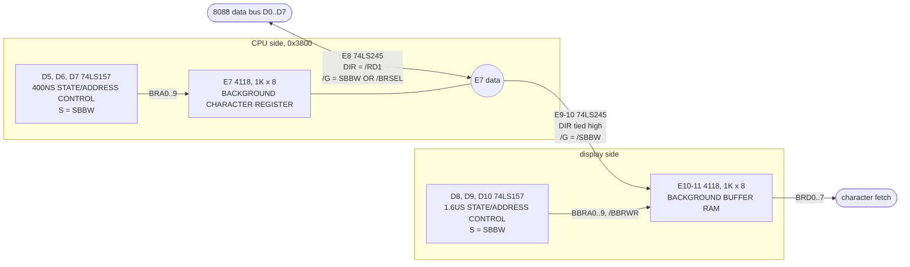
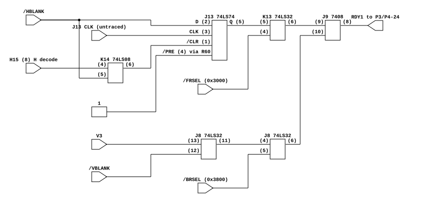

# Q*bert's playfield double buffer, and when the CPU waits for video RAM

Gottlieb System 80's playfield is two RAMs, not one. The CPU writes one; the
display reads the other; a DMA copies the first into the second during the first
eight lines of vertical blank, and the board's READY logic holds the 8088 off the
CPU-side RAM for exactly those lines. The same READY logic holds it off object
RAM for the part of every line that the object scan owns.

**Answers:** why a tilemap write in the middle of the screen does not reach the
picture until the next frame, which is what lets Q*Bert's Qubes rebuild its whole
attract page mid screen every frame without tearing; and when the 8088 waits on
a video RAM access.
**Extends:** [`qbert-object-enable.md`](qbert-object-enable.md), which read
sheets 2 and 3 for the object path and left sheet 1, the READY gating and the
background RAMs unread.

## Provenance

| | |
|---|---|
| Drawing | Logic Board Assy. (A1) Schematic Diagram, sheets 1, 2 and 3 of 3 |
| Read from | `arcade-museum.com/manuals-videogames/Q/QBertInstructionManual483.pdf`, PDF page 15 (sheet 1), 16 (sheet 2), 17 (sheet 3); 400 dpi CCITT scans, cropped at native resolution |
| Cross-checked | `arcade-museum.com/manuals-videogames/Q/QBertsQubes.pdf`, PDF pages 17 (sheet 1) and 19-20 (sheet 2), and the addendum on PDF pages 3-5 |
| Transcribed | 2026-10-06 |

The Qubes manual has no sheet 3: its PDF pages 21-22 are the power supply. Its
sheets 1 and 2 match Q*Bert's on everything this file reads, and its addendum
changes sheet 3 only at the foreground object ROM sockets (K4-K8 pin 26, the
expansion module's bank select). So sheet 3 is read from the Q*Bert manual and
applied to both games; that is an inference, named again below.

## The double buffer

Both address muxes switch on the same signal, SBBW, so the two RAMs change
hands together:

| | SBBW low: the frame | SBBW high: the DMA |
|---|---|---|
| E7 address | the CPU's A0..A9 | V2 V1 V0 H7..H1 |
| E7 /WR | the CPU's /BRWR | held high |
| E7 /OE | /RD1 | grounded |
| E8 (CPU buffer) | enabled by /BRSEL | disabled |
| E9-10 (DMA buffer) | disabled | enabled, E7 to buffer only |
| E10-11 address | VV7..VV3 HH7..HH3, row and column | the same BRA0..9 as E7 |
| E10-11 /WR | held high | /H0 |

## The wait states

Generated from [`qbert-ready.json`](qbert-ready.json) by
[`render.sh`](render.sh). The gate count is the argument: RDY1 is one AND of
two ORs, and each OR is a RAM select against a video timing term, so the 8088
waits on exactly two things and on nothing else.

RDY1 leaves sheet 2 on P4-24 and reaches the 8284A's RDY1 on sheet 1, whose
/AEN1 is grounded, so it is live, and whose RDY2 is grounded, so it is the only
ready input on the board. The 8284A's READY goes straight to the 8088's.

## Nets

### Background RAMs, sheet 3

| Net | Pins |
|---|---|
| `BRA0`..`BRA9` | D7.Y1..Y4, D6.Y1..Y4, D5.Y1..Y2 -> E7.A0..A9 (8, 7, 6, 5, 4, 3, 2, 1, 23, 22), and D8.B1..B4, D9.B1..B4, D10.B1..B2 |
| CPU `A0`..`A9` | D7.A1..A4, D6.A1..A4, D5.A1..A2 (2, 5, 11, 14 on each) |
| `H1`..`H7`, `V0`..`V2` | D7.B1..B4 (H1..H4), D6.B1..B4 (H5, H6, H7, V0), D5.B1..B2 (V1, V2): pins 3, 6, 10, 13 |
| `/BRWR` | D5.A3 (11) |
| +5V via R62 | D5.B3 (10) |
| `/BRWRR` | D5.Y3 (9) -> E7./WR (21) |
| `/RD1` | D5.A4 (14), E8.DIR (1) |
| GND | D5.B4 (13), D5./STRB, D6./STRB, D7./STRB (15), E7./CE (18) |
| D5.Y4 (12) | E7./OE (20) |
| `SBBW` | D5.S, D6.S, D7.S, D8.S, D9.S, D10.S (1); J8.9; K15.9 |
| `/BRSEL` | J8.10 |
| J8.8 | E8./G (19) |
| `/SBBW` | K15.8 -> E9-10./G (19) |
| +5V via R61 | E9-10.DIR (1), E7.L (19), E10-11.L (19), D10.A3 (11) |
| CPU `D0`..`D7` | E8.A0..A7, drawn as pins 5, 6, 8, 9, 7, 4, 3, 2 |
| E7 data | E7.D0..D7 (9, 10, 11, 13, 14, 15, 16, 17), E8.B0..B7 (15, 14, 12, 11, 13, 16, 17, 18), E9-10.A0..A7 (5, 6, 8, 9, 7, 4, 3, 2) |
| `BRD0`..`BRD7` | E9-10.B0..B7 (15, 14, 12, 11, 13, 16, 17, 18), E10-11.D0..D7 (9, 10, 11, 13, 14, 15, 16, 17) |
| `HH3`..`HH7`, `VV3`..`VV7` | D8.A1..A4 (HH3..HH6), D9.A1..A4 (HH7, VV3, VV4, VV5), D10.A1..A2 (VV6, VV7): pins 2, 5, 11, 14 |
| `/H0` | D10.B3 (10) |
| `BBRA0`..`BBRA9` | D8.Y1..Y4, D9.Y1..Y4, D10.Y1..Y2 (4, 7, 9, 12) -> E10-11.A0..A9 (8, 7, 6, 5, 4, 3, 2, 1, 23, 22) |
| `/BBRWR` | D10.Y3 (9) -> E10-11./WR (21) |
| GND | E10-11./CE (18), D8..D10./STRB (15) |

### SBBW, sheet 2

| Net | Pins |
|---|---|
| `V3` | F15.5 |
| `/V3` | F15.6 -> K14.12 |
| `/VBLANK` | E17.8 -> K15.3 |
| `VBLANK` | K15.4 -> K14.13 |
| K14.11 | K14.10 |
| K14.9 | not traced |
| `SBBW` | K14.8 |

### RDY1, sheet 2

| Net | Pins |
|---|---|
| H15.8 | K14.4 |
| `/HBLANK` | K15.6 -> K14.5, J13.D (2) |
| K14.6 | J13./CLR (1) |
| J13.CLK (3), (11) | tied together; source not traced |
| +5V via R60 | J13./PRE (4), and the second half's /PRE and /CLR (10, 13) |
| J13.Q (5) | K13.5; labeled `EXTH BLANK` with a bar over it |
| J13./Q (6) | "TO D1-15" |
| `/FRSEL` | K13.4 |
| K13.6 | J9.9 |
| `V3` | J8.13 |
| `/VBLANK` | J8.12 |
| J8.11 | J8.4 |
| `/BRSEL` | J8.5 |
| J8.6 | J9.10 |
| `RDY1` | J9.8 -> P4-24 |

### Selects and the clock driver, sheet 1

| Net | Pins |
|---|---|
| `/FRSEL` | B6 74HC138 Y6 (9), A11..A13 = 0, 1, 1 under B7's 0x0000-0x3FFF enable: 0x3000-0x37FF |
| `/BRSEL` | B6 Y7 (7): 0x3800-0x3FFF |
| `RDY1` | P3/P4-24 -> A1 8284A RDY1 (4) |
| GND | A1 CSYNC (1), /AEN1 (3), RDY2 (6), F/C (13) |
| +5V via R44 | A1 /AEN2 (7), /ASYNC (15) |
| X-TAL 1, 15 MHz | A1 X1 (17), X2 (16) |
| `CLK` | A1 CLK (8) -> B1 8088 CLK (19) |
| `READY` | A1 READY (5) -> B1 READY (22) |

## What it establishes

- **The display never reads the RAM the CPU writes.** E7 is reachable from the
  CPU's data bus through E8 and from nowhere else; the character fetch reads
  E10-11, whose only writer is the DMA path.
- **The copy runs one way, E7 into the buffer.** E9-10's DIR is tied high, E7's
  write strobe is forced high and its output enable grounded for the duration,
  so the DMA cannot disturb what the CPU wrote.
- **The copy covers the whole 1K in the eight lines of SBBW.** E7's DMA address
  is `V2 V1 V0 H7..H1`, so line `V` copies the 128-byte block `V & 7`, one
  address per two pixel clocks, strobed into the buffer at the same address by
  `/H0`. SBBW includes `VBLANK AND /V3`, which is `V` in 240..247, and those
  eight values of `V2..V0` are the eight blocks.
- **The CPU is locked out of E7 for exactly the copy.** J8's half of RDY1 is low
  when `/BRSEL`, `V3` and `/VBLANK` are all low: a tilemap access on lines
  240..247. The lockout and the DMA are the same window, so the picture a frame
  draws is the tilemap as it stood at the start of line 240, however the game
  writes it during the frame.
- **The 8088 waits on two things only.** RDY1 is the 8284A's one ready input,
  and it is an AND of an object RAM term and that playfield term.

## What it does NOT establish

- **Which way J13's extended blank faces the CPU.** The label at J13.Q reads
  `EXTH BLANK` with a bar. Taken literally, K13 would hold object RAM during the
  extended blank and open it on the active line. The emulator takes the
  opposite, object RAM open only in the extended blank, from the object scan's
  cadence: [`qbert-object-enable.md`](qbert-object-enable.md) has that scan gated
  by `/HBLANK` and reading 64 entries at four pixel clocks each, which is the
  whole of the 256 active clocks. J13's clock was not traced, and the bar may be
  misread; this is the least certain claim behind the model.
- **The extended blank's edges.** H15's eight inputs were not read pin by pin.
  The model's window, `H` in 254..317, takes H15 to decode `H1..H7` all ones,
  which is an inference from how the block is drawn.
- **SBBW's third term**, K14.9. If it is a horizontal term, the copy runs on
  only part of each of its lines; the address coverage above still completes
  the copy within the first 256 clocks of each line.
- **E10-11's /OE (20)** runs toward a net labeled `/VH BLANK` and was not
  followed. **D5.Y4 to E7./OE** was followed by eye across two crops.
- **`VV` against `V`** for the display address, the same open question
  [`qbert-object-enable.md`](qbert-object-enable.md) records for the object
  path: VV comes through the E16 latch, the D16 adder and the E15 flip XOR.
- **The 8284A's synchronization**: RDY1 reaches READY a clock later than it
  changes, which the model does not apply.
- **Sheet 3 on Qubes** is read from the Q*Bert manual, for the reason under
  Provenance.

## Consequence for the emulator

`gottlieb.rs` keeps the buffer as `bg_buffer`, copies the whole of video RAM into
it at the boundary of line 240, and renders the playfield from it. Copying at
once rather than over eight lines is the same picture, because the CPU cannot
reach E7 until line 248. `qbert.rs` implements RDY1 as `Bus::memory_ready`, and
the I8088 holds a cycle in Tw while it is low. The evidence that the buffer is
what the board does is Qubes' attract page, which clears and retypes all 960
cells in the middle of the visible frame, every frame: drawn from E7 it tore
every frame, with holes in the top lines and stray lines of the hidden page below them.
