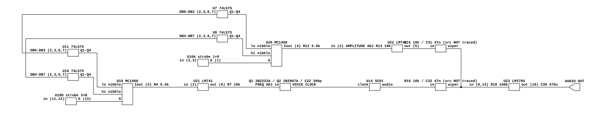

# Q*Bert's sound board output stage

How the Gottlieb System 80 Sound/Speech board gets from its two MC1408 DACs and
its Votrax SC-01 to the cabinet speaker. Read for
`phosphor-emulator-discrete-sound-fidelity-l5r3.10`, the project-wide audit. The
model is `machines/src/gottlieb.rs`.

## Provenance

| | |
|---|---|
| Drawing | `SOUND/SPEECH ASSY. (A6), SCHEMATIC DIAGRAM`, D. Gottlieb & Co. |
| Read from | `arcade-museum.com/manuals-videogames/Q/QBertInstructionManual483.pdf`, PDF p19 (manual pp27-29) |
| Also read | `PRIMARY POWER/FILTER BOARD/INTERCONNECTION DIAGRAM`, PDF p20 (manual pp30-32), for the cabinet side |
| Transcribed | 2026-08-31, from 150, 350 and 400 dpi renders |

Note the assembly is **A6**, not the A5 a first glance suggests, and the sound
schematic is a different sheet from the Logic Board A1 sheet 2 already cited for
this board's video in `phosphor-emulator-aih3`.

## What was already modelled, and is not a finding

`gottlieb.rs` is the furthest along of the boards this audit swept, and two of the
three things that look like gaps are already there:

- **Both MC1408s are accounted for.** U19 and U20 are each an 8-bit DAC fed by a
  pair of 74LS75 latches with its own write strobe (U10D off `3+B`, U10A off
  `1+9`). One is the audio DAC; the other steers the SC-01's clock. The model has
  `Mc1408Dac` for the first and treats the second as a clock-rate function,
  `VOTRAX_NOMINAL_CLOCK_HZ` 950 kHz at DAC centre `0xA0`, plus or minus 5.5 kHz
  per step.
- **The coupling capacitor after the sum** is modelled, as `output_coupling`, and
  its comment already reasons correctly that it belongs after the sum because it
  sits between the board and the amplifier.

## The board, at pin level

[`qbert-sound-output.json`](qbert-sound-output.json). **The two trimmers are
drawn with a source each, and that assignment is NOT established** -- the cells
say so. Everything else in the drawing is read off the sheet: the two latch pairs
with their separate strobes, both MC1408s, both LM741s, the voice-clock
oscillator, and the summing node into the LM379S.

## The finding: the mix is two trimmers and two couplings

None of the following is modelled.

The two sources do NOT arrive at the amplifier as a plain sum. Each gets its own
volume trimmer and its own coupling capacitor:

| leg | trimmer | coupling |
|---|---|---|
| one source | R15 10k pot, wiper out | C31 0.047 uF |
| the other | R16 10k pot, wiper out | C32 0.047 uF |

Both pots have their low end grounded. Both wipers pass through their capacitor
to a common node, and that node goes through **R18 100k** to U23 pins 14 and 9.

**U23 is an LM379S**, a dual power amplifier on +30 V, decoupled by C33 0.1 uF.
The output at pin 10 goes through **C36 470 uF 35 V** to `AUDIO OUT`. **R21 100k**
and **R22 2k** with **C37 4.7 uF** form the feedback network back to pin 8.

The cabinet then adds its own: the interconnection diagram puts a **100 ohm 2 W
volume control** on the service panel between the sound board's AUDIO OUTPUT and
a **4 ohm 5 W speaker**.

## What it establishes

- **The DAC-to-speech balance is set by two trimmers**, not by a constant.
  `fill_audio` currently scales the Votrax by a literal `32000.0` and adds it to
  the DAC samples. That number has no counterpart on the board; what the board
  has is R15 and R16, and the balance is wherever an operator last set them.
  This is a fitted constant standing where two parts are, which is the pattern
  this project keeps finding.
- **Each leg is AC-coupled separately, before the sum**, by C31 and C32. The
  model couples once, after the sum. Two 47 nF capacitors ahead of the mix are
  not the same filter as one capacitor behind it, and they act on the DAC and the
  speech independently.
- **There is a second amplifier section.** U23 is a dual and only one section's
  output was traced to AUDIO OUT.

## What it does NOT establish

- **Which source drives R15 and which drives R16.** Both pots' high ends run up
  the same region of the sheet and neither was traced back to its origin. Until
  that is done, "one is the DAC and one is the speech" is the obvious reading and
  not a checked one.
- **The corner of the C31 and C32 high-passes.** It depends on the wiper
  position and on the LM379S input impedance through R18, and neither was worked
  out. The capacitors are 47 nF; the resulting corner is somewhere in the tens of
  hertz for a mid-set wiper and rises as the wiper is turned down, so it is a
  filter that MOVES WITH THE VOLUME SETTING. That is worth checking before it is
  modelled as fixed.
- **What U21 and U22, the two LM741 analog inverters, do to the levels.** U21
  sits between one DAC and the voice-clock oscillator (Q1 2N2222A, Q2 2N2907A,
  C22 300 pF, with a FREQ ADJ trim); U22 sits with an AMPLITUDE ADJ trim, R13
  10k. The model's linear "plus or minus 5.5 kHz per DAC step" is a
  straight-line fit to whatever that transistor oscillator actually does, and
  this sheet has the parts to check it. Not done here.
- **Any measurement.** Nothing here was compared against a capture.

## Confidence

A clean scan. The output stage above was read at 350 dpi without ambiguity: every
designator, every value, and the topology of the two-trimmer sum.

The two things flagged above as untraced are untraced because following them
means walking the length of a large sheet, not because they were unreadable.

This is a hand transcription and can be wrong. Nothing in it is checked by a
test; the section above it is what keeps that honest.
