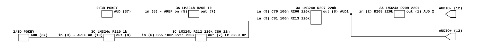

# Quantum's audio output

What Atari's Quantum PCB does between its two POKEYs and the cabinet. Read for
`phosphor-emulator-discrete-sound-fidelity-l5r3.10`, the project-wide audit. The
model is `machines/src/quantum.rs`.

**The two POKEYs do not reach the mixer through the same circuit.** One goes
buffer, coupling, mixer. The other goes buffer, coupling, *an extra inverting
stage that is a low-pass at 32.9 Hz*, coupling, mixer. So the second chip arrives
in opposite polarity and about 30 dB down at 1 kHz, where `quantum.rs` mixes the
pair with `(s0 + s1) * 0.5`.

That is a large claim and it is what the sheet shows. The design intent is not
established and this transcription does not guess at one; see the confidence
section for exactly which connections were checked and how.

## Provenance

| | |
|---|---|
| Drawing | `Quantum PCB Schematic Diagram`, Atari SP-221 sheet 9A, 1st printing, (c) Atari Inc. 1982, block `Audio Output` |
| Drawing | `Quantum Reg./Audio II PCB and Power Supply Diagrams`, SP-221 sheet 2A, carrying `Regulator/Audio II PCB` 035435-02 rev F |
| Read from | `arcade-museum.com/manuals-videogames/Q/quantum-sp221.pdf`, PDF pages 17 and 3, a 300 dpi scan |
| Transcribed | 2026-09-01 |

The package is 22 pages, stored rotated 270 degrees, and its sheet numbering is
regular: sheet 1A is page 1 and each side advances one page, so sheet 9A is page
17. The contents page calls sheet 9A `Color Memory and Output, Audio Output`, and
the audio is the lower right of the three boxes on it.

## What the model does today

`QuantumSystem::run_frame` drains two `Pokey`s, takes `(s0 + s1) * 0.5`, runs one
shared `DcBlocker` at the 10 Hz default, and scales by 2.

## The chain

[`quantum-audio-output.json`](quantum-audio-output.json).

## Both POKEYs get the same front end

The chips are `CO12294-01` at board positions 2/3B and 2/3D. Each `AUD` output on
pin 37 goes straight into an LM324 wired as a **transimpedance amplifier**: the
inverting input is the chip's only load, a feedback resistor of **1k** sets the
current-to-voltage conversion, and the non-inverting input is held at the net
`AREF`.

| chip | section | feedback | reference |
|---|---|---|---|
| 2/3B | 3A pins 6, 5, 7 | R205 1k | `AREF` on pin 5 |
| 2/3D | 3C pins 9, 10, 8 | R210 1k | `AREF` on pin 10 |

`AREF` is R204 220k up to +5 V with C78 0.1 uF to ground, and it drives nothing
but op-amp inputs on this sheet, so it computes to +5 V.

This is the same idea as Star Wars, which also lands each POKEY on a virtual
ground through a 1k, and unlike Missile Command, Tempest and Food Fight, which
all load pin 37 with a resistor to +5 V and a capacitor to ground. **There is no
load filter here at all**: the POKEY sees a virtual ground, and the only shunt
capacitor Star Wars has across its 1k is absent.

## One of the two is band-limited to below 33 Hz

From here the two paths diverge, and this is the finding.

**2/3B, the short path.** Output pin 7, then **C79 0.1 uF into R206 220k**, which
is one leg of the mixer. One high-pass, at **7.23 Hz**. Two inversions in total,
counting the mixer, so it arrives non-inverted.

**2/3D, the long path.** Output pin 8, then **C55 0.1 uF into R211 220k** and a
*second* inverting stage at 3C pins 6, 5, 7, whose feedback is **R212 220k in
parallel with C80 0.022 uF** and whose non-inverting input is grounded. Its
output at pin 7 goes through **C81 0.1 uF into R213 220k**, the mixer's other leg.

That second stage is a first-order low-pass:

- passband gain `-R212/R211` = **-1**
- low-pass corner `1 / (2*pi*R212*C80)` = **32.88 Hz**
- high-pass corner from the input, `1 / (2*pi*R211*C55)` = **7.23 Hz**

so the stage passes a band roughly 7 Hz to 33 Hz flat and rolls off at 6 dB per
octave above it. Against the other chip's path, chip 2/3D therefore arrives:

| frequency | 2/3D relative to 2/3B |
|---|---|
| 100 Hz | **-10.1 dB** |
| 440 Hz | **-22.5 dB** |
| 1 kHz | **-29.7 dB** |
| 4 kHz | **-41.7 dB** |

**and in opposite polarity**, because its path carries three inversions where the
other carries two.

The model gives both chips 0.5 at every frequency and the same sign.

## The mixer and the antiphase pair

One LM324 section at 3A pins 9, 10, 8 does the summing: **R207 220k** feedback,
non-inverting input **grounded**, and the two legs R206 and R213 both **220k**, so
each path arrives at `-1`. Which pin is which was checked at pixel level: the two
legs and the feedback all land on pin 9, marked `-`, and pin 10, marked `+`, goes
straight to ground.

The output is `AUD1`, leaving on connector pin 13 as `AUDIO +`. A further section
at 3A pins 2, 3, 1 inverts it through **R208 220k** with **R209 220k** feedback,
giving `AUD 2` on pin 12 as `AUDIO -`.

Unlike Food Fight, **this antiphase pair is symmetric**: there is no coupling
capacitor in the inverting leg, so both connector pins carry the same band.

## The Regulator/Audio II PCB

035435-**02** rev **F**, one revision later than Tempest's rev E. The audio half
is component for component the circuit transcribed in
[`atari-pokey-audio-output.md`](atari-pokey-audio-output.md), and its output
coupling capacitors C9 and C10 are **3300 uF**, which into a nominal 8 ohm
speaker is a high-pass at **6.0 Hz**. Two channels, two speakers, and the model
is mono.

This is the third game in the sweep on that board. The set is tabulated under
[`foodf-audio-output.md`](foodf-audio-output.md), which is also where the six
different POKEY interfaces are collected.

## What it establishes

- **The two POKEYs are not mixed equally and are not in phase.** Chip 2/3D passes
  through an extra inverting stage that is a low-pass at 32.88 Hz, so it reaches
  the mixer inverted and about 30 dB down at 1 kHz. `(s0 + s1) * 0.5` is wrong in
  balance, in polarity and in spectrum, and no single constant can express it.
- The **mixer legs themselves are equal**, R206 and R213 both 220k into R207 220k,
  so the asymmetry is entirely in the extra stage and not in the summing network.
- **Each POKEY is loaded by a transimpedance amplifier at a virtual ground** with
  1k of feedback, which is the Star Wars interface rather than the Missile
  Command, Tempest and Food Fight one. There is no load filter on pin 37.
- Every coupling in the path is 0.1 uF into 220k, so **every high-pass on the
  board is at 7.23 Hz**, where the model has one `DcBlocker` at 10 Hz.
- **The board emits an antiphase pair** on connector pins 13 and 12, symmetric
  between the two, into two independent channels and two speakers on a
  Regulator/Audio II PCB. The model is mono.

## What it does NOT establish

- **Which of the model's `pokey[0]` and `pokey[1]` is 2/3D.** `pokey[0]` is at
  0x840000 and `pokey[1]` at 0x840020, and the chip selects were not traced back
  from 2/3B and 2/3D. **Here it matters**, because it decides which chip loses its
  top four octaves, unlike Food Fight and Crystal Castles where the two paths are
  identical. It is the first thing anyone implementing this has to settle, and it
  is the same question BurgerTime and Star Wars left open.
- **The design intent of the low-pass.** Nothing on the sheet says why one chip is
  band-limited, and no attempt was made to infer it from what the game plays.
- **`AREF`, and a supply label that does not add up.** `AREF` computes to +5 V
  from R204 alone, and package 3C is drawn with **+5 V on pin 4** and -15 V on pin
  11. An LM324 cannot hold its non-inverting input at its own positive rail, so
  one of those two readings is wrong or something off this sheet loads `AREF`.
  Both were read at high magnification and are what the drawing shows. Worth
  noting that Crystal Castles uses the same `AREF` scheme on a +12 V supply, where
  a +5 V reference is unremarkable, which is weak evidence that Quantum's pin 4
  label is the error. This was not resolved and it does not change any AC result
  above.
- **The transimpedance stages' output impedance and headroom**, for the same
  reason.
- **Whether the speakers are 8 ohms.** Not on either sheet, and the 6.0 Hz scales
  with it.
- **Any measurement.** Nothing here has been compared against a capture.

## Confidence

A 300 dpi scan, clean, and every resistor and capacitor value above was read
without ambiguity at moderate magnification. Three things were checked
specifically at pixel level, because the whole finding rests on them.

- **That C80 is in parallel with R212 and not somewhere else.** Both of C80's
  leads run back to the same two nodes R212 spans, pin 6 and pin 7. A capacitor
  from pin 6 to ground would be a different circuit and no low-pass.
- **That the mixer sums into pin 9 and grounds pin 10.** The two 220k legs and the
  220k feedback all meet at one dot on pin 9, marked `-`; pin 10, marked `+`, has
  a bare ground symbol.
- **That the +5 V rail crosses the first 3C section's output without joining it.**
  Two verticals pass within 100 pixels of the pin 8 output line at full scale: one
  is the R210 feedback dropping onto it with a large dot, the other is the pin 4
  supply on its way to the decoupling capacitor C94 and crosses cleanly. Read the
  other way the supply would short to an op-amp output, which is what prompted the
  check.

This is a hand transcription and can be wrong. Nothing in it is checked by a
test; the section above it is what keeps that honest.
