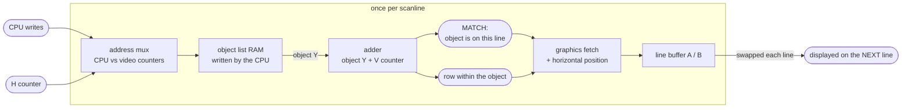

# How a sprite circuit gets its object list

Whether the video hardware reads the object list as the beam scans, or from a
copy taken once at vblank. Nine boards, one architecture, and the answer is the
same on all of them.

**Derives:** the W3 table in
[`raster-sampling-fidelity.md`](../designs/raster-sampling-fidelity.md).
**Settles:** whether per-scanline sprite rendering from live RAM would introduce
tearing a cabinet never shows. It would not, on any board read here.

This is one file rather than nine because it is one behaviour. Each board gets
its own provenance and its own parts, because each was read separately and any
of them can be wrong on its own.

## The shape they all share

Every board below is built from the same four stages. The chips differ, the
names differ, the order of the object list differs; the structure does not.

The address mux is what settles the question, where it was read: on `foodf`,
`btime` and `mrdo` the object list RAM's address is multiplexed between the CPU
bus and the **horizontal** counter, so the list is walked once per scanline in
step with the beam. On `namco_galaga` the mux is inside the Namco 04XX, whose
inputs are the same horizontal timing. `mcr2` is the exception and is described
in its own section: its mux takes `H3..H8` plus three vertical bits, which
spreads a copy of the list across eight scanlines rather than walking it in one.
On `gottlieb`,
`atari_system1`, `namco_pac` and `mario_bros` the mux was not traced, and the
per-line conclusion rests on the stage after it instead: an adder against the
vertical counter, or a line buffer that has to be refilled every line.

What is absent is as much of the finding as what is present. No board here has a
DMA engine on the object path, a transfer counter driven by the vertical timing,
or a register that triggers a copy. There is nowhere for a vblank capture to
happen.

The consequence for the emulator: sprite state is sampled per scanline, one line
ahead of where it is displayed. Per-scanline rendering from live RAM is correct;
a vblank snapshot is not.

---

## Food Fight (`foodf`)

### Provenance

| | |
|---|---|
| Drawing | SP-229 Food Fight schematic package, 2nd printing, sheets 7B, 8A, 8B |
| Read from | `arcarc.xmission.com/PDF_Arcade_Atari_Kee/Food_Fight/Food_Fight_SP-229_2nd_Printing.pdf`, PDF pages 14, 15, 16 |
| Transcribed | 2026-08-28, from a 70 dpi render (legible; the sheets are sparse) |

The three sheets are titled, in the drawing's own words, "Food Fight Motion
Object RAM", "Food Fight Vertical Position" and "Food Fight Motion-Object ROM".
This board is the clearest of the nine and is the one to read first.

### Parts

| Ref | Part | Role |
|---|---|---|
| 6C, 6D, 6E, 6F | 137250-001 | motion-object RAM, 128 words x 16 bits |
| 6H, 6J | 74LS157 | object RAM address mux, CPU vs video |
| (sheet 8A) | 74LS283 x2 | object Y + V counter |
| 3C | 74LS174 | latches MATCH and the object row |
| (sheet 8A) | 74LS157 x2 | odd/even line buffer control |
| (sheet 8A) | 74LS74 | 1VX, the odd/even line select |
| 4D, 4E | 136020-xxx | motion-object graphics ROM |
| (sheet 8B) | 74LS299 x2 | pixel shift registers, loaded at HLOAD- |

### Nets

| Net | Pins |
|---|---|
| `2H` | 6H.1B |
| `8H` | 6H.4B |
| `16H` | 6H.2B |
| `32H` | 6H.3B |
| `64H` | 6J.1B |
| `128H` | 6J.4B |
| `256H` | 6J.2B |
| `BA1`..`BA4` | 6H.1A, 6H.4A, 6H.2A, 6H.3A |
| `BA5`..`BA7` | 6J.1A, 6J.4A, 6J.2A |
| `OBJRAM-` | 6H.1, 6J.1 (mux select) |
| `BRA/W-` | 6J.3A (the write line is muxed with the address) |
| `MOD0`..`MOD7` | sheet 8A adder A inputs |
| `1V`..`128V` | sheet 8A adder B inputs |
| `MATCH` | 3C output, into sheet 8B's LS21 with 1H, 2H, 8H |
| `ODDLD-`, `ODDCLR-`, `EVENLD-`, `EVENCLR-` | sheet 8A LS157 outputs |
| `ODDCLK`, `EVENCLK`, `ODDCS-`, `EVENCS-` | sheet 8A LS157 outputs |

### What it establishes

- The object RAM address on the video side is `{256H, 128H, 64H, 32H, 16H, 8H,
  2H}` and nothing else. No vertical counter bit reaches it. The list is
  therefore walked in full once per scanline.
- The CPU-side and video-side pin pairs give the bit correspondence
  `BA1<->2H, BA2<->8H, BA3<->16H, BA4<->32H, BA5<->64H, BA6<->128H,
  BA7<->256H`. Since address bit 0 is `2H` and bit 1 is `8H`, the address is
  `((H>>3)<<1) | ((H>>1)&1)`: each two-word object entry holds the bus for eight
  H clocks. 64 objects x 8 = 512, one full horizontal period.
- Vertical selection is arithmetic, not a comparison: two LS283s add the
  object's Y to the V counter, the carry structure gives MATCH, and the low sum
  bits give the row within the object (XORed with VFLIP).
- There are two line buffers, and their load/clear/clock/select lines are split
  odd/even off `1VX`. One is written while the other is displayed.

### What it does NOT establish

- The line buffer RAMs themselves were not located; the odd/even control lines
  leave sheet 8A and were not followed. That two buffers exist is read from the
  signal names, not from the chips.
- The reference designators on sheet 8A were not legible at the zoom used, so
  the adders and muxes there are cited by part number and function only.
- Nothing here says how many objects can be displayed on one line, or what
  happens when the line buffer overflows.

---

## Galaga / Dig Dug / Xevious (`namco_galaga`)

### Provenance

| | |
|---|---|
| Drawing | Galaga Video P.C. A084-91408-B508, sheet 7-7; Galaga CPU P.C. A084-91404-C508 |
| Read from | `arcade-museum.com/manuals-videogames/G/galaga3.pdf`, PDF pages 14 and 15 |
| Transcribed | 2026-08-28, from 150 and 400 dpi renders |

The video board is the two-page drawing at manual sheet 7-7 (PDF pages 14, 15);
pages 21 to 24 are the CPU board and do not carry the object circuit. This
tripped up the first pass.

### Parts

| Ref | Part | Role |
|---|---|---|
| 1H | Namco 04XX | object address generator: takes MATCH, HSYNC, 1H, 2H |
| 1L | Namco 00XX | tilemap address mux: CPU vs 8V..128V and FLIP |
| 1K | TMM2016 | 2K tilemap VRAM, addressed by the 00XX |
| 3L, 3J, 3F (sheet left) and 3K, 3H, 3E (sheet right) | 2114 | the three 1K shared RAM banks; sprites live at +0x380. Which half pairs with which is inferred from the bank layout, not traced |
| 3D, 3C | 74LS283 | object Y + V counter, feeding MATCH at 2B |
| 4F | MB8532 | object graphics ROM |
| 4H | Namco 02XX | object graphics shifter |
| 4M | Namco 05XX | starfield generator (not part of this path) |

### Nets

| Net | Pins |
|---|---|
| `MATCH` | 1H.8 (input) |
| `HSYNC` | 1H (input, pin not legible) |
| `1H`, `2H` | 1H inputs |
| `AB0A`..`AB6A` | 1H.13, .12, .11, .10, .8, .9, .7 -> Buffer Address Bus "A" |
| `VRST`, `HRST` | 1H outputs |
| `OBJON` | 1H.7 area output |
| `16H*`, `8H*`, `4H*` | 1H.6, .5, .4 |
| `16V`, `64V`, `32V`, `8V` | 3D.A4, .A3, .A2, .A1 |
| `8V`, `4V`, `2V`, `1V` | 3C.A4..A1 |
| `AB0`..`AB10` | 1L outputs -> 1K address |

### What it establishes

- Sprite addressing and tilemap addressing are separate circuits. The 00XX
  drives the tilemap VRAM from the CPU or from the V counters; the 04XX drives
  the low seven bits of the buffer address bus, which is exactly the 128-byte
  sprite window at the top of each 1K bank.
- The 04XX's inputs are `MATCH`, `HSYNC`, `1H` and `2H`: it is sequenced by the
  video timing and by the result of the vertical comparison, once per line.
- The vertical comparison is the same two-LS283 adder as Food Fight's.

### What it does NOT establish

- The line buffer was not found. MAME's `galaga_v.cpp` compensates with
  `sy = 256 - spriteram_2[offs] + 1` and the comment "sprites are buffered and
  delayed by one scanline", which is consistent with one existing, but the
  chips were not located on the sheet and the 02XX is a custom whose internals
  are not on the drawing.
- **Dig Dug and Xevious were not read.** They share the board family and MAME
  treats their sprite RAM identically (Dig Dug carries the same one-scanline
  comment). That is an argument from family resemblance, not a transcription.

---

## Burger Time (`btime`)

### Provenance

| | |
|---|---|
| Drawing | Burger Time CPU/DATA PCB A084-91441-E355, sheet 9-5 |
| Read from | `archive.org/items/arcademanual_BurgerTime/BurgerTime.pdf`, PDF pages 74 and 75 |
| Transcribed | 2026-08-28, from a 300 dpi render |

Sheet 9-5 spans two PDF pages: 74 is the CPU and the map RAM address path, 75
is the video ROM path and the object circuit.

### Parts

| Ref | Part | Role |
|---|---|---|
| 10D, 9C | 2114 | map RAM (the CPU's video RAM; sprite attributes live in it) |
| (refs not read) | 74LS153 x5 | map RAM address mux, CPU vs H and V counters |
| 3F, 4F | 74LS163 | object horizontal position counter, loaded from `P0`..`P7` |
| (refs not read) | 74LS86 x8 | `AP0`..`AP7`, the counter XORed with 3H/4H for flip |
| 3J, 4J, 8J | 93425 | object line buffer, 3 bits per pixel |
| 13K, 16K, 9K, 7K, 10K, 12K | 2732 | character/object graphics ROM |
| (refs not read) | 74LS194 x8 | pixel shift registers |

### Nets

| Net | Pins |
|---|---|
| `80H`, `40H`, `20H`, `10H`, `8H`, `4H` | LS153 video-side inputs (sheet 74) |
| `80V`, `40V`, `20V`, `10V`, `8V`, `4V` | LS153 video-side inputs (sheet 74) |
| `A0`..`A9` | LS153 CPU-side inputs |
| `M0`..`M9` | LS153 outputs -> Map RAM Address Bus |
| `P0`..`P7` | Buf Map Ram Data Bus -> 3F.D..A, 4F.D..A |
| `8H` | 3F.CLK, 4F.CLK |
| `AP0`..`AP7` | LS86 outputs -> 3J, 4J, 8J address |
| `INV`, `BLK2` | LS00 -> the 8H gate that opens the object window |

### What it establishes

- The map RAM address is muxed between the CPU and the H and V counters, so the
  CPU's video RAM is read by the video hardware as the beam scans it.
- Sprite attributes are not in a separate RAM: MAME reads them out of
  `m_videoram` at stride 0x20, and the schematic agrees that there is only one
  RAM here.
- Horizontal placement is a loadable counter, not a comparator: the object's X
  is loaded into 3F/4F and the count addresses the line buffer. That is the
  signature of a line-buffer design.
- The line buffer is three 93425s: 256 addresses, 3 bits per pixel, which is
  Burger Time's sprite depth.

### What it does NOT establish

- Which H window the eight sprite entries are fetched in. The `INV`/`BLK2` gate
  into 8H is the obvious candidate and was not traced.
- The buffer swap. Only one bank of 93425s was found, so whether the second is
  elsewhere on the sheet or the design reads and writes the same buffer at
  different points in the line is not established.

---

## Mr. Do! (`mrdo`)

### Provenance

| | |
|---|---|
| Drawing | Mr. Do! 8201 main PCB, the object sheet |
| Read from | `arcade-museum.com/manuals-videogames/M/mrdo_2.pdf`, PDF page 10 |
| Transcribed | 2026-08-28, from a 300 dpi render |

Four schematic sheets, PDF pages 7 to 10; page 10 is the object circuit.

### Parts

| Ref | Part | Role |
|---|---|---|
| A6, B6 | 6148P | sprite RAM, 256 bytes (the CPU's write-only 0x9000 window) |
| A5, B5, C5, D5 | 74LS153 | sprite RAM address mux, CPU vs the scan counter |
| (ref not read) | 74LS393 | the scan counter, clocked from HA |
| H6, H7 | 74LS283 | object Y + vertical counter |
| A8, B8 | 6148 | RAM on the object path |
| F8, G8 | 6148 | RAM on the object path |
| (refs not read) | 74LS157, 74LS244 | output path to the colour PROMs |
| (refs not read) | S288 | colour PROMs |

### Nets

| Net | Pins |
|---|---|
| `A0`..`A7` (CPU) | A5, B5, C5, D5 `1C0`/`2C0` inputs |
| `*PAD0`, `*PAD1` | mux select inputs |
| `PAD0`..`PAD7` | mux outputs -> A6, B6 address |
| `OB0`..`OB7` | A6, B6 data -> the object registers |
| `RB0`..`RB7` | LS273 outputs -> H6, H7 adder A inputs |
| `VA`, `VB`, `VC`, `VD` | H6, H7 adder B inputs |
| `HA`, `HX`, `HBL`, `VBL` | timing into the LS393 and the buffer control |

### What it establishes

- The sprite RAM address is muxed between the CPU address bus and a free-running
  counter clocked from the horizontal timing. The CPU cannot read this RAM at
  all (MAME maps it `writeonly`), which is what a design does when the RAM is
  the video hardware's to read.
- The same LS283 vertical adder appears again.
- Two pairs of 6148s sit on the object output path, which is a line buffer's
  shape.

### What it does NOT establish

- Which pair of 6148s is the line buffer and which is something else, and how
  the two are alternated. Both pairs were read as chips, not as a traced path.

---

## Satan's Hollow / MCR II (`mcr2`)

### Provenance

| | |
|---|---|
| Drawing | Schematic Video Gen A084-91399-A941, Midway, sheet 9-8 |
| Read from | Satan's Hollow Parts and Operating Manual, PDF page 104 |
| Transcribed | 2026-08-28, from a 400 dpi render |

The drawing carries functional block labels, which is unusual and makes it the
easiest of the nine to read at the block level and the hardest to read at the
pin level (it is dense and the scan is soft).

### Parts

| Ref | Part | Role |
|---|---|---|
| L6, K6 | 2114 x2 | **staging RAM**: the CPU's 512-byte sprite RAM |
| C7, M7, N7 | 74LS157 | staging RAM address mux, CPU vs video counters |
| N5 | 74LS245 | bidirectional buffer to the CPU data bus |
| M5, K5, + 2 (refs not read) | 93422 | **object RAM**: 256 x 16, the hardware's copy of the list |
| N4, L4 | 74LS283 | object Y + DV counter, in the block marked "ADDRESS" |
| B4 + 1 (ref not read) | 93422 | **BUFFER RAM1**: 256 x 8 = 512 pixels x 4 bits |
| (refs not read) | 93422 | **BUFFER RAM2**: the second line buffer |
| D4 | 74LS273 | latch gated by `DV0`, selecting between the two buffers |
| (refs not read) | 74175, 74174, 74LS283 x3 | "OBJECT ADDRESS COUNTER" |
| (refs not read) | 74LS273 | "PICTURE NUMBER LATCH" |
| (refs not read) | 74161 | "BUFFER LOADING COUNTER" |

### Nets

| Net | Pins |
|---|---|
| `BuA0`..`BuA3` | C7.1A, .2A, .3A, .4A |
| `H3`, `H4`, `H5`, `H6` | C7.1B, .2B, .3B, .4B |
| `BuA4`..`BuA7` | M7.1A, .2A, .3A, .4A |
| `H7`, `H8`, `DV0`, `DV1` | M7.1B, .2B, .3B, .4B |
| `BuA8` | N7.1A |
| `DV2` | N7.1B |
| `SR0`..`SR8` | C7, M7, N7 outputs -> staging RAM address |
| `SRSEL`, `SRWR` | N7.2Y, .3Y |
| `OR0`..`OR7` | object RAM address, from a second LS157 bank on `H3`..`H6` or from `OAC0`..`OAC7` |
| `DV0` | D4.CLR, the buffer swap |
| `OAC0`..`OAC9` | object address counter outputs |
| `EOPAC`, `LDET`, `GATE`, `MCLR` | counter control circuit |

### What it establishes

- There are three RAMs in the path, not one: a staging RAM the CPU writes, an
  object RAM the display walks, and two line buffers.
- The staging RAM's video-side address is `{H3..H8, DV0, DV1, DV2}`: 64 bytes
  per scanline, so the whole 512-byte list is transferred into the object RAM
  every eight scanlines, continuously, with no vblank trigger anywhere in it.
- The object RAM address is muxed the same way, which is what makes the transfer
  a transfer: the two RAMs are addressed identically while it runs.
- The line buffers alternate on `DV0`, the vertical counter's least significant
  bit. Along with System 1's `ACS`/`BCS`, that is one of only two boards here
  where the buffer swap is read directly rather than inferred.

### What it does NOT establish

- **The direction of the staging-to-object transfer is inferred**, from the
  chip types (2114 for the CPU-visible RAM, fast 93422 for the display's) and
  from the shared addressing. The data path between them was not traced.
- `DV2` at N7.1B is the least certain glyph on any of these sheets; it is read
  as a 2 and it makes the address a clean nine bits, but the scan is soft. If
  it were `DV7` the refresh cycle would be different (and strange).
- The object address counter's sequencing, and hence how many objects can appear
  on one line, was not worked out.

---

## Q*bert (`gottlieb`)

### Provenance

| | |
|---|---|
| Drawing | Logic Board Assy. (A1) Schematic Diagram, sheet 2 of 3 |
| Read from | `arcade-museum.com/manuals-videogames/Q/QBertInstructionManual483.pdf`, PDF page 16 |
| Transcribed | 2026-08-28, from a 300 dpi render |

Gottlieb labelled the functional blocks on the drawing, in the same style as
Midway's video gen sheet, and the scan is much better. The block names below are
the drawing's own.

### Parts

| Ref | Part | Role |
|---|---|---|
| E4 | 93419 | "FOREGROUND VERT POSITION REGISTER": the object Y table |
| E1-2 | 93415 | "FOREGROUND HORIZ POSITION REGISTER" |
| E2-3 | 93415 | "FOREGROUND OBJECT SELECT REGISTER" |
| F5, E5 | 74LS283 | "VERT POSITION SELECT": object Y + V counter |
| E6, J8 | 74LS30, 74LS32 | "LINE RAM ENABLE PULSE GENERATOR" |
| G6, G8 | 74LS161, 74LS74 | "LINE RAM ADDRESS COUNTER" |
| H1..H4 | 74S189 | "LINE OBJECT POSITION RAM" |
| J1..J6 | 74S189 | "LINE OBJECT SELECT RAM" |
| G3, G4, G5 | 74LS157 | "LINE OBJECT SELECT RAM MUX" |
| G1, G2, G7, G9 | 74S157 | 2:1 muxes on the position data |
| A6, A7 | 74S157 | "FOREGROUND ADDRESS" mux |

### Nets

| Net | Pins |
|---|---|
| `D0`..`D7` | E4.D0..D7 (CPU data) |
| `FORA0`..`FORA5` | E4.A0..A5 (foreground object index, 64 objects) |
| `FOY0`..`FOY7` | E4.Q0..Q7 -> F5.A1..A4, E5.A1..A4 |
| `VV0`..`VV7` | F5.B1..B4, E5.B1..B4 |
| `FRBD0`..`FRBD3` | F5.S1..S4 -> G5 mux |
| `VBLANK`, `HBLANK` | E6.11, E6.6 |
| `ENBUF` | E6 output |
| `HCLK` | G6.CLK |
| `HBLANK` | G6.LD |
| `ENVOR`, `ENHOR`, `ENPOR` | register write enables from the CPU side |

### What it establishes

- The object Y table is a RAM addressed by a 6-bit object index, and its output
  is added to the vertical counter every line. `ENBUF` (from the adder sums
  gated with VBLANK and HBLANK) is the per-line "this object is on this line"
  pulse.
- The drawing names a **line** object select RAM and a **line** object position
  RAM, driven by a line RAM address counter clocked at HCLK and loaded at
  HBLANK. The nomenclature is the hardware saying, on the drawing, that its
  object list is rebuilt per line.

### What it does NOT establish

- Sheet 1 was not read.
- Whether the line RAM on sheet 2 is double buffered. The line *buffer* on sheet
  3 is: two 93422s, one written while the other is read.

Sheet 3, the enable pulse E6 generates, and what the position constants are made
of were read later, in
[`qbert-object-enable.md`](qbert-object-enable.md).

---

## Pac-Man / Ms. Pac-Man (`namco_pac`)

Read for completeness: these boards already render per scanline and nothing
here changes them.

### Provenance

| | |
|---|---|
| Drawing | Pac-Man game logic PCB, manual sheet page 32 |
| Read from | `arcade-museum.com/manuals-videogames/P/pac-man_p2.pdf`, PDF page 2 |
| Transcribed | 2026-08-28, from a 300 dpi render |

### Parts

| Ref | Part | Role |
|---|---|---|
| 3F, 3H (read at low zoom only) | 74LS89 or 82S25 | sprite position RAM, 16 x 4 (the 0x5060 window) |
| 2F, and the chain below it | 74LS283 | object Y + V counter |
| 3E | 74LS20 | `MATCH` |

### Nets

| Net | Pins |
|---|---|
| `DR4`..`DR7` | 2F.B1, .B2, .B3, .B4 |
| `16V`, `32V`, `64V`, `128V` | 2F.A1, .A2, .A3, .A4 |
| `S1`..`S4` | 2F -> 3E inputs |
| `MATCH` | 3E.8 |

### What it establishes

- The same adder-against-the-vertical-counter structure, producing a signal the
  drawing itself calls `MATCH`. Pac-Man's sprite positions are compared per
  line, live.

### What it does NOT establish

- Everything downstream of `MATCH`. The graphics fetch and the buffer were not
  read.

---

## Atari System 1 (`atari_system1`)

The board this whole item was quarantined behind, on the belief that its motion
objects come from a list captured at vblank. They do not.

### Provenance

| | |
|---|---|
| Drawing | System I Main PCB Schematic Diagram, SP-277 1st printing, sheets 8B and 9A |
| Read from | `arcade-museum.com/manuals-videogames/A/Atari-System-1-SP277-1st-Printing.pdf`, PDF pages 16 and 17 |
| Transcribed | 2026-08-28, from a 400 dpi render |

Two false starts worth recording. The Marble Madness operator's manual carries
schematic package SP-276, which is a supplement covering the **cartridge PCB
only** (program ROM, video microprocessor ROM, bank-switch ROM and speech,
graphic palette select, and the playfield/motion-object graphic data
multiplexer). The motion-object engine is not in it: it is on the System 1
motherboard, and the motherboard is SP-277. Second, SP-277's sheets are titled
only "System I Main PCB Schematic Diagram" from 4B to 9B; the useful names are
the block labels inside each drawing, not the title block.

### Parts

| Ref | Part | Role |
|---|---|---|
| 3L, 4L | 2149-2 | line buffer **A**, 1K x 8 |
| 1L, 2L | 2149-2 | line buffer **B**, 1K x 8 |
| 2J, 2H, 2F | 74S163 | buffer A address counter, loaded from the object's X |
| 1J, 1H, 1F | 74S163 | buffer B address counter |
| 3J | 74LS273 | latches `VRD5`..`VRD13`, the object horizontal position |
| 3M, 2M | 74LS244 | buffer read-back, gated by `PADB` |
| 3K | 74S374 | `MPX0`..`MPX7`, the motion-object pixel out |
| 6A, 1K | 74LS74 | `T1` and the buffer-select flip-flops |

### Nets

| Net | Pins |
|---|---|
| `VRD5`..`VRD13` | 3J.D inputs |
| `4HDD` | 3J.CK, 6A.CK, 1K.CK |
| `LDA` | 2J.LD, 2H.LD, 2F.LD |
| `LDB` | 1J.LD, 1H.LD, 1F.LD |
| `CLRA` | 2J.CLR, 2H.CLR, 2F.CLR |
| `CLRB` | 1J.CLR, 1H.CLR, 1F.CLR |
| `MCKR` | S163 clocks; also 3L, 4L, 1L, 2L `WE` |
| `ACS` | 3L.CS, 4L.CS |
| `BCS` | 1L.CS, 2L.CS |
| `MOSR0`..`MOSR7` | line buffer data -> 3M, 2M |
| `MPX0`..`MPX7` | 3K.Q |

### What it establishes

- Sheet 9A is titled, on the drawing, **"Motion Object Horizontal Line Buffer"**,
  and sheet 8B carries **"Motion Object Horizontal Line Buffer Control"** beside
  the "Motion Object/Playfield Graphic Address Generator". The System 1 motion
  object path is a line buffer. There is no frame store in it and no DMA engine
  feeding one.
- The buffer is doubled: two independent 1K x 8 2149-2 pairs with separate chip
  selects `ACS`/`BCS`, separate load and clear lines `LDA`/`LDB` and
  `CLRA`/`CLRB`, and separate address counters. One is written while the other
  is read.
- Horizontal placement is a counter loaded from the object's X (`VRD5`..`VRD13`
  through 3J), the same shape as Burger Time and Mario Bros.

### What it does NOT establish

- The motion-object list RAM's own address path was not traced; sheet 8B's
  graphic address generator was seen at the block level only. That the list is
  read per line follows from the line buffer having to be filled per line, not
  from a mux that was read.
- The SLIP (scanline pointer) mechanism, which is what makes System 1's list
  per-band rather than one flat list, is not on either sheet read.

### Agreement with the reference driver

MAME's `atarisy1_v.cpp` says the same thing in a comment at `spriteram_w`:

> if we're about to modify data in the active sprite bank, make sure the video
> is up-to-date. Road Runner needs this to work; note the +2 kludge -- +1 would
> be correct since the video renders the next scanline's sprites to the line
> buffers, but Road Runner still glitches without the extra +1

and forces `update_partial(vpos + 2)` on any mid-frame write to the **active**
bank. Writes to the inactive bank do nothing to the display, which is how the
games double-buffer: in software, by rebuilding the other bank and swapping. A
software double buffer is not a hardware latch, and it does not make a vblank
snapshot correct: a write to the *active* bank mid-frame changes what the beam
draws from the next line on.

---

## Mario Bros (`mario_bros`)

Read for completeness. Nintendo's TMA1 board, and the same family as the TKG-04
boards (`dkong`, `dkongjr`), which were not read.

### Provenance

| | |
|---|---|
| Drawing | TMA1-VIDEO SCHEMATIC, sheet F |
| Read from | `arcade-museum.com/manuals-videogames/M/MarioBros.pdf`, PDF page 48 |
| Transcribed | 2026-08-28, from a 300 dpi render (the sheet is printed rotated) |

### Parts

| Ref | Part | Role |
|---|---|---|
| 5M, 4M | 74LS163 | object horizontal position counter, loaded from `HPO0`..`HPO7` |
| 4S, 5S | 74LS157 | `OVID0`..`OVID2`, `OCOL0`..`OCOL3` select onto the `OBJ` path |
| 5J, 5K | 74LS161 | vertical counter |
| 7J, 6J | 74LS175 | `1VFC`..`128VFC`, the flipped vertical counter |

### Nets

| Net | Pins |
|---|---|
| `HPO0`..`HPO7` | 5M.A..D, 4M.A..D |
| `OBJ0`..`OBJ2` | 6S gate -> the 157 select |
| `OVID0`..`OVID2`, `OCOL0`..`OCOL3` | 4S, 5S inputs |

### What it establishes

- The same loadable horizontal position counter as Burger Time and System 1: the
  object's X goes into a counter, and the counter walks the object across the
  line. Live, per line.

### What it does NOT establish

- Almost everything else. One quadrant of a four-quadrant sheet was read, the
  buffer was not found, and the other three quadrants were not.
- **Donkey Kong and Donkey Kong Jr. were not read at all.** Note that MAME's
  `dkong.cpp` documents an 8257 DMA copying sprite data from 0x6900 to the
  sprite banks at 0x7400. That is a CPU-commanded copy into the list, the
  same category as System 1's bank swap, not the video circuit latching what it
  reads.
