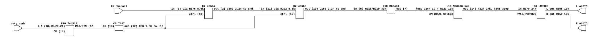

# The Super Sound I/O board's analog output

What Bally Midway's Super Sound I/O board does between its two AY-3-8910s and
the cabinet. Read for `phosphor-emulator-discrete-sound-fidelity-l5r3.10`, the
project-wide audit. The model is `core/src/device/ssio.rs`, used by Satan's
Hollow through `machines/src/mcr2.rs`.

## Provenance

| | |
|---|---|
| Drawing | `SCHEMATIC DRAWING, SUPER SOUND I/O`, `A084-90913-E000`, sheet 9-15, Midway Mfg. Co. |
| Read from | `arcade-museum.com/manuals-videogames/T/Tron.pdf`, PDF p128 |
| Transcribed | 2026-08-31, from 150 and 400 dpi renders |

**Read from Tron's manual, not Satan's Hollow's.** The Super Sound I/O is shared
across MCR II, so any manual carrying the board carries the same drawing.
`phosphor-emulator-aih3` cites it as "Super Sound I/O sheet 9-10", which is the
sheet number in the Satan's Hollow package; in Tron's it is 9-15, and no Satan's
Hollow scan was located. Sheet numbers in these manuals are per-package and are
not a stable way to name a drawing.

Also on the same sheet and NOT part of this board: Tron's sheet 9-7 is a separate
`DUAL POWER AMP` assembly, `A082-90910-E000`. That is the cabinet amplifier
downstream of everything here.

## The per-channel chain

[`ssio-audio-output.json`](ssio-audio-output.json). One of six identical
channels, three per AY-3-8910.

**THE DUTY-CYCLE VOLUME IS AN ANALOG CHOPPER.** The sound CPU loads a 74LS191
counter (F8, F9, F10 for one AY) with four bits; the counter's output drives a
7407 open-collector buffer with a 1.8k pull-up to +12, and that gates a pair of
4016/4066 analog switch sections in series with the AY channel's audio. The
channel arrives through a 5.6k resistor, passes the first switch into a 2.2 nF
capacitor to ground, through another 5.6k, through the second switch, into a
second 2.2 nF capacitor.

So the attenuation is pulse-width modulation of the audio itself, smoothed by two
RC sections at roughly 5.6k and 2.2 nF each. `ssio.rs` implements this as
`DUTY_CYCLE_VOLUME`, a sixteen-entry lookup applied as a digital gain. That is
the chopper's AVERAGE and not its behaviour: a lookup has neither the smoothing
nor whatever the chopping leaves behind.

Each channel then goes through an MC3403 section (marked `3403`) with 33k
resistors on both legs.

## The mix

The six channel outputs are AC-coupled by 1 uF capacitors (C162, C163, C164 and
their counterparts) and enter a summing MC3403 section through **13k** legs
(R220, R221, R222, R223), with **R224 27k** and **C165 330 pF** as its feedback.
An `OPTIONAL SPEECH` input joins the same node. The sum leaves through R179 24k
and R404 33k.

`ssio.rs` mixes as `(s0 + s1) / 2`: a plain average of the two chips' already
summed outputs. The board sums six channels through equal 13k legs into a 27k
feedback, which is a different arithmetic and carries a 330 pF pole the average
does not.

## The output is stereo, and the volume is remote

Downstream sit several LM3900 Norton sections (marked `3900`, D3) around a diode
network (D101-D107, 1N4148) with 680k and 100k resistors, an optional **VR1 1k
pot**, and three lines named **RV12, RVR and RVS** that leave on connector J3
alongside the audio. Those are remote volume controls: the cabinet sets the level
over the connector rather than on the board.

Connector J3 carries **`L AUDIO`, `L SHIELD`, `R AUDIO`, `R SHIELD`**, each audio
pin fed from its own LM3900 section through a 10k series resistor with 1.2k to
ground.

**The board's output is two channels.** `ssio.rs` produces one.

## What it establishes

- The duty-cycle volume is analog chopping with RC smoothing, modelled today as
  a digital lookup of its average.
- The six channels sum with defined weights through a 27k/330 pF amplifier, not
  as `(s0 + s1) / 2`.
- Each channel is AC-coupled by 1 uF before the sum.
- The board is stereo; the model is mono.
- Volume is a remote analog control over J3, not the boolean `mute` the model
  has.

## What it does NOT establish

- **Whether the two channels carry different content or the same signal split.**
  Both LM3900 sections were found and their output dividers read; neither was
  traced back to see what feeds it. Until that is done, "stereo" means two output
  pins, not necessarily two mixes.
- **What the D101-D107 diode network does.** It sits between the remote-volume
  lines and the output amplifiers and is most likely a DC-controlled attenuator,
  but that is an inference from its position and was not worked out.
- **The exact corner of the chopper's RC smoothing.** 5.6k and 2.2 nF gives
  roughly 12.9 kHz per section, but the switches' on-resistance and the following
  stage's input impedance both enter and neither was accounted for.
- **Whether Satan's Hollow's board revision matches Tron's.** Same part number
  family, but no Satan's Hollow drawing was seen.
- **Any measurement.** Nothing here has been compared against a capture.

## Confidence

A dense sheet read at 400 dpi. The per-channel chain and the summing network were
legible without ambiguity. The output section is legible but was read at block
level, and the two items flagged above are flagged because they need tracing
across the sheet rather than because they could not be read.

This is a hand transcription and can be wrong. Nothing in it is checked by a
test; the section above it is what keeps that honest.
