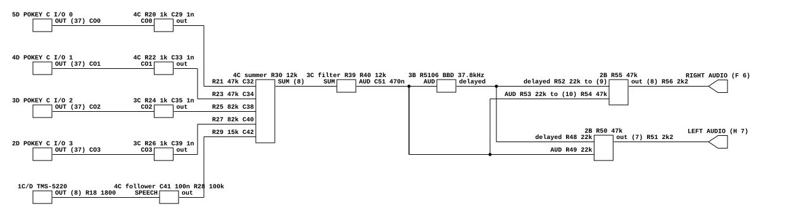

# Star Wars's audio output

What Atari's Star Wars Sound PCB does between its four POKEYs, its speech chip
and the cabinet. Read for `phosphor-emulator-discrete-sound-fidelity-l5r3.10`,
the project-wide audit. The model is `machines/src/starwars.rs`.

This was the largest gap the sweep found, and it is now closed. The board has
**an analog delay line** and **a deliberate stereo matrix**, and the model had
neither; the five sources it mixes arrive at the summing amplifier through five
different resistors, where the model used two constants; and two Butterworth
sections at 3.47 kHz that nothing corresponded to make the whole board much
darker than the emulator was.

It is also the first board in this sweep where the model has explicit per-source
gain constants that can be held directly against the board's resistor ratios.

## Provenance

| | |
|---|---|
| Drawing | `STAR WARS Sound PCB`, Atari SP-225 sheet 16A, 2nd printing, (c) Atari Inc. 1983 |
| Drawing | `STAR WARS Sound PCB`, SP-225 sheet 16B, same printing |
| Drawing | `STAR WARS Sound PCB`, SP-225 sheet 15B, `Address Decoders`, added 2026-09-02 |
| Read from | `arcade-museum.com/manuals-videogames/S/StarWars.pdf`, PDF pages 142, 143 and 141, a 433 dpi scan |
| Transcribed | 2026-09-01, extended 2026-09-02 |

The schematics run from PDF page 114 to 147 and these two sheets carry all of the
audio. They are the cleanest drawings in this sweep: typeset block titles, one
function per box, and every value legible at moderate magnification.

Sheet 16A holds the generators, the buffers and the summing amplifier. Sheet 16B
holds the filter, the delay and the two output amplifiers.

## What the model does today

**Updated 2026-09-02, and both sheets are now modelled.**
`StarWarsBoard::end_frame_audio` runs the five summing legs, both Sallen-Key
sections, the 512-stage delay with its swept clock, and the stereo matrix, and
the machine declares two channels. It previously summed the four POKEYs with a
single `POKEY_GAIN = 0.20`, added the TMS5220 with `SPEECH_GAIN = 0.50`, ran one
one-pole DC block at about 35 Hz, and emitted mono.

Two things about level are worth recording here rather than only in the code,
because neither is a board fact and both change what the emulator sounds like.

- The board's speech-to-effects ratio is 4.08 dB hotter than the model's was.
  Nothing on either sheet sets an absolute level — that is the power amplifier
  and the cabinet volume, neither of which is drawn — so the model pays for the
  ratio out of the POKEYs. Anchoring the POKEYs instead was measured on a
  recorded session and took the clipped fraction from 0.10% to 1.02%.
- A source now reaches each output **twice**, dry and delayed, so the scale
  reserves a factor of two for the pair. That was left out on a first pass, on
  the argument that the two only add for a sustained tone at a multiple of
  `1/delay`; measuring said otherwise, taking clipping from 0.10% to 0.58% and
  the RMS up 2.5 dB. With the factor in, clipping is 0.009%.

What is still **not** modelled: the R5106 samples at half its clock and this
does not, because the 3.47 kHz sections either side make that inaudible; and
`C51` into the delay line's 68k bias network is a 5 Hz high-pass, left out as
below the band rather than modelled and ignored.

## The chain



[`starwars-audio-output.json`](starwars-audio-output.json).

## The four POKEYs are not weighted equally

Each POKEY's `OUT` on pin 37 goes into a TL084 section wired as a
**transimpedance amplifier**: the chip's output current lands on a virtual
ground with a 1k feedback resistor and a 1000 pF cap across it, so
`V = -I * 1000` with a pole at 159 kHz. All four buffers are identical, at R20,
R22, R24 and R26. The speech chip instead gets a unity follower, AC-coupled
through C41 0.1 uF onto R28 100k.

The five buffered signals then reach one inverting summing amplifier with R30
12k of feedback, each through its own resistor and its own 0.1 uF:

| source | leg | gain `-R30/R` | leg high-pass |
|---|---|---|---|
| POKEY 0, `CO0` | R21 47k, C32 | **-0.2553** | 33.9 Hz |
| POKEY 1, `CO1` | R23 47k, C34 | **-0.2553** | 33.9 Hz |
| POKEY 2, `CO2` | R25 82k, C38 | **-0.1463** | 19.4 Hz |
| POKEY 3, `CO3` | R27 82k, C40 | **-0.1463** | 19.4 Hz |
| speech | R29 15k, C42 | **-0.8000** | 106.1 Hz |

Three things follow, and all three are things the model does not have.

- **Two POKEYs are 4.84 dB louder than the other two.** The model gives all four
  the same 0.20.
- **The model's 0.20 is the average of the board's four**, which are 0.2553,
  0.2553, 0.1463 and 0.1463, mean 0.2008. That is close enough that it is
  probably where the number came from rather than a coincidence, and it means
  the constant is right about the ensemble and wrong about every individual
  chip.
- **Speech sits higher against the effects on the board than in the model.**
  Board: `0.8 / 0.2008` = 3.98. Model: `0.50 / 0.20` = 2.5. The board's speech is
  **about 4.05 dB louder relative to the POKEYs** than the model's.

## Which chip is which, and it is not the obvious answer

Read on 2026-09-02, when the model's gain table needed it. Sheet 16A is
self-consistent — 5D takes `C I/O 0` and emits `CO0`, 4D `C I/O 1` and `CO1`, 3D
`C I/O 2` and `CO2`, 2D `C I/O 3` and `CO3` — so the question is only what
selects each chip. That is sheet **15B**, `Address Decoders`, where the **1/2 3J
LS139** generates the four selects, and **it runs backwards**:

| `(SA4, SA3)` | LS139 output | pin | net | chip | out | leg |
|---|---|---|---|---|---|---|
| 0, 0 | Y0 | 4 | `C I/O 3` | 2D | `CO3` | R27 82k |
| 0, 1 | Y1 | 5 | `C I/O 2` | 3D | `CO2` | R25 82k |
| 1, 0 | Y2 | 6 | `C I/O 1` | 4D | `CO1` | R23 47k |
| 1, 1 | Y3 | 7 | `C I/O 0` | 5D | `CO0` | R21 47k |

`SA3` is the LS139's A input on pin 2 and `SA4` its B on pin 3, so the select
value is `SA4*2 + SA3`. The drawing labels its own outputs `3`, `2`, `1`, `0`
against pins 7, 6, 5, 4, which is the real 74LS139 pinout, so the net *names*
descend as the select value ascends.

**So the sheet's `C I/O n` is the chip selected by address value `3 - n`**, and
anything indexing the four POKEYs by `(SA4, SA3)` gets the 82k pair first. The
natural assumption puts the loud pair and the quiet pair the wrong way round,
and would sound entirely plausible. Both the pin numbers and the output labels
were checked at pixel level, because the whole gain table turns on them.

The one-line summary for the enable above it: `C I/O` itself comes from a second
LS139 half at 1/2 2J on `SA12` and `SA11`, asserted at `SA12 = SA11 = 1`, which
is the `$1800` base the sound CPU uses.

The per-leg capacitors also mean each source has **its own** high-pass rather
than one shared corner. The model's single 35 Hz block happens to match the two
47k legs almost exactly, is nearly twice too high for the 82k legs, and is
**three times too low for speech**, whose leg rolls off below 106 Hz. That last
one is in a range where it audibly thins a voice, and it looks deliberate.

## The two filters are Butterworth, and the arithmetic says so

Read properly on 2026-09-02, when the model needed them. Sheet 16B has the same
section twice: R39/R40 12k with C48, C49 and C50 in the `Filter` box between
`SUM` and `AUD`, and R46/R47 12k with C56, C57 and C58 after the delay line.

The paired capacitors are the thing to notice. **C48 and C49 are in parallel**,
both from the R39/R40 node to the op-amp's output, and the op-amp's inverting
input is tied to that output — a unity-gain follower. So the section is a
Sallen-Key low-pass with a bridging capacitor of 0.0054 uF and a shunt one of
0.0027 uF against equal 12k resistors:

```text
f0 = 1 / (2*pi*sqrt(R1*R2*C1*C2))     = 3473 Hz
Q  = sqrt(R1*R2*C1*C2) / (C2*(R1+R2)) = 0.7071
```

`Q = 1/sqrt(2)` is **exactly Butterworth**, which is what equal resistors and
`C1 = 2*C2` always give. The board got there by using one capacitor value and
doubling it, and two identical parts in parallel is usually that.

The dry path passes one of these sections and the delayed path passes two, so
**this board is far darker than an unfiltered POKEY mix**. It is the largest
audible difference the whole audit has produced.

## The delay line, its 512 stages, and a clock that sweeps

`AUD` drives an **R5106 bucket-brigade delay line** at 3B through C51 0.47 uF,
with R44 100 and C53/C54 on its supply, R41 68k and R42 12k biasing `VBB` through
R43 1500 and C52, and C55 0.1 uF with R45 470k recovering its output.

**The stage count is on none of the drawings.** The schematic prints only
`R5106`; the `Sound PCB Assembly Parts List` on **page 84 of the same manual**
calls 3B a `512 Delay Line Integrated Circuit`, Atari part **137310-001**. That
is what turns a clock into a time: `512 / (2 * 37.8 kHz)` = **6.77 ms**.

The `Delay Clock` box is where the transcription was thinnest, and it is not one
oscillator but two halves of a 556 with an op-amp between them.

- **The second half is the clock.** R33 4700, R34 4700 and C46 0.0027 uF give
  `1.44 / ((R33 + 2*R34) * C46)` = **37.8 kHz**, which is the figure printed on
  the sheet. Derived, not taken on trust.
- **The first half is an LFO, and its square output is unused.** R31 560k, R32
  560k and C43 0.1 uF give **8.57 Hz**, and pin 5, `OUT`, is marked **`n.c.`**.
  What the board taps is the **timing capacitor itself**, which ramps between
  `Vcc/3` and `2*Vcc/3` — a 4 V triangle, and the sheet labels that net `8Hz`
  with a triangle symbol.
- **It modulates the clock.** `1/4 2B` buffers the triangle, R35 2.2k against
  R38 470 divides it to 0.176, and C47 couples it onto the second half's
  control-voltage pin, which otherwise sits at `2/3 Vcc`. Working the 555's
  charge time for `8 +/- 0.352` V gives **35.5 kHz to 40.3 kHz**, so the delay
  sweeps **6.36 ms to 7.23 ms** at 8.57 Hz.
- **The game switches it.** `PA3` drives Q4 2N3904 through R37 10k, and Q4's
  collector shunts the modulation node through R36 15 ohm. PA3 high collapses
  the divider to 0.7% and pins the clock; PA3 low lets it sweep.

So this is not a fixed delay, it is a **flanger under program control**, which
is a different thing to model and a different thing to hear.

## Star Wars is stereo, and the matrix is deliberate

Two TL084 sections at 2B drive two connector pins, and they do not carry the same
thing.

- **Left**, pins 6, 5 and 7: the delayed signal through **R48 22k** and `AUD`
  through **R49 22k**, both into the inverting input, with **R50 47k** feedback
  and the non-inverting input grounded. Both arrive at `-47/22` = **-2.136**.
  Out through R51 2.2k to P2 pin 1, `H 7`, `LEFT AUDIO`, with TP9.
- **Right**, pins 9, 10 and 8: the delayed signal through **R52 22k** into the
  inverting input with **R55 47k** feedback, so **-2.136** again; but `AUD`
  arrives at the *non-inverting* input through **R53 22k** with **R54 47k** to
  ground, a divider of `47/69` = 0.681 into a non-inverting gain of
  `1 + 47/22` = 3.136, which is **+2.136**. Out through R56 2.2k to P2 pin 2,
  `F 6`, `RIGHT AUDIO`, with TP10.

So, writing `D` for delayed and `A` for `AUD`:

```
LEFT  = -(D + A)
RIGHT = -(D - A)
```

The delayed signal is common to both channels and the dry signal is in
antiphase between them, at gains matched to three figures. **The dry signal lands
entirely in the difference channel and the delayed signal entirely in the sum.**
That is a difference matrix, built on purpose out of one op-amp's two inputs, and
it is what makes the cabinet sound wide.

The model now produces both, and the cancellation is what its test measures:
recovering `left + right` and `left - right` and cross-correlating them peaks at
the delay line's length, which checks the matrix and the 512 stages at once.

**Nothing downstream may average the two channels.** `left + right` is the delay
line alone, with the dry signal gone entirely, so a naive fold to mono does not
approximate this board — it removes half of it. That is why `AudioSource` grew a
channel count rather than the board folding itself.

## What it establishes

- The four POKEYs are mixed at two different weights, 4.84 dB apart, where the
  model uses one constant for all four.
- The model's `POKEY_GAIN` of 0.20 is the mean of the board's four legs, so it
  is right about the total and wrong about the distribution.
- The board's speech-to-effects balance is about 4.05 dB hotter than the model's.
- Each of the five legs has its own high-pass, 33.9, 33.9, 19.4, 19.4 and
  106.1 Hz, where the model has one at 35 Hz.
- Each POKEY is loaded by a **transimpedance amplifier at a virtual ground**,
  which is a third distinct POKEY interface in this sweep after Missile
  Command's 10k with 0.1 uF and Tempest's 10k with 0.015 uF.
- **`pokey[0]` and `pokey[1]` are the 82k legs, not the 47k ones.** Sheet 15B's
  LS139 names its outputs backwards against the select value, so an index
  computed from `(SA4, SA3)` reaches the chips in the order `C I/O 3`, `2`, `1`,
  `0`. This is the fact item 1 of the issue was blocked on.
- **There is a bucket-brigade analog delay line clocked at 37.8 kHz**, with an
  active filter before it and another after it. None of it is modelled.
- **Star Wars is stereo by construction**, with the dry signal in the difference
  channel and the delayed signal in the sum, at matched gains of 2.136.

## What it does NOT establish

- **The triangle's exact shape.** A 555's timing capacitor charges and
  discharges exponentially, not linearly. Between `Vcc/3` and `2*Vcc/3` the
  curve is shallow and the sheet's own symbol for the net is a triangle, so the
  model uses one; that approximates the *shape* of the sweep, not its extent.
- **The 555's control-voltage law.** The 35.5-40.3 kHz range above is the
  textbook charge-time equation with `Vc` substituted for `2/3 Vcc`. It was not
  checked against a datasheet curve or a measurement.
- **What `PA3` is for.** That it gates the modulation is read off the circuit;
  what the game actually uses it for, and how often, is not — no sound ROM was
  disassembled.
- **The Empire Strikes Back.** It is in the same catalog row and runs on
  `starwars.rs`, and no ESB drawing was read. It is a conversion on this PCB set,
  which makes sharing likely, but three times in this sweep a shared board family
  has not meant a shared output stage.
- **What is after P2.** `LEFT AUDIO` and `RIGHT AUDIO` leave the Sound PCB and
  the power amplifier is on neither of these sheets.
- **Any measurement.** Nothing here has been compared against a capture.

## Confidence

The best drawings in this sweep, at 433 dpi, typeset and blocked by function.
Every resistor and capacitor above was read without ambiguity at moderate
magnification and none of it needed a pixel-level check.

The one thing worth stating as read rather than assumed is the right channel's
non-inverting input, because it is the whole stereo finding: `AUD` reaches pin 10
through R53 22k with R54 47k to ground, and pin 10 is the `+` terminal. Had it
been the `-` terminal, the two channels would carry the same signal and the board
would be mono with two outputs. The pin numbers and the `+` and `-` marks were
checked together.

One correction to a first reading, recorded because it nearly went in: R17 10k
sits between +5 V and the TMS5220's pin 21, `ADD8/DATA`. It is a pull-up on a
data pin and has nothing to do with audio. The speech output's load is R18 1800
from pin 8 to ground.

This is a hand transcription and can be wrong. Nothing in it is checked by a
test; the section above it is what keeps that honest.
