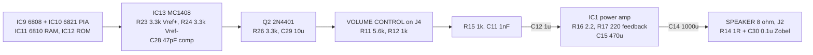

# The Williams D-8224 sound board's output

What Williams' gen-1 sound board does between its MC1408 and the cabinet
speaker. Shared by Joust, Robotron and Sinistar, so one reading covers three
machines. Read for `phosphor-emulator-discrete-sound-fidelity-l5r3.10`, the
project-wide audit. The model is `machines/src/williams.rs`.

## Provenance

| | |
|---|---|
| Drawing | `D-8224-3006 Sound Board Logic Diagram`, Williams Electronics, rev A, December 1982 |
| Read from | `arcade-museum.com/manuals-videogames/J/joust-dp.pdf`, PDF p16 (drawing-set item 13) |
| Transcribed | 2026-08-31, from a 500 dpi render, rotated 90 degrees |

The drawing set's contents page lists sixteen items; the sound board is the last
two, an assembly drawing at PDF p15 and this schematic at p16. The sheet is
landscape on a portrait page, so it reads rotated.

## The chain

## The finding: one default stands for two real couplings

`williams.rs` builds `DcBlocker::new(1_000_000)`, which takes
`DEFAULT_CUTOFF_HZ`, a round **10 Hz** chosen to be "low enough to pass the whole
audible band untouched". Its comment correctly places it before the downsampler
so the DAC pedestal never reaches the resampler. What it is standing for is two
capacitors, in different places, and one of them is computable:

- **C14, 1000 uF, into an 8 ohm speaker.** That is the output coupling, and
  8 ohms and 1000 uF give **19.9 Hz**. The board's number, not a default, and
  `DcBlocker::with_cutoff` already exists to take it.
- **C12, 1 uF, ahead of the power amplifier.** Its corner depends on IC1's input
  impedance, which was not established, so this one is not computable from the
  sheet alone.

Two couplings in series are not one, and 19.9 Hz is not 10 Hz. Neither is a large
effect on most material -- that is the honest framing -- but the first is free to
correct and turns a default into a derived value.

## What else is not modelled

- **Q2, a 2N4401, on the MC1408's current output**, with R26 3.3k and C29 10 uF.
  The DAC's `Io` does not drive the amplifier directly.
- **The volume control is external**, on connector J4 through R11 5.6k and
  R12 1k. There is no volume in the model at all.
- **IC1's gain**, set by R17 220 against R16 2.2, with C15 470 uF. About 100,
  which is calibration rather than shape, but it also sets where the board
  clips.
- **R14 1 ohm with C30 0.1 uF across the speaker**, a Zobel network. Audible only
  at the top of the band and only into a real speaker load.

## What it does NOT establish

- **IC1's part number.** The package is drawn with pins 1, 2, 3, 4, 8 and 9 and
  a 470 uF on one of them, which is the shape of an LM377/LM378-family audio
  amplifier, but the legend was not legible at 500 dpi and no part number was
  read. Its input impedance, which decides C12's corner, therefore is not known.
- **Whether Robotron and Sinistar carry the same board revision.** The part
  number D-8224 is the gen-1 sound board and all three machines use it, but only
  Joust's drawing set was read. Sinistar additionally has the CVSD speech board,
  which is not on this sheet.
- **Where the CVSD output joins.** `williams.rs` has an `Hc55516` for Sinistar and
  this sheet does not show it.
- **Any measurement.** Nothing here was compared against a capture.

## Confidence

A clean scan read at 500 dpi after rotation. Every resistor and capacitor value
above was legible; the one thing that was not is IC1's type, and that is flagged
rather than guessed.

This is a hand transcription and can be wrong. Nothing in it is checked by a
test; the section above it is what keeps that honest.
