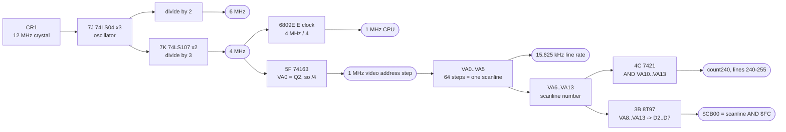

# Williams gen-1: the crystal, and 64 cycles to a scanline

Where the board's clocks come from, and why a scanline is exactly 64 CPU cycles
rather than approximately 64.

**Derives:** `machines/src/williams.rs`, `clock_tree()` and `TIMING`.
**Related:** [`williams-video-counter.md`](williams-video-counter.md), which
reads the same counter chain from the other end.
**Settles:** the last entry in `clock_tree_test.rs`'s `NO_RASTER_DERIVATION`
list, which is now empty.

## Provenance

| | |
|---|---|
| Drawing | R-8731 CPU Board Logic Diagram, both sheets |
| Read from | Robotron service manual, `arcade-museum.com/manuals-videogames/R/robotron-ds.pdf`, pages 9 and 10 |
| Transcribed | 2026-08-28, from a 400 dpi render |

The oscillator is on page 10 and the counter chain on page 9, which is why the
first pass at this missed it: the counters are legible on one sheet and the
clock that drives them is on the other.

## The circuit

## Parts

| Ref | Part | Role |
|---|---|---|
| CR1 | 12 MHz crystal | the board's only reference |
| 7J | 74LS04 | crystal oscillator, three inverters |
| 7K | 74LS107 x2 | JK flip-flops: the divide-by-three to 4 MHz |
| 7G | 7474 | further division, feeds the 4 MHz label |
| 5F | 74163 | video address counter, low stage: VA0 from Q2 |
| 4C | 7421 | four-input AND: `count240` |
| 3B | 8T97 | the `$CB00` readback |

## Nets

| Net | Pins |
|---|---|
| 12 MHz | CR1, 7J.1-2, 7J.3-4, 7J.5-6, then 7K |
| 4 MHz | 7K output, labelled on the sheet |
| 6 MHz | second tap, labelled on the sheet |
| count240 | 4C.in (5) = VA10, 4C.in (4) = VA11, 4C.in (2) = VA12, 4C.in (1) = VA13, out (6) |
| VA0 | 5F.Q2 (12) |
| VA1 | 5F.Q3 (11) |

The `$CB00` tap is in
[`williams-video-counter.md`](williams-video-counter.md) and not repeated here.

## The derivation

1. **12 MHz crystal**, divided by three at `7K` to **4 MHz**.
2. **The E clock is 4 MHz over four**, so the 6809E runs at **1 MHz**.
3. **The video address counter is clocked at 4 MHz**, and its low two bits are
   not on the bus: `5F` drives VA0 from Q2, not Q0. So the *video address* steps
   at **1 MHz**, one fetch per CPU cycle, which is the CPU/video DRAM interleave
   the whole board is built around.
4. **A scanline is 64 video-address steps.** Two independent decodes on the
   sheet fix where the within-line field ends and the scanline number begins,
   and they agree: `count240` is a four-input AND over VA10-VA13, which is
   scanline 240 to 255 only if scanline bit 0 is VA6; and `$CB00` reads
   VA8-VA13 onto D2-D7, which is `scanline & $FC` under the same mapping. So
   VA0-VA5 is the within-line field: 64 steps.
5. Therefore a scanline is **64 microseconds**, a **15.625 kHz** line rate, and
   exactly **64 E cycles**.
6. The dot clock is 12 MHz times two thirds, **8 MHz**, and each of the 64
   fetches covers **8 pixels** across the four DRAM banks, which gives the
   **512 dots a line** the horizontal timing is built on. 8 MHz over 512 is the
   same 15.625 kHz, by a second route.

`cycles_per_scanline: 64` was an approximate 15.6 kHz measured after the fact.
It is now a division of the crystal, and `declared_raster_reproduces_cycles_per_scanline`
recomputes it from the declared 8 MHz dot clock and 512 dots.

## What this does NOT establish

- **The 260-line frame.** The counter's scanline field is eight bits, VA6-VA13,
  which is 256 lines. The remaining four come from beyond VA13, and the
  candidates on the sheet are the 7474s at `4D` and `7G`, which were not traced.
  260 lines at 15.625 kHz is 60.096 Hz, which is the figure the board is known
  for, but that is corroboration and not a derivation.
- **Which of `7K`'s two flip-flops makes which tap.** The sheet labels 12 MHz,
  6 MHz and 4 MHz as outputs; that two 74LS107s in this arrangement are a
  divide-by-three is read from the topology and the labels, not from a truth
  table.
- **`7G`'s exact role.** It sits between the dividers and the 4 MHz label and
  was not traced.
- **The `4 MS-IRQ` net** on page 10, which is a separate timing chain and was
  not followed.

## Confidence

The crystal, the labelled taps, `4C`'s four inputs and `5F`'s VA0-from-Q2 were
read at legible size and are stated with confidence. The step from those to "64
cycles" is arithmetic on them, and it is checked twice: once against the dot
clock over 512, and once by the clock-tree test recomputing
`cycles_per_scanline` from the declaration.
