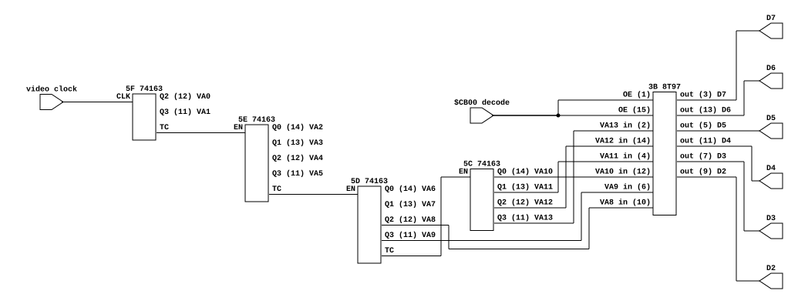

# Williams gen-1: the video counter at `$CB00`

What the CPU reads when it polls `$CB00`, and where the value comes from.

**Derives:** `machines/src/williams.rs`, the `MainRegion::IO_VIDEO` read.
**Discussed in:** [`williams-video-conformance.md`](../designs/williams-video-conformance.md),
the "video counter aliases" note.
**Settles:** whether the counter saturates or wraps above line 255, which we and
MAME model differently.

## Provenance

| | |
|---|---|
| Drawing | R-8731 CPU Board Logic Diagram, sheet 1 of 2 |
| Read from | Robotron service manual, `arcade-museum.com/manuals-videogames/R/robotron-ds.pdf`, page 9 |
| Also in | Joust manual `J/joust-dp.pdf` pages 6-7, same drawing, poorer scan |
| Transcribed | 2026-08-28, from a 400 dpi render |

The Joust scan is the one to avoid: at 900 dpi its digits still do not resolve,
because the limit is the scan and not the render. Robotron's is clean at 400.

## The circuit

Generated from [`williams-video-counter.json`](williams-video-counter.json) with
`netlistsvg`; that file is the source, the SVG is committed output. Every port
is labeled with its pin number and its net, so the drawing carries the same
information as the net tables below rather than paraphrasing them.

`TC` and `EN` are the two labels with no pin number, because the cascade pins
were not read from the drawing. `VA0` through `VA7` are labeled on the counters
that produce them but have no wire drawn, because where they go was not traced.

## Parts

| Ref | Part | Role |
|---|---|---|
| 5F | 74163 | video address counter, low stage |
| 5E | 74163 | video address counter |
| 5D | 74163 | video address counter |
| 5C | 74163 | video address counter, high stage |
| 3B | 8T97 | hex tri-state buffer: the `$CB00` readback |

## Nets

The readback, which is the point of this excerpt and the part read with most
confidence:

| Net | Pins |
|---|---|
| VA13 | 5C.Q3 (11), 3B.in (2) |
| VA12 | 5C.Q2 (12), 3B.in (14) |
| VA11 | 5C.Q1 (13), 3B.in (4) |
| VA10 | 5C.Q0 (14), 3B.in (12) |
| VA9 | 5D.Q3 (11), 3B.in (6) |
| VA8 | 5D.Q2 (12), 3B.in (10) |
| D7 | 3B.out (3) |
| D6 | 3B.out (13) |
| D5 | 3B.out (5) |
| D4 | 3B.out (11) |
| D3 | 3B.out (7) |
| D2 | 3B.out (9) |

The rest of the counter's outputs, which do not reach `3B`:

| Net | Pins |
|---|---|
| VA7 | 5D.Q1 (13) |
| VA6 | 5D.Q0 (14) |
| VA5, VA4, VA3, VA2 | 5E.Q3 (11), 5E.Q2 (12), 5E.Q1 (13), 5E.Q0 (14) |
| VA1, VA0 | 5F.Q3 (11), 5F.Q2 (12) |

## What this establishes

1. **`$CB00` reads bits 8 to 13 of the video address counter**, placed on data
   bits 2 to 7.
2. **The `& $FC` is not a mask.** D0 and D1 are not driven by anything. The low
   two bits of the value are two data lines nobody connected.
3. **There is no logic between the counter outputs and the buffer inputs.** Six
   wires. No gates, no clamp, no saturation.

(3) is what settles the modelling question. A counter read through a plain
buffer shows whatever it is counting, and a 74163 chain on a free-running clock
does not stop at its maximum: it rolls over and keeps counting. So the lines
past the end of the visible field show a **small** value, not `$FC`. Our `u8`
alias reproduces that. MAME's `video_counter_r`, which returns a flat `$fc`
above `vpos` 255, models a counter that holds, and nothing here holds it.

## What this does NOT establish

Recorded so the next reader knows which parts were checked and which were not.

- **The frame reset.** The counters' `MR` pins are commonly tied and driven from
  a decode involving VA13 through an inverter at `5A` into a 7411 at `3A`, with
  a 7474 at `4D` alongside. Which count resets the chain was not traced, so the
  exact line-to-value mapping is unknown: the top six bits advance every 260/64
  lines rather than every 4 exactly, and which lines carry the doubled value
  falls out of that decode.
- **`3B`'s enables.** Pins 1 and 15 come from the address decode near `5G`
  (74LS138), `6E` (7432) and `5A` (7404). That it decodes `$CB00` is inferred
  from the memory map rather than traced through the gates.
- **Power pins.** Not transcribed. The drawing's labels around `3B` pin 8 and
  pin 16 did not match the 8T97 datasheet's GND and Vcc assignment cleanly
  enough to write down, and nothing here depends on them.
- **`5F.Q0` and `5F.Q1`.** `Q0` is marked N.C.; `Q1` carries no legible label.
  The counter therefore runs at four times the address rate, but where its two
  low bits go, if anywhere, was not read.

## Confidence

The twelve nets in the readback table were read from a 400 dpi render at
legible size and are stated with confidence. Everything under "does not
establish" is either inference or unread, and is marked as such rather than
smoothed into the same voice.
