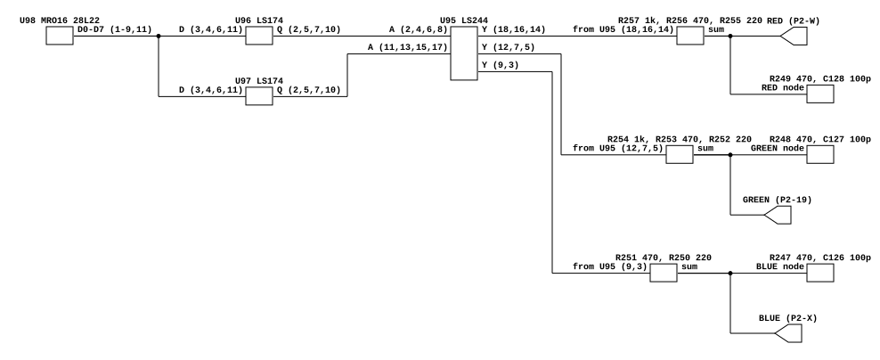

# Zaxxon's color DAC, and why its whites are not white

Why the Zaxxon family's brightest color is `(255, 255, 247)` rather than
`(255, 255, 255)`, read off the drawing rather than inferred from a reference
emulator.

Read for the palette in `machines/src/sega_zaxxon.rs`, which two machines share:
`zaxxon` and `congobongo`.

## Provenance

| | |
|---|---|
| Drawing | `IC Board A 834-0214 rev A`, sheet 13 of 16, Gremlin/SEGA, drawn 4-8-82 |
| Read from | `arcade-museum.com/manuals-videogames/Z/Zaxxon.pdf`, PDF p136 |
| Transcribed | 2026-09-19, from a 400 dpi render of that one page |

Each sheet is spread across two PDF pages, left half then right half; the DAC is
entirely on the left half, p136. At 150 dpi the resistor values are not legible
and at 400 dpi they are, which is the only reason the page was re-rendered.

**The manual carries a partial schematic set**, and that is worth recording
before anyone else searches it. What is in it:

| Drawing | Sheets present | PDF pages | What is on them |
|---|---|---|---|
| `700-0087` cabinet | 1-9 | ~111-129 | Harness, power supply, operator control block |
| `IC Board A 834-0214` | **11-14 of 16** | 131-139 | Discrete sound (11, 12), I/O + color DAC (13), Z80 + program ROM + video RAM (14) |
| `IC Board B 834-0211` | **6-8 of 9** | 140-145 | Background scroll and map ROMs (6), sync chain (7), sprite ROMs and line buffers (8) |
| `IC Board B 834-0257` | **6-8 of 9** | 146-151 | The same three sheets of a second board revision |
| Monitor | | 152-157 | |

So IC Board A sheets 1-10 and 15-16, and IC Board B sheets 1-5 and 9, are **not
in this manual**. That matters because the two 74LS259 control latches the
program writes (`U55` and `U56` in the reference driver's comments) are on
sheets this manual does not have, and neither does the `0xE0F0` address decode.
Those remain unverified. See [What this does not
establish](#what-this-does-not-establish).

## The circuit



One `MRO16` PROM at `U98`, a 256 x 8 28L22, latched by two LS174s and buffered
by an LS244, drives three resistor ladders straight into the monitor's R, G and
B inputs on P2. There is no op-amp, no trim and no gain stage anywhere between
the ladder and the connector.

The ladders are not the same size:

| Channel | Ladder | Termination | P2 pin |
|---|---|---|---|
| Red | R257 1k, R256 470, R255 220 | R249 470, C128 100p | W |
| Green | R254 1k, R253 470, R252 220 | R248 470, C127 100p | 19 |
| Blue | R251 470, R250 220 | R247 470, C126 100p | X |

Three bits for red and green, **two for blue**, and three identical 470 ohm
pulldowns.

## Net table

| Net | Connections |
|---|---|
| PROM data | `U98.1-9,11` -> `U96.3,4,6,11`, `U97.3,4,6,11` |
| latched | `U96.2,5,7,10` -> `U95.2,4,6,8`; `U97.2,5,7,10` -> `U95.11,13,15,17` |
| red ladder | `U95.18` -> R257 1k; `U95.16` -> R256 470; `U95.14` -> R255 220 |
| green ladder | `U95.12` -> R252 220; `U95.7` -> R253 470; `U95.5` -> R254 1k |
| blue ladder | `U95.9` -> R251 470; `U95.3` -> R250 220 |
| red node | R255/R256/R257 -> R249 470 to ground, C128 100p to ground, P2.W |
| green node | R252/R253/R254 -> R248 470 to ground, C127 100p to ground, P2.19 |
| blue node | R250/R251 -> R247 470 to ground, C126 100p to ground, P2.X |

## What this establishes

**The resistances are 1k/470/220 with a 470 ohm pulldown**, which the emulator
had been taking on the reference driver's word. They are now read.

**Blue cannot reach what red and green reach, and the board has nothing that
would let it.** Each node is a divider from the LS244's output-high level to
ground, and the three pulldowns are equal, so the only thing that differs is
how much conductance the ladder puts above the node:

```text
red, green   1k || 470 || 220 = 130.3 ohm    ->  470 / (470 + 130.3) = 0.7829
blue              470 || 220  = 149.9 ohm    ->  470 / (470 + 149.9) = 0.7582

blue / red = 0.7582 / 0.7829 = 0.9685        ->  0.9685 x 255 = 247
```

So a PROM byte of `0xFF` puts the red and green nodes at full scale and the blue
node at **96.9 % of it**, and the brightest color this board can draw is
`(255, 255, 247)`. The picture is very slightly warm by construction.

**This is the whole argument for one shared scale across the three channels.**
Normalizing each channel to its own all-bits-on would be correct only if each
had a gain that could be set independently, and the drawing shows that nothing
between the ladder and P2 could do that. The emulator did normalize per channel
until 2026-09-19, which put `0xF6` at `(201, 201, 255)` where the board puts it
at `(222, 222, 247)`: a lavender in place of a near-white, on every machine in
the family. Both look like plausible palettes, which is why it survived.

**The 100 pF terminations are a ~3.4 MHz corner** against the 470 ohm pulldown,
well above the 6.08 MHz pixel clock's fundamental only by a factor of two, so
they round pixel edges slightly rather than shaping color. Nothing models them
and nothing should until someone cares about edge softness.

## What this does NOT establish

- **Which PROM data bit reaches which ladder.** The path runs through two LS174
  latches and the LS244, and the individual bits were not traced through them.
  That red is bits 0-2, green 3-5 and blue 6-7 is the reference driver's
  assignment, corroborated only by the rendered picture matching a reference
  capture exactly. The drawing does independently fix that **blue is the 2-bit
  channel**, because only one ladder has two resistors and the red node was
  traced to a 3-resistor one.
- **Which pulldown terminates green and which terminates blue.** R247 and R248
  were not disambiguated. They are both 470 ohm with a 100 pF cap, so it does
  not change anything; it is recorded so the table is not read as more traced
  than it is.
- **The LS259 control latches and their bit assignments.** INTON, CREF1, CREF3,
  BEN and FLIP are all real signals on sheets this manual does have (they arrive
  at IC Board B on its P2 connector, sheet 6), but what drives them is on IC
  Board A sheets 1-10, which the manual does not carry. The emulator's bit
  numbering for those is still the reference driver's alone.
- **The `0xE0F0` write decode**, where a 74LS138 at `U57` is said to share its
  G2B enable with the second latch so that one write lands in two places. Same
  missing sheets. The emulator has a test pinning that behavior and it rests on
  the reference driver, not on this.
- **Whether the second board revision (834-0257) uses the same values.** Only
  sheets 6-8 of it are present, and the DAC is not on those.
- **The PROM's board position.** This drawing puts `MRO16` at `U98` on IC Board
  A. The reference driver's ROM set names the file `mro16.u76`. One of the two
  is a different revision or simply wrong, and nothing here settles which; the
  emulator matches on content, not on socket.
