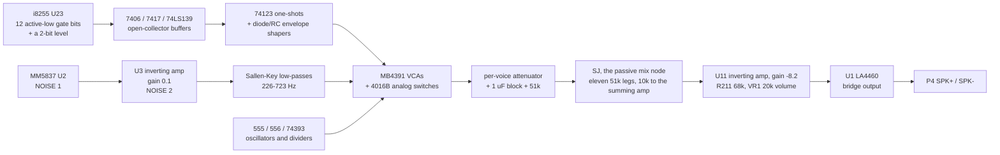
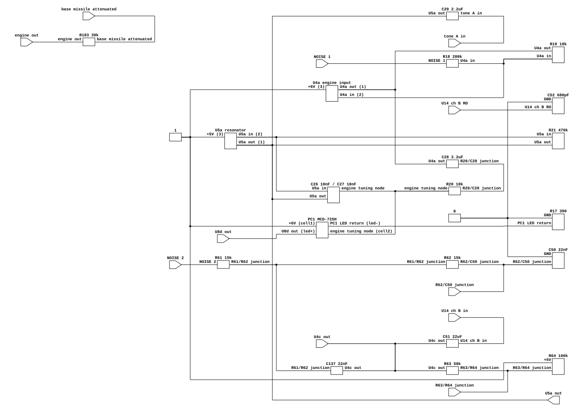
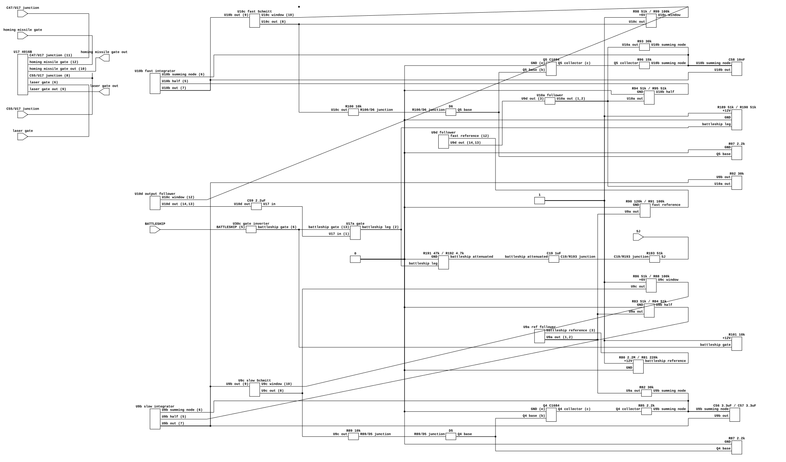
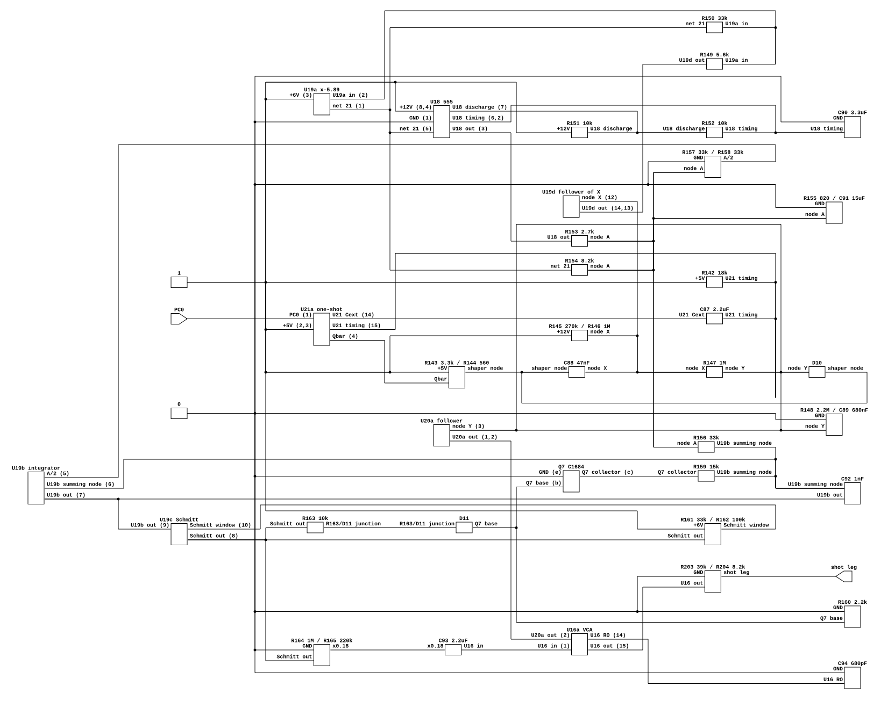
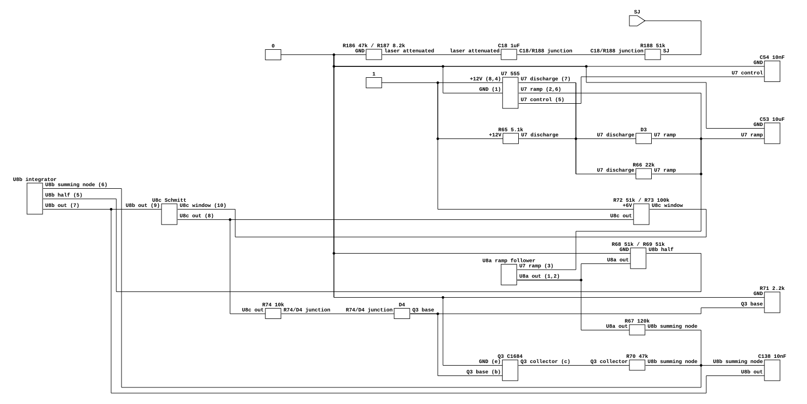

# Zaxxon's sound board: twelve gates, eleven voices, one mix bus

What generates Zaxxon's sound. The board carries no sound chip and no sound CPU:
every voice is an analog circuit on IC Board A, gated by one active-low bit of
an i8255 PPI, and all of them meet at a single passive summing node the drawing
calls `SJ`.

Read for `phosphor-emulator-uy54`. The device built from it is
`machines/src/zaxxon_sound.rs`.

## Provenance

| | |
|---|---|
| Drawing | `IC Board A 834-0214 rev A`, sheets 11 and 12 of 16, Gremlin/SEGA, drawn 4-8-82 |
| Read from | `arcade-museum.com/manuals-videogames/Z/Zaxxon.pdf`, PDF pp132-135 |
| Transcribed | 2026-09-19, from a 400 dpi render, with crops upscaled 1.3x to 2.8x for the component values |

Each sheet is spread across two PDF pages, left half then right half: sheet 11
is pp132-133, sheet 12 is pp134-135. **This corrects the page range the issue
and `machines/src/zaxxon.rs` both carried**, which was pp131-135. Page 131 is
the cabinet wiring diagram and has nothing on it.

150 dpi is enough to follow signal names and chip designators, and is not enough
to read resistor and capacitor values: `2.2K` and `2.2M`, and `470Ω` against
`470K`, are not separable at that size. Every value in the tables below was read
at 400 dpi.

The manual's schematic set is partial; the inventory is in
[`zaxxon-color-dac.md`](zaxxon-color-dac.md). Nothing the sound path needs is on
a missing sheet: sheets 11 and 12 are the whole sound board, from the PPI to the
speaker connector.

## Why this file exists

The reference emulator plays recorded WAV samples for this board rather than
emulating it, so the drawing is what a model has to be built from. That much has
always been right, and it is why this file exists.

**What was wrong, everywhere this file said it, is the next step: that the
samples are therefore not evidence about the hardware.** They are recordings of
a real Zaxxon board. Comparing against them measures that board, through one
cabinet and an unknown recording chain, with four of the twelve files clipped.
Writing that a sample set "is what somebody did instead of reading this sheet"
confused the *reason a sample set exists* with *what is on it*.

The rule that survives is a distinction rather than a dismissal, and it is worth
stating precisely because this file spent five passes with the blunt version:

- **A recording can constrain a part property the drawing does not give.** The
  `MCD-725H`'s curve, `Q6`'s on-resistance, the `MM5837`'s swing, the op-amps'
  output swing and the `MB4391`'s control law are not in competition with a read
  value; no sheet dimensions any of them. For those, a board measurement is the
  only evidence there is, and refusing it leaves the number an invention.
- **A recording cannot move a junction.** This is what the two reverted fits
  actually were. The alarm divider went to `1QB`, a pin wired to nothing, and
  `BATTLESHIP_HZ` went to 750 Hz against a derived 122. Neither revert needed
  the samples to be inadmissible, and both had a bad measurement underneath:
  "near 5 kHz" is where both alarm files' *centroid* and *rolloff* sit, and
  their fundamentals are 2264.7 and 1133.8 Hz.
- **And it cannot correct a value the drawing gives.** Both alarms sit 12 %
  below the clock `R168`, `R169` and `C97` give, by the same factor within
  0.15 %. That is one cabinet's ceramic capacitor, and a constant moved to close
  it would be a read value overwritten by a tolerance.

A measurement is still taken *after* a change and never before it. What has
changed is that a constant the drawing does not give may now be **constrained by
a recording and labeled as such**, rather than carrying `INVENTED` on the
grounds that the only evidence for it was inadmissible.

## The architecture



The board is one design applied eleven times. A voice is a **source** (noise, a
555, or a resonator), a **gate** (an MB4391 VCA driven by a control voltage, or a
4016B analog switch driven by a logic level), and a **leg** into `SJ`: a series
resistor, a shunt resistor, a 1 uF DC block, and a 51 kΩ common. Getting one
voice right gets the shape of all eleven.

## The PPI map

`U23`, an `8255AC-5`, sits on the Z80 bus (D0-D7 on pins 34-27, A0/A1 on 9/8,
`RD` 5, `WR` 36, `CS` 6, `RESET` 35). Every used output pin is labeled with its
voice on the drawing, so this is read rather than inherited. All three ports are
outputs; every used line carries a 4.7 kΩ pull-up to +5 V (`RP1` 4.7K x 8 on
port A, `RP2` 4.7K x 6 on ports B and C), so **the board powers up with every
bit high and every voice off**.

| Port | Bit | Pin | Net | Goes to |
|---|---|---|---|---|
| A | 0 | 4 | `PLAYER SHIP A` | `U30` 7406 (11 -> 10); level ladder |
| A | 1 | 3 | `PLAYER SHIP B` | `U30` 7406 (13 -> 12); level ladder |
| A | 2 | 2 | `PLAYER SHIP C` | `U32` 74LS139 pin 2 (A) |
| A | 3 | 1 | `PLAYER SHIP D` | `U32` 74LS139 pin 3 (B) |
| A | 4 | 40 | `HOMING MISSILE` | `U30` 7406 (1 -> 2), sheet 12 |
| A | 5 | 39 | `BASE MISSILE` | `U22` 74123 pin 9, sheet 12 |
| A | 6 | 38 | `LASER` | `U30` 7406 (3 -> 4), sheet 12 |
| A | 7 | 37 | `BATTLESHIP` | sheet 11, `U30` 7406 (5 -> 6) |
| B | 4 | 22 | `S-EXP` | sheet 11, `U22` 74123 pin 1 |
| B | 5 | 23 | `M-EXP` | sheet 11, `U21` 74123 pin 9 |
| B | 7 | 25 | `CANNON` | sheet 11, `U45` 74123 pin 9 |
| C | 0 | 14 | `SHOT` | sheet 11, `U21` 74123 pin 1 |
| C | 2 | 16 | `ALARM 2` | sheet 11, `U46` 74123 pin 9 |
| C | 3 | 17 | `ALARM 3` | sheet 11, `U44` 74123 pin 1 |

`PB0-PB3` (18-21), `PB6` (24), `PC1` (15), `PC5-PC7` (12, 11, 10) are drawn and
go nowhere. `PC4` is not drawn at all.

That is fourteen signals and twelve gates: player ship A and B are a **level**
rather than a gate, and the other twelve each turn something on. Eleven legs
reach `SJ`, because alarm 2 and alarm 3 share one.

## Player ship A and B are a level, and the drawing does not say what the issue said

This is the one place a plausible implementation is wrong in a way nothing would
catch. `phosphor-emulator-uy54` described the ladder as "R11 1.2k, R14 2.4k". It
is neither of those, `R11` is not in the ladder at all, and the bit order is the
opposite of a naive reading.

```text
+12V --R10 2.2k--+                    +12V --R13 82k--+
                 |                                    |
  PA0 -->|7406|--+-- A --R12 6.8k-- X ----------------+-- R15 56k -- GND
        (U30 11->10)                |
                                 R14 36k
                                    |
+12V --R11 2.2k--+                  |
                 |                  |
  PA1 -->|7406|--+-- B --R16 100k-- Y --+-- C25 15uF -- GND
        (U30 13->12)                    |
                                        +-- U8 pin 12 (+), follower
                                              |
                                        pin 14 --R17 390-- PC1 LED -- GND
```

`R10` and `R11` are **pull-ups on the two open-collector inverters**, not ladder
legs; they cross the ladder on the drawing without a junction dot, which is what
makes the 2.2 kΩ pair easy to mistake for the ladder. The ladder proper is
`R12` 6.8 kΩ from node A and `R16` 100 kΩ from node B, with `R13` 82 kΩ and
`R15` 56 kΩ setting the range at node X and `R14` 36 kΩ coupling X down to Y.

Solving that network at DC, with a 7406 saturating to about 0.2 V and the PPI
bits inverted by it:

| `PA0` | `PA1` | Node X | Node Y (the control) | LED current through `R17` 390 Ω |
|---|---|---|---|---|
| 0 | 0 | 10.54 V | **10.93 V** | 24.9 mA |
| 0 | 1 | 9.98 V | **7.39 V** | 15.9 mA |
| 1 | 0 | 1.43 V | **4.18 V** | 7.6 mA |
| 1 | 1 | 0.96 V | **0.76 V** | 0 (below the LED's forward drop) |

Two things follow, and both matter.

**`PA0` is the more significant bit, and the level falls as the bits rise.** The
steps are 3.54 V, 3.21 V and 3.42 V: a near-linear two-bit DAC whose code is
`3 - (PA0 * 2 + PA1)`. `PA0` is worth about twice `PA1` because it reaches the
ladder through `R12` 6.8 kΩ where `PA1` reaches it through `R16` 100 kΩ, and the
whole thing runs backwards from the bit values because `U30`'s 7406 sections
invert both.

A model that reads the pair as `data & 3` is therefore wrong twice over: it puts
the two middle states the wrong way round, and it rises where the board falls.
Both mistakes are entirely plausible to listen to, which is why they are worth
writing down.

The maximum is at `PA0 = PA1 = 0` and the minimum, with `PC1`'s LED dark, is the
`1, 1` that `RP1` leaves at power-on. So this pair is consistent with the rest of
the port after all: the engine is at its quietest and lowest when nothing has
been written.

**`C25` is 15 uF against a Thevenin resistance of about 26 kΩ**, so node Y does
not step between those levels, it glides with a time constant near 0.4 s. The
engine pitch bends rather than jumping. Nothing about that is a matter of taste
either.

## The player ship engine

Node Y drives `PC1`, an `MCD-725H` opto-isolator, through `U8` as a unity
follower and `R17` 390 Ω. `PC1`'s photoresistor sits between +6 V and the tuning
node of a multiple-feedback band-pass built on `U5`:



[`zaxxon-engine-resonator.json`](zaxxon-engine-resonator.json), which draws tone
A; tone B is the same twelve parts with different designators.

| Part | Value | Role |
|---|---|---|
| `R18` | 200 kΩ | `NOISE 1` into `U4` pin 2 |
| `R19` | 10 kΩ | `U4` feedback; gain 0.05, inverting |
| `C28` | 2.2 uF | block into the band-pass input |
| `R20` | 10 kΩ | band-pass input resistor, to node X |
| `PC1` LDR | variable | from +6 V to node X, so it parallels `R20` for AC |
| `C26`, `C27` | 0.01 uF | the band-pass's two feedback capacitors |
| `R21` | 470 kΩ | `U5`(1,2,3) feedback |

`U5`(1,2,3)'s pin 3 is on **+5 V**, not the +6 V mid-rail the rest of the analog
board swings about. The label is drawn beside the pin at 400 dpi. It changes
nothing audible, because `C28` blocks going in and `C29`/`C38` block coming out,
and the LDR's other end is on +6 V so node X floats there with no current in it.
It is recorded because this is the only op-amp on the board referenced anywhere
but the mid-rail, and because a later pass that assumes +6 V here would be
assuming rather than reading.

Three things about this front end follow from `R21` and `C26` and nothing else:

- with the LED dark the input resistance is `R20` alone and the center is
  `1 / (2*pi*C*sqrt(R20*R21))` = **232 Hz**;
- the **peak gain is `R21/(2*R20)` = 23.5 wherever the center goes**, because an
  MFB band-pass's peak depends on the input resistor alone and not on the
  parallel pair. The LDR moves the engine's *pitch*, not its level;
- the **bandwidth is `1/(pi*R21*C26)` = 68 Hz wherever the center goes** too,
  for the same reason. So the `Q` runs 3.4 with the LED dark and rises with the
  center: the LDR slides a fixed window rather than widening it.

That third point is the one an earlier draft of this section got backwards. It
said the gain rose with the center "so the two level bits set the engine's pitch
*and* its loudness through one part". They do not. Both the gain and the
bandwidth are pinned by two parts the LDR cannot reach.

That one band-pass output feeds **both** engine tones, through `C29` and `C38`:

| Tone | Filter | Values | Divider | VCA | Leg |
|---|---|---|---|---|---|
| A | Sallen-Key low-pass, `U5`(9,10,8) | `R24`/`R25` 100 kΩ, `C30`/`C31` 2200 pF, gain `1 + R23/R22` = 2 | `R26` 12 kΩ / `R27` 3.3 kΩ, then `C32` | `MB4391 U14` ch A | `R174`/`R175` |
| B | Sallen-Key low-pass, `U5`(12,13,14) | `R38`/`R39` 100 kΩ, `C39`/`C40` 3300 pF, gain `1 + R37/R36` = 2 | `R40` 12 kΩ / `R41` 3.3 kΩ, then `C41` | `MB4391 U15` ch A | `R177`/`R178` |

`1 / (2*pi*R*C)` gives **723 Hz** and **482 Hz**, and `Q = 1/(3-K)` with `K` = 2
gives **Q 1**: a gentle bump at the corner on top of everything below it.

**These are the two explosion filters again, at a different corner, and they are
not band-passes.** This file called them "Wien resonators" for nine commits on
the strength of a part list that was entirely correct, which is the same failure
the cannon, the shot and the battleship's `R96` each produced once already. The
distinguishing junction is `C30`'s far plate (and `C39`'s). It sits on the
**+6 V rail**, whose vertical crosses the audio bus at the page seam with no
junction dot; the bus is the next vertical to the right and carries `C29` and
`C38`. Put `C30` on the bus and the stage is a band-pass. Put it on +6 V, which
is where the drawing puts it, and the stage is a low-pass.

`R26` and `R27` had no entry here at all. `R26` 12 kΩ leaves `U5` pin 8, `R27`
3.3 kΩ goes from their junction to **ground**, and `C32` 2.2 uF takes the
junction to `U14` pin 1. That is a divider of **0.216**, or 13.3 dB, and it
applies to these two voices and to nothing else on the board. The MB4391s' `RO`
pins carry `C33` and `C42` 680 pF to ground, which is the part's own rolloff pin
and not in the signal path.

`PLAYER SHIP C` and `D` reach `U32`, a 74LS139 with its enable grounded. Only
`Y0` (pin 4) and `Y1` (pin 5) are connected; `Y2` and `Y3` go nowhere. Each
drives a 7417 open-collector buffer at `U31`, which pulls a 0.68 uF capacitor to
ground through 1 kΩ when the output is low and lets it charge toward +6 V through
440 kΩ when it is not:

| Output | Active when | Buffer | Pull-down | Charge path | VCA control |
|---|---|---|---|---|---|
| `Y0` | `PA2`=0, `PA3`=0 | `U31` 1 -> 2 | `R28` 1 kΩ, `C34` 0.68 uF | `R29`+`R30` 440 kΩ | `U14` ch B `CON` |
| `Y1` | `PA2`=1, `PA3`=0 | `U31` 3 -> 4 | `R31` 1 kΩ, `C35` 0.68 uF | `R32`+`R33` 440 kΩ | `U15` ch B `CON` |

So the attack is 0.68 ms and the release about 0.3 s, and the two bits pick which
of the two engine pitches sounds.

## The two explosions

`S-EXP` and `M-EXP` are the same circuit twice, and it is the clearest voice on
the board: a 74123 one-shot yanks a capacitor down through a diode, the capacitor
crawls back up through a megohm-class path, and that slow recovery is the
explosion's decay.

| | small (`S-EXP`, `PB4`) | medium (`M-EXP`, `PB5`) |
|---|---|---|
| one-shot | `U22` half A (1, 2, 3, 4, 13, 14, 15) | `U21` half B (9, 10, 11, 5, 12, 6, 7) |
| timing cap | `C60` 1 uF | `C62` 3.3 uF |
| timing resistor | `R102` 36 kΩ to +5 V | `R107` 47 kΩ to +5 V |
| pulse width (0.28 R C) | **10.1 ms** | **43.4 ms** |
| output tap | `Qbar` (pin 4), pulled up by `R103` 1 kΩ | `Qbar` (pin 12), pulled up by `R108` 1 kΩ |
| the other output | `Q` (pin 13), drawn and unconnected | `Q` (pin 5), drawn and unconnected |
| discharge diode | `D7`, cathode toward the one-shot | `D8`, cathode toward the one-shot |
| discharge resistor | `R106` 1 kΩ | `R212` 470 Ω |
| envelope cap | `C61` 2.2 uF | `C63` 1 uF |
| recovery path | `R105` + `R104` 940 kΩ to +5 V | `R110` + `R109` 2 MΩ to +5 V |
| recovery time constant | **2.07 s** | **2.00 s** |
| control buffer | `U20` (10, 9, 8), unity | `U20` (12, 13, 14), unity |
| noise filter | `R113`/`R116` 15 kΩ, `C70`/`C71` 0.033 uF | `R119`/`R122` 15 kΩ, `C72`/`C73` 0.047 uF |
| filter center, Q | **321 Hz**, Q 2.0 | **226 Hz**, Q 2.0 |
| filter gain | `1 + R115/R114` = 2.5 | `1 + R121/R120` = 2.5 |
| VCA | `MB4391 U15` ch B (5, 6, 10, 11) | `MB4391 U13` ch B (5, 6, 10, 11) |
| leg | `R194` 15 kΩ / `R195` 8.2 kΩ | `R197` 8.2 kΩ / `R198` 47 kΩ |
| leg attenuation | 0.353 | **0.851, the loudest leg on the board** |

Note the diodes: **both point back toward the one-shot**, so the capacitor sits
charged at rest and is pulled *down* on a trigger. The envelope is therefore
inverted with respect to loudness, which is the first thing that tells you which
way an MB4391's control pin works (below).

The two filters are Sallen-Key low-passes with equal resistors and equal
capacitors, so `f0 = 1/(2*pi*R*C)` and `Q = 1/(3-K)` with `K` the amplifier's
non-inverting gain. `K` = 2.5 puts both at Q 2, a broad resonance rather than a
tone: band-limited noise, low for the medium explosion and higher for the small
one, which is the correct way round. Both were checked against white noise
through the two-pole low-pass their own parts give and both match it to 0.5 dB.

### The medium explosion is retriggered, and that is most of its length

The `74123` is a **retriggerable** monostable, and for `M-EXP` that is the voice
rather than a footnote. A single trigger is 43 ms of pulse followed by `C63`
recovering through `R109` + `R110` for 2.0 s, so the sound decays from its first
instant. The reference recording does not: it is flat for two seconds and then
falls off a cliff, which no RC recovery produces.

What produces it is the game pulsing `PB5` repeatedly. While the pulses arrive
faster than 43 ms apart the one-shot never finishes, `D8` holds `C63` at a diode
drop, the `MB4391` stays wide open, and the 2.0 s recovery becomes the cliff at
the end instead of the whole shape. The evidence that the game does this is not
the recording: it is that the reference driver guards `M-EXP` and alarm 3
against restarting while already playing, and guards nothing else. A guard
against a restart exists where restarts happen.

The small explosion has no such guard and is struck once, which is why the
single-trigger scenario matches it and not its neighbor. The rate at which the
game pulses `M-EXP` has **not** been read out of the ROM; `zaxxon/m-exp-sustained`
picks 25 ms to demonstrate the mechanism and says so.

## The cannon

The cannon's envelope does not drive a VCA. It drives a transistor sitting in the
tuning leg of a band-pass, so the pitch falls as the envelope decays.

| Part | Value | Role |
|---|---|---|
| `U45` half A | `C78` 1 uF, `R125` 47 kΩ | one-shot, **13.2 ms** |
| `R126` | 330 Ω | pull-up on `Q` (pin 5) |
| `D9` | cathode away from the one-shot | charges the envelope cap on the pulse |
| `C79` | 6.8 uF | envelope cap |
| `R127` | 100 kΩ | envelope decay to ground, **0.68 s** |
| `U12` (5, 6, 7) | unity follower | envelope buffer |
| `R131`, `R132` | 15 kΩ, 3.3 kΩ | into `Q6`'s base |
| `Q6` | C1684 | the variable tuning resistance |
| `R130` | 100 Ω | in series with `Q6`, from the band-pass tuning node to ground |
| `R133` | 1.5 kΩ | `Q6`'s collector to ground, which **bounds** the sweep |
| `C80` | 2.2 uF | `NOISE 2` in |
| `R128` | 10 kΩ | input resistor, **to the inverting input** |
| `R127` | 47 kΩ | `U12` feedback (see below: the designator is reused) |
| `C81`, `C82` | 0.01 uF | the bridged-T's two capacitors |
| `C83`, `R134`, `R135` | 10 uF, 100 kΩ, 100 kΩ | a 2:1 divider out to `C84` |

**This is not the multiple-feedback band-pass the rest of the board uses, and
the difference is one wire.** In every other filter here the input resistor
lands on the capacitor junction. `R128` does not: it lands on `U12`'s
**inverting input**, with `R127` bridging input to output and `C81`/`C82` in
series between them, their junction tied to ground through `R130` and `Q6`. The
feedback network is a bridged-T, and the stage is an inverting **low-pass**:

```text
gain(s) = -(R127/R128) * (1 + 2*s*C*r) / (1 + 2*s*C*r + R127*r*C^2*s^2)

DC gain = R127/R128 = 4.7
f0      = 1 / (2*pi*C*sqrt(R127*r))
Q       = 0.5 * sqrt(R127/r)
```

with `r` = `R130` in series with `R133` paralleled by `Q6`, so `r` runs between
1.6 kΩ with `Q6` off and `R130`'s 100 Ω with it hard on. That sweeps the corner
**1835 Hz to 7.3 kHz** at a Q of 2.7 to 10.8: a broadband crack that starts
bright and falls, which is what a cannon is.

**It does not fall for the whole 0.68 s, and the reason is read.** `Q6` is drawn
rotated, like every transistor on these sheets: the horizontal lead is the base,
the top one the collector (to `R130` and `R133`) and the bottom one the emitter,
to ground. `R131` 15 kΩ and `R132` 3.3 kΩ put the base at **0.180** of the
envelope, and a bipolar transistor's base-emitter junction is a silicon diode,
so nothing happens until the envelope passes `0.6 * 18.3/3.3` = **3.33 V**. The
envelope starts at 4.4 V and decays with a 0.68 s time constant, so it crosses
that **0.19 s** in. The cannon sweeps for the first fifth of its length and then
sits at `R130 + R133`'s 1835 Hz while the VCA closes.

The peak base drive is 0.79 V, a fifth of a volt above turn-on, so `Q6` is a
soft resistance over a narrow range rather than a switch, and how far down it
goes there is still [invented](#what-this-does-not-establish).

Reading it as the neighboring MFB pattern instead gives a Q-10.9 band-pass
sitting *at* 7.4 kHz with a gain of 2.35, which is a thin whistle carrying a
twentieth of the energy. The device made exactly that mistake and the voice was
inaudible in play; see the note at the end of this file.

Its output reaches `MB4391 U13` ch A (1, 2, 14, 15) through the `R134`/`R135` divider and
`C84` 4.7 uF, and the leg is `R200` 47 kΩ / `R201` 3.9 kΩ, an attenuation of
0.0766. That VCA's `CON` pin is driven by `U12`'s **other** section, an
inverting amp with `R136` 51 kΩ in and `R137` 51 kΩ of feedback about the
`R139` 33 kΩ / `R141` 22 kΩ divider's 2.4 V, so `CON` = 4.8 V − envelope.

**`R127` appears twice on sheet 11**, once as the 100 kΩ envelope shunt and once
as the 47 kΩ band-pass feedback, both legible and both unambiguously reading
`R127` at 400 dpi. One of them is presumably `R129`, which appears nowhere; the
drawing does not say which, and this note distinguishes them by function.

## The battleship: two relaxation oscillators, one of which reaches nothing

`BATTLESHIP` (`PA7`) goes to `U30` 7406 (5 -> 6) with `R101` 10 kΩ to +12 V, and
gates a `4016B` section. What that section passes is built from two copies of
one circuit, an op-amp integrator driving an inverting Schmitt trigger with a
transistor closing the loop:



[`zaxxon-battleship-oscillator.json`](zaxxon-battleship-oscillator.json). The
slow stage is the upper row and the fast one the lower, and the argument is in
the pins. `R85` and `R96` both arrive at their integrator's **pin 6**, the
inverting input, not at the divider that feeds pin 5: that is what makes each
loop reverse and it is the one thing a block diagram of this voice cannot say.
`R92` leaves `U9`'s pin 7 and arrives at `U10a`'s output, which is strapped to
its own inverting input, so the slow stage drives a follower and nothing else.
And `U10d`'s pin 12 sits on pin 10, the Schmitt's hysteresis node, rather than
on pin 8.

| | slow (`U9`) | fast (`U10`) |
|---|---|---|
| reference into the integrator | `R80` 2.2 MΩ / `R81` 220 kΩ off +12 V, buffered by `U9`(2,3,1): **1.091 V** | that, divided by `R90` 120 kΩ / `R91` 100 kΩ and buffered twice: **0.496 V** |
| integrator | `U9`(5,6,7) | `U10`(5,6,7) |
| virtual ground | `R83`/`R84` 51 kΩ halve it: **0.545 V** | `R94`/`R95` 51 kΩ halve it: **0.248 V** |
| input resistor | `R82` 30 kΩ | `R93` 30 kΩ |
| feedback cap | `C56` + `C57` 3.3 uF back to back: **1.65 uF** | `C58` **0.01 uF** |
| Schmitt | `U9`(9,10,8), `R86` 51 kΩ from +6 V, `R88` 100 kΩ feedback | `U10`(9,10,8), `R98` 51 kΩ from +6 V, `R99` 100 kΩ feedback |
| window at the integrator | `51/151` of the output swing | the same |
| loop transistor | `Q4` C1684, base from `D5` and `R89` 10 kΩ, `R87` 2.2 kΩ to ground, emitter grounded | `Q5` C1684, `D6` and `R100` 10 kΩ, `R97` 2.2 kΩ, emitter grounded |
| sink into the summing node | `R85` **2.2 kΩ** | `R96` **15 kΩ** |
| duty cycle | `R85`/`R82` gives **7.3 %** | `R96`/`R93` gives **exactly 50 %** |
| rate | **3.02 Hz** | **122 Hz** |

**`R85` and `R96` land on their integrators' pin-6 summing nodes, not on the
divider that feeds pin 5.** Both look like they could go either way at 150 dpi
and both are unambiguous at 400: the divider's line crosses that vertical with
no junction dot, twice, in the same shape. This file had the first one right and
the second one wrong, and getting `R96` wrong is worth a factor of four in the
audible rate.

Everything above follows from read values except the op-amp's output swing,
which sets the Schmitt window and which both rates are inversely proportional
to. That term cancels exactly in the ratio, so **40.5 to 1** is a reading even
though 122 Hz is only as good as the swing. Note that the capacitors alone would
say 165 to 1: the fast stage works against a quarter of the reference where the
slow one works against a half, and its sink is 15 kΩ where the slow one's is
2.2 kΩ.

What leaves is a **square**, and its harmonics are the voice. `U10`(12,13,14) is
a unity follower and `C59` 2.2 uF takes its output to the `4016B` with no
divider, but its pin 12 does not tap the Schmitt's *output*: it taps the
`R98`/`R99` junction, one crossing lower on the sheet. So the voice arrives at
**3.378 V peak to peak**, the width of the Schmitt's own window, symmetrically
about the +6 V that `R98` holds that node toward, and that is also the bias
`R189`/`R190` 51 kΩ put on the far side of `C59`. The leg is `R191` 47 kΩ /
`R192` 4.7 kΩ, the second quietest on the board.

### The slow stage reaches nothing, and that is a reading too

`U9`'s integrator output leaves through `R92` 30 kΩ. `R92`'s other end lands on
the node where `U10`(1,2,3)'s output, its own **inverting input**, `R93` and
`R94` all meet: that section's pin 2 runs left and down onto the same horizontal
that pin 1 runs down and left onto, joined by a plain wire with a junction dot
where `R92` arrives. A section with its inverting input strapped to its output
is a unity follower of whatever is on its pin 3, which here is the 0.496 V bias.
`R92` can only load it.

So the slow oscillator, which is a complete and solvable circuit, has no way to
reach the audio. It has no other output on the sheet and `R92` has no other end.
Either the drawing is missing a wire (or drawing one it should not), or the part
is vestigial. Traced three times at 900 % zoom, including the one 200-pixel
segment the whole question turns on.

**The model therefore does not modulate the battleship**, and both constants an
earlier pass invented for that modulation are gone. This is the uncomfortable
kind of result and it is the point of reading the sheet: a 7 % duty pulse at
3 Hz is exactly what somebody would *want* to shape this voice with, and
modeling it anyway would have been modeling a wire that is not drawn.

## The shot: the same oscillator again, with its reference swept

`SHOT` (`PC0`) is a **tone**, and there is no noise anywhere in it. That is the
first thing to say, because the obvious reading of `R156` 33 kΩ with `C92`
1000 pF around a `U19` section is a filter, and every other `U19`-class stage on
this board is one. It is not. `U19`(5,6,7) with `C92` in its feedback and
`U19`(9,10,8) around `R161` 33 kΩ / `R162` 100 kΩ are **the battleship's
oscillator built a third time**, transistor and all, and `R156` with `R157` and
`R158` is its reference divider rather than a filter's input.

The difference from the battleship is that here the reference is a live node, so
the pitch is swept. Everything else on the voice exists to work out by how much.



[`zaxxon-shot-oscillator.json`](zaxxon-shot-oscillator.json). Two pin-level
facts carry the voice, and both are invisible in a part list. `R159` arrives at
`U19b`'s **pin 6**, the same summing-node junction the battleship's `R85` and
`R96` make, which is what says this is an oscillator and not a filter. And the
one-shot's **`Qbar`** on pin 4 is what drives the shaper, while `Q` on pin 13 is
drawn and connects to nothing: that is the difference between a VCA that rests
muted and one that rests wide open.

The node table for the part that is not a chip:

| Net | Reaches |
|---|---|
| shaper node | `R143`.b, `R144`.b, `C88`.a, `D10` cathode |
| node X | `C88`.b, `R146`.b, `R147`.a, `U19`.12 |
| node Y | `R147`.b, `R148`.a, `C89`.a, `D10` anode, `U20`.3 |
| node A | `R153`.b, `R154`.b, `R155`.a, `C91`.a, `R156`.a, `R157`.a |
| `U19b` summing node | `R156`.b, `C92`.a, `R159`.b, `U19`.6 |

**`R144` is driven by `Qbar`, not `Q`.** `Q` on pin 13 is drawn and connects to
nothing. This is not a detail: it inverts the whole voice. With `Qbar` the
shaper node rests at +5 V, `D10` holds node `Y` a diode drop above it at 5.6 V,
which is above the `MB4391`'s 4.76 V mute point, and the trigger drags `Y` down
to 1.50 V and opens the VCA. That is the two explosions' shape exactly, and
under the other reading the voice would scream at power-on.

`C89` 0.68 uF then recovers through `R147` in parallel with `R148`, a **468 ms**
time constant, and `Y` crosses back above the mute point at about 630 ms. That
is the shot's length, and the reference recording of this voice is 990 ms.

Two things follow from node X that are worth stating plainly:

- **`U19`(1,2,3) is not amplifying.** `C88` carries the shaper node's 4.1 V step
  into X, and a gain of -5.9 about a +6 V reference turns that into 24 V of
  demand on an amplifier with 10 V to give. It sits pinned at one rail or the
  other: high while the trigger runs, low the rest of the time. Same finding as
  the alarm stage, on a different part of the same chip.
- **It drives the 555's control pin, not its timing.** `U18` is an astable on
  `R151`/`R152` 10 kΩ and `C90` 3.3 uF, which alone would be 14.5 Hz, but pin 5
  is live. A 555's control pin is its upper threshold and half of it is the
  lower, so raising it stretches the charge leg against `V_cc` far more than the
  discharge leg against ground: the part runs near 39 Hz at an 11 % duty with
  the amplifier low, and near 7 Hz at 84 % with it high. The duty is what this
  board is using.

Node A is then the 555 through `R153` 2.7 kΩ and the amplifier through `R154`
8.2 kΩ, loaded by `R155`'s **820 Ω** to ground and smoothed by `C91` 15 uF at an
18 Hz corner. `R155` is the part that makes the voice work: it holds the node to
about a fifth of what either source alone would give, which is what keeps the
oscillator's reference in the range where it sounds like a shot.

The rate is linear in node A, because `R157` and `R158` are equal and the
integrator's virtual ground is therefore half of it:

```text
f = (A/2) / (window * C92 * (R156 + R156*R159/(R156 - R159)))
  = A * 3331 Hz/V        with window = R161/(R161+R162) * swing = 2.48 V
```

so the voice covers roughly 1.1 kHz at rest to 10 kHz at the head of a trigger,
warbling with the 555. Its duty is 45.5 % rather than the battleship's exact
50 %, because `R156` against `R159` is 2.2 to 1 where the battleship's pair is 2
to 1. It reaches `MB4391 U16` ch A (1, 2, 14, 15) through `R164` 1 MΩ against `R165` 220 kΩ, a
divider of **0.18**, and `C93` 2.2 uF; the leg is `R203` 39 kΩ / `R204` 8.2 kΩ.

### The board sweeps this voice down over its whole length and the device does not

The open item on the shot was "11.5 dB deficient at 125-250 Hz and bright at
4-8 kHz", which is a shape read off one window. Split the comparison into three
windows instead, which `disasm audiodiff --range` and `--range-b` exist for, and
it is not a shape at all. It is a sweep.

| | first 200 ms | 200-500 ms | 500-990 ms |
|---|---|---|---|
| `23.wav` centroid | 1930 Hz | 1212 Hz | **836 Hz** |
| ours | 2097 Hz | 1906 Hz | **1918 Hz** |
| `23.wav` fundamental | 1181 Hz | 301 Hz | **276 Hz** |
| ours | the 39 Hz warble, throughout | | |
| `23.wav` at 150-400 Hz | 3.4 % | 19.6 % | **28.3 %** |
| ours | 0.7 % | 0.2 % | 0.1 % |

**The reference's pitch falls by two octaves across the voice. Ours does not
move.** The whole of the "deficient at 125-250 Hz" is the second half of that
fall, and the "bright at 4-8 kHz" is our tone sitting where the board's began.

The first number is the one that says the model is close rather than lost:
`23.wav` starts at 1181 Hz and this file's own arithmetic for node A with the
amplifier at its low rail gives about 1.1 kHz. The board starts where we sit and
then goes down.

**The mechanism is a wire this device does not have.** `R147` 1 MΩ runs from
node X to node Y, which is on the node table above and in
[`zaxxon-shot-oscillator.json`](zaxxon-shot-oscillator.json). Node Y is the
VCA's envelope, 4.1 V below its rest at the bottom of a trigger and back over
hundreds of milliseconds; node X is the oscillator's reference through `U19`'s
buffer and inverting amplifier. So X sits on a divider between +12 V through
`R145`/`R146` and *whatever Y currently is*: **8.42 V at rest and 6.12 V at the
bottom of a trigger**, sliding between them as the envelope recovers. The device
holds X's DC at the value Y has at rest and gives it only `C88`'s step, so after
40 ms its pitch is constant.

It also makes this file's own sentence about that stage wrong. `U19`(1,2,3) does
**not** "spend the whole voice pinned at one rail or the other": it comes off its
low rail whenever X is within `OPAMP_SWING/5.89` of the mid-rail, which is
whenever Y is below 2.79 V.

### What was tried, and why none of it shipped

Three changes, each one arithmetic on the node list above rather than a reading,
and **every one made the voice measurably worse**. They are written down so the
next pass does not spend the afternoon rediscovering them.

- **Coupling Y into X** at `R145`/`R146` against `R147`, a weight of 0.560. The
  direction is right (X falls on a trigger, so the amplifier rises, so the
  voice starts high and falls) and the size is wrong: the early window's
  centroid went from 2097 Hz to 3067 Hz against the reference's 1930, because
  the amplifier now rails high for longer. Adding the lag `C88` gives that node
  did not help.
- **`C88`'s corner is 26 ms, not the 43 ms this file states.** `shot_pitch_r`
  puts `R147 + R148` in the path, on the reading that those two are how X
  reaches ground. They are, at DC. At the 4 Hz this corner describes, `C89`
  680 nF holds Y to ground with 59 kΩ against `R148`'s 2.2 MΩ, so `R147` lands
  on an AC ground and `R148` is not in it: `R145`/`R146` ∥ `R147` = 0.56 MΩ.
- **`C89`'s recovery is 760 ms, not the 468 ms this file states.** The same
  argument the other way: `R147` does not land on a held node, it lands on X,
  which reaches +12 V through `R145`/`R146` 1.27 MΩ and the shaper through a
  `C88` that is 15 MΩ at 0.2 Hz and therefore open. `R148` ∥ (`R147` +
  `R145`/`R146`) = 1.12 MΩ. That one is attractive because it predicts the
  voice's length at about 1.0 s against the recording's 990 ms, where 468 ms
  gives the 630 ms this file has carried as a curiosity. It still measures
  worse: our decay T20 goes from 0.444 s to 0.748 s against the reference's
  0.519 s.

The two time-constant arguments are almost certainly right as arithmetic, and
the pair of poles they give is 26 ms and 760 ms, twenty-nine to one, which is
exactly the separation that lets a two-capacitor network be written as two
independent RCs at all. What that means is that **the error in this voice is not
in these numbers**, because correcting both of them and coupling the two nodes
still leaves the pitch an octave high and not falling.

So this is where the file's own rule applies and the afternoon's work does not
substitute for it: **go back to sheet 11.** What needs reading at 400 dpi is
`U19`(1,2,3)'s supply and output range, node A between `R153`, `R154` and
`R155`, and whether anything else lands on net 21 between the amplifier, `R154`
and `U18` pin 5. A pass that re-derives from the node list above cannot find a
wrong node in it, and three tries just demonstrated that again.

## The base missile, and the last block-level reading on the board

This was the last voice named only at block level. It is read at component level
now, and the result is the one this format almost never produces: **nothing was
wrong**. Every junction is where a part list would have put it, and the device
built from the old bullet is the device the trace gives.

- **`BASE MISSILE` (`PA5`)** triggers `U22` half B (`C48` 15 uF, `R56` 36 kΩ,
  **151 ms**), whose `Qbar` drives `R57` 1 kΩ, `D2`, `R58` 470 Ω and `C49` 15 uF,
  recovering through `R59`+`R60` 440 kΩ (**6.6 s**) into `U20`. It controls
  `MB4391 U14` ch B (5, 6, 10, 11), whose audio is a third Sallen-Key noise band
  on sheet 12 (`R61`/`R62` 15 kΩ, `C50`/`C137` 0.022 uF, **482 Hz**, gain
  `1 + R63/R64` with `R63` 50 kΩ and `R64` 100 kΩ = 1.5, Q 0.67) through `C51`
  22 uF; the leg is `R183` 39 kΩ / `R184` 8.2 kΩ.

Four things the trace adds to that bullet.

**`Qbar` drives `R57`, and `Q` is drawn and goes nowhere.** That is true of all
four one-shot-shaped voices on this board and this file had it right once, on
the shot, and wrong three times. `U22` pin 4 (small explosion), `U21` pin 12
(medium), `U22` pin 12 (base missile) and `U21` pin 4 (shot) are every one of
them `Qbar` on a 74123, and every one of them is the pin the file named while
calling it `Q`. It changes nothing, because the polarity the model was built
from is the diodes': all four cathodes face the one-shot, so the capacitor rests
charged and is pulled down. But a pin name that contradicts its own pin number
is exactly the kind of thing the next pass reasons from.

**`U20` taps the `R59`/`R60` junction, not `C49`.** Both are 220 kΩ, so the
control moves half as far as the capacitor does: 5.00 V at rest and 2.80 V at
the bottom, which is the same window both explosions land in and straddles the
`MB4391`'s 4.76 V and 2.84 V. That is the fourth independent landing on it.

**The filter is the fifth copy of one Sallen-Key low-pass**, with `C137`
bridging the `R61`/`R62` junction to the output and `C50` taking `U4` pin 10 to
ground: the identical shape to the two explosions and, now, the two engine
tones. And it lands on **482.3 Hz, which is exactly engine tone B's**, from a
completely different pair of parts: 15 kΩ with 0.022 uF here, 100 kΩ with
3300 pF there.

**6.6 seconds is the recovery**, three times either explosion's and the longest
time constant on the board. With the `MB4391`'s squared law the voice is still
4 dB down after three seconds and does not reach the mute point for about
fifteen. That is what the parts say.

### What the reference recording cannot settle here

MAME's `02.wav` is the base missile, and it does not match. Octave-band energy
in dB relative to each file's own full-band RMS, ours measured over the same
0.72 s the sample lasts:

| Band | `02` | ours | 2-pole ideal |
|---|---|---|---|
| 125-250 | -14.1 | -12.0 | -12.0 |
| 250-500 | **-5.5** | **-8.7** | **-8.7** |
| 500-1000 | -12.2 | -9.7 | -9.6 |
| 1000-2000 | -22.5 | -16.4 | -16.3 |
| 2000-4000 | -35.7 | -24.6 | -24.9 |
| 4000-8000 | -49.0 | -33.7 | -34.3 |

The third column is white noise through a 482.3 Hz two-pole low-pass at Q 0.667,
generated and measured the same way, and **our voice matches it in every band to
within 0.6 dB**. So the model is the drawing, exactly, and the recording is
something else: `02` is peaked and falls away on *both* sides, which is a
resonance, where a low-pass passes everything below its corner.

There is a likely reason it is something else. **`02.wav` and `04.wav` are
statistically indistinguishable.** Their octave bands agree to 0.1 dB in all six,
their peak and trough amplitudes agree to six figures, their maximum sample
delta agrees to six figures (0.231995), and their RMS agrees to 0.2 %; they are
different files of different lengths, so one is not a copy of the other, but
these are not two independent recordings of a noise source. `04` is an engine
sample. Either the sample set uses one recording for two voices, or the two
voices really do sound the same on a real board, which the drawing says they
should because both are 482.3 Hz noise bands.

Either way `02.wav` cannot be used to correct this voice: under the first
reading it is a recording of the engine, and under the second it disagrees with
the engine sample's own circuit as much as with this one. Nothing here was
changed to chase it.

## The homing missile: a 555 warbled at 15 Hz, and the gate is only a switch

`HOMING MISSILE` (`PA4`) goes to `U30` 7406 (1 -> 2) with `R55` 10 kΩ to +12 V,
and **that is the only thing the gate does on this voice**. The 7406's output
crosses the whole sheet at one height with no junction on it and turns up at the
page edge to `U17`'s 4016B pin 12. Traced end to end along the strip. There is
no envelope anywhere in this voice, exactly as there is none in the laser's or
the battleship's, and for the same reason: the gate is a switch.

What is behind that switch is a 555 whose control pin is warbled, continuously,
by a free-running oscillator and by noise.

| Stage | Parts | What it does |
|---|---|---|
| gate | `U30` 7406 (1, 2), `R55` 10 kΩ to +12 V | drives `U17` 4016B pin 12, and nothing else |
| warble | `U5`(5,6,7), `R42` 51 kΩ from **+6 V**, `R43` 100 kΩ from pin 7, `R44` 6.8 kΩ and `C43` 6.8 uF on pin 6 | a free-running relaxation oscillator: **15.4 Hz**, 50 % |
| buffer | `U4`(12,13,14) on the `C43` node | unity |
| summer | `U4`(5,6,7) about +6 V, `R45` 68 kΩ and `R46` 200 kΩ in, `R47` 10 kΩ back | warble at -0.147, `NOISE 1` (through `C44` 1 uF) at -0.05 |
| coupling | `C46` **33 uF** into pin 5's own ~3.3 kΩ | a **1.4 Hz** block: both pass whole |
| oscillator | `U6` 555 on **+5 V**, `R48` 47 kΩ, `R49` 68 kΩ, `C45` 0.01 uF | free-runs at `1.44/((R48+2*R49)*C45)` = **787 Hz** |
| out | `R50` 3.3 kΩ pull-up, `R51` 12 kΩ / `R52` 3.3 kΩ, `C47` 10 uF | to `U17` 4016B (10, 11, 12), biased by `R53`/`R54` 51 kΩ |
| leg | `R180` 22 kΩ / `R181` 27 kΩ | |

`R42`'s far end is labeled `+6` at the sheet's left margin, beside `U5` and one
resistor away from it. Read at 700 %.

`U5`(5,6,7) is therefore the textbook op-amp astable: `R43` returns the output
to its own **non-inverting** input against `R42` to the mid-rail, so the trip
points are `+/- beta` of the output's swing about +6 V with
`beta = R42/(R42+R43)` = 0.338, and `R44` charges `C43` toward whichever rail
the output is on. Each half period is

```text
R44 * C43 * ln((1 + beta)/(1 - beta)) = 46.2 ms * ln(2.02) = 32.5 ms
```

so **15.4 Hz at exactly 50 %**. The op-amp's swing appears above and below in
that log and cancels, so this rate is a reading in the same sense the
battleship's 40.5:1 ratio is, even though the warble's *depth* is not: that is
`beta` times the swing, 1.69 V at `C43` and 0.248 V after `R45` and `R47`.

Against `U6`'s thresholds, 0.248 V either side of pin 5's own 3.33 V sweeps the
tone about **710 Hz to 872 Hz**, thirty times in two seconds. **That is the
warble's own contribution and it is not where the voice sits**: `NOISE 1` is on
the same pin and moves the whole thing up by a quarter of an octave. See below.

**`C46` is 33 uF, not 2.2 uF.** That correction is what turns the voice from a
transient into a sustained sound. 2.2 uF against pin 5's 3.3 kΩ is a 22 Hz
high-pass, which sits *above* a 15 Hz modulation and differentiates it; 33 uF is
a 1.4 Hz block that passes it whole and removes only the DC. 2.2 uF 50 V is
what `C28`, `C29`, `C38`, `C55` and `C93` all are on these two sheets, which is
where the wrong value came from.

A 555's control pin is also not a frequency control. It is the upper threshold,
with the lower at half of it, so raising it stretches the charge leg against
`V_cc` much more than the discharge leg against ground: the duty cycle moves
with the pitch. That is why the model simulates the part rather than solving it.

### `NOISE 1` sets this voice's pitch, and 787 Hz is a rate the board never runs at

The row above says `U6` free-runs at 787 Hz, and every pass of this file has
then quoted that as the voice's pitch. It is not. `U4` puts **two** things on
pin 5, and the second one is not a modulation of the first: `NOISE 1` arrives
through `R46` 200 kΩ at `-R47/R46` = -0.05, which is about **+/-0.25 V** of
[`MM5837_SWING`], re-randomized every `1/MM5837_HZ`, on a pin that *is* the
comparator's threshold.

A threshold that moves faster than the capacitor approaches it is not averaged,
it is a **first-passage** problem. `C45` climbs about 15 mV per simulation step
near the trip point while the threshold jumps sixteen times that, so the
crossing happens at the first dip of the noise rather than at its middle: the
effective threshold sits near the bottom of the excursion, and a 555 charging to
a lower threshold is a faster 555. The same argument holds for the lower
threshold on the way down, where it shortens the discharge leg.

Measured, on the board's own chain with one input at a time removed:

| | rate |
|---|---|
| pin 5 parked at the part's own 2/3 of +5 V | **787 Hz**, which is `1.44/((R48+2*R49)*C45)` |
| the 15.4 Hz warble alone | **785 Hz**: 15 Hz is slow against a 1 ms period, so the part just follows it |
| the warble and `NOISE 1`, as the board wires them | **977 Hz** |
| the same, stepped eight times finer | **985 Hz** |

The fourth row is the one that makes this a property of the part rather than of
the simulation. A rate set by our quantizing the crossing would move with the
step, and would move the *other way*: the framework trips on the first step at
or past the threshold, so its error is a late bias worth 0.8 % at 96 kHz.
Eight times the resolution moves the answer by 0.8 %, in the direction of a
limit.

Two consequences, and the second is uncomfortable.

**The reference corroborates it.** `disasm audiodiff`'s autocorrelation puts
`03.wav`'s fundamental at **1025.6 Hz**. No reading of `R48`, `R49` and `C45`
produces that, and neither does any position of the warble; the board is doing
the same thing our model is. Nothing here was tuned to it.

**This voice's pitch now rests on an invented constant.** `MM5837_SWING` is a
guess, and across the `MM5837`'s published 24 to 56 kHz clock spread the rate
runs 947 to 997 Hz. The file's list of what the noise generator's amplitude does
said "it sets the absolute level and nothing else"; that is true of the three
Sallen-Key voices and the cannon and false here. It was not changed, because
changing it to close the remaining 4.8 % would be fitting a constant to a
recording, which this file has done twice and reverted twice.

### Three readings of one stage

This file has now read `U5`(5,6,7) three ways, and it is worth listing them
because the progression is the file's whole failure mode in miniature.

1. **An envelope**, multiplying the tone, driven by the gate level. Wrong twice:
   an `rc_envelope` driven by a level never decays while the level is held, so
   the pitch sat high for the whole note.
2. **A latch**, thrown by the gate. This corrected the arithmetic while keeping
   the premise, and the premise was the error: it still had `R42` on the 7406.
3. **A free-running oscillator**, because `R42` is on +6 V. Nothing the gate
   does reaches this stage.

Readings 1 and 2 disagree about what the stage is and agree about what is
connected to it, which is the signature of a topology that was never traced. The
second pass re-derived from the first pass's node list instead of the drawing,
and a correct derivation from a wrong premise looks exactly like progress.

The reference set corroborates the third reading in the one way a sample set
legitimately can, which is qualitative. MAME loops `03.wav` for as long as the
gate is held, as it loops the laser, the battleship and the two engine tones,
and one-shots the explosions, the cannon, the shot, the base missile and the
alarms. A voice somebody chose to loop is a voice with no envelope in it.

## The laser: the oscillator a fourth time, swept by a capacitor

`LASER` (`PA6`) goes to `U30` 7406 (3 -> 4) with `R79` 10 kΩ to +12 V, which
reaches `U17`'s 4016B and does nothing else: the gate is a switch, so this voice
has no envelope and nothing in it decays.



[`zaxxon-laser-oscillator.json`](zaxxon-laser-oscillator.json). `U8`(5,6,7) and
`U8`(9,10,8) around `Q3` are the **fourth** copy of the battleship's
integrator-and-Schmitt oscillator on this board, and `R70` 47 kΩ lands on pin 6
like `R85`, `R96` and `R159` before it. `R72` 51 kΩ and `R73` 100 kΩ are the
same Schmitt pair as the battleship's two stages, so the window is the same
3.378 V.

**`U7`'s pin 3 is not drawn**, and that is the key to the voice. The pin is
absent from the symbol, not merely unlabeled, and the only wire off the part
besides its supply and its timing network runs from the **pins 2 and 6 node**,
`C53`'s top, to `U8`(1,2,3)'s non-inverting input. The board is using the 555 as
a ramp generator and reading its capacitor.

So what sweeps the oscillator is an exponential ramp between the part's own two
thresholds:

| | |
|---|---|
| `U7` astable | `R65` 5.1 kΩ, `R66` 22 kΩ, `C53` 10 uF, `D3` across `R66` |
| rise, through `R65` alone | `0.693*R65*C53` = **35 ms** |
| fall, through `R66` alone | `0.693*R66*C53` = **153 ms** |
| rate, duty | **5.31 Hz**, 18.8 % rising |
| capacitor swing | `V/3` to `2V/3` = **4 V to 8 V** |
| oscillator | `R67` 120 kΩ in, `C138` 0.01 uF, `R70` 47 kΩ sink, `R68`/`R69` 51 kΩ halving |
| rate against the ramp | **75 Hz per volt** |
| sweep | **300 Hz to 600 Hz**, fast up and slow down |
| duty | `R70`/`R67` gives 39 % |
| out | `R75` 10 kΩ / `R76` 2.2 kΩ, a divider of **0.18**, then `C55` 2.2 uF |
| gate | `U17` 4016B (8, 9, 6), biased by `R77`/`R78` 51 kΩ |
| leg | `R186` 47 kΩ / `R187` 8.2 kΩ |

`D3` is what makes the two legs different and the asymmetry is the whole
character: a fast swoop up and a slow fall, repeated 5.31 times a second. The
reference recording of this voice is 0.20 s long, which is one period of that to
within a frame, and its energy peaks in the 250 Hz band, which is where a square
sweeping 300 to 600 Hz puts its fundamental.

## The alarms

Both alarms share one leg and one tone generator.

```text
+5V --R168 470-- pin 1 --R169 120-- pins 2,6 --C97 0.1uF-- GND     (U50, half a 556)
                                        |
                                      pin 5 OUT: 1.44/((470 + 240)*0.1uF) = 20.3 kHz
                                        |
                                    74393 U49 pin 1 (1A), both CLRs grounded
                                        |
              1QC (pin 5) = 2535 Hz     1QD (pin 6) = 1268 Hz, and on to 2A (pin 13)
                    |                          |
   ALARM 3 (U44 A) -+-> U67 pins 4,5      ALARM 2 (U46 B) -+-> U67 pins 1,2
                             |                                      |
                             `--- both open-collector, wired AND ----+
                                         R171 1k pull-up to +12V ----+
                                                       |
                            R172 1.5k --> U12 (13, 12, 14), R173 330k with C99 0.01uF
                                    gain 220 into a 12 V rail: a comparator, not an amp
                                                       |
                                       R206 68k / R207 1k --> C24 1uF --> R208 51k --> SJ
```

Both one-shots are `C` 10 uF with `R` 47 kΩ (`C95`/`R166` for alarm 2,
`C96`/`R167` for alarm 3), so both are **132 ms** long.

**Alarm 2 is the low tone and alarm 3 is the high one.** This was previously
recorded as unresolved because the pairing crosses the sheet seam. It is
resolved by following both `Q` outputs to the page edge and matching their
heights: `U46`'s (alarm 2) is the upper of the two crossings and reaches `U67`
pin 1, whose other input is `1QD`, and `U44`'s (alarm 3) is the lower and
reaches pin 4 against `1QC`. The two lines jog by about 90 drawing units either
side of the break, which is what made them look interchangeable.

The 20.3 kHz figure looked wrong until the 74393 turned up: the 556 is a clock
for the divider, not a voice. `R168` and `R169` are genuinely 470 Ω and 120 Ω,
read at 400 dpi with the ohm symbol drawn.

`U12`'s section here is **not a linear amplifier**, and the 48 Hz corner that
`R173` and `C99` describe is not what it does. `R171` 1 kΩ holds the wired-AND
node at +12 V and an open-collector section pulls it to a saturated low, so
`R172` 1.5 kΩ delivers about 4 mA either side of the +6 V on pin 12. `R173` can
return 36 uA at most, a hundredth of that, so the rest goes into `C99` and the
output ramps at `I / C99` = **0.4 V per microsecond** until it reaches a rail
and stays there. The voice is a square with 25 us edges, not a triangle: at
`1QC`'s 2535 Hz those edges are an eighth of a half period.

### The two recordings corroborate `1QC` and `1QD`, which is the one thing they can do here

An earlier pass moved this divider to `1QB` "because two files in MAME's sample
set measure near 5 kHz", and `1QB` is not wired to anything. Restoring it was
done from the sheet, and the recordings were left alone on the principle that a
recording of one cabinet cannot settle which pin a wire is on. That principle
holds. But there is one question a pair of recordings *can* answer, which is
whether the two taps are adjacent, because that is a ratio and a ratio survives
everything a cabinet's tolerances do to an absolute rate.

`disasm audiodiff` estimates a fundamental by **autocorrelation**, which locks
to the period regardless of harmonic structure, with the largest spectral bin
only as a fallback. On the two alarm files:

| | `20.wav` (alarm 3) | `21.wav` (alarm 2) | ratio |
|---|---|---|---|
| fundamental | **2264.7 Hz** | **1133.8 Hz** | **1.997** |
| ours | 2536.3 Hz | 1268.3 Hz | 2.000 |
| ours over the recording | 1.120 | 1.119 | |
| centroid | 4280 Hz | 3360 Hz | |
| 85 % rolloff | 6805 Hz | 5663 Hz | |

Three things fall out and the third is the useful one.

- **The taps are adjacent**, to a quarter of a percent, in the recordings and in
  the model. Two divider outputs an octave apart is what `1QC` and `1QD` are.
- **They are the right two.** `1QB` and `1QC` would be 5070 and 2535 Hz, which
  is a factor of 2.2 away from what these files measure. Whatever produced
  "near 5 kHz", it was not a fundamental: both files' *centroid* and *85 %
  rolloff* land there, which is what a harmonic-weighted measure of a square
  does and what the autocorrelation exists not to do.
- **The remaining 12 % is one cabinet's parts.** Both files sit the same
  distance below `1.4427/((R168 + 2*R169) * C97)`, by 11.99 % and 11.86 %, so
  it is the 556's clock and not either tap. Nothing on the sheet accounts for
  it and nothing needs to: a 555 astable on a 470 Ω, a 120 Ω and a ceramic
  0.1 uF is a ±12 % part in series with two ±5 % parts, and the 555's own
  discharge transistor and propagation delay are worth about 1 % between them
  at this rate. **It was not fitted**, and a constant moved to close it would
  be the third time this file did that.

What the recordings still disagree with is the top of the spectrum. Above
8 kHz, in the same order:

| | `20.wav` | `21.wav` |
|---|---|---|
| the recording | **13.8 %** | **13.0 %** |
| an ideal square at that fundamental | 5.2 % | 4.6 % |
| ours | 3.5 % | 3.1 % |

Ours is that ideal square with `C99`'s 25 us edges taken off, which is what the
slew limit is for and is the right direction. The recordings are at nearly
three times an ideal square, and a square is the most harmonic-rich thing this
chain can produce, so whatever that energy is it is not the tone. Not acted on.

## The mix: eleven legs into one node

Every voice ends the same way: a series resistor, a shunt resistor to ground, a
1 uF DC block, and a **51 kΩ common into `SJ`**. Because all eleven commons are
51 kΩ, they are equally weighted at the node, and the entire balance of the board
is the series/shunt pair ahead of each one.

| Voice | Sheet | Series | Shunt | Block | Common | Attenuation | dB below the loudest |
|---|---|---|---|---|---|---|---|
| medium explosion | 11 | `R197` 8.2k | `R198` 47k | `C21` | `R199` 51k | **0.851** | 0.0 |
| player ship tone A | 12 | `R174` 15k | `R175` 22k | `C14` | `R176` 51k | 0.595 | -3.1 |
| player ship tone B | 12 | `R177` 15k | `R178` 22k | `C15` | `R179` 51k | 0.595 | -3.1 |
| homing missile | 12 | `R180` 22k | `R181` 27k | `C16` | `R182` 51k | 0.551 | -3.8 |
| small explosion | 11 | `R194` 15k | `R195` 8.2k | `C20` | `R196` 51k | 0.353 | -7.6 |
| shot | 11 | `R203` 39k | `R204` 8.2k | `C23` | `R205` 51k | 0.174 | -13.8 |
| base missile | 12 | `R183` 39k | `R184` 8.2k | `C17` | `R185` 51k | 0.174 | -13.8 |
| laser | 12 | `R186` 47k | `R187` 8.2k | `C18` | `R188` 51k | 0.149 | -15.2 |
| battleship | 11 | `R191` 47k | `R192` 4.7k | `C19` | `R193` 51k | 0.0909 | -19.4 |
| cannon | 11 | `R200` 47k | `R201` 3.9k | `C22` | `R202` 51k | 0.0766 | -20.9 |
| alarms 2 and 3 | 11 | `R206` 68k | `R207` 1k | `C24` | `R208` 51k | 0.0145 | -35.4 |

The alarms look absurdly quiet until you notice that the stage ahead of them
saturates rail to rail, and the cannon's leg sits behind its own gain stage.
The battleship's runs the other way: its leg is small *and* the square that
reaches it is a third of an op-amp's swing, because of which pin its follower
taps. **The attenuation column is the leg, not the voice**, and it is only the
whole answer where the source's amplitude is known.

`SJ` is a passive node, not a virtual ground: it is loaded by `R209` 10 kΩ to the
inverting input of `U11`, which sits at +6 V with `R210` 82 kΩ of feedback
(gain **-8.2**). `R211` 68 kΩ then feeds `VR1`, a 20 kΩ volume potentiometer to
ground, so the wiper delivers at most `20/(68+20)` = 0.227 of that into the power
amplifier.

## The output stage

`U1` is an `LA4460` in **bridge configuration**: `OUT1` (pin 9) to `SPK+` (P4
pin 3) and `OUT2` (pin 7) to `SPK-` (P4 pin 4), so the speaker never sees ground.
`C7` 1000 uF decouples the +12 V supply at pin 10, `C8` and `C9` 47 uF sit on
pins 4 and 5, `C12` 0.01 uF with `R4` 1.5 kΩ is the feedback network, and each
output carries a Zobel network (`C18`/`R5` and `C11`/`R6`, 0.033 uF and 4.7 Ω).
`RES` reaches the mute pin (6) through `U31` 7417 (5 -> 6), `R3` 330 Ω and `D1`,
with `R7` 10 kΩ, `C13` 15 uF, `R8` 2.2 MΩ, `R9` 100 kΩ, `R280` 1 kΩ, `Q1` and
`Q2` forming the mute delay: **the board mutes itself across reset**, which is
why it does not thump on power-up.

## The noise source

`U2` is an `MM5837`. Its `Vss` (pin 4) is at +12 V and its `Vdd` and `Vgg` (pins
1 and 2) are tied together at ground, so the part runs at 12 V against the
datasheet's nominal 14 V. `C64` 22 uF and `C65` 0.1 uF decouple it. `OUT` (pin 3)
is `NOISE 1`, used directly by the player-ship front end and the homing missile.

`NOISE 2` is `NOISE 1` through `C66` 10 uF, `R111` 100 kΩ and `U3` with `R112`
10 kΩ of feedback: an inverting **attenuation of 0.1**, and it is what the three
Sallen-Key filters and the cannon's band-pass are fed from. There is one noise
generator on this board and two named nets off it, which is easy to read as two
sources.

## What this establishes

- **The PPI map, at component level.** Every voice is labeled on `U23`'s pins on
  the drawing. Fourteen signals: twelve gates, and two that are not.
- **Player ship A and B set a near-linear two-bit level with `PA0` as the MSB,
  and the level falls as the bits rise.** Four solved control voltages and a
  0.4 s glide between them. Every part of that contradicts a `data & 3` volume
  fit, which has the two middle states swapped and the slope inverted.
- **The engine's front end slides a fixed window.** An MFB band-pass's peak gain
  is `R21/(2*R20)` = 23.5 and its bandwidth is `1/(pi*R21*C26)` = 68 Hz, and the
  LDR appears in neither. The ladder sets the engine's pitch and nothing else,
  and the 68 Hz is what says the reference recordings cannot place the LDR.
- **The two engine tones are Sallen-Key low-passes at 723 Hz and 482 Hz, Q 1**,
  the same topology as the two explosion filters, with `C30` and `C39` returning
  to the +6 V rail rather than to the signal bus. They are followed by `R26`/
  `R27` and `R40`/`R41`, a divider of 0.216 that applies to these two voices
  alone.
- **The board is silent at reset** and stays silent until the program writes,
  because all fourteen lines are pulled high (which for the level pair is the
  bottom of the ladder, with `PC1`'s LED dark) and the amplifier mutes itself
  across `RES`.
- **The MB4391's control pin attenuates: high control, low gain.** This is
  inferred rather than read from a datasheet, and it is inferred from five
  independent uses agreeing. The two explosions' envelope capacitors sit charged
  at rest and are pulled down on a trigger; the two engine tones' capacitors sit
  charged at +6 V when their 74LS139 output is inactive and are pulled to ground
  when it is selected. Under the opposite polarity the board would howl at reset
  and fall silent when a voice fired.
- **The mix balance is eleven series/shunt pairs**, not eleven summing
  resistors: the 51 kΩ commons are all equal, and `SJ` is loaded by `R209` 10 kΩ
  into a virtual ground. The spread from the medium explosion to the alarms is
  35 dB of leg.
- **The output is a bridge into one speaker**, with a mute circuit that holds
  across reset.
- **There is exactly one noise generator**, an `MM5837` at `U2`, and `NOISE 2` is
  `NOISE 1` attenuated tenfold by one inverting stage.
- **The battleship is a 50 % square at 122 Hz, 3.378 V peak to peak**, and
  nothing sweeps it. Both of its oscillators are solved from read values, their
  40.5:1 ratio holds whatever the op-amps' swing turns out to be, and the slow
  one is a solved circuit that reaches no audio at all.
- **The shot is a swept tone, not filtered noise**, on a third copy of that same
  integrator-and-Schmitt oscillator. Its rate is 3331 Hz per volt at node A, its
  `Qbar`-driven shaper rests the VCA muted and decays over 468 ms, and its 555
  is modulated through its control pin rather than its timing resistors. **What
  the device does not do is sweep it**: the board's pitch falls from 1181 Hz to
  276 Hz across the voice and ours holds still, and the mechanism is `R147`
  carrying the envelope into the oscillator's reference. Three attempts at it
  all measured worse and none shipped; see that voice's section.
- **The laser is a fourth copy of it**, swept 300 Hz to 600 Hz by `U7`'s timing
  capacitor. `U7`'s output pin is not drawn: the board reads pins 2 and 6.
- **The homing missile has no envelope**, and its gate is a switch like the
  laser's and the battleship's. `R42`'s far end is +6 V, so `U5`(5,6,7) is a
  free-running op-amp astable at **15.4 Hz**, and `C46` 33 uF passes it to
  `U6`'s control pin whole. The warble's rate follows from `R42`, `R43`, `R44`
  and `C43` alone: the op-amp's swing cancels in `ln((1+beta)/(1-beta))`.
- **The homing missile's *tone* is the one rate on this board that is not
  arithmetic.** `NOISE 1` shares `U6`'s control pin with the warble, and a 555's
  control pin is its comparator threshold, so a threshold jumping faster than
  the capacitor approaches it is crossed at the bottom of the noise rather than
  its middle. Measured on the chain with one input at a time removed: 787 Hz
  parked, 785 Hz with the warble alone, **977 Hz** as the board wires it, and
  985 Hz at eight times the simulation resolution. `03.wav` sits at 1025.6 Hz.
- **That voice's sub-audio energy is its duty cycle, not a broadband floor and
  not our sample grid.** The same moving control pin moves the duty 0.590 to
  0.666, so the square's mean swings at 15.4 Hz. The duty swing predicts
  0.202 % of the square's energy below 100 Hz and the chain measures 0.203 %,
  and eight times the resolution moves that by 0.6 %.
- **One circuit accounts for four of the eleven voices.** An op-amp integrator,
  an inverting Schmitt on a 51 k / 100 k or 33 k / 100 k pair, and a transistor
  sinking the summing node through a resistor that decides the duty. What
  differs between them is the capacitor, the sink ratio, and whether the
  reference is a fixed divider (the battleship), a node driven by a 555 and an
  envelope (the shot), or a 555's capacitor directly (the laser).
- **The alarm stage is a comparator**, driven a hundred times past its rails,
  whose output is slew-limited by `C99` to 0.4 V per microsecond.
- **`1QC` and `1QD` are corroborated by the two recordings**, which is the one
  thing a pair of recordings can settle here because it is a ratio. Their
  autocorrelated fundamentals are 2264.7 and 1133.8 Hz, adjacent to a quarter
  of a percent, and both sit 12 % below the taps this file reads where `1QB`
  would be a factor of 2.2 away. The "near 5 kHz" that once moved this divider
  to a pin wired to nothing is where both files' *centroid* and *rolloff* sit,
  which is what a harmonic-weighted measure of a square does.
- **Seven 74123 one-shot widths**, from their own R and C:

  | Voice | Package | R | C | Width at 0.28 R C |
  |---|---|---|---|---|
  | small explosion | `U22` A | 36 kΩ | 1 uF | 10.1 ms |
  | shot | `U21` A | 18 kΩ | 2.2 uF | 11.1 ms |
  | cannon | `U45` A | 47 kΩ | 1 uF | 13.2 ms |
  | medium explosion | `U21` B | 47 kΩ | 3.3 uF | 43.4 ms |
  | alarm 2 | `U46` B | 47 kΩ | 10 uF | 131.6 ms |
  | alarm 3 | `U44` A | 47 kΩ | 10 uF | 131.6 ms |
  | base missile | `U22` B | 36 kΩ | 15 uF | 151.2 ms |

  The parts are **74123, not 74LS123**, and the two have different timing
  constants (0.28 against 0.45 for a large `Cext`). Using the LS figure would
  make every one of these 60 % too long.

## What this does NOT establish

- **The `MCD-725H`'s resistance against LED current.** The opto-isolator's
  transfer curve is not on the drawing and no datasheet was found (searched
  again 2026-09-20; the part appears only in distributor stock listings), so the
  engine pitch at each of the four levels is *not* established: only that node Y
  takes those four voltages, that the LED is dark at the lowest one, and that
  the band-pass reaches 232 Hz with the LED dark. The device models the curve
  with an explicitly invented law and says so at the call site.

  **The reference recordings cannot narrow this, and were not used to.** Both
  engine samples are about an octave wide and this front end is 68 Hz wide at
  every LDR position, so no value here reproduces their shape. See the third
  pass's section below.
- **The `MM5837`'s shift rate on this board.** The part's clock is internal, it
  is specified at a supply this board does not give it, and part-to-part spread
  is wide. The model uses the commonly quoted 100 kHz, which is a convention and
  not a reading.
- **The `MB4391`'s control law beyond its direction.** The argument above fixes
  the sign. How many volts of control correspond to how much attenuation is not
  established at all, and the device carries a named, invented mapping for it.
- **How far `Q6` pulls the cannon's tuning node down at full envelope.** Where
  its sweep *stops* is now read (`R131`/`R132` and a silicon base-emitter drop
  put it 0.19 s in) and `R133` bounds what it can do at the quiet end, so what
  is left is only how bright the first fifth of the voice is. Still invented,
  still labeled so at the call site, and not fitted to anything.
- **Which 4016B section each of the three sheet-12 gate bits controls.** `U17`'s
  three used sections take their control on pins 13, 6 and 12; the battleship's
  is pin 13, read on sheet 11. The homing-missile and laser assignments to pins
  12 and 6 follow from which audio each section passes, not from tracing the
  control wires, which were not followed across the sheet boundary.
- **Which explosion buffer goes to which VCA.** `S-EXP`'s buffered envelope was
  traced by its crossing height at the sheet seam to `U15` ch B, the 321 Hz
  path. `M-EXP` to `U13` ch B is by elimination, corroborated by the medium
  explosion being the lower and louder of the two. The **channels** are read
  (pins 5, 6, 10, 11 in both cases); it is the envelope's routing to them that
  is not.
- **The 555's output levels and its control pin's impedance.** Both are
  properties of the part rather than of the drawing. The shot's node A is
  directly proportional to the first, so its pitch scales with a number no sheet
  gives; the bipolar part's usual 1.7 V of headroom is what the model uses. The
  second sets how far the homing missile's 15 Hz warble is turned into pitch,
  and the internal 5 k ladder is where 3.3 kOhm comes from.
- **How loud `NOISE 1` is, which is also the homing missile's pitch.** The
  `MM5837`'s output swing is the one amplitude on this board that is a guess
  rather than a divider. Everywhere else that is only a level, because every
  stage after it is a read divider. On the homing missile it is not: `NOISE 1`
  lands on `U6`'s **control pin**, which is the part's own comparator threshold,
  and the size of that noise is what puts the voice at 977 Hz rather than at the
  787 Hz its timing parts give. Across the part's published 24 to 56 kHz clock
  spread the rate runs 947 to 997 Hz. The swing remains unmeasured and untuned,
  and the three Sallen-Key voices it also feeds are the second reason to leave
  it alone.
- **What `R92` 30 kΩ is for.** Everything either side of it is read: it runs from
  the slow oscillator's integrator output to a node that is a unity follower's
  output. As drawn it can do nothing, and no other path off that oscillator
  exists on the sheet.
- **The op-amps' output swing.** Nothing on the drawing dimensions it, and it is
  the one term the battleship's absolute pitch rests on. The two stages' ratio
  does not.
- **Anything a topology comparison would settle.** Every voice here has now been
  compared against a recording of a real board through `disasm audiodiff`, and
  the scoreboard below is that comparison. What those recordings cannot review
  is which pin a wire lands on, which is where all of this board's errors have
  been, so nothing in the tables above rests on one. This entry used to read
  "nothing here was compared against a board or a recording, and nothing could
  be: the reference plays samples", and the second half of that was wrong: the
  reference plays samples **of a board**.

## What a first pass got wrong, and how

Three of the items that were on the list above are now read, and all three were
found the same way: the device built from this file was driven by a recorded
movie and each mix leg was watched, so a voice that was inaudible in play could
be pointed at rather than guessed about.

- **The cannon's filter is a bridged-T, not a multiple-feedback band-pass.** The
  first reading assumed the pattern the neighboring voices use instead of
  checking where `R128` lands, which cost the voice 24 dB and put it an octave
  too high. This is the failure mode the format exists to catch and it still got
  through: a topology taken from context rather than from the drawing reads
  exactly like one that was traced.
- **`Q6` cannot open the tuning node very far**, because `R133` 1.5 kΩ sits
  across it. The first pass let it reach 10 MΩ, which `R133` flatly contradicts.
- **`R59`'s upper end is +5 V**, so the base missile's shaper rests and bottoms
  where the two explosions' do. It was previously recorded as unresolved between
  +5 V and +6 V.

The `MB4391`'s control window is what ties those last two together. Three
independent shapers on this board (both explosions, the base missile, and the
cannon through `U12`'s inverting section) rest between 4.8 and 5.0 V and bottom
at 2.8 V, against a part that mutes at 4.76 V and reaches full gain at 2.84 V.
Four circuits landing on the same window is the strongest evidence in this file
that the window is right, and it is worth more than any one of them.

## What a second pass got wrong, and how

The battleship section above replaces a reading that was wrong in three separate
ways, and the three failed differently enough to be worth separating.

- **`R96` was read off the wrong node** by assuming it matched its neighbor,
  which is the same mistake the cannon's `R128` was. `R85` and `R96` are the
  same part of the same circuit drawn twice, and the pass that got `R85` right
  guessed `R96` from the divider immediately above it. The crossing has no
  junction dot at 400 dpi, in both stages, and the arithmetic that follows from
  the wrong node is visibly sick: the integrator barely reverses at all, so the
  rate depends on the transistor's saturation voltage, which nothing gives.
  **Arithmetic that is hypersensitive to an unknown is usually a misread
  topology, not a hard problem.**
- **A modulation path was assumed because the circuit obviously wants one.** The
  slow stage is a 7 %-duty pulse at 3 Hz, `R92` is its only way out, and the
  natural reading is that it lands on the fast stage's input. It does not; it
  lands on a follower's output. This one took three passes at 900 % zoom to
  believe, because the answer is that a part on a shipped board does nothing.
- **The voice's amplitude was taken from the wrong pin.** `U10`(12,13,14) is a
  follower into the 4016B with no divider, so the file gave the battleship the
  op-amp's whole swing. Its pin 12 taps the Schmitt's hysteresis node, not its
  output, and the difference is 9.4 dB. **"There is no divider" is not the same
  claim as "this is the full swing"**, and it reads like it.

A fourth, on the alarms: `U49`'s `1QC` and `1QD` were correctly read in the
first pass, replaced in the second by `1QB` because two files in MAME's sample
set measure near 5 kHz, and restored here. `1QB` is not wired to anything. The
sample set is a recording of one board and cannot settle which pin a wire is on.

And a fifth, on the shot, which is the same mistake as the cannon's for the
third time: **`U19`(5,6,7) was read as a filter because its neighbors are
filters.** A 33 kΩ resistor and a 1000 pF capacitor around an op-amp section
look exactly like the band-pass the explosions use, and the pitch that falls out
of `1/(2*pi*R*C)` is a plausible 4.8 kHz, so nothing about the wrong reading
looked wrong. What it is instead is the battleship's oscillator, which this file
had already solved forty lines further up without either transcription noticing
the other. Three voices on this board are the same circuit and it took three
separate traces to see it.

The lesson that generalizes: **a part list is not a topology, and this format
lets one masquerade as the other.** Every value in the old shot bullet was
correct. It named `R156`, `C92`, `R161`, `R162`, `Q7` and `D11`, and a reader
could have rebuilt the oscillator from it. What it did not say was what was
connected to what, and the model built from it band-passed noise at a frequency
the circuit never produces.

## What a third pass got wrong, and how

The two engine tones, which nine commits of this file never traced and no
capture had ever been compared against anything. Three errors, and they are the
same three shapes as every error before them.

- **The two resonators are Sallen-Key low-passes, and this file called them Wien
  resonators.** That is the cannon's mistake, the shot's mistake and `R96`'s
  mistake for the fourth time: a topology taken from what the part list looks
  like rather than from where a wire lands. Every value was right. `R24`, `R25`,
  `C30`, `C31`, `R22` and `R23` were all correctly read, and 723 Hz and Q 1 fall
  out of them under either reading, so nothing about the wrong one looked wrong.
  The junction that settles it is `C30`'s far plate: it sits on the **+6 V
  rail**, whose vertical crosses the audio bus at the page seam with no dot, one
  column left of the bus that carries `C29` and `C38`. It is drawn twice,
  identically, and both copies read the same way at 500 %.

  What it cost is the whole point of the voice. A band-pass rejects below `f0`,
  so the two corners stopped shaping anything and the LDR-tuned front end
  decided the pitch on its own. The 723 Hz copy and the 482 Hz copy came out
  **measurably identical**, which is a circuit with two filters in it doing the
  work of none.

- **`R26` 12 kΩ and `R27` 3.3 kΩ had no entry anywhere in this file.** They sit
  between `U5` pin 8 and `C32`, with `R27` to ground, and they divide each
  engine tone by 0.216 before its VCA. `R40`/`R41` are the same pair on tone B.
  This is the omission the format is worst at catching, because a part that is
  missing from a table looks exactly like a part that is not on the board.

- **Every one of the six `MB4391` channel labels was backwards.** The parts are
  `IN 1, CON 2, RO 14, OUT 15` for channel A and `IN 5, CON 6, RO 10, OUT 11`
  for channel B, which is the pinout this file already carried in its argument
  about the control window. All six assignments were written with the opposite
  convention: ship tone A is `U14` ch A and the base missile ch B, ship tone B
  is `U15` ch A and the small explosion ch B, the cannon is `U13` ch A and the
  medium explosion ch B, and the shot is `U16` ch A. Nothing depends on it,
  which is why it survived: a label that changes no arithmetic is never checked
  by the arithmetic. `U16` ch B is spare.

And one that was not wrong but was stated backwards. This section used to say
that as the LDR falls "both the center frequency and the gain rise", so the two
level bits set the engine's pitch *and* its loudness. They do not. An MFB
band-pass's peak gain is `Rf/(2*Rin)` and its bandwidth is `1/(pi*Rf*C)`, and
neither expression contains the resistor the LDR parallels. The ladder slides a
fixed 68 Hz window of fixed height. That matters beyond the engine, because it
is what says the reference recordings cannot place the LDR curve.

### And the homing missile, found while aiming at something else

A mis-aimed crop while looking for the base missile landed on `U5`(5,6,7), and
it is the fourth instance of the same failure in this section alone. `R42`'s far
end is **+6 V**, not the 7406, so the stage free-runs at 15.4 Hz and the voice
has no envelope. `C46` is **33 uF**, not the 2.2 uF that five other capacitors
on these sheets are, so the warble reaches `U6`'s control pin whole rather than
differentiated. Both are written up in that voice's section above, along with
the three successive readings of the stage, which is the part worth reading.

The lesson is not the same as the others, and it is the more uncomfortable one.
The cannon, the shot, the battleship's `R96` and the engine's `C30` were all
read once, wrongly, and corrected once. This stage was read twice, and the
second reading corrected the first one's arithmetic while inheriting its
premise. **A pass that re-derives from the previous pass's node list rather than
from the drawing cannot find a wrong node, however carefully it works**, and its
output is indistinguishable from progress.

### And the base missile, where nothing was wrong

The last voice read only at block level is read end to end now, and it came out
unchanged. Three notes on it are in its section above: `Qbar` rather than `Q`
drives `R57` (as on every other one-shot voice here, and as this file said only
for the shot), `U20` taps the `R59`/`R60` junction, and the filter is the fifth
copy of one Sallen-Key low-pass, landing on engine tone B's 482.3 Hz from
different parts.

The comparison is the interesting part and it is a negative result. Our voice
matches a white-noise-through-a-482-Hz-two-pole-low-pass reference in **every
band to within 0.6 dB**, so the model is the drawing; and `02.wav` matches
neither, because `02.wav` is statistically indistinguishable from `04.wav`, the
engine sample. Detail and numbers in that section.

### The engine, measured against the reference for the first time

MAME's `04.wav` and `05.wav` are this voice family and nobody had ever put them
beside a capture. Octave-band energy, in dB relative to each file's own
full-band RMS, our tone A and tone B at the top of the ladder:

| Band | `05` | tone A | `04` | tone B |
|---|---|---|---|---|
| 125-250 | -29.7 | -33.7 | -14.1 | -27.5 |
| 250-500 | -12.2 | -18.7 | -5.5 | -13.7 |
| 500-1000 | **-2.6** | **-1.4** | -12.2 | **-1.9** |
| 1000-2000 | -15.8 | -18.2 | -22.4 | -20.2 |
| 2000-4000 | -21.8 | -38.1 | -35.6 | -41.0 |
| 4000-8000 | -33.2 | -46.1 | -48.9 | -50.9 |

Two things are worth taking from this and a third is worth refusing.

**What the low-pass correction bought, and it is the level-independent half.**
Before it, tone A and tone B measured the same in every band to within 1.5 dB:
two voices, one sound. After it they separate in the same direction the two
recordings do, in every band, sign for sign. They separate about a third as far
as `04` and `05` do, and the shortfall is the front end still dominating both.

**Which ladder level each recording was made at is not knowable**, so the
absolute placement cannot be scored. `04` peaks an octave below tone B, but a
recording taken at the bottom of the ladder would do that whatever this model's
LDR curve is. MAME also treats `PA2` and `PA3` as two independent gates playing
two independent samples, where this sheet decodes them through `U32`'s 74LS139
and selects one of two tones, so the two sets of states do not correspond
one-for-one either.

**And the recordings cannot be used to move [the LDR curve](#what-this-does-not-establish).**
This is the part worth refusing rather than the part worth doing. Both samples
are about an octave wide: `04` is 6.7 dB down one octave below its peak and `05`
is 9.6 dB down. This circuit's front end is 68 Hz wide, which is 0.3 of an
octave at the *bottom* of its range and narrower everywhere above, and the 68 Hz
is arithmetic on `R21` and `C26` rather than anything invented. **No position of
the LDR makes this board as broad as either recording.** Whatever those files
are a recording of, it is not this chain alone, and a curve fitted to make the
peak land in the right band would be a curve fitted to a shape the circuit
cannot produce. The invented law is unchanged.

## The low-band residual: not one cause, and not those voices

`phosphor-emulator-uy54` carried an open item saying that the shot, the homing
missile, alarm 2 and the base missile were all 8 to 19 dB hot at 125-250 Hz and
that this was probably one cause. It is neither. Every number below is measured
against the matching reference excerpt over a window of the **same length**,
because these voices are 50 ms to 1 s long and a mismatched window moves this
band by 5 dB on its own.

| Voice | 125-250 Hz, ours minus the reference | Worst band, and where |
|---|---|---|
| homing missile | **+18.8** | 18.8 at 125-250 |
| alarm 2 | **+17.6** | 17.6 at 125-250 |
| alarm 3 | **+8.3** | 8.3 at 125-250 |
| base missile | +2.1 | 15.3, at **4-8 kHz** |
| shot | **-11.5** | 11.5 at 125-250 |

Two of the four named voices are not in the group. The base missile's 125-250 Hz
is within 2 dB and its error is at the top of the spectrum, and **the shot's low
band is 11 dB deficient rather than hot**, which is the opposite direction and
cannot share a cause with the other two. The group is three voices: the homing
missile and the two alarms.

### The three candidates, tested

- **Duty-cycle modulation of the 555s by `NOISE 1`.** Ruled out. Removing
  `NOISE 1` from `U6`'s control pin entirely moves the homing missile's
  125-250 Hz by **0.9 dB**. It also cannot apply to the alarms, which have no
  noise anywhere in them: their chain is a 556, a 74393, two 7426 sections and a
  comparator.
- **The 48 kHz `MM5837` against the 96 kHz simulation rate.** Ruled out.
  Running the whole circuit at **384 kHz** moves alarm 2's 125-250 Hz by 0.1 dB
  and the homing missile's by 0.4 dB. Whatever this band is, it is not aliasing.
- **The 132 ms alarm burst through `C24`.** **Confirmed**, for the alarms, and
  it is the board rather than the model. `C24` 1 uF against `R208` 51 kΩ is a
  51 ms time constant and the burst is 132 ms, so the coupling capacitor droops
  across a burst instead of ignoring it. Measured 25 ms at a time, the alarm
  leg's 125-250 Hz energy falls **monotonically from 14 dB below its own full
  band at the start of a burst to 30 dB below at the end**, which is that droop
  and nothing else. `21.wav` is a **78 ms loop body**: by construction it is cut
  from the part of a sound that does not change, so it cannot contain a droop,
  and the 17 dB is a comparison the sample cannot support.

  This file's own note on the 1 uF blocks said the 3.1 Hz corner was "far below
  anything the board generates". It is below every *tone*. It is not below the
  alarms' envelope, and the two shortest one-shots, 10 ms and 11 ms, are well
  inside it.

### What the homing missile's is instead: the duty cycle the warble moves

Not a candidate anybody had named. Remove the 15.4 Hz warble and leave the tone
free-running, and the low-frequency floor collapses; removing the noise as well
changes almost nothing. So the whole of that voice's low band comes from the
warble.

**It is the duty cycle, and it is arithmetic.** A 555's control pin raises the
charge leg's target while leaving the discharge leg at `ln 2` of its own time
constant whatever the control does, so a moving pin moves the duty as well as
the pitch. Over the warble's +/-0.248 V the duty runs

```text
d(v) = t_high / (t_high + t_low)
t_high = (R48 + R49) * C45 * ln((5 - v/2) / (5 - v))
t_low  = R49 * C45 * ln 2
```

from **0.590** at 3.085 V to **0.666** at 3.581 V. A square's mean is `2d - 1`,
so the mean swings 0.181 to 0.331 of the square's own amplitude, at 15.4 Hz, and
the leg's 1 uF block passes that whole because its corner is 3.1 Hz. Treating
the warble as a triangle, that modulation carries

```text
((d_hi - d_lo) / sqrt(3))^2 / (2 * sqrt(d*(1-d)))^2 = 0.202 %
```

of the square's energy, 27 dB under the tone, at a frequency nothing else on
this board reaches.

Measured through the chain, below 100 Hz and with the measuring filter's own
leakage of the square subtracted, it is **0.203 %**. Predicted and measured
agree to under one percent, and **stepping the chain eight times finer moves the
measurement by 0.6 %** where a floor made by quantizing the edges would fall
18 dB, since that power goes as the step squared.

So the open question this section used to end with is closed, and both of its
alternatives were wrong: the floor is not broadband and it is not the sample
grid. It is a 15.4 Hz comb, and it is on the board.

What the reference says about it is nothing. `03.wav` carries 0.00 % of its
energy below 400 Hz, and this modulation's fundamental is 15.4 Hz with its first
harmonics at 31 and 46 Hz, which is exactly where a cabinet speaker and a
sample-maker's high-pass both live. The drawing says the board makes it; whether
anything downstream of `SJ` passes it is not a question the drawing or the
sample set can answer.

## The cannon and the two explosions, measured

The last two entries on the issue's error list, and they came out opposite ways.

**The cannon was 7.2 dB out at 1-2 kHz and is now 3.8 dB out at its worst band**,
on the derived `Q6` threshold above and nothing else. Ours minus `08.wav`, per
octave, before and after:

| Band | before | after |
|---|---|---|
| 125-250 | -0.3 | +3.8 |
| 250-500 | -2.8 | +1.5 |
| 500-1000 | -3.4 | +1.7 |
| 1000-2000 | **-7.2** | +2.0 |
| 2000-4000 | -1.6 | -1.5 |
| 4000-8000 | +2.3 | -0.1 |

The voice was light at 1 kHz because it never stopped sweeping: with `Q6`'s
threshold at zero it kept the corner moving for the whole 0.68 s instead of
parking at 1835 Hz after 0.19 s. Nothing was tuned; the base divider is read and
the turn-on voltage is the same silicon drop this file uses for every diode.

**The medium explosion is 7.8 dB out and is not going to be fixed by changing
it, because it is already exactly the drawing.** Both explosion filters were
checked against white noise through the two-pole low-pass their own parts give,
generated and measured the same way:

| | vs its own ideal | vs the reference |
|---|---|---|
| small explosion, 321 Hz Q 2 | **0.5 dB** | 2.6 dB |
| medium explosion, 226 Hz Q 2 | **0.5 dB** | **7.8 dB** |

These are the same circuit one octave apart. One of them agrees with its
reference and the other does not, and both agree with the drawing to half a
decibel, so the spectral disagreement is in `10.wav` rather than in the filter.
Our shortfall against it is spread evenly over four octaves above 500 Hz rather
than sitting in one band, which is what a second voice still sounding under a
ship explosion would look like and is not what a wrong filter looks like.
Nothing about the filter changed.

**That analysis was right about the spectrum and it stopped one question too
early.** It was reached entirely from these tables, and a table like this cannot
hear an envelope: `10.wav` is flat for two seconds and a single trigger of this
voice decays from its first instant, and the two score 7.8 dB apart, which is
the same as a voice that is merely a bit bright. Somebody listened to the A/B
wavs and the ship explosion was obviously missing. The board sustains it by
retriggering, as the section on the two explosions now records, and the metric
that is the whole apparatus of this file moves **0.4 dB** between the two.

`10.wav` being 3.83 s where the next longest sample is 1.75 s was in this
paragraph as a curiosity about the file. It was the finding.

## Where every voice stands, and what the number is worth

All twelve, through `disasm audiodiff`, over windows matched to each reference's
own length. The hand-rolled octave table this replaces is at the end of this
section, along with why it was replaced.

```bash
sndcmp capture zaxxon/<voice> --out /tmp/ours.wav
disasm audiodiff <samples>/NN.wav /tmp/ours.wav --range-b <start>:<end>
```

| Voice | Reference clips | Worst band | Centroid, reference / ours | STFT distance |
|---|---|---|---|---|
| homing missile | 0.0 % | 21.3 pp at 1-3 kHz | 1794 / 1875 Hz | **0.92** |
| cannon | 0.0 % | 6.0 pp at 3-8 kHz | 2628 / 2312 Hz | 1.22 |
| laser | 0.0 % | 7.0 pp at 150-400 Hz | 1239 / 1444 Hz | 1.52 |
| battleship | 0.0 % | 14.7 pp at 0-150 Hz | 248 / 320 Hz | 1.79 |
| alarm 3 | 0.0 % | 10.3 pp at 8 kHz+ | 4280 / 3360 Hz | 1.90 |
| alarm 2 | 0.0 % | 9.9 pp at 8 kHz+ | 3360 / 1935 Hz | 1.91 |
| medium explosion, retriggered | **5.1 %** | 7.7 pp at 150-400 Hz | 201.5 / 198.6 Hz | 2.69 |
| small explosion | 0.8 % | 8.2 pp at 150-400 Hz | 275.9 / 282.0 Hz | 3.43 |
| base missile | **6.8 %** | 35.2 pp at 150-400 Hz | 398 / 333 Hz | 4.10 |
| shot | 0.0 % | 13.7 pp at 150-400 Hz | 1385 / 2026 Hz | 5.10 |
| engine tone B | **6.8 %** | 57.5 pp at 400-1000 Hz | 399 / 510 Hz | 5.59 |
| engine tone A | **14.5 %** | 11.4 pp at 150-400 Hz | 759 / 555 Hz | 6.41 |

Read the clipping column first and the band column last, which is the order
`audiodiff` prints them in and the opposite of the order four rounds of this
file read them in.

**The homing missile is the worked example of why a band delta is not a score.**
It has the largest band disagreement in the table and the smallest STFT
distance, by a factor of one and a half over the next voice. Both are correct.
Its fundamental **warbles across the 1000 Hz band edge** thirty times in two
seconds, so the fraction of each sweep that lands below the edge is a steep
function of where the sweep's center sits, and a 4.6 % difference in center
moves 20 percentage points across the boundary. 1794 Hz against 1875 Hz is what
that voice actually is: 4.5 % apart on a chain whose 555 nobody has measured.

Three more things this table says that the octave one could not.

- **Four of the twelve references are clipped**, and they are four of the five
  worst rows. Clipping raises RMS and generates harmonics, which broadens a
  spectrum in exactly the way a wider filter would, so a band comparison against
  a clipped file cannot distinguish the two. `audiodiff` calls this a capture
  defect rather than a difference, in its verdict.
- **The two explosions' centroids land within 1.5 %**, where the base missile's
  and the engine's do not. The centroid survives clipping better than the bands
  do, which is what makes that worth saying.
- **The shot is the only unclipped row in the bottom third**, and it is the
  only one whose error is not a shape at all. See its section: its pitch falls
  by two octaves across the voice on the board and does not move in the device.

### The table this replaces

It was the worst octave-band error between 125 Hz and 8 kHz, each file
normalized to its own full-band RMS, computed by hand in a shell. It is kept
here because two of its entries are still the clearest statement of what those
voices are, and because the reason it was replaced is the reason this file spent
four rounds not noticing that the ship explosion is a two-second roar.

| Voice | On the issue | The last hand-rolled figure | |
|---|---|---|---|
| battleship | 0.8 | 0.8 | solved end to end |
| laser | 2.1 | 2.0 | solved end to end |
| small explosion | 2.6 | 2.6 | matches its own ideal filter to 0.5 dB |
| cannon | 7.1 | **3.8** | `Q6`'s threshold derived |
| medium explosion | 7.8 | 7.4 | matches its own ideal filter to 0.5 dB |
| alarm 3 | 8.8 | 8.3 | the `C24` droop, which the sample cannot contain |
| shot | 11.5 | 11.5 | deficient at 125-250, not hot |
| engine tone B | never measured | 11.8 | |
| base missile | 15.6 | 15.3 | matches its own ideal filter to 0.6 dB |
| engine tone A | never measured | 17.0 | |
| alarm 2 | 19.4 | 17.6 | the `C24` droop |
| homing missile | 17.4 | 18.8 | |

A per-file-normalized octave table compares spectrum, which is what it is for
and is a real thing to compare. What it cannot see is a level, an envelope, a
clipped capture, an event count or a spacing, and `audiodiff` reports all five
in the same output. It also does not know that a voice's own bandwidth can
straddle one of its bin edges, which is the homing missile above.

### The board was quiet, and the leg table does not say what it looks like

The medium explosion sounded far too quiet against the reference, and chasing
that produced two results worth keeping, one of which is a correction to how
this file reads its own mix table.

**The noise chain is not at fault.** Calibrating the mix path against the
battleship, whose source amplitude is derived end to end (a 3.378 Vpp square
into a 0.0909 leg), gives a path gain of 0.328 from leg volts to full scale. The
medium explosion measures **0.206 V** at its leg with its VCA wide open, against
**0.183 V** predicted from `NOISE 2` at 0.5 V RMS spread over 24 kHz through a
226 Hz Q-2 Sallen-Key of gain 2.5 into a 0.851 leg. Those agree to within the
error of the noise-bandwidth estimate, so the chain is producing exactly what
its own constants say and neither `MM5837_SWING` nor `MM5837_HZ` was touched.

**The leg table is not a loudness ranking, and reading it as one is a trap this
file sets for itself.** Held against the battleship, the legs appear to say the
medium explosion should be 19.4 dB louder, and it measures 3.1 dB quieter: a
22 dB "error" that is not an error at all. A 226 Hz slice of noise is inherently
some 20 dB smaller than a full-swing square, and **the designer gave that voice
the largest leg precisely because its source is the smallest**. The legs
compensate for source size; they do not set output level. The mix section says
this already, in one sentence that is easy to read past and was:

> The attenuation column is the leg, not the voice, and it is only the whole
> answer where the source's amplitude is known.

So a voice sitting far from its leg's apparent rank is evidence of nothing on
its own, and `voice_levels_follow_the_leg_table` is right to be as loose as it
is.

**What it did not do was compare like with like.** It measured peaks, and a
noise band's crest factor is 12 dB where a square's is 0, so the two classes of
voice were not on one scale in it and the bound had to be 100:1 to accommodate
that: wide enough to hide the failure it exists to catch. It measures an RMS
now, over one window that is the same for all eleven voices, which is possible
because every voice on this board either sustains or runs for at least the
alarms' 132 ms and so no voice needs a window picked to suit it.

On that scale the eleven legs land within **12:1**, and the bound that carries
the meaning is derived rather than chosen: the mix must come out **narrower
than the leg table's own 59:1 span**. If the legs governed the balance and every
source were the same size, the mix would spread exactly that far; the sources
are not the same size and the designer compensated in the narrowing direction,
giving the largest leg to the smallest source. A mix wider than its own leg
table is a source amplitude doing the work the series/shunt pairs should be
doing, which is the failure that actually happened.

**What was actually wrong was the output scaling.** `OUTPUT_GAIN` is an explicit
headroom choice rather than a reading, its comment claimed it put a single loud
voice at about a third of full scale, and at 3.2 it put the loudest at 0.20 and
the whole board 8 to 13 dB under the level the reference emulator plays its
samples at. At 4.4 the loudest single voice reaches 0.27 and the medium
explosion peaks at **0.249 against the reference's 0.25 as played**, which is
the same peak. The remaining 10 dB of RMS between them is the clipping below:
5.1 % of that recording sits at the rail, where ours has a noise band's natural
14 dB crest factor. 4.8 clips the all-voices-at-once case, so 4.4 is the ceiling
the conservative bound allows.

### Four of these scores are measuring a clipped recording

Run `disasm audiodiff` over each pair, which is the project's own tool for this
and reports what a hand-rolled octave table does not:

| Voice | Reference clips on | Reference crest | Ours | Centroid, reference vs ours |
|---|---|---|---|---|
| ship engine A | **14.5 %** | 1.41 | 4.26 | 759 vs 556 Hz |
| ship engine B | **6.8 %** | 1.61 | 6.33 | 399 vs 645 Hz |
| base missile | **6.8 %** | 1.61 | 9.06 | 398 vs 343 Hz |
| medium explosion | **5.1 %** | 1.61 | 7.64 | 201.5 vs 198.8 Hz |
| small explosion | 0.8 % | 2.91 | 8.72 | 275.9 vs 279.9 Hz |

`audiodiff` names it in its verdict, as a **capture defect** rather than a
difference: "10 clips on 5.1% of samples".

The five noise voices are the ones this matters for, because a square is
supposed to have a crest factor near 1 and does. Four of the five references are
driven into the rails; the fifth, the small explosion, is nearly clean, and it
is the one whose octave bands agree with this model. Clipping raises RMS and
generates harmonics, which broadens a spectrum in exactly the way a wider filter
would, and **broadened-by-clipping cannot be told from a wider filter by looking
at octave bands**. That is most of what the 17.0, 15.3, 11.8 and 7.4 dB scores
on those four voices are, and it is why none of them was chased with a constant.

The centroid column is the part of the comparison that survives clipping better,
and on it the two explosions land within 1.5 %.

### What this column cannot see at all

It is blind to the envelope, and that is not a small blind spot. Every figure
here normalizes a file by its own full-band RMS, which is exactly what makes it
a comparison of shape rather than of level, and exactly what makes it unable to
tell a two-second roar from a thump.

The ship explosion is the case. `10.wav` sits **flat for two seconds** and then
falls off a cliff; a single trigger of `U21` half B is a 43 ms pulse followed by
a 2.0 s exponential, so it decays from its first instant. Those are completely
different sounds and the table above scores them 7.8 dB apart, which is the
same as several voices that are merely a bit bright.

The board makes the roar, and the reason is that the **74123 is retriggerable**
and the game pulses `M-EXP` rather than striking it once. The reference driver
carries a `!playing()` guard on that voice and on alarm 3 and on no others, and
a guard against restarting only exists where restarts happen. While the pulses
keep arriving the one-shot never finishes, `D8` holds `C63` down and the VCA
stays open; the 2.0 s recovery is the cliff at the end rather than the whole
shape. Retriggered at 25 ms, our envelope is flat to 2.25 s and gone by 3.5 s,
against the recording's flat to 2.0 s and gone by 3.5 s.

**The octave-band figure for that voice moves 0.4 dB between the two**, because
retriggering changes the envelope and not the spectrum. It was found by
listening, after four rounds of these tables had been written and none of them
had noticed. `zaxxon/m-exp-sustained` is the scenario, and
`the_one_shots_retrigger_and_that_is_what_sustains_the_ship_explosion` is what
keeps the path covered.

**And it was visible the whole time in `disasm audiodiff`**, which reports
attack, decay T20, decay T40, decay tau, event count and event spacing beside
the bands. That tool is where the comparison for this project lives, as
`sndcmp`'s own module doc says in its first paragraph; the octave tables above
were done by hand in a shell instead, and hand-rolling them is what left this
file blind to an envelope for four rounds. Against the retriggered capture
audiodiff puts the decay T20 at 2.350 s for the recording and 2.360 for ours,
and the centroid at 201.5 Hz against 198.0, which is the medium explosion's
envelope and center both landing within 2 % of a recording this file had
concluded was simply an outlier.

### And the per-voice probes were clipping, so none of them could be compared

`sndcmp`'s Zaxxon target can capture one leg instead of the mix, which is the
only way to hear one voice of eleven and is what a before-and-after comparison
of a topology correction is made from. It scaled every leg by a flat **50x**, on
the reasoning that the legs are millivolt-scale and had to be lifted to be
audible.

They are not millivolt-scale. The loudest peaks near 0.2 V, so 50x put it at ten
times full scale and **every per-voice capture on this board clipped**, which is
the same capture defect this section spends four paragraphs on in somebody
else's recordings.

The scale a leg probe wants is not a number at all, it is the mix path: a leg
reaches `SJ` through its own 51 kΩ common against all eleven of them and
`R209` 10 kΩ, and after that it is `U11`'s -8.2, `VR1`'s 0.227 at full volume
and the device's output scaling. That is **0.509** of full scale per leg volt,
and with it a probe capture of the only voice sounding is the mix capture of it,
sample for sample. `zaxxon_sound::leg_to_output` is the chain,
`a_leg_probe_is_the_voices_share_of_the_mix` checks it against the device rather
than against its own arithmetic, and
`a_probe_of_the_only_voice_sounding_matches_the_mix` checks the adapter.

### Two entries that moved the wrong way

**Read that column with care, because it moved the wrong way twice and both
times the change was right.** The engine tones are now low-passes rather than
band-passes, which is what sheet 12 draws, and the correct rolloff takes 17 dB
out of the 2-4 kHz band where `05.wav` has energy the circuit cannot produce:
the front end's bandwidth is 68 Hz by arithmetic on `R21` and `C26`, and the
sample is an octave wide. The homing missile now warbles continuously instead of
chirping once, which is what `R42`'s far end being on +6 V requires, and the
warble carries its own low-frequency bandwidth.

The single number is a screen for "something is wrong", not a score. Five of
these twelve are now **known** to be exactly the drawing, three of them checked
against an independently generated ideal response, and in four cases the
remaining gap has been traced to a property of the recording rather than of the
model. What the number is good for is what it was good for at the start of this
work: a voice sitting at 17 dB is worth going back to the sheet about, and every
time anybody has, the sheet has had something to say.

## Confidence

A good scan. The PPI map, the ladder network, the seven one-shot R/C pairs, the
five Sallen-Key filters and the whole eleven-leg mix table were read at 400 dpi
with every designator and value legible, and those are the parts to trust.

**Every voice on this board is now read at component level.** The battleship's,
the shot's and the laser's oscillators are solved, and so are the junctions
their rates turn on; the homing missile's chain is traced from `U5` to `U6`'s
control pin and its gate is traced to `U17`; the engine's two resonators and the
divider after them are read at 500 % in both copies; and the base missile, which
was the last block-level entry, is read end to end. What remains unread is not a
voice but a routing: the control voltages that cross the sheet seam, other than
the shot's and the alarms', are still assigned by which audio each section
passes rather than by following the wire, and that is marked above.

This is a hand transcription and can be wrong. Most of it is not checked by a
test, and the sections above are what keep that honest. The parts that *are*
checked are the arithmetic the device shares with this file, in
`machines/src/zaxxon_sound.rs`'s test module: the one-shot widths, both
battleship stages, the shot's and laser's oscillators, the homing missile's
warble and its 555, the alarm comparator, the engine's two corners and its front
end's fixed bandwidth, the base missile end to end, and the mix table's shape. A
test can pin a derivation; it cannot pin a junction, which is the failure this
file keeps making.
