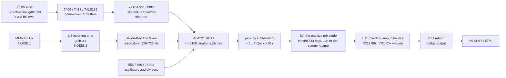

# Zaxxon's sound board: twelve gates, eleven voices, one mix bus

What generates Zaxxon's sound. The board carries no sound chip and no sound CPU:
every voice is an analog circuit on IC Board A, gated by one active-low bit of
an i8255 PPI, and all of them meet at a single passive summing node the drawing
calls `SJ`.

Read for `phosphor-emulator-uy54`. The device built from it is
`machines/src/zaxxon_sound.rs`.

## Provenance

| | |
|---|---|
| Drawing | `IC Board A 834-0214 rev A`, sheets 11 and 12 of 16, Gremlin/SEGA, drawn 4-8-82 |
| Read from | `arcade-museum.com/manuals-videogames/Z/Zaxxon.pdf`, PDF pp132-135 |
| Transcribed | 2026-09-19, from a 400 dpi render, with crops upscaled 1.3x to 2.8x for the component values |

Each sheet is spread across two PDF pages, left half then right half: sheet 11
is pp132-133, sheet 12 is pp134-135. **This corrects the page range the issue
and `machines/src/zaxxon.rs` both carried**, which was pp131-135. Page 131 is
the cabinet wiring diagram and has nothing on it.

150 dpi is enough to follow signal names and chip designators, and is not enough
to read resistor and capacitor values: `2.2K` and `2.2M`, and `470Ω` against
`470K`, are not separable at that size. Every value in the tables below was read
at 400 dpi.

The manual's schematic set is partial; the inventory is in
[`zaxxon-color-dac.md`](zaxxon-color-dac.md). Nothing the sound path needs is on
a missing sheet: sheets 11 and 12 are the whole sound board, from the PPI to the
speaker connector.

## Why this file exists

The reference emulator plays recorded WAV samples for this board. That is not
evidence about the hardware, for exactly the reason written up in
[`congo-percussion.md`](congo-percussion.md) for the sibling board: a sample set
is what somebody did instead of reading this sheet. Comparing a model against
those recordings would measure whoever made the recordings, so there is no
comparison to run here and the drawing is the only reference.

## The architecture



The board is one design applied eleven times. A voice is a **source** (noise, a
555, or a resonator), a **gate** (an MB4391 VCA driven by a control voltage, or a
4016B analog switch driven by a logic level), and a **leg** into `SJ`: a series
resistor, a shunt resistor, a 1 uF DC block, and a 51 kΩ common. Getting one
voice right gets the shape of all eleven.

## The PPI map

`U23`, an `8255AC-5`, sits on the Z80 bus (D0-D7 on pins 34-27, A0/A1 on 9/8,
`RD` 5, `WR` 36, `CS` 6, `RESET` 35). Every used output pin is labeled with its
voice on the drawing, so this is read rather than inherited. All three ports are
outputs; every used line carries a 4.7 kΩ pull-up to +5 V (`RP1` 4.7K x 8 on
port A, `RP2` 4.7K x 6 on ports B and C), so **the board powers up with every
bit high and every voice off**.

| Port | Bit | Pin | Net | Goes to |
|---|---|---|---|---|
| A | 0 | 4 | `PLAYER SHIP A` | `U30` 7406 (11 -> 10); level ladder |
| A | 1 | 3 | `PLAYER SHIP B` | `U30` 7406 (13 -> 12); level ladder |
| A | 2 | 2 | `PLAYER SHIP C` | `U32` 74LS139 pin 2 (A) |
| A | 3 | 1 | `PLAYER SHIP D` | `U32` 74LS139 pin 3 (B) |
| A | 4 | 40 | `HOMING MISSILE` | `U30` 7406 (1 -> 2), sheet 12 |
| A | 5 | 39 | `BASE MISSILE` | `U22` 74123 pin 9, sheet 12 |
| A | 6 | 38 | `LASER` | `U30` 7406 (3 -> 4), sheet 12 |
| A | 7 | 37 | `BATTLESHIP` | sheet 11, `U30` 7406 (5 -> 6) |
| B | 4 | 22 | `S-EXP` | sheet 11, `U22` 74123 pin 1 |
| B | 5 | 23 | `M-EXP` | sheet 11, `U21` 74123 pin 9 |
| B | 7 | 25 | `CANNON` | sheet 11, `U45` 74123 pin 9 |
| C | 0 | 14 | `SHOT` | sheet 11, `U21` 74123 pin 1 |
| C | 2 | 16 | `ALARM 2` | sheet 11, `U46` 74123 pin 9 |
| C | 3 | 17 | `ALARM 3` | sheet 11, `U44` 74123 pin 1 |

`PB0-PB3` (18-21), `PB6` (24), `PC1` (15), `PC5-PC7` (12, 11, 10) are drawn and
go nowhere. `PC4` is not drawn at all.

That is fourteen signals and twelve gates: player ship A and B are a **level**
rather than a gate, and the other twelve each turn something on. Eleven legs
reach `SJ`, because alarm 2 and alarm 3 share one.

## Player ship A and B are a level, and the drawing does not say what the issue said

This is the one place a plausible implementation is wrong in a way nothing would
catch. `phosphor-emulator-uy54` described the ladder as "R11 1.2k, R14 2.4k". It
is neither of those, `R11` is not in the ladder at all, and the bit order is the
opposite of a naive reading.

```text
+12V --R10 2.2k--+                    +12V --R13 82k--+
                 |                                    |
  PA0 -->|7406|--+-- A --R12 6.8k-- X ----------------+-- R15 56k -- GND
        (U30 11->10)                |
                                 R14 36k
                                    |
+12V --R11 2.2k--+                  |
                 |                  |
  PA1 -->|7406|--+-- B --R16 100k-- Y --+-- C25 15uF -- GND
        (U30 13->12)                    |
                                        +-- U8 pin 12 (+), follower
                                              |
                                        pin 14 --R17 390-- PC1 LED -- GND
```

`R10` and `R11` are **pull-ups on the two open-collector inverters**, not ladder
legs; they cross the ladder on the drawing without a junction dot, which is what
makes the 2.2 kΩ pair easy to mistake for the ladder. The ladder proper is
`R12` 6.8 kΩ from node A and `R16` 100 kΩ from node B, with `R13` 82 kΩ and
`R15` 56 kΩ setting the range at node X and `R14` 36 kΩ coupling X down to Y.

Solving that network at DC, with a 7406 saturating to about 0.2 V and the PPI
bits inverted by it:

| `PA0` | `PA1` | Node X | Node Y (the control) | LED current through `R17` 390 Ω |
|---|---|---|---|---|
| 0 | 0 | 10.54 V | **10.93 V** | 24.9 mA |
| 0 | 1 | 9.98 V | **7.39 V** | 15.9 mA |
| 1 | 0 | 1.43 V | **4.18 V** | 7.6 mA |
| 1 | 1 | 0.96 V | **0.76 V** | 0 (below the LED's forward drop) |

Two things follow, and both matter.

**`PA0` is the more significant bit, and the level falls as the bits rise.** The
steps are 3.54 V, 3.21 V and 3.42 V: a near-linear two-bit DAC whose code is
`3 - (PA0 * 2 + PA1)`. `PA0` is worth about twice `PA1` because it reaches the
ladder through `R12` 6.8 kΩ where `PA1` reaches it through `R16` 100 kΩ, and the
whole thing runs backwards from the bit values because `U30`'s 7406 sections
invert both.

A model that reads the pair as `data & 3` is therefore wrong twice over: it puts
the two middle states the wrong way round, and it rises where the board falls.
Both mistakes are entirely plausible to listen to, which is why they are worth
writing down.

The maximum is at `PA0 = PA1 = 0` and the minimum, with `PC1`'s LED dark, is the
`1, 1` that `RP1` leaves at power-on. So this pair is consistent with the rest of
the port after all: the engine is at its quietest and lowest when nothing has
been written.

**`C25` is 15 uF against a Thevenin resistance of about 26 kΩ**, so node Y does
not step between those levels, it glides with a time constant near 0.4 s. The
engine pitch bends rather than jumping. Nothing about that is a matter of taste
either.

## The player ship engine

Node Y drives `PC1`, an `MCD-725H` opto-isolator, through `U8` as a unity
follower and `R17` 390 Ω. `PC1`'s photoresistor sits between +6 V and the tuning
node of a multiple-feedback band-pass built on `U5`:

| Part | Value | Role |
|---|---|---|
| `R18` | 200 kΩ | `NOISE 1` into `U4` pin 2 |
| `R19` | 10 kΩ | `U4` feedback; gain 0.05, inverting |
| `C28` | 2.2 uF | block into the band-pass input |
| `R20` | 10 kΩ | band-pass input resistor |
| `PC1` LDR | variable | from +6 V to the same node, so it parallels `R20` for AC |
| `C26`, `C27` | 0.01 uF | the band-pass's two feedback capacitors |
| `R21` | 470 kΩ | `U5` feedback |

With the LED dark the input resistance is `R20` alone and the center frequency is
`1 / (2*pi*C*sqrt(R20*R21))` = **232 Hz**; as the LDR falls the parallel
resistance falls with it and both the center frequency and the gain
(`R21 / 2*Rin`) rise. So the two level bits set the engine's pitch *and* its
loudness through one part, and there is no separate volume control anywhere on
the path.

That one band-pass output feeds **both** engine tones, through `C29` and `C38`:

| Tone | Resonator | Values | VCA | Leg |
|---|---|---|---|---|
| A | Wien, `U5` | `R24`/`R25` 100 kΩ, `C30`/`C31` 2200 pF, gain `1 + R23/R22` = 2 | `MB4391 U14` ch B | `R174`/`R175` |
| B | Wien, `U5` | `R38`/`R39` 100 kΩ, `C39`/`C40` 3300 pF, gain `1 + R37/R36` = 2 | `MB4391 U15` ch B | `R177`/`R178` |

`1 / (2*pi*R*C)` gives **723 Hz** and **482 Hz**, and an amplifier gain of 2 in a
Wien network gives `Q = 1/(3-K)` = 1: these resonate rather than oscillate, so
what comes out is the LDR-tuned noise rung at two fixed pitches.

`PLAYER SHIP C` and `D` reach `U32`, a 74LS139 with its enable grounded. Only
`Y0` (pin 4) and `Y1` (pin 5) are connected; `Y2` and `Y3` go nowhere. Each
drives a 7417 open-collector buffer at `U31`, which pulls a 0.68 uF capacitor to
ground through 1 kΩ when the output is low and lets it charge toward +6 V through
440 kΩ when it is not:

| Output | Active when | Buffer | Pull-down | Charge path | VCA control |
|---|---|---|---|---|---|
| `Y0` | `PA2`=0, `PA3`=0 | `U31` 1 -> 2 | `R28` 1 kΩ, `C34` 0.68 uF | `R29`+`R30` 440 kΩ | `U14` ch B `CON` |
| `Y1` | `PA2`=1, `PA3`=0 | `U31` 3 -> 4 | `R31` 1 kΩ, `C35` 0.68 uF | `R32`+`R33` 440 kΩ | `U15` ch B `CON` |

So the attack is 0.68 ms and the release about 0.3 s, and the two bits pick which
of the two engine pitches sounds.

## The two explosions

`S-EXP` and `M-EXP` are the same circuit twice, and it is the clearest voice on
the board: a 74123 one-shot yanks a capacitor down through a diode, the capacitor
crawls back up through a megohm-class path, and that slow recovery is the
explosion's decay.

| | small (`S-EXP`, `PB4`) | medium (`M-EXP`, `PB5`) |
|---|---|---|
| one-shot | `U22` half A (1, 2, 3, 4, 13, 14, 15) | `U21` half B (9, 10, 11, 5, 12, 6, 7) |
| timing cap | `C60` 1 uF | `C62` 3.3 uF |
| timing resistor | `R102` 36 kΩ to +5 V | `R107` 47 kΩ to +5 V |
| pulse width (0.28 R C) | **10.1 ms** | **43.4 ms** |
| output tap | `Q` (pin 4), pulled up by `R103` 1 kΩ | `Q` (pin 12), pulled up by `R108` 1 kΩ |
| discharge diode | `D7`, cathode toward the one-shot | `D8`, cathode toward the one-shot |
| discharge resistor | `R106` 1 kΩ | `R212` 470 Ω |
| envelope cap | `C61` 2.2 uF | `C63` 1 uF |
| recovery path | `R105` + `R104` 940 kΩ to +5 V | `R110` + `R109` 2 MΩ to +5 V |
| recovery time constant | **2.07 s** | **2.00 s** |
| control buffer | `U20` (10, 9, 8), unity | `U20` (12, 13, 14), unity |
| noise filter | `R113`/`R116` 15 kΩ, `C70`/`C71` 0.033 uF | `R119`/`R122` 15 kΩ, `C72`/`C73` 0.047 uF |
| filter center, Q | **321 Hz**, Q 2.0 | **226 Hz**, Q 2.0 |
| filter gain | `1 + R115/R114` = 2.5 | `1 + R121/R120` = 2.5 |
| VCA | `MB4391 U15` ch A | `MB4391 U13` ch A |
| leg | `R194` 15 kΩ / `R195` 8.2 kΩ | `R197` 8.2 kΩ / `R198` 47 kΩ |
| leg attenuation | 0.353 | **0.851, the loudest leg on the board** |

Note the diodes: **both point back toward the one-shot**, so the capacitor sits
charged at rest and is pulled *down* on a trigger. The envelope is therefore
inverted with respect to loudness, which is the first thing that tells you which
way an MB4391's control pin works (below).

The two filters are Sallen-Key low-passes with equal resistors and equal
capacitors, so `f0 = 1/(2*pi*R*C)` and `Q = 1/(3-K)` with `K` the amplifier's
non-inverting gain. `K` = 2.5 puts both at Q 2, a broad resonance rather than a
tone: band-limited noise, low for the medium explosion and higher for the small
one, which is the correct way round.

## The cannon

The cannon's envelope does not drive a VCA. It drives a transistor sitting in the
tuning leg of a band-pass, so the pitch falls as the envelope decays.

| Part | Value | Role |
|---|---|---|
| `U45` half A | `C78` 1 uF, `R125` 47 kΩ | one-shot, **13.2 ms** |
| `R126` | 330 Ω | pull-up on `Q` (pin 5) |
| `D9` | cathode away from the one-shot | charges the envelope cap on the pulse |
| `C79` | 6.8 uF | envelope cap |
| `R127` | 100 kΩ | envelope decay to ground, **0.68 s** |
| `U12` (5, 6, 7) | unity follower | envelope buffer |
| `R131`, `R132` | 15 kΩ, 3.3 kΩ | into `Q6`'s base |
| `Q6` | C1684 | the variable tuning resistance |
| `R130` | 100 Ω | in series with `Q6`, from the band-pass tuning node to ground |
| `R133` | 1.5 kΩ | `Q6`'s collector to ground, which **bounds** the sweep |
| `C80` | 2.2 uF | `NOISE 2` in |
| `R128` | 10 kΩ | input resistor, **to the inverting input** |
| `R127` | 47 kΩ | `U12` feedback (see below: the designator is reused) |
| `C81`, `C82` | 0.01 uF | the bridged-T's two capacitors |
| `C83`, `R134`, `R135` | 10 uF, 100 kΩ, 100 kΩ | a 2:1 divider out to `C84` |

**This is not the multiple-feedback band-pass the rest of the board uses, and
the difference is one wire.** In every other filter here the input resistor
lands on the capacitor junction. `R128` does not: it lands on `U12`'s
**inverting input**, with `R127` bridging input to output and `C81`/`C82` in
series between them, their junction tied to ground through `R130` and `Q6`. The
feedback network is a bridged-T, and the stage is an inverting **low-pass**:

```text
gain(s) = -(R127/R128) * (1 + 2*s*C*r) / (1 + 2*s*C*r + R127*r*C^2*s^2)

DC gain = R127/R128 = 4.7
f0      = 1 / (2*pi*C*sqrt(R127*r))
Q       = 0.5 * sqrt(R127/r)
```

with `r` = `R130` in series with `R133` paralleled by `Q6`, so `r` runs between
1.6 kΩ with `Q6` off and `R130`'s 100 Ω with it hard on. That sweeps the corner
**1835 Hz to 7.3 kHz** at a Q of 2.7 to 10.8: a broadband crack that starts
bright and falls over 0.68 s, which is what a cannon is.

Reading it as the neighboring MFB pattern instead gives a Q-10.9 band-pass
sitting *at* 7.4 kHz with a gain of 2.35, which is a thin whistle carrying a
twentieth of the energy. The device made exactly that mistake and the voice was
inaudible in play; see the note at the end of this file.

Its output reaches `MB4391 U13` ch B through the `R134`/`R135` divider and
`C84` 4.7 uF, and the leg is `R200` 47 kΩ / `R201` 3.9 kΩ, an attenuation of
0.0766. That VCA's `CON` pin is driven by `U12`'s **other** section, an
inverting amp with `R136` 51 kΩ in and `R137` 51 kΩ of feedback about the
`R139` 33 kΩ / `R141` 22 kΩ divider's 2.4 V, so `CON` = 4.8 V − envelope.

**`R127` appears twice on sheet 11**, once as the 100 kΩ envelope shunt and once
as the 47 kΩ band-pass feedback, both legible and both unambiguously reading
`R127` at 400 dpi. One of them is presumably `R129`, which appears nowhere; the
drawing does not say which, and this note distinguishes them by function.

## The shot, the battleship, and the three sheet-12 voices

These were read at block level: enough to name every part and the signal flow,
not enough to state a center frequency or a sweep law from the values.

- **`SHOT` (`PC0`)** triggers `U21` half A (`C87` 2.2 uF, `R142` 18 kΩ, **11.1
  ms**), whose `Q` drives `R144` 560 Ω, `R143` 3.3 kΩ, `C88` 0.047 uF and `D10`
  into a network of `R145` 270 kΩ, `R146`/`R147` 1 MΩ and `R148` 2.2 MΩ around
  `U19` and `U20`. A 555 at `U18` (`R151`/`R152` 10 kΩ, `R153` 2.7 kΩ, `R154`
  8.2 kΩ, `R155` 820 Ω, `C90` 3.3 uF, `C91` 15 uF) and a further `U19` stage
  (`R156`-`R159` 33 kΩ/15 kΩ, `C92` 1000 pF, `R161` 33 kΩ, `R162` 100 kΩ, `Q7`,
  `D11`, `R163` 10 kΩ) produce the tone. It reaches `MB4391 U16` ch B through
  `R164` 1 MΩ and `C93` 2.2 uF; the leg is `R203` 39 kΩ / `R204` 8.2 kΩ.
- **`BATTLESHIP` (`PA7`)** goes to `U30` 7406 (5 -> 6) with `R101` 10 kΩ to
  +12 V, into a chain of `U9` and `U10` sections with `R80` 2.2 MΩ / `R81`
  220 kΩ setting a 1.09 V reference, `R82`/`R92` 30 kΩ, `R83`/`R84`/`R94`/`R95`
  51 kΩ, `C56`/`C57` 3.3 uF, `R86` 51 kΩ with `R88` 100 kΩ as a Schmitt
  relaxation pair, `R90` 120 kΩ, `R91` 100 kΩ, `R93` 30 kΩ, `R96` 15 kΩ, `Q4`
  and `Q5` C1684, `D5`, `D6`, `R89`/`R100` 10 kΩ and `R97` 2.2 kΩ. Its output is
  switched by `U17` 4016B (pins 1, 2, 13) and biased by `R189`/`R190` 51 kΩ; the
  leg is `R191` 47 kΩ / `R192` 4.7 kΩ, the second quietest on the board.
- **`HOMING MISSILE` (`PA4`)** goes to `U30` 7406 (1 -> 2) with `R55` 10 kΩ to
  +12 V, then `R42` 51 kΩ into `U5` with `R43` 100 kΩ, `R44` 6.8 kΩ and `C43`
  6.8 uF (**46 ms**), buffered by `U4`, summed through `R45` 68 kΩ with `NOISE 1`
  through `C44` 1 uF and `R46` 200 kΩ into `U4` (`R47` 10 kΩ feedback), and
  AC-coupled by `C46` into the **control-voltage pin of a 555 at `U6`**
  (`R48` 47 kΩ, `R49` 68 kΩ, `C45` 0.01 uF, free-running at
  `1.44/((R48+2*R49)*C45)` = **787 Hz**). The swept tone passes `R50` 3.3 kΩ,
  `R51` 12 kΩ, `R52` 3.3 kΩ and `C47` 10 uF to `U17` 4016B (pins 10, 11, 12),
  biased by `R53`/`R54` 51 kΩ; the leg is `R180` 22 kΩ / `R181` 27 kΩ.
- **`BASE MISSILE` (`PA5`)** triggers `U22` half B (`C48` 15 uF, `R56` 36 kΩ,
  **151 ms**), whose `Q` drives `R57` 1 kΩ, `D2`, `R58` 470 Ω and `C49` 15 uF,
  recovering through `R59`+`R60` 440 kΩ (**6.6 s**) into `U20`. It controls
  `MB4391 U14` ch A, whose audio is a third Sallen-Key noise band on sheet 12
  (`R61`/`R62` 15 kΩ, `C50`/`C137` 0.022 uF, **482 Hz**, gain `1 + R63/R64` =
  1.5, Q 0.67) through `C51` 22 uF; the leg is `R183` 39 kΩ / `R184` 8.2 kΩ.
- **`LASER` (`PA6`)** goes to `U30` 7406 (3 -> 4) with `R79` 10 kΩ to +12 V. A
  555 at `U7` free-runs at `1.44/((R65+2*R66)*C53)` with `R65` 5.1 kΩ, `R66`
  22 kΩ, `C53` 10 uF and `D3` across `R66`, giving **about 5.3 Hz at a 19 % duty
  cycle**: a repetition rate rather than a tone. That drives `U8` stages with
  `R67` 120 kΩ, `R68`/`R69` 51 kΩ, `C138` 0.01 uF, `R70` 47 kΩ, `R71` 2.2 kΩ,
  `R72` 51 kΩ, `R73` 100 kΩ, `R74` 10 kΩ, `Q3` and `D4`, then `R75` 10 kΩ,
  `R76` 2.2 kΩ and `C55` 2.2 uF into `U17` 4016B (pins 8, 9, 6), biased by
  `R77`/`R78` 51 kΩ; the leg is `R186` 47 kΩ / `R187` 8.2 kΩ.

## The alarms

Both alarms share one leg and one tone generator.

```text
+5V --R168 470-- pin 1 --R169 120-- pins 2,6 --C97 0.1uF-- GND     (U50, half a 556)
                                        |
                                      pin 5 OUT: 1.44/((470 + 240)*0.1uF) = 20.3 kHz
                                        |
                                    74393 U49 pin 1 (1A), both CLRs grounded
                                        |
              1QC (pin 5) = 2535 Hz     1QD (pin 6) = 1268 Hz, and on to 2A (pin 13)
                                        |
   ALARM 2 one-shot (U46 half B) ---> 7426 U67 open-collector NANDs ---.
   ALARM 3 one-shot (U44 half A) ---'                                   |
                                         R171 1k pull-up to +12V -------+
                                                       |
                            R172 1.5k --> U12 (13, 12, 14), R173 330k with C99 0.01uF
                                    gain 220, corner 48 Hz: the square becomes a triangle
                                                       |
                                       R206 68k / R207 1k --> C24 1uF --> R208 51k --> SJ
```

Both one-shots are `C` 10 uF with `R` 47 kΩ (`C95`/`R166` for alarm 2,
`C96`/`R167` for alarm 3), so both are **132 ms** long.

The 20.3 kHz figure looked wrong until the 74393 turned up: the 556 is a clock
for the divider, not a voice. `R168` and `R169` are genuinely 470 Ω and 120 Ω,
read at 400 dpi with the ohm symbol drawn.

## The mix: eleven legs into one node

Every voice ends the same way: a series resistor, a shunt resistor to ground, a
1 uF DC block, and a **51 kΩ common into `SJ`**. Because all eleven commons are
51 kΩ, they are equally weighted at the node, and the entire balance of the board
is the series/shunt pair ahead of each one.

| Voice | Sheet | Series | Shunt | Block | Common | Attenuation | dB below the loudest |
|---|---|---|---|---|---|---|---|
| medium explosion | 11 | `R197` 8.2k | `R198` 47k | `C21` | `R199` 51k | **0.851** | 0.0 |
| player ship tone A | 12 | `R174` 15k | `R175` 22k | `C14` | `R176` 51k | 0.595 | -3.1 |
| player ship tone B | 12 | `R177` 15k | `R178` 22k | `C15` | `R179` 51k | 0.595 | -3.1 |
| homing missile | 12 | `R180` 22k | `R181` 27k | `C16` | `R182` 51k | 0.551 | -3.8 |
| small explosion | 11 | `R194` 15k | `R195` 8.2k | `C20` | `R196` 51k | 0.353 | -7.6 |
| shot | 11 | `R203` 39k | `R204` 8.2k | `C23` | `R205` 51k | 0.174 | -13.8 |
| base missile | 12 | `R183` 39k | `R184` 8.2k | `C17` | `R185` 51k | 0.174 | -13.8 |
| laser | 12 | `R186` 47k | `R187` 8.2k | `C18` | `R188` 51k | 0.149 | -15.2 |
| battleship | 11 | `R191` 47k | `R192` 4.7k | `C19` | `R193` 51k | 0.0909 | -19.4 |
| cannon | 11 | `R200` 47k | `R201` 3.9k | `C22` | `R202` 51k | 0.0766 | -20.9 |
| alarms 2 and 3 | 11 | `R206` 68k | `R207` 1k | `C24` | `R208` 51k | 0.0145 | -35.4 |

The alarms look absurdly quiet until you notice that the stage ahead of them has
a gain of 220, and the battleship's and cannon's legs sit behind their own gain
stages too. **The attenuation column is the leg, not the voice**, and it is only
the whole answer where the source's amplitude is known.

`SJ` is a passive node, not a virtual ground: it is loaded by `R209` 10 kΩ to the
inverting input of `U11`, which sits at +6 V with `R210` 82 kΩ of feedback
(gain **-8.2**). `R211` 68 kΩ then feeds `VR1`, a 20 kΩ volume potentiometer to
ground, so the wiper delivers at most `20/(68+20)` = 0.227 of that into the power
amplifier.

## The output stage

`U1` is an `LA4460` in **bridge configuration**: `OUT1` (pin 9) to `SPK+` (P4
pin 3) and `OUT2` (pin 7) to `SPK-` (P4 pin 4), so the speaker never sees ground.
`C7` 1000 uF decouples the +12 V supply at pin 10, `C8` and `C9` 47 uF sit on
pins 4 and 5, `C12` 0.01 uF with `R4` 1.5 kΩ is the feedback network, and each
output carries a Zobel network (`C18`/`R5` and `C11`/`R6`, 0.033 uF and 4.7 Ω).
`RES` reaches the mute pin (6) through `U31` 7417 (5 -> 6), `R3` 330 Ω and `D1`,
with `R7` 10 kΩ, `C13` 15 uF, `R8` 2.2 MΩ, `R9` 100 kΩ, `R280` 1 kΩ, `Q1` and
`Q2` forming the mute delay: **the board mutes itself across reset**, which is
why it does not thump on power-up.

## The noise source

`U2` is an `MM5837`. Its `Vss` (pin 4) is at +12 V and its `Vdd` and `Vgg` (pins
1 and 2) are tied together at ground, so the part runs at 12 V against the
datasheet's nominal 14 V. `C64` 22 uF and `C65` 0.1 uF decouple it. `OUT` (pin 3)
is `NOISE 1`, used directly by the player-ship front end and the homing missile.

`NOISE 2` is `NOISE 1` through `C66` 10 uF, `R111` 100 kΩ and `U3` with `R112`
10 kΩ of feedback: an inverting **attenuation of 0.1**, and it is what the three
Sallen-Key filters and the cannon's band-pass are fed from. There is one noise
generator on this board and two named nets off it, which is easy to read as two
sources.

## What this establishes

- **The PPI map, at component level.** Every voice is labeled on `U23`'s pins on
  the drawing. Fourteen signals: twelve gates, and two that are not.
- **Player ship A and B set a near-linear two-bit level with `PA0` as the MSB,
  and the level falls as the bits rise.** Four solved control voltages, a 0.4 s
  glide between them, and an LDR that makes pitch and loudness one control.
  Every part of that contradicts a `data & 3` volume fit, which has the two
  middle states swapped and the slope inverted.
- **The board is silent at reset** and stays silent until the program writes,
  because all fourteen lines are pulled high (which for the level pair is the
  bottom of the ladder, with `PC1`'s LED dark) and the amplifier mutes itself
  across `RES`.
- **The MB4391's control pin attenuates: high control, low gain.** This is
  inferred rather than read from a datasheet, and it is inferred from five
  independent uses agreeing. The two explosions' envelope capacitors sit charged
  at rest and are pulled down on a trigger; the two engine tones' capacitors sit
  charged at +6 V when their 74LS139 output is inactive and are pulled to ground
  when it is selected. Under the opposite polarity the board would howl at reset
  and fall silent when a voice fired.
- **The mix balance is eleven series/shunt pairs**, not eleven summing
  resistors: the 51 kΩ commons are all equal, and `SJ` is loaded by `R209` 10 kΩ
  into a virtual ground. The spread from the medium explosion to the alarms is
  35 dB of leg.
- **The output is a bridge into one speaker**, with a mute circuit that holds
  across reset.
- **There is exactly one noise generator**, an `MM5837` at `U2`, and `NOISE 2` is
  `NOISE 1` attenuated tenfold by one inverting stage.
- **Seven 74123 one-shot widths**, from their own R and C:

  | Voice | Package | R | C | Width at 0.28 R C |
  |---|---|---|---|---|
  | small explosion | `U22` A | 36 kΩ | 1 uF | 10.1 ms |
  | shot | `U21` A | 18 kΩ | 2.2 uF | 11.1 ms |
  | cannon | `U45` A | 47 kΩ | 1 uF | 13.2 ms |
  | medium explosion | `U21` B | 47 kΩ | 3.3 uF | 43.4 ms |
  | alarm 2 | `U46` B | 47 kΩ | 10 uF | 131.6 ms |
  | alarm 3 | `U44` A | 47 kΩ | 10 uF | 131.6 ms |
  | base missile | `U22` B | 36 kΩ | 15 uF | 151.2 ms |

  The parts are **74123, not 74LS123**, and the two have different timing
  constants (0.28 against 0.45 for a large `Cext`). Using the LS figure would
  make every one of these 60 % too long.

## What this does NOT establish

- **The `MCD-725H`'s resistance against LED current.** The opto-isolator's
  transfer curve is not on the drawing and no datasheet was found, so the engine
  pitch at each of the four levels is *not* established: only that node Y takes
  those four voltages, that the LED is dark at the lowest one, and that the
  band-pass reaches 232 Hz with the LED dark. The device models the curve with
  an explicitly invented law and says so at the call site.
- **The `MM5837`'s shift rate on this board.** The part's clock is internal, it
  is specified at a supply this board does not give it, and part-to-part spread
  is wide. The model uses the commonly quoted 100 kHz, which is a convention and
  not a reading.
- **The `MB4391`'s control law beyond its direction.** The argument above fixes
  the sign. How many volts of control correspond to how much attenuation is not
  established at all, and the device carries a named, invented mapping for it.
- **Which 4016B section each of the three sheet-12 gate bits controls.** `U17`'s
  three used sections take their control on pins 13, 6 and 12; the battleship's
  is pin 13, read on sheet 11. The homing-missile and laser assignments to pins
  12 and 6 follow from which audio each section passes, not from tracing the
  control wires, which were not followed across the sheet boundary.
- **Which explosion buffer goes to which VCA.** `S-EXP`'s buffered envelope was
  traced by its crossing height at the sheet seam to `U15` ch A, the 321 Hz path.
  `M-EXP` to `U13` ch A is by elimination, corroborated by the medium explosion
  being the lower and louder of the two.
- **The 7426's input assignment.** That `U49`'s `1QC` and `1QD` taps and the two
  alarm one-shots reach `U67`'s four inputs is read; which alarm is NANDed with
  which tap is not, so the model's choice of 2535 Hz for alarm 2 and 1268 Hz for
  alarm 3 is arbitrary between the two.
- **The battleship's and the shot's oscillators at component level.** Both are
  transcribed as part lists above and neither was solved. Their pitches in the
  model are not derived from the drawing.
- **Any measurement.** Nothing here was compared against a board or a recording,
  and nothing could be: the reference plays samples.

## What a first pass got wrong, and how

Three of the items that were on the list above are now read, and all three were
found the same way: the device built from this file was driven by a recorded
movie and each mix leg was watched, so a voice that was inaudible in play could
be pointed at rather than guessed about.

- **The cannon's filter is a bridged-T, not a multiple-feedback band-pass.** The
  first reading assumed the pattern the neighboring voices use instead of
  checking where `R128` lands, which cost the voice 24 dB and put it an octave
  too high. This is the failure mode the format exists to catch and it still got
  through: a topology taken from context rather than from the drawing reads
  exactly like one that was traced.
- **`Q6` cannot open the tuning node very far**, because `R133` 1.5 kΩ sits
  across it. The first pass let it reach 10 MΩ, which `R133` flatly contradicts.
- **`R59`'s upper end is +5 V**, so the base missile's shaper rests and bottoms
  where the two explosions' do. It was previously recorded as unresolved between
  +5 V and +6 V.

The `MB4391`'s control window is what ties those last two together. Three
independent shapers on this board (both explosions, the base missile, and the
cannon through `U12`'s inverting section) rest between 4.8 and 5.0 V and bottom
at 2.8 V, against a part that mutes at 4.76 V and reaches full gain at 2.84 V.
Four circuits landing on the same window is the strongest evidence in this file
that the window is right, and it is worth more than any one of them.

## Confidence

A good scan. The PPI map, the ladder network, the seven one-shot R/C pairs, the
three Sallen-Key filters and the whole eleven-leg mix table were read at 400 dpi
with every designator and value legible, and those are the parts to trust.

The battleship and shot oscillators, the sheet-12 555 chains, and the routing of
control voltages across the sheet seam are read at block level and are marked so
above.

This is a hand transcription and can be wrong. Nothing in it is checked by a
test; the section above it is what keeps that honest.
